# TÀI LIỆU ĐẶC TẢ YÊU CẦU PHẦN MỀM (SRS)
## PHÂN HỆ GIAO DIỆN XÁC THỰC & ĐĂNG NHẬP ỨNG DỤNG DI ĐỘNG (MOBILE AUTHENTICATION UI/UX)
### DỰ ÁN: NỀN TẢNG ĐẶT LỊCH MAKE-UP (MAKEUP BOOKING PLATFORM)
**Mã phân hệ:** `APP-FE-AUTH` | **Phiên bản:** `1.0.0` | **Tiêu chuẩn áp dụng:** `ISO/IEC/IEEE 29148`  
**Nền tảng công nghệ:** React Native 0.86 + Expo SDK 57 (Expo Router) + TypeScript + Zustand + Expo SecureStore  

---

## 1. TỔNG QUAN HỆ THỐNG & PHẠM VI (SYSTEM OVERVIEW & SCOPE)

### 1.1. Mục đích tài liệu (Purpose)
Tài liệu này xác định các yêu cầu chức năng (Functional Requirements), phi chức năng (Non-functional Requirements), thiết kế giao diện (UI/UX Design Specifications) và hợp đồng tích hợp API (API Contracts) cho **Phân hệ Xác thực & Quản lý Phiên Người dùng** trên ứng dụng di động (`code/app`).

### 1.2. Phạm vi phân hệ (Scope)
Phân hệ đảm nhiệm toàn bộ vòng đời xác thực của người dùng trên thiết bị di động, bao gồm:
1. Màn hình Chào mừng & Giới thiệu nhận diện thương hiệu (**Welcome / Onboarding Splash**).
2. Đăng nhập đa phương thức bằng Số điện thoại hoặc Email kết hợp Mật khẩu (**Login Flow**).
3. Đăng ký tài khoản phân luồng theo vai trò người dùng (**Role-based Registration Flow**):
   - **Khách hàng (`ROLE_CUSTOMER`)**: Đăng ký cơ bản (Họ tên, SĐT, Email, Giới tính, Mật khẩu).
   - **Thợ trang điểm tự do (`ROLE_FREELANCE_MUA`)**: Đăng ký chuyên môn Onboarding (Bio, Số năm kinh nghiệm, Bán kính phục vụ tối đa km).
4. Cơ chế duy trì phiên làm việc an toàn (**Session & Token Lifecycle Management**) với JWT Access Token & Refresh Token qua `expo-secure-store`.
5. Đổi mật khẩu (**Change Password**) & Đăng xuất an toàn (**Revoke Session via Redis Blacklist**).
6. Tùy chọn chuyển đổi ngôn ngữ ứng dụng tức thời (**Instant Language Switcher**: Tiếng Việt `vi` / Tiếng Anh `en`).

### 1.3. Đối tượng người dùng di động mục tiêu (Target Mobile Personas)
Ứng dụng di động (`code/app`) được thiết kế dành riêng cho 3 phân hệ người dùng hoạt động trên môi trường di động (Super Admin và Agency Admin sử dụng Cổng Quản trị Web Dashboard trên máy tính):
1. **Khách hàng (`ROLE_CUSTOMER`)**: Tìm kiếm thợ MUA, xem danh mục dịch vụ, đặt lịch trang điểm tận nơi / tại studio, phát lệnh điều thợ khẩn cấp 30s, theo dõi live GPS thợ di chuyển.
2. **Thợ Make-up Tự do (`ROLE_FREELANCE_MUA`)**: Đăng ký hồ sơ tay nghề (Onboarding Bio, kinh nghiệm, bán kính km), nhận thông báo đơn khẩn cấp 30s, bật/tắt phát sóng tọa độ GPS, quản lý lịch làm việc và ví tiền.
3. **Nhân viên Điều phối Studio (`ROLE_AGENCY_STAFF`)**: Nhân viên lễ tân/điều phối Studio đăng nhập trên điện thoại để cập nhật tiến độ ca làm, kiểm tra lịch trực và tiếp nhận khách hàng tại cơ sở.

---

## 2. QUY CHUẨN THIẾT KẾ GIAO DIỆN (MODERN CLEAN & ROSE BRAND DESIGN SYSTEM)

Toàn bộ màn hình Auth trên ứng dụng di động phải tuân thủ nghiêm ngặt theo tài liệu `docs/UI/UX style guideline/guideline.md` và nguyên mẫu thiết kế Figma:

### 2.1. Bảng màu chuẩn nhận diện (Brand Colors)
| Phân loại | Mã Màu HEX | Tên gọi | Ứng dụng trong Auth UI |
| :--- | :---: | :--- | :--- |
| **Primary Color** | `#E11D48` | Rose-600 Ruby | Nút bấm chính (CTA Đăng nhập / Đăng ký), Link nổi bật, Icon active |
| **Primary Hover** | `#BE123C` | Rose-700 | Trạng thái nhấn nút (active/pressed state) |
| **Soft Border / Tint** | `#FFE4E6` | Rose-100 | Viền thẻ Card đăng nhập, viền bao quanh form |
| **Heading / Brand Title** | `#0F172A` | Slate-900 | Tên thương hiệu MUA MAKEUP, Tiêu đề màn hình H1 |
| **Subtitle / Body** | `#64748B` | Slate-500 | Phụ đề, hướng dẫn đăng nhập, mô tả |
| **Muted Text / Placeholder** | `#94A3B8` | Slate-400 | Icon tiền tố ô input, placeholder nhập liệu |
| **Surface Card** | `#FFFFFF` | Pure White | Khối chứa form nhập liệu (Card form) |
| **Input Background**| `#FFFFFF` | Pure White | Nền các ô Text Input |
| **Border Color** | `#E2E8F0` | Slate-200 | Đường viền các ô input mặc định (1px) |
| **Error / Required** | `#EF4444` | Coral Red | Dấu hoa thị (*), dòng text báo lỗi validation |
| **Success Color** | `#10B981` | Emerald Green | Trạng thái đăng ký thành công |

### 2.2. Typography & Kích thước Chữ (Mobile Type Scale)
* **Font gia đình**: `Inter` / `Plus Jakarta Sans` / `Outfit` (Modern Sans-serif đồng nhất toàn hệ thống). Tuyệt đối KHÔNG dùng font Serif hay font vàng neon.
* **Brand Title ("MUA MAKEUP")**: `22px` - ExtraBold (`font-extrabold`), màu `#0F172A`.
* **Screen Heading ("Đăng Nhập Hệ Thống")**: `26px - 28px` - Bold (`font-bold`), màu `#0F172A`.
* **Sub-title**: `13px - 14px` - Regular, màu `#64748B`.
* **Input Label**: `13px - 14px` - Medium (`font-medium`), màu `#0F172A` kèm dấu `*` màu đỏ `#EF4444`.
* **Input Text**: `14px - 15px` - Regular, màu `#0F172A`.
* **CTA Button Text**: `15px - 16px` - SemiBold, chữ trắng `#FFFFFF` kèm mũi tên `→`.

### 2.3. Quy chuẩn Thành phần Nhập liệu (Input & Button Components)
1. **Ô Nhập liệu Chuẩn Figma (BaseInput)**:
   - Chiều cao chuẩn: `48px - 52px`, bo góc nhẹ `10px - 12px`.
   - Nền trắng, viền mảnh `#E2E8F0`.
   - Icon chỉ báo đầu dòng màu Slate nhạt `#94A3B8` (`person-outline`, `lock-closed-outline`, `call-outline`).
   - Ô mật khẩu bắt buộc có nút toggle Ẩn/Hiện mật khẩu (`eye-outline` / `eye-off-outline`).
   - Trạng thái Focus: Viền đổi sang màu Rose `#E11D48` kèm hiệu ứng ring phát sáng nhẹ `ring-2 ring-rose-100`.
   - Trạng thái Error: Viền chuyển sang Coral Red `#EF4444`, hiển thị text giải thích lỗi nhỏ `12px` ngay bên dưới.
2. **Nút Bấm Hành Động Chính (Primary CTA Button)**:
   - Chiều cao chuẩn: `48px - 52px`, bo góc `10px - 12px`, nền màu `#E11D48` (Rose-600).
   - Nhãn chữ in đậm màu trắng: `"Đăng Nhập Vào Hệ Thống →"` hoặc `"Đăng Ký Tài Khoản →"`.
   - Đổ bóng nhẹ: `box-shadow: 0 4px 12px rgba(225, 29, 72, 0.25)`.
   - Trạng thái Đang xử lý (`loading`): Ẩn nhãn chữ, hiển thị `ActivityIndicator` màu trắng, vô hiệu hóa bấm lặp.
3. **Khối Tài Khoản Test Nhanh (Quick Test Accounts - 3 Vai trò Mobile)**:
   - Khung viền mỏng bo góc `12px`, hiển thị danh sách 3 tài khoản test di động:
     - **Khách Hàng**: `0912345678`
     - **Thợ MUA Tự Do**: `0987654321`
     - **Nhân Viên Agency**: `0933112233`

---

## 3. KIẾN TRÚC LUỒNG ĐIỀU HƯỚNG & QUẢN LÝ PHIÊN (NAVIGATION & STATE ARCHITECTURE)

### 3.1. Cấu trúc Route thư mục Expo Router (`code/app/src/app/`)
Hệ thống sử dụng cơ chế File-based Routing của Expo SDK 57 với nhóm Route riêng biệt:
```text
code/app/src/
├── app/
│   ├── _layout.tsx                     # Root Layout: Provider Theme, Auth Guard, Splash Overlay
│   ├── (auth)/                         # NHÓM MÀN HÌNH XÁC THỰC (STACK AUTH)
│   │   ├── _layout.tsx                 # Stack Navigator không Header, hiệu ứng chuyển cảnh trượt ngang
│   │   ├── welcome.tsx                 # Màn hình Splash Welcome / Giới thiệu
│   │   ├── login.tsx                   # Màn hình Đăng nhập (SĐT/Email + Mật khẩu)
│   │   ├── register.tsx                # Màn hình Đăng ký (Segmented Control: Khách vs Thợ MUA)
│   │   └── forgot-password.tsx         # Màn hình Hỗ trợ Quên mật khẩu
│   └── (tabs)/                         # NHÓM MÀN HÌNH CHÍNH SAU KHI ĐĂNG NHẬP (PROTECTED)
│       ├── _layout.tsx                 # Tab Navigation chính (Home, Explore, Bookings, Profile)
│       ├── index.tsx                   # Trang chủ Khách hàng / Dashboard Thợ MUA
│       └── profile.tsx                 # Hồ sơ, Cài đặt Ngôn ngữ & Nút Đăng xuất
├── components/
│   ├── auth/                           # RoleSelector, PasswordStrengthMeter, SocialAuthButtons
│   └── base/                           # BaseInput, BaseButton, BaseCard, LanguageSwitcher
├── services/
│   └── auth.service.ts                 # Axios Client kết nối trực tiếp http://<ip>:8080/api/v1/auth
├── store/
│   └── auth.store.ts                   # Zustand State: token, user, isAuthenticated, login, logout
└── utils/
    ├── storage.ts                      # Wrapper Expo SecureStore lưu trữ Access/Refresh Token
    └── validators.ts                   # Zod Schema kiểm tra hợp lệ phía Client
```

### 3.2. Sơ đồ Trạng thái Xác thực & Luồng Điều hướng (State Transition Diagram)

```mermaid
stateDiagram-v2
    [*] --> CheckSecureStore: Mở App (App Bootstrap)
    CheckSecureStore --> AuthenticatedSession: Tìm thấy AccessToken & RefreshToken hợp lệ
    CheckSecureStore --> WelcomeScreen: Chưa có Token / Đã đăng xuất

    WelcomeScreen --> LoginScreen: Bấm "Đăng nhập ngay"
    WelcomeScreen --> RegisterScreen: Bấm "Tạo tài khoản mới"

    state LoginScreen {
        InputCredentials --> SubmitLogin
        SubmitLogin --> ApiLoginSuccess: HTTP 200 OK
        SubmitLogin --> ShowLoginError: HTTP 401 / 404 / 400
    }

    state RegisterScreen {
        SelectRole --> CustomerForm: Chọn "Khách hàng"
        SelectRole --> MuaForm: Chọn "Thợ Make-up (MUA)"
        CustomerForm --> SubmitRegister
        MuaForm --> SubmitRegister
        SubmitRegister --> ApiRegisterSuccess: HTTP 201 Created
        SubmitRegister --> ShowRegisterError: HTTP 409 Conflict / 400
    }

    ApiLoginSuccess --> SaveTokensSecureStore: Lưu Access & Refresh Token
    SaveTokensSecureStore --> AuthenticatedSession: Cập nhật Zustand Store

    ApiRegisterSuccess --> LoginScreen: Thông báo thành công, mời đăng nhập

    AuthenticatedSession --> RoleRouting: Kiểm tra User Roles trong JWT
    RoleRouting --> CustomerHome: ROLE_CUSTOMER
    RoleRouting --> MuaDashboard: ROLE_FREELANCE_MUA
    RoleRouting --> AgencyDashboard: ROLE_AGENCY_ADMIN

    AuthenticatedSession --> LogoutTrigger: Người dùng bấm Đăng xuất
    LogoutTrigger --> RevokeBackendSession: Gửi POST /api/v1/auth/logout
    RevokeBackendSession --> ClearSecureStore: Xóa Token & Store
    ClearSecureStore --> LoginScreen: Trở về màn hình đăng nhập
```


---

## 4. ĐẶC TẢ CHI TIẾT CÁC MÀN HÌNH (DETAILED SCREEN SPECIFICATIONS)

### 4.1. Màn hình Chào mừng & Giới thiệu Nền tảng (Onboarding Carousel - `welcome.tsx`)
* **Mục tiêu**: Định vị nhận diện thương hiệu MUA MAKEUP, truyền tải 3 giá trị cốt lõi của nền tảng qua chuỗi 3 slide tương tác mượt mà khi người dùng mở ứng dụng lần đầu.
* **Cấu trúc Carousel 3 Slide Tương Tác**:
  1. **Slide 1 - Đặt Lịch Thần Tốc 30 Giây**:
     - *Badge*: `ĐẶT LỊCH THẦN TỐC`
     - *Tiêu đề*: *"Tìm Thợ Make-up Gần Bạn Trong 30 Giây"*
     - *Nội dung*: Hệ thống tự động định vị GPS quét thợ rảnh thời gian thực. Thợ di chuyển đến tận nhà hoặc phục vụ tại studio.
  2. **Slide 2 - Đa Dạng Phong Cách**:
     - *Badge*: `ĐA DẠNG PHONG CÁCH`
     - *Tiêu đề*: *"Hàng Trăm Tone Make-up Chuẩn Salon"*
     - *Nội dung*: Tone Tây sắc sảo, Douyin phát sáng, Cô dâu hoàng gia đến Kỷ yếu thanh xuân. Dễ dàng so sánh ảnh thực tế trước/sau.
  3. **Slide 3 - Bảo Chứng Chất Lượng & Escrow**:
     - *Badge*: `AN TÂM TUYỆT ĐỐI`
     - *Tiêu đề*: *"Quỹ Cọc Escrow & 100% Thợ Có Chứng Chỉ"*
     - *Nội dung*: Toàn bộ thợ make-up được kiểm duyệt tay nghề nghiêm ngặt. Tiền cọc giữ trong ví Escrow, chỉ giải ngân khi khách hài lòng.
* **Thành phần Điều hướng & Tương tác**:
  - **Nút "Bỏ qua →" (Skip)**: Góc trên cùng bên phải màn hình $\rightarrow$ Vào thẳng Trang chủ.
  - **Chấm chỉ báo (3 Indicator Dots)**: Chấm active đổi thành thanh pill màu hồng `#E11D48`, bấm vào từng chấm để nhảy trực tiếp tới slide tương ứng.
  - **Nút Hành động Chính ("Tiếp Tục →" / "Bắt Đầu Ngay")**: Chuyển slide 1 $\rightarrow$ 2 $\rightarrow$ 3; tại slide cuối cùng đổi thành "Bắt Đầu Ngay" $\rightarrow$ Điều hướng sang `login.tsx`.
  - **Nút Thứ cấp ("Tạo Tài Khoản Mới")**: Dẫn sang `register.tsx`.
  - **Liên kết Khám phá ("Khám phá trang chủ không cần tài khoản →")**: Dẫn sang chế độ Guest trên Trang chủ.

---

### 4.2. Màn hình Đăng nhập (Login Screen - `login.tsx`)
* **Mục tiêu**: Cho phép người dùng đăng nhập bằng Số điện thoại hoặc Email + Mật khẩu.
* **Các thành phần giao diện & Input fields**:
  1. **Tiêu đề chào mừng**: *"Mừng bạn trở lại"* (Heading 1, Playfair Display) kèm câu phụ *"Đăng nhập để trải nghiệm dịch vụ trang điểm đẳng cấp"*.
  2. **Trường Nhập Liệu 1: Tài khoản đăng nhập (`loginIdentifier`)**:
     - Label: *"Số điện thoại hoặc Email"*.
     - Placeholder: *"0912345678 hoặc email@domain.com"*.
     - Keyboard type: `email-address` (hỗ trợ nhập cả số và chữ).
     - Prefix icon: `person-outline` hoặc `mail-outline`.
  3. **Trường Nhập Liệu 2: Mật khẩu (`password`)**:
     - Label: *"Mật khẩu"*.
     - Placeholder: *"Nhập mật khẩu của bạn"*.
     - Secure text entry: Mặc định bật `true`.
     - Suffix icon: Nút con mắt chuyển đổi `eye` / `eye-off`.
  4. **Hàng tiện ích phụ**:
     - Checkbox: *"Ghi nhớ đăng nhập"* (Lưu trạng thái an toàn).
     - Link chữ: *"Quên mật khẩu?"* $\rightarrow$ Mở popup hoặc dẫn tới `forgot-password.tsx`.
  5. **Nút CTA Chính: "ĐĂNG NHẬP"**:
     - Gọi hàm `login()` qua API `POST /api/v1/auth/login`.
     - Có spinner loading khi mạng đang xử lý.
  6. **Chuyển hướng Đăng ký**: Dòng chữ dưới cùng: *"Bạn chưa có tài khoản? "* kèm liên kết màu vàng Champagne **"Đăng ký ngay"**.

* **Kịch bản xử lý phản hồi API**:
  - **Thành công (`200 OK`)**:
    - Nhận payload `AuthRes` gồm `accessToken`, `refreshToken`, `userInfo`.
    - Ghi `accessToken` và `refreshToken` vào `SecureStore`.
    - Lưu `userInfo` vào Zustand `useAuthStore`.
    - Thông báo Toast/Alert: *"Đăng nhập thành công"*.
    - Điều hướng vào màn hình tương ứng với vai trò (`(tabs)/index.tsx`).
  - **Thất bại (`401 Unauthorized`)**:
    - Hiển thị thông báo lỗi in-line hoặc Toast: *"Thông tin đăng nhập không chính xác hoặc tài khoản đã bị vô hiệu hóa"*.
  - **Lỗi kết nối / Mạng (`Network Error`)**:
    - Báo lỗi: *"Không thể kết nối đến máy chủ. Vui lòng kiểm tra mạng và thử lại"*.

---

### 4.3. Màn hình Đăng ký Đa phân hệ (Registration Screen - `register.tsx`)
* **Mục tiêu**: Đăng ký tài khoản cho Khách hàng (`CUSTOMER`) hoặc Thợ Make-up tự do (`FREELANCE_MUA`) trên cùng một giao diện tinh tế.
* **Bộ điều khiển Phân đoạn Vai trò (Role Selector Segmented Control)**:
  - 2 Tab chọn linh hoạt ở đầu form:
    - Tab 1: **Khách hàng (Customer)** (Mặc định).
    - Tab 2: **Thợ Trang Điểm (Freelance MUA)**.
  - Hiệu ứng chuyển động mượt mà (Animated Slide Indicator) với viền mạ vàng.

* **Nhóm Trường thông tin Chung (Bắt buộc cho cả 2 vai trò)**:
  1. **Họ và tên (`fullName`)**:
     - Bắt buộc từ 2 đến 100 ký tự. Icon `person-outline`.
  2. **Số điện thoại (`phoneNumber`)**:
     - Bắt buộc đúng định dạng số điện thoại Việt Nam (`^(0|\+84)(\d{9})$`). Icon `call-outline`. Keyboard `phone-pad`.
  3. **Địa chỉ Email (`email`)**:
     - Bắt buộc đúng định dạng email RFC. Icon `mail-outline`.
  4. **Giới tính (`gender`)**:
     - Dropdown / Radio button sang trọng: `Nữ` (Female), `Nam` (Male), `Khác` (Other).
  5. **Mật khẩu (`password`)**:
     - Tối thiểu 8 ký tự, gồm ít nhất 1 chữ hoa, 1 chữ thường, 1 chữ số và 1 ký tự đặc biệt (`@#$%^&+=!._-`).
     - **Thanh đo độ mạnh mật khẩu trực quan (Password Strength Meter)**: Gồm 4 vạch màu chuyển dần từ Đỏ $\rightarrow$ Vàng $\rightarrow$ Xanh ngọc lục bảo khi mật khẩu đạt chuẩn.
  6. **Xác nhận Mật khẩu (`confirmPassword`)**:
     - Kiểm tra trùng khớp với mật khẩu đã nhập ở trên.

* **Nhóm Trường thông tin Chuyên môn (Chỉ hiển thị khi chọn Tab "Thợ Trang Điểm - MUA")**:
  7. **Số năm kinh nghiệm (`experienceYears`)**:
     - Kiểu số (`number-pad`), khoảng từ `0` đến `50` năm.
     - Placeholder: *"VD: 3"*.
  8. **Bán kính nhận ca tối đa (`maxServiceRadiusKm`)**:
     - Slider kéo chọn khoảng cách từ `1 km` đến `50 km` (mặc định `15 km`), hiển thị số km tức thời.
     - Giúp hệ thống giới hạn phạm vi phát sóng đơn hàng khẩn cấp 30s sau này.
  9. **Tiểu sử nghề nghiệp (`bio`)**:
     - Ô nhập nhiều dòng (Multiline TextInput, tối đa 500 ký tự).
     - Placeholder: *"Mô tả phong cách sở trường (Cô dâu Tone Tây, Douyin, Kỷ yếu...)"*.

* **Điều khoản & Nút kích hoạt**:
  - Checkbox xác nhận: *"Tôi đồng ý với Điều khoản dịch vụ và Chính sách bảo mật của Makeup Booking Platform"*.
  - Nút CTA: **"HOÀN TẤT ĐĂNG KÝ"**.
  - Gửi payload tương ứng:
    - Nếu là Khách: `accountType = "CUSTOMER"`, `muaDetails = null`.
    - Nếu là MUA: `accountType = "FREELANCER_MUA"`, đính kèm `muaDetails: { bio, experienceYears, maxServiceRadiusKm }`.
  - Phản hồi thành công (`201 Created`):
    - Khách hàng: Hiển thị dialog chúc mừng $\rightarrow$ Chuyển sang màn hình Đăng nhập.
    - MUA: Hiển thị dialog chúc mừng kèm **Mã thợ được cấp** (VD: `MUA-2026-08912`) $\rightarrow$ Hướng dẫn đăng nhập nhận ca.

---

### 4.4. Màn hình Đổi Mật khẩu (Change Password Screen - `change-password.tsx`)
* **Mục tiêu**: Người dùng đã đăng nhập thay đổi mật khẩu định kỳ để tăng cường bảo mật.
* **Các trường nhập liệu**:
  1. **Mật khẩu hiện tại (`oldPassword`)**: Bắt buộc nhập, kiểm tra mật khẩu cũ.
  2. **Mật khẩu mới (`newPassword`)**: Bắt buộc tuân thủ regex độ mạnh, không được trùng mật khẩu cũ.
  3. **Xác nhận mật khẩu mới (`confirmNewPassword`)**: Bắt buộc khớp với mật khẩu mới.
* **Hành động API**: Gọi `POST /api/v1/auth/change-password` kèm Bearer Token.
* **Phản hồi**:
  - `200 OK`: Thông báo đổi mật khẩu thành công, tự động đăng xuất người dùng trên các phiên khác nếu cần.

---

### 4.5. Quản lý Phiên & Đăng xuất (Logout Flow)
* **Vị trí kích hoạt**: Nút "Đăng xuất" (màu đỏ nhẹ) nằm cuối màn hình `ProfileScreen`.
* **Hộp thoại xác nhận (Confirmation Alert Modal)**:
  - Tiêu đề: *"Xác nhận Đăng xuất"*.
  - Nội dung: *"Bạn có chắc chắn muốn đăng xuất khỏi ứng dụng không?"*.
  - 2 Nút: "Hủy bỏ" & "Đăng xuất".
* **Kịch bản thực thi**:
  1. Gọi API `POST /api/v1/auth/logout` lên backend với `refreshToken` và `Bearer accessToken`.
  2. Backend đưa `accessToken` vào Redis Blacklist (`jwt:blacklist:{token}`) với thời gian TTL bằng thời gian sống còn lại, đồng thời xóa `refreshToken` khỏi Redis.
  3. Mobile App xóa sạch token trong `expo-secure-store`.
  4. Reset trạng thái Zustand Store về trạng thái ban đầu (`isAuthenticated = false`, `user = null`).
  5. Điều hướng người dùng về màn hình `(auth)/login.tsx`.

---

## 5. HỢP ĐỒNG API & BẢN ĐỒ DỮ LIỆU (API CONTRACTS & DATA MAPPING)

### 5.1. Cấu hình Địa chỉ IP Kết nối Backend (Backend Base URL Configuration)
Khi ứng dụng di động chạy trên thiết bị thật qua Expo Go, `localhost` sẽ trỏ về chính chiếc điện thoại chứ không phải máy tính chạy backend. Do đó, tầng HTTP Client trong mã nguồn app (`code/app/src/services/api.ts`) bắt buộc cấu hình trỏ về địa chỉ IP mạng LAN nội bộ của máy chủ phát triển:

```typescript
// Trong code app (src/services/api.ts):
export const BASE_URL = __DEV__ 
  ? 'http://192.168.0.229:8080/api/v1'  // Địa chỉ máy tính khi dev cùng Wi-Fi
  : 'https://api.makeup-platform.com/api/v1'; // Khi deploy production
```

---

### 5.2. Bảng Tổng hợp Endpoints Xác thực
| STT | Endpoint | Method | Quyền truy cập | Mô tả nghiệp vụ |
| :---: | :--- | :---: | :---: | :--- |
| 1 | `/api/v1/auth/login` | `POST` | Public | Đăng nhập bằng SĐT/Email + Mật khẩu, nhận cặp JWT |
| 2 | `/api/v1/auth/register` | `POST` | Public | Đăng ký tài khoản Khách hàng hoặc Thợ MUA |
| 3 | `/api/v1/auth/refresh-token` | `POST` | Public | Cấp lại Access Token mới khi token cũ hết hạn (30 ngày) |
| 4 | `/api/v1/auth/logout` | `POST` | Đã xác thực | Đăng xuất, hủy Refresh Token và đưa Access Token vào Blacklist |
| 5 | `/api/v1/auth/me` | `GET` | Đã xác thực | Lấy thông tin chi tiết hồ sơ tài khoản hiện tại |
| 6 | `/api/v1/auth/change-password` | `POST` | Đã xác thực | Đổi mật khẩu tài khoản người dùng |
| 7 | `/api/v1/auth/language` | `PUT` | Đã xác thực | Cập nhật cài đặt ngôn ngữ mặc định (`vi` hoặc `en`) |

---

### 5.3. Chi tiết Payload Giao Tiếp DTOs

#### A. Đăng nhập (`POST /api/v1/auth/login`)
* **Request Body (`LoginReq`)**:
```json
{
  "loginIdentifier": "0912345678",
  "password": "Password@123"
}
```
* **Response Body Thành công (`200 OK - ApiResponse<AuthRes>`)**:
```json
{
  "success": true,
  "message": "Đăng nhập thành công",
  "data": {
    "accessToken": "eyJhbGciOiJIUzI1NiIsIn...",
    "refreshToken": "eyJhbGciOiJIUzI1NiIsIn...",
    "tokenType": "Bearer",
    "expiresIn": 86400000,
    "userInfo": {
      "id": 105,
      "fullName": "Nguyễn Thu Hà",
      "phoneNumber": "0912345678",
      "email": "thuha@gmail.com",
      "avatarUrl": "https://res.cloudinary.com/.../avatar.jpg",
      "gender": "FEMALE",
      "isVerified": true,
      "agencyId": null,
      "muaId": null,
      "language": "vi",
      "roles": ["ROLE_CUSTOMER"],
      "permissions": [
        "booking:create",
        "booking:view_my_history",
        "wallet:view_balance",
        "review:create"
      ]
    }
  },
  "timestamp": "2026-09-18T10:30:00Z"
}
```

#### B. Đăng ký Khách hàng (`POST /api/v1/auth/register`)
* **Request Body (`RegisterReq` - Customer)**:
```json
{
  "phoneNumber": "0912345678",
  "email": "thuha@gmail.com",
  "password": "Password@123",
  "fullName": "Nguyễn Thu Hà",
  "gender": "FEMALE",
  "accountType": "CUSTOMER"
}
```

#### C. Đăng ký Thợ Make-up Tự do (`POST /api/v1/auth/register`)
* **Request Body (`RegisterReq` - Freelance MUA)**:
```json
{
  "phoneNumber": "0987654321",
  "email": "mua.lananh@gmail.com",
  "password": "Password@123",
  "fullName": "Đỗ Lan Anh",
  "gender": "FEMALE",
  "accountType": "FREELANCER_MUA",
  "muaDetails": {
    "bio": "Chuyên viên trang điểm cô dâu tone Tây & Douyin 5 năm kinh nghiệm",
    "experienceYears": 5,
    "maxServiceRadiusKm": 20.0
  }
}
```
* **Response Body Thành công (`201 Created - ApiResponse<UserRegisterRes>`)**:
```json
{
  "success": true,
  "message": "Đăng ký tài khoản thành công",
  "data": {
    "id": 106,
    "fullName": "Đỗ Lan Anh",
    "phoneNumber": "0987654321",
    "email": "mua.lananh@gmail.com",
    "accountType": "FREELANCER_MUA",
    "muaCode": "MUA-2026-00106",
    "agencyCode": null
  },
  "timestamp": "2026-09-18T10:32:00Z"
}
```

#### D. Cấp lại Token (`POST /api/v1/auth/refresh-token`)
* **Request Body (`RefreshTokenReq`)**:
```json
{
  "refreshToken": "eyJhbGciOiJIUzI1NiIsIn..."
}
```
*(Gửi kèm header `Authorization: Bearer <accessToken_hết_hạn>` để kích hoạt cơ chế xoay vòng token).*

---

## 6. QUY CHUẨN VALIDATION & MA TRẬN MÃ LỖI (CLIENT VALIDATION & ERROR HANDLING)

### 6.1. Quy chuẩn Client Validation (Zod Schemas tại `src/schemas/auth.schema.ts`)
1. **Số điện thoại**: Bắt buộc, kiểm tra Regex `^(0|\+84)(\d{9})$`.
2. **Email**: Bắt buộc chuẩn email định dạng `@`.
3. **Mật khẩu**: Độ dài 8–50 ký tự, chứa ít nhất 1 số, 1 chữ thường, 1 chữ hoa, 1 ký tự đặc biệt.
4. **Họ tên**: 2–100 ký tự, không chứa ký tự đặc biệt nguy hiểm.
5. **Kinh nghiệm MUA**: Số nguyên từ 0 đến 50.
6. **Bán kính MUA**: Số thực từ 1.0 đến 100.0 km.

### 6.2. Ma trận Xử lý Mã Lỗi Backend (Backend ErrorCodes Matrix)
| Mã Lỗi Backend (`errorCode`) | HTTP Code | Thông báo Tiếng Việt (`vi`) | Thông báo Tiếng Anh (`en`) | Hành động trên Mobile UI |
| :--- | :---: | :--- | :--- | :--- |
| `ERR_PHONE_ALREADY_EXISTS` | 409 | Số điện thoại này đã được sử dụng. | Phone number is already registered. | Đánh dấu viền đỏ ô SĐT, hiển thị helper error bên dưới. |
| `ERR_EMAIL_ALREADY_EXISTS` | 409 | Email này đã được sử dụng. | Email is already registered. | Đánh dấu viền đỏ ô Email, hiển thị helper error. |
| `ERR_LOGIN_FAILED` | 401 | Số điện thoại hoặc mật khẩu không đúng. | Invalid phone/email or password. | Rung nhẹ (haptic error), hiển thị Banner cảnh báo đỏ. |
| `ERR_ACCOUNT_LOCKED` | 403 | Tài khoản của bạn đã bị tạm khóa. Vui lòng liên hệ hỗ trợ. | Your account has been locked. Contact support. | Hiển thị Modal thông báo kèm nút "Gọi Hotline hỗ trợ". |
| `ERR_TOKEN_EXPIRED` | 401 | Phiên đăng nhập đã hết hạn. | Session has expired. | Kích hoạt bộ đón lỗi Interceptor gọi `/refresh-token`. |
| `ERR_TOKEN_INVALID` | 401 | Phiên làm việc không hợp lệ. Vui lòng đăng nhập lại. | Invalid session token. Please log in again. | Xóa SecureStore, đưa người dùng về màn hình Login. |
| `ERR_VALIDATION` | 400 | Dữ liệu đầu vào không hợp lệ. | Invalid input data. | Bóc tách chi tiết từng trường lỗi từ `data`, map vào form helper error và ưu tiên hiển thị nội dung lỗi chi tiết. |

### 6.3. Quy Chuẩn Xử Lý & Trích Xuất Lỗi API Cho Toàn Bộ Ứng Dụng Di Động
1. **Cấu Trúc Lỗi Phản Hồi Từ Spring Boot Core API**:
   - Khi có lỗi vi phạm validation (`@Pattern`, `@Size`, `@NotBlank`...), backend trả về HTTP 400 kèm JSON:
     ```json
     {
       "success": false,
       "message": "Dữ liệu đầu vào không hợp lệ.",
       "errorCode": "ERR_VALIDATION",
       "data": {
         "password": "Mật khẩu phải chứa ít nhất 1 chữ hoa, 1 chữ thường, 1 số và 1 ký tự đặc biệt.",
         "phoneNumber": "Số điện thoại không đúng định dạng."
       },
       "timestamp": "2026-09-18T07:31:00.1643601"
     }
     ```
2. **Quy Tắc Bóc Tách & Hiển Thị Lỗi Bắt Buộc (Strict Mobile Error Rules)**:
   - **Tuyệt đối KHÔNG chỉ hiển thị câu tóm tắt `res.message` ("Dữ liệu đầu vào không hợp lệ")**: Người dùng sẽ không thể biết được họ nhập sai trường nào và sai vì lý do gì.
   - **Ưu tiên hiển thị thông điệp chi tiết của trường**: Nếu `res.data` chứa lỗi chi tiết của từng trường, thông báo Alert/Toast bắt buộc phải trích xuất chính xác thông điệp này (ví dụ: *"Mật khẩu phải chứa ít nhất 1 chữ hoa, 1 chữ thường, 1 số và 1 ký tự đặc biệt"*).
   - **Map trực tiếp vào Input Helper Error**: Toàn bộ các trường trong object `res.data` (`{ [field]: message }`) bắt buộc phải được map vào state lỗi của form (`errors[field]`) để đổi viền ô input sang màu đỏ (`#EF4444`) và hiển thị dòng chữ giải thích lỗi ngay dưới chân ô nhập.
   - **Sử dụng module chuẩn hóa `src/utils/error.ts` (`parseApiError`)**: Mọi khối `try/catch` khi gọi API trên app đều phải gọi qua hàm `parseApiError(err)` để lấy về `{ message, fieldErrors, errorCode }`.
   - **Đồng bộ Validation Client ↔ Backend**: Logic validation trên Mobile bắt buộc khớp hoàn toàn với Backend (ví dụ mật khẩu: tối thiểu 8 ký tự, 1 hoa, 1 thường, 1 số, 1 ký tự đặc biệt `@#$%^&+=!._-`), ngăn chặn việc để lọt dữ liệu yếu lên server rồi mới báo lỗi.

---

## 7. BẢO MẬT & QUẢN LÝ DỮ LIỆU AN TOÀN TRÊN THIẾT BỊ (MOBILE SECURITY)

### 7.1. Cơ chế Lưu Trữ Token: Tại Sao Mobile App Không Dùng Cookie?
1. **Không Sử Dụng Cookie trên Native Mobile App**:
   - **Cookie là cơ chế đặc thù của Trình duyệt Web (Browser)**: Trình duyệt tự động đính kèm Cookie qua header HTTP mỗi khi gửi request.
   - **Trên App Native di động (React Native / Expo)**: Không chạy trong môi trường trình duyệt, không có CookieJar ổn định. Cơ chế Cookie trên thiết bị di động thường xuyên bị hệ điều hành xóa phiên đột ngột (session drop), dễ gây lỗi mất trạng thái đăng nhập của khách hàng và thợ MUA.
   - Do đó, **100% Native Mobile App chuẩn công nghiệp (như Grab, Shopee, TikTok)** đều sử dụng cơ chế **Bearer Token (RFC 6750)**: Token được lưu an toàn trong phần cứng thiết bị và ứng dụng tự động đính kèm vào Header HTTP: `Authorization: Bearer <accessToken>`.

2. **Lưu trữ Token bằng Phần Cứng Bảo Mật (`expo-secure-store`)**:
   - ❌ **TUYỆT ĐỐI KHÔNG dùng `AsyncStorage`**: Vì `AsyncStorage` chỉ là file SQLite/XML không mã hóa, thiết bị Root/Jailbreak có thể trích xuất token dễ dàng.
   -  **SỬ DỤNG `expo-secure-store`**:
     - **Trên iPhone (iOS)**: Tự động lưu vào **iOS Keychain Services** (được bảo vệ bởi chip bảo mật phần cứng Apple Secure Enclave).
     - **Trên Android (Samsung, Xiaomi...)**: Tự động mã hóa phần cứng bằng thuật toán AES-256 qua **Android Keystore & EncryptedSharedPreferences**.

3. **Bảng So Sánh Cơ Chế Xác Thực: Web Browser vs Mobile App**:
| Tiêu chí so sánh | Web Frontend (`code/frontend`) | Mobile App (`code/app`) |
| :--- | :--- | :--- |
| **Môi trường thực thi** | Trình duyệt Web (Chrome, Edge, Safari) | Ứng dụng Di động Native (React Native / Expo) |
| **Nơi lưu trữ Refresh Token** | `HttpOnly Cookie` (Trình duyệt tự quản lý) | `expo-secure-store` (iOS Keychain / Android Keystore) |
| **Nơi lưu trữ Access Token** | RAM / Zustand / Memory Cache | `expo-secure-store` kết hợp In-Memory Zustand RAM |
| **Cơ chế truyền Token lên API** | Tự động qua Header Cookie | Đính kèm qua Header `Authorization: Bearer <token>` |
| **Độ an toàn khi thiết bị bị can thiệp** | Bị giới hạn theo chính sách SameSite / CORS | Được chip phần cứng bảo vệ chống trích xuất |

---

### 7.2. Tích hợp Axios Interceptor Tự Động Gắn Bearer Token
Toàn bộ các request gửi từ ứng dụng di động đều được bộ lọc Interceptor chặn và tự động nạp Access Token từ phần cứng bảo mật:

```typescript
// File: src/services/api.ts
import axios from 'axios';
import { getAccessToken, clearTokens } from '@/utils/storage';

export const BASE_URL = __DEV__ 
  ? 'http://192.168.0.229:8080/api/v1'  // Địa chỉ máy tính khi dev cùng Wi-Fi
  : 'https://api.makeup-platform.com/api/v1'; // Khi deploy production

export const apiClient = axios.create({
  baseURL: BASE_URL,
  timeout: 10000,
  headers: {
    'Content-Type': 'application/json',
  },
});

// Request Interceptor: Tự động gắn Token từ Keychain/Keystore vào Header
apiClient.interceptors.request.use(async (config) => {
  const token = await getAccessToken(); // Đọc từ expo-secure-store
  if (token) {
    config.headers.Authorization = `Bearer ${token}`;
  }
  return config;
}, (error) => Promise.reject(error));
```

---

### 7.3. Cơ Chế Tự Động Làm Mới Token (Silent Auto-Refresh Interceptor)
- Khi gọi bất kỳ API nào gặp phản hồi HTTP `401 Unauthorized`:
  1. Tạm ngưng (Queue) các request gửi tiếp theo.
  2. Lấy `refreshToken` từ `SecureStore` và gửi yêu cầu `POST /api/v1/auth/refresh-token`.
  3. Nếu cấp lại thành công: Ghi đè `accessToken` mới vào `SecureStore`, nhả Queue và thực hiện lại request ban đầu một cách mượt mà (người dùng không bị văng ra ngoài).
  4. Nếu `refreshToken` cũng hết hạn: Xóa sạch bộ nhớ (`clearTokens()`) và điều hướng ngay về `(auth)/login`.

### 7.4. Các Biện Pháp Bảo Mật Bổ Trợ
- **Chống Bấm Lặp (Debounce Prevention)**: Vô hiệu hóa nút Submit 1.5 giây sau khi bấm để tránh gửi trùng lặp request.
- **Che Giấu Mật Khẩu (Masking)**: Tự động ẩn mật khẩu khi người dùng chuyển app sang chế độ chạy nền (App Switcher).

---

## 8. KẾ HOẠCH BÀN GIAO & MA TRẬN TRUY VẾT YÊU CẦU (TRACEABILITY MATRIX)

| Mã Jira Issue | Tên Hạng Mục Triển Khai | File Nguồn Liên Quan | Tiêu Chí Hoàn Thành |
| :--- | :--- | :--- | :--- |
| **ISSUE-10.1** | Xây dựng Màn hình Đăng nhập Mobile | `src/app/(auth)/login.tsx` | Đăng nhập thành công với SĐT/Email, lưu Token vào SecureStore, chuyển đúng Tab |
| **ISSUE-10.1** | Xây dựng Màn hình Đăng ký Đa phân hệ | `src/app/(auth)/register.tsx` | Hỗ trợ chọn vai trò Khách hàng / MUA, đầy đủ validation Zod, nhận phản hồi chuẩn |
| **ISSUE-10.2** | Kiểm soát Route & Phân quyền Role trên Mobile | `src/app/_layout.tsx`, `src/store/auth.store.ts` | Khách chỉ xem tab Khách, Thợ MUA có màn hình nhận ca khẩn cấp 30s |
| **ISSUE-106** | Đổi mật khẩu & Cập nhật Ngôn ngữ tức thời | `src/app/(auth)/change-password.tsx`, `src/components/LanguageSwitcher.tsx` | Đổi mật khẩu qua API, đổi ngôn ngữ không reload giao diện |
