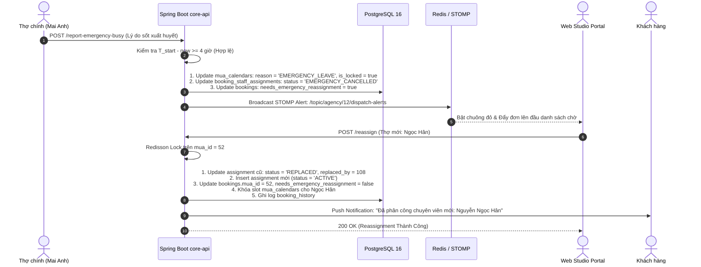

# TÀI LIỆU ĐẶC TẢ USER STORIES & THIẾT KẾ KỸ THUẬT CHI TIẾT
## PHÂN HỆ: ĐIỀU PHỐI ĐƠN STUDIO (DISPATCHING ENGINE), MA TRẬN GÁN THỢ & ĐỔI THỢ DỰ PHÒNG
### (Spring Boot 3.3.x Layered Monolith `core-api` - Schemas: `agency_schema` & `booking_schema`, Port `8080`)

---

## 📌 1. TỔNG QUAN TÍNH NĂNG (FEATURE OVERVIEW)

* **Tên Phân hệ Nghiệp vụ:** `Agency Dispatching Engine, Staff Assignment Matrix & Emergency Reassignment`
* **Mã Jira Issues phụ trách (Sprint 3):**
  * `ISSUE-19.1`: **User Story** - Agency Dispatching Engine - Tiếp nhận đơn đặt chỉ định Studio (`PENDING_AGENCY_DISPATCH`).
  * `ISSUE-19.2`: **Task** - UI Ma trận Lịch rảnh & Gán Thợ chính / Thợ phụ cho ca trên Web Studio (`agency_staff_services`, `agency_staff_styles` & `agency_staff_shifts`).
  * `ISSUE-19.3`: **Task** - Tính năng Đổi Thợ dự phòng khi Thợ chính báo bận đột xuất trên Web Studio Portal.
* **Mô hình Kiến trúc:**
  * **Spring Boot 3.3.x Layered Architecture Monolith** (`code/backend/core-api`, Port `8080`).
  * **Động cơ Ma trận Lọc Năng lực & Lịch trực 4 Chiều Toàn Diện (Comprehensive 4-Way Dispatching Matrix):**
    Thực thi bằng **1 Single Projection Native Query duy nhất** đối chiếu đồng thời 4 điều kiện tiên quyết chỉ trong **$< 15\text{ms}$** (loại bỏ hoàn toàn $N+1$ query):
    1. **Năng lực Gói Dịch vụ:** Thợ trực thuộc Studio đạt chuẩn gói (`agency_schema.agency_staff_services.is_qualified = true`).
    2. **Kỹ năng Phong cách (Tone Make-up):** Thợ đạt chứng chỉ phong cách khách chọn (`agency_schema.agency_staff_styles.is_qualified = true`).
    3. **Lịch Trực Ca Studio (`agency_schema.agency_staff_shifts`):** Ca hẹn của khách $[T_{\text{start}}, T_{\text{end}}]$ phải nằm trọn vẹn trong ca làm việc đăng ký của thợ tại Studio. Hỗ trợ đồng thời cả **Ca định kỳ lặp lại theo tuần (`is_recurring = true, day_of_week`)** và **Ca trực đột xuất xếp riêng theo ngày cụ thể (`work_date = :bookingDate`)**. Thợ không có ca trực hợp lệ sẽ được phân hạng `OFF_SHIFT`.
    4. **Lịch Rảnh & Đệm Di Chuyển (PostgreSQL GiST `tstzrange &&`):** Thợ không bị trùng lịch làm việc hoặc ca bận cá nhân trong `mua_schema.mua_calendars` (đối chiếu qua `agency_staff.mua_id`). **Tuyệt đối không lọc cứng theo `booking_date`** để bảo vệ 100% các ca vắt qua ranh giới nửa đêm (Midnight Crossing) có khoảng đệm di chuyển 30 phút hai đầu.
  * **Ràng Buộc Nghiệp Vụ Cứng: Duy Nhất 1 Thợ Chính (Single Primary MUA Constraint):**
    * Bảo vệ bằng **PostgreSQL Partial Unique Index**:  
      `CREATE UNIQUE INDEX idx_unique_primary_mua_per_booking ON booking_schema.booking_staff_assignments(booking_id) WHERE assignment_role = 'PRIMARY_MUA' AND status = 'ACTIVE';`
    * Đảm bảo mỗi đơn hàng chỉ có duy nhất 1 Thợ chính đang hoạt động, ngăn chặn triệt để xung đột khi đồng bộ `bookings.mua_id`.
  * **Kiểm Soát Tranh Chấp Lịch & Chống Deadlock (Lock Ordering & Redisson MultiLock):**
    * Khi gán đa nhân sự (1 Thợ chính + 1–2 Thợ phụ), toàn bộ danh sách `mua_id` bắt buộc phải được **sắp xếp tăng dần theo ID tự nhiên** (`Collections.sort`) trước khi yêu cầu khóa.
    * Sử dụng **Redisson MultiLock** (`redissonClient.getMultiLock(...)`) khóa đồng thời các thợ theo thứ tự cố định để giảm thiểu deadlock/race-condition khi nhiều lễ tân gán ca cùng thời điểm. Ràng buộc cuối cùng vẫn phải được bảo vệ bằng unique/exclusion constraint ở PostgreSQL.
    * Kết hợp **Exclusion Constraint** (`exclude_mua_overlapping_slots`) ở tầng Database để bảo vệ phòng thủ 2 lớp (Defense-in-Depth). Migration bắt buộc phải tạo GiST index/constraint tương ứng, không chỉ mô tả ở tầng service.
  * **Quản Lý Vòng Đời & Kiểm Toán Khi Thợ Báo Bận Khẩn Cấp (Emergency Audit Trail):**
    * Khi thợ báo bận đột xuất, **KHÔNG xóa slot lịch** để chống việc khách khác nhảy vào book thợ đang ốm/sự cố. Hệ thống giữ nguyên `is_locked = true`, cập nhật `reason = 'EMERGENCY_LEAVE_STAFF_{id}'` và gỡ `booking_id = NULL`.
    * Cập nhật bản ghi phân công trong `booking_staff_assignments` sang `status = 'EMERGENCY_CANCELLED'`, ghi nhận `cancellation_reason` và `cancelled_at` để bảo lưu đầy đủ Audit Trail.
    * Khi Studio gán thợ thay thế, bản ghi thợ cũ chuyển sang `status = 'REPLACED'` kèm tham chiếu `replaced_by_staff_id`.
  * **Ưu Tiên Điều Phối Đơn Khẩn Cấp Trên Web Studio:**
    * Bổ sung Partial Index `idx_bookings_agency_emergency` lọc `needs_emergency_reassignment = TRUE`, đẩy ngay lập tức các đơn cần đổi thợ lên đầu bảng danh sách chờ tiếp nhận.
* **Đối tượng Sử dụng (User Personas):**
  1. **Agency Owner / Studio Admin (`ROLE_AGENCY_ADMIN`) & Receptionist (`ROLE_AGENCY_STAFF`):**
     * Tiếp nhận đơn hàng do khách đặt trực tiếp cho Studio trên Web Studio Portal.
     * Sử dụng Ma trận Lịch rảnh 4 chiều trực quan để phân công thợ chính / thợ phụ phù hợp nhất với phong cách khách yêu cầu.
     * Theo dõi trạng thái xác nhận ca của thợ (`is_confirmed_by_staff`) để chủ động liên hệ nhắc nhở.
     * Xử lý tình huống khẩn cấp khi thợ chính báo bận đột xuất: Nhận cảnh báo chuông đỏ tức thì qua WebSocket STOMP và đổi thợ dự phòng chỉ với 1 cú click chuột.
  2. **Studio Staff MUA (Thợ trang điểm trực thuộc Studio):**
     * Nhận thông báo ca làm được Studio phân công trên Mobile App.
     * Được quyền bấm xác nhận nhận ca (`is_confirmed_by_staff = true`) hoặc báo bận đột xuất theo 3 ngưỡng rõ ràng:
       - Còn $\ge 4\text{ tiếng}$ trước giờ hẹn: Thợ được tự báo bận trên App nếu có lý do và bằng chứng hợp lệ.
       - Còn từ $2\text{ tiếng}$ đến dưới $4\text{ tiếng}$: App ghi nhận yêu cầu nhưng chuyển sang trạng thái `PENDING_STUDIO_APPROVAL`, Studio phải xác nhận thủ công.
       - Còn $< 2\text{ tiếng}$: Chặn tự hủy trên App, yêu cầu gọi hotline Studio để xử lý khẩn cấp.
  3. **Customer (Khách hàng đặt ca của Studio):**
     * Được phục vụ bởi đội ngũ chuyên nghiệp có sự bảo chứng uy tín từ Studio.
     * Được thông báo rõ ràng thông tin Thợ chính và Thợ phụ phụ trách ca làm; được tự động cập nhật thông tin nếu Studio đổi thợ dự phòng.

---

## 🏗️ 2. KIẾN TRÚC PHÂN TẦNG BACK-END (LAYERED ARCHITECTURE BACKEND)

Mã nguồn phân hệ Agency Dispatching được tổ chức chuẩn hóa theo kiến trúc phân tầng tại `code/backend/core-api/src/main/java/com/makeup/platform/`:

```text
code/backend/core-api/src/main/java/com/makeup/platform/
├── common/
│   ├── base/
│   │   ├── BaseEntity.java                    # id, created_at, updated_at
│   │   ├── BaseController.java                # ok, created, error
│   │   ├── ApiResponse.java                   # Envelope: {success, errorCode, message, data, timestamp}
│   │   ├── PageResponse.java                  # Envelope phân trang chuẩn
│   │   ├── BaseService.java
│   │   └── BaseServiceImpl.java
│   ├── constants/
│   │   ├── DispatchConstants.java             # BUFFER_MINUTES (30), EMERGENCY_REASSIGN_BUFFER_HOURS (4h), MIN_BUSY_REPORT_HOURS (2h), MAX_ASSISTANTS (2)
│   │   └── ErrorCodes.java                    # ERR_STAFF_NOT_QUALIFIED, ERR_STAFF_OFF_SHIFT, ERR_MULTIPLE_PRIMARY_MUA, ERR_STAFF_CALENDAR_BUSY...
│   ├── exception/
│   │   ├── GlobalExceptionHandler.java        # @RestControllerAdvice xử lý ngoại lệ tập trung
│   │   ├── CustomBusinessException.java       # Lỗi nghiệp vụ có mã lỗi ErrorCodes
│   │   ├── ResourceNotFoundException.java     # Lỗi không tìm thấy bản ghi (404)
│   │   ├── AccessDeniedException.java         # Lỗi vi phạm phân quyền/IDOR (403)
│   │   └── StaffQualificationException.java   # Lỗi gán thợ không đủ điều kiện chuyên môn/ca trực
│   ├── i18n/
│   │   ├── CustomLocaleResolver.java          # Đa ngôn ngữ Accept-Language (vi, en)
│   │   └── JsonMessageSource.java             # Nạp file i18n JSON (messages_vi.json, messages_en.json)
│   └── utils/
│       ├── SecurityContextUtils.java          # Trích xuất userId, agencyId từ SecurityContext
│       └── DateTimeUtils.java                 # Chuyển đổi ngày giờ, tính DOW chuẩn Database (1: CN, 2: T2... 7: T7)
│
├── config/
│   ├── SecurityConfig.java                    # Phân quyền Endpoint & PreAuthorize
│   ├── RedissonConfig.java                    # Redisson Distributed Lock & MultiLock client
│   └── WebSocketConfig.java                   # STOMP broker cấu hình /ws-makeup
│
├── controller/
│   └── agency/
│       ├── AgencyDispatchController.java      # GET /api/v1/agency/dispatch/pending-bookings, POST /reject
│       ├── AgencyStaffMatrixController.java   # GET /api/v1/agency/dispatch/bookings/{id}/staff-matrix
│       ├── AgencyAssignmentController.java    # POST /api/v1/agency/dispatch/bookings/{id}/assign
│       └── AgencyEmergencyController.java     # POST /api/v1/agency/dispatch/bookings/{id}/reassign & /report-emergency-busy
│
├── dto/
│   ├── request/agency/
│   │   ├── AssignStaffToBookingReq.java       # primaryStaffId, assistantStaffIds, dispatchNotes
│   │   ├── ReassignStaffReq.java              # oldStaffId, newStaffId, reassignmentReason
│   │   ├── RejectDispatchBookingReq.java      # rejectionReason, rejectionNote
│   │   └── ReportEmergencyBusyReq.java        # emergencyReason, proofDocumentUrl
│   └── response/agency/
│       ├── AgencyPendingBookingRes.java       # bookingId, customerName, package, style, totalAmount, needsEmergencyReassignment
│       ├── StaffAvailabilityMatrixRes.java    # Danh sách thợ kèm ma trận: packageQualified, styleQualified, onShift, calendarFree, eligibility
│       ├── DispatchAssignmentRes.java         # bookingId, primaryMua, assistants, status
│       └── EmergencyReassignmentRes.java      # bookingId, previousStaff, newStaff, customerNotified
│
├── entity/
│   ├── agency/
│   │   ├── AgencyStaffEntity.java             # agency_schema.agency_staff (id, agency_id, mua_id, status)
│   │   ├── AgencyStaffShiftEntity.java        # agency_schema.agency_staff_shifts (day_of_week, work_date, start_time, end_time)
│   │   ├── AgencyStaffServiceEntity.java      # agency_schema.agency_staff_services (staff_id, package_id, is_qualified)
│   │   └── AgencyStaffStyleEntity.java        # agency_schema.agency_staff_styles (staff_id, style_id, is_qualified)
│   ├── booking/
│   │   ├── BookingEntity.java                 # booking_schema.bookings (style_id, needs_emergency_reassignment...)
│   │   └── BookingStaffAssignmentEntity.java  # booking_schema.booking_staff_assignments (status: ACTIVE, EMERGENCY_CANCELLED, REPLACED)
│   └── mua/
│       └── MuaCalendarEntity.java             # mua_schema.mua_calendars (mua_id, start_at, end_at, is_locked, reason)
│
├── mapper/
│   ├── agency/
│   │   ├── AgencyStaffMapper.java             # Manual Mapper Spring @Component: AgencyStaffEntity <-> DTOs
│   │   └── DispatchMatrixMapper.java          # Manual Mapper Spring @Component: Native Projection <-> Matrix DTOs
│   └── booking/
│       └── BookingStaffAssignmentMapper.java  # Manual Mapper Spring @Component: BookingStaffAssignmentEntity <-> DTOs
│
├── repository/
│   ├── agency/
│   │   ├── AgencyStaffRepository.java
│   │   ├── AgencyStaffShiftRepository.java    # findActiveShiftsByStaffAndDate
│   │   ├── AgencyStaffServiceRepository.java  # checkStaffQualifiedForPackage
│   │   └── AgencyStaffStyleRepository.java    # checkStaffQualifiedForStyle
│   └── booking/
│       ├── BookingRepository.java             # findPendingDispatchBookingsByAgencyId
│       ├── BookingStaffAssignmentRepository.java # findByBookingIdAndStatus, countActivePrimaryMua
│       └── custom/
│           ├── StaffMatrixCustomRepository.java # Interface Native Projection ma trận thợ 4 chiều
│           └── StaffMatrixCustomRepositoryImpl.java # Triển khai Native SQL 1 Query duy nhất (<15ms)
│
├── event/
│   ├── BookingStaffAssignedEvent.java         # Bắn thông báo mời thợ nhận ca
│   ├── EmergencyReassignmentRequestedEvent.java # Báo chuông đỏ trên Web Studio qua WebSocket STOMP
│   └── BookingStaffReassignedEvent.java       # Thông báo cập nhật thợ mới cho khách hàng
│
└── service/
    ├── agency/
    │   ├── AgencyDispatchService.java         # Tiếp nhận / từ chối đơn hàng gửi tới Studio
    │   ├── StaffAssignmentMatrixService.java  # Tính toán ma trận thợ & gán đa nhân sự (Redisson MultiLock)
    │   └── EmergencyReassignmentService.java  # Quy trình đổi thợ dự phòng khẩn cấp & Audit Trail
    └── impl/agency/
        ├── AgencyDispatchServiceImpl.java     # Triển khai tiếp nhận / từ chối đơn chỉ định
        ├── StaffAssignmentMatrixServiceImpl.java # Triển khai gán thợ, sort Lock Ordering, khóa mua_calendars
        └── EmergencyReassignmentServiceImpl.java # Triển khai đổi thợ, chuyển status assignment, STOMP alert
```

---

## 📋 3. DANH SÁCH USER STORIES CHI TIẾT & TIÊU CHÍ BDD (ACCEPTANCE CRITERIA)

---

### **US-DISP-01: Tiếp Nhận & Phê Duyệt Đơn Đặt Chỉ Định Studio (`ISSUE-19.1`)**
> **As a** Chủ Studio / Đại lý (`ROLE_AGENCY_ADMIN`) hoặc Lễ tân điều phối (`ROLE_AGENCY_STAFF`),  
> **I want to** xem danh sách các đơn hàng do khách đặt chỉ định cho Studio của tôi (ưu tiên đơn cần đổi thợ khẩn cấp lên đầu) và bấm tiếp nhận điều phối hoặc từ chối,  
> **So that** Studio chủ động quản lý công suất phục vụ và xử lý đơn khẩn cấp kịp thời.

#### **Tiêu chí Nghiệm thu (Acceptance Criteria - BDD):**

* **Scenario 01: Studio tiếp nhận đơn đặt chỉ định thành công và sắp xếp ưu tiên đơn khẩn cấp**
  * **Given** Khách hàng đặt đơn hẹn trước chỉ định Studio Áo Cưới Dạ Yến (`agency_id = 12`).
  * **And** Có 2 đơn hàng: Đơn `720` mới đặt (`PENDING_AGENCY_DISPATCH`, `needs_emergency_reassignment = false`) và Đơn `680` bị thợ báo bận (`needs_emergency_reassignment = true`).
  * **When** Lễ tân Studio mở màn hình `GET /api/v1/agency/dispatch/pending-bookings`.
  * **Then** Đơn `680` xuất hiện ở **vị trí đầu tiên** với viền đỏ cảnh báo nhấp nháy: `[CẦN ĐỔI THỢ KHẨN CẤP]`.
  * **And** Đơn `720` nằm ở vị trí tiếp theo, hiển thị đầy đủ thông tin:
    - Khách hàng: Nguyễn Thanh Trúc - SĐT: `0908***123`
    - Gói dịch vụ: Make-up Cô dâu Hoàng Gia ($3,500,000\text{ đ}$)
    - Phong cách yêu cầu: Tone Thái Sang Trọng (`style_id = 2`)
    - Thời gian hẹn: 06:00 sáng ngày 15/11/2026 tại Khách sạn Rex, Q.1.
    - Doanh thu Studio dự kiến: $2,800,000\text{ đ}$ (sau khi trừ $20\%$ hoa hồng sàn).
  * **And** Studio bấm nút **[Bắt đầu Điều phối Thợ]** $\rightarrow$ Chuyển sang màn hình Ma trận Gán Thợ.

* **Scenario 02: Studio từ chối đơn do toàn bộ thợ kín lịch (Reject Booking)**
  * **Given** Vào ngày 15/11/2026 Studio đã nhận tối đa ca cưới, không còn nhân sự trống.
  * **When** Studio Admin gửi request `POST /api/v1/agency/dispatch/bookings/720/reject`:
    ```json
    {
      "rejection_reason": "STUDIO_FULLY_BOOKED",
      "rejection_note": "Toàn bộ chuyên viên trang điểm của Studio đã kín lịch trong ngày cưới cao điểm 15/11. Rất mong quý khách thông cảm!"
    }
    ```
  * **Then** Backend cập nhật trạng thái đơn sang `CANCELLED`.
  * **And** Kích hoạt `BookingStateChangedEvent` $\rightarrow$ giải phóng cọc Escrow hoàn lại $100\%$ ($1,050,000\text{ đ}$) vào ví khách hàng trong cùng `@Transactional`.
  * **And** Gửi thông báo kèm lời xin lỗi và lý do từ chối đến tài khoản của Khách hàng.

* **Scenario 03: Chặn Studio khác can thiệp vào đơn chỉ định (IDOR Prevention)**
  * **Given** Đơn `booking_id = 720` được đặt cho Studio A (`agency_id = 12`).
  * **When** Studio B (`agency_id = 99`) cố tình gửi request tiếp nhận hoặc từ chối đơn 720.
  * **Then** Backend đối chiếu `booking.agency_id != current_user.agency_id`.
  * **And** Ném ngoại lệ `AccessDeniedException` với mã lỗi `ERR_BOOKING_NOT_ASSIGNED_TO_AGENCY`, trả về HTTP `403 FORBIDDEN`.

---

### **US-DISP-02: Ma Trận Lịch Rảnh & Gán Thợ Chính / Thợ Phụ Theo Năng Lực (`ISSUE-19.2`)**
> **As a** Quản trị viên Điều phối Studio,  
> **I want** hệ thống hiển thị bảng ma trận đối soát 4 chiều (Gói, Tone, Ca trực Studio bao gồm ca ngày/ca tuần, Lịch rảnh cá nhân),  
> **So that** tôi chỉ gán các thợ đang trong ca làm việc, đủ kỹ năng gói và phong cách make-up mà khách đã chọn.

#### **Tiêu chí Nghiệm thu (Acceptance Criteria - BDD):**

* **Scenario 01: Ma trận tự động phân loại 4 chiều (Bao gồm Ca trực & Midnight Crossing)**
  * **Given** Đơn hàng 720 yêu cầu Gói Make-up Cô dâu (`package_id = 15`), Tone Thái (`style_id = 2`), thời gian hẹn 06:00 - 08:30 sáng ngày Chủ Nhật (15/11/2026).
  * **When** Studio mở API `GET /api/v1/agency/dispatch/bookings/720/staff-matrix`.
  * **Then** Backend tính toán cửa sổ đệm di chuyển 30 phút hai đầu ($05:30 - 09:00$) và thực thi 1 Native Projection Query:
    * **Thợ 1 (Mai Anh):** Đạt Gói 15 (`true`), Đạt Tone Thái (`true`), Có ca trực sáng Chủ Nhật 05:00 - 13:00 (`on_shift = true`), Không vướng ca vắt qua đêm trong `mua_calendars` $\implies$ **`ELIGIBLE_PRIMARY` (TOP_MATCH)**.
    * **Thợ 2 (Lan Phương):** Đạt Gói 15 (`true`), Chưa thi chứng chỉ Tone Thái (`false`), Có ca trực (`true`), Lịch rảnh $\implies$ **`ELIGIBLE_ASSISTANT_ONLY`**.
    * **Thợ 3 (Hồng Nhung):** Đạt Gói 15 (`true`), Đạt Tone Thái (`true`), nhưng **không đăng ký ca trực Chủ Nhật** tại Studio (`on_shift = false`) $\implies$ **`OFF_SHIFT` (DISABLED)**.
    * **Thợ 4 (Kim Tuyến):** Có ca trực, đủ năng lực nhưng vướng ca tiệc đêm kết thúc lúc 05:30 sáng 15/11 (khoảng đệm 30m chạm vào 06:00) $\implies$ **`BUSY` (DISABLED)**.
  * **And** Ma trận hiển thị trực quan bằng các nhãn màu (Xanh lá Emerald / Vàng Amber / Xám Slate).

* **Scenario 02: Gán 1 Thợ chính và 1 Thợ phụ thành công (Happy Path)**
  * **When** Studio Admin chọn:
    - Thợ chính: `staff_id = 101` (Mai Anh - `PRIMARY_MUA`)
    - Thợ phụ: `staff_id = 105` (Lan Phương - `ASSISTANT_MUA`)
  * **And** Gửi request `POST /api/v1/agency/dispatch/bookings/720/assign`:
    ```json
    {
      "primaryStaffId": 101,
      "assistantStaffIds": [105],
      "dispatchNotes": "Yêu cầu thợ có mặt đúng 05:45 tại sảnh lễ tân Sheraton"
    }
    ```
  * **Then** Backend thực thi trong `@Transactional`:
    - Áp dụng **Lock Ordering Pattern**: Sort danh sách `[muaId: 45, 48]` tăng dần và gọi `Redisson MultiLock`.
    - Lưu 2 bản ghi mang `status = 'ACTIVE'`, `is_confirmed_by_staff = false` vào `booking_schema.booking_staff_assignments`.
    - Tạo 2 bản ghi khóa lịch bận trong `mua_schema.mua_calendars` cho cả Mai Anh và Lan Phương.
    - Cập nhật trường `mua_id = 45` (thợ chính) trên `booking_schema.bookings`.
    - Chuyển trạng thái đơn hàng sang `AGENCY_ASSIGNED`.
    - Bắn thông báo In-App Toast & Push Notification đến máy của 2 thợ để yêu cầu xác nhận.

* **Scenario 03: Chặn gán trùng hoặc cố tình gán 2 Thợ chính (Single Primary MUA Protection)**
  * **When** Do lỗi giao diện hoặc cố tình gọi API với 2 Thợ chính cho cùng 1 đơn hàng.
  * **Then** Backend và Database ném ngoại lệ vi phạm Partial Unique Index `idx_unique_primary_mua_per_booking`.
  * **And** Trả về HTTP `400 BAD_REQUEST` với mã lỗi `ERR_MULTIPLE_PRIMARY_MUA`: `"Đơn hàng chỉ được phép có duy nhất 1 Thợ chính phụ trách!"`.

* **Scenario 04: Chống Race-Condition & Deadlock khi nhiều lễ tân gán ca đồng thời**
  * **Given** Lễ tân A gán Đơn 1 (cần Thợ 101 + Thợ 105); Lễ tân B gán Đơn 2 (cần Thợ 105 + Thợ 101).
  * **When** Cả hai bấm submit đồng thời ($< 50\text{ms}$).
  * **Then** Nhờ thuật toán Lock Ordering (luôn sort ID tăng dần thành `[45, 48]`), một bên sẽ lấy được MultiLock trước, bên còn lại chờ hoặc bị ném `ERR_STAFF_CALENDAR_BUSY`, **giảm thiểu khả năng xảy ra deadlock phân tán; xung đột còn lại được xử lý bằng timeout và constraint ở database**.

---

### **US-DISP-03: Tính Năng Đổi Thợ Dự Phòng Khi Thợ Chính Báo Bận Đột Xuất (`ISSUE-19.3`)**
> **As a** Chủ Studio / Quản trị viên Điều phối,  
> **I want** khi thợ được gán báo bận đột xuất, hệ thống khóa lịch không cho thợ nhận đơn khác, lưu vết kiểm toán, rung chuông cảnh báo và hỗ trợ đổi thợ dự phòng ngay lập tức,  
> **So that** ca làm của khách luôn được đảm bảo thực hiện đúng hẹn, bảo vệ uy tín thương hiệu của Studio.

#### **Tiêu chí Nghiệm thu (Acceptance Criteria - BDD):**

* **Scenario 01: Thợ chính báo bận đột xuất hợp lệ trước ca làm $\ge 4$ tiếng**
  * **Given** Thợ chính Mai Anh (`staff_id = 101`, `mua_id = 45`) bị sốt xuất huyết trước giờ hẹn 8 tiếng.
  * **When** Mai Anh mở App và bấm "Báo bận khẩn cấp" qua API `POST /api/v1/agency/dispatch/bookings/720/report-emergency-busy`:
    ```json
    {
      "emergencyReason": "SỐT_XUẤT_HUYẾT",
      "proofDocumentUrl": "https://cdn.makeup.vn/proofs/medical_report_101.webp"
    }
    ```
  * **Then** Hệ thống thực thi:
    - Không xóa slot lịch mà đổi `reason = 'EMERGENCY_LEAVE_STAFF_101'`, giữ nguyên `is_locked = true` và `booking_id = NULL` trong `mua_schema.mua_calendars` để thợ không bị đơn khác book vào.
    - Cập nhật bản ghi phân công của Mai Anh trong `booking_staff_assignments`: `status = 'EMERGENCY_CANCELLED'`, `cancelled_at = NOW()`, `cancellation_reason = 'SỐT_XUẤT_HUYẾT'`.
    - Cập nhật `bookings.needs_emergency_reassignment = true`, `bookings.emergency_reason = 'SỐT_XUẤT_HUYẾT'`.
    - Bắn WebSocket STOMP Alert tới `/topic/agency/12/dispatch-alerts` rung chuông đỏ trên Web Studio Portal.
  * **And** Khách hàng chưa bị hủy đơn; hiển thị trạng thái tạm: `"Studio đang chuẩn bị chuyên viên thay thế tốt nhất cho bạn"`.

* **Scenario 02: Studio thực hiện Đổi Thợ Dự Phòng thành công (Emergency Reassignment)**
  * **Given** Web Studio Portal nhận được cảnh báo đỏ cho đơn 720.
  * **When** Studio Admin bấm nút **[Đổi Thợ Dự Phòng]** và chọn Thợ dự phòng Ngọc Hân (`staff_id = 108`, `mua_id = 52` - có cùng chứng chỉ Gói 15 & Tone Thái, trong ca trực, đang rảnh).
  * **And** Gửi request `POST /api/v1/agency/dispatch/bookings/720/reassign`:
    ```json
    {
      "oldStaffId": 101,
      "newStaffId": 108,
      "reassignmentReason": "Thay thế chuyên viên Mai Anh do sốt nhập viện"
    }
    ```
  * **Then** Backend thực thi `@Transactional` với Redisson Lock trên `mua_id = 52`:
    - Cập nhật bản ghi của Mai Anh sang `status = 'REPLACED'`, `replaced_by_staff_id = 108`.
    - Tạo bản ghi mới cho Ngọc Hân trong `booking_staff_assignments` với `status = 'ACTIVE'`, `assignment_role = 'PRIMARY_MUA'`.
    - Cập nhật `mua_id = 52` trên `booking_schema.bookings`.
    - Đặt `needs_emergency_reassignment = false`.
    - Khóa lịch bận mới cho Ngọc Hân trong `mua_schema.mua_calendars`.
    - Ghi log biến động vào `booking_schema.booking_history`: `"Đổi thợ chính từ Mai Anh sang Ngọc Hân (Lý do: Sốt nhập viện)"`.
  * **And** Gửi Push Notification cập nhật hồ sơ chuyên viên mới (kèm ảnh, rating 4.96★) cho Khách hàng.

* **Scenario 03: Chặn thợ tự ý báo bận sát giờ ($< 2$ tiếng) mà không có xác nhận của Studio**
  * **When** Thợ báo bận khi chỉ còn 45 phút nữa là đến giờ hẹn khách.
  * **Then** Hệ thống chặn lại không cho thợ tự hủy trên App và ném lỗi `ERR_EMERGENCY_REPORT_TOO_LATE`.
  * **And** Trả về HTTP `400 BAD_REQUEST`: `"Chỉ còn dưới 2 tiếng trước ca làm. Vui lòng liên hệ hotline khẩn cấp của Studio để được hỗ trợ thủ công!"`.

---

## ⚠️ 4. CHI TIẾT NGOẠI LỆ, VALIDATION & BẢNG MÃ LỖI BACK-END

### 4.1. Bảng Ma trận Mã Lỗi Phân hệ Agency Dispatching

| HTTP Status | Mã Lỗi (`errorCode`) | Nguyên Nhân Kích Hoạt | Giải Pháp Xử Lý Phía Server |
| :--- | :--- | :--- | :--- |
| **`400 BAD_REQUEST`** | `ERR_STAFF_NOT_QUALIFIED_FOR_PACKAGE` | Thợ được chọn chưa được cấp quyền thực hiện Gói Dịch vụ của Studio (`agency_staff_services.is_qualified = false`). | Chặn gán, yêu cầu chọn thợ có kỹ năng gói phù hợp. |
| **`400 BAD_REQUEST`** | `ERR_STAFF_NOT_QUALIFIED_FOR_STYLE` | Thợ được chọn chưa có chứng chỉ Phong cách Make-up (Tone) theo yêu cầu đơn hàng (`agency_staff_styles.is_qualified = false`). | Chặn phân công Thợ chính, chỉ cho phép làm Thợ phụ nếu cần. |
| **`400 BAD_REQUEST`** | `ERR_STAFF_OFF_SHIFT` | Thợ không có ca làm việc đăng ký tại Studio (`agency_staff_shifts`) vào thời điểm diễn ra ca hẹn. | Chặn phân công, yêu cầu chọn thợ đang trong ca trực. |
| **`400 BAD_REQUEST`** | `ERR_MULTIPLE_PRIMARY_MUA` | Cố tình gán từ 2 Thợ chính trở lên cho cùng 1 đơn hàng. | Chặn gán bằng Partial Unique Index. |
| **`202 ACCEPTED`** | `PENDING_STUDIO_APPROVAL` | Thợ báo bận khi còn từ $2\text{ tiếng}$ đến dưới $4\text{ tiếng}$. | Ghi nhận yêu cầu ở trạng thái chờ duyệt, `errorCode = null`, gửi alert cho Studio duyệt thủ công. |
| **`400 BAD_REQUEST`** | `ERR_EMERGENCY_REPORT_TOO_LATE` | Thợ báo bận đột xuất khi thời gian còn lại trước ca làm $< 2\text{ tiếng}$. | Chặn tự hủy, yêu cầu thợ gọi hotline Studio can thiệp. |
| **`400 BAD_REQUEST`** | `ERR_DUPLICATE_STAFF_ASSIGNMENT` | Chọn cùng một thợ cho cả vai trò Thợ chính và Thợ phụ trong cùng 1 đơn. | Bean Validation chặn trùng lặp ID thợ. |
| **`403 FORBIDDEN`** | `ERR_BOOKING_NOT_ASSIGNED_TO_AGENCY` | Studio A cố tình truy cập hoặc điều phối đơn hàng thuộc về Studio B (Lỗ hổng IDOR). | Đối chiếu `current_user.agency_id == booking.agency_id`. |
| **`403 FORBIDDEN`** | `ERR_STAFF_NOT_IN_AGENCY` | Studio cố tình gán thợ tự do bên ngoài hoặc thợ thuộc Studio khác. | Đối chiếu `staff.agency_id == current_agency_id`. |
| **`409 CONFLICT`** | `ERR_STAFF_CALENDAR_BUSY` | Thợ được chọn đã có ca làm khác hoặc lịch bận cá nhân trùng giờ hẹn (kể cả ca đêm). | Kiểm tra `mua_calendars` kết hợp Redisson MultiLock. |

---

### 4.2. Khai Báo Song Ngữ i18n Chuẩn Bắt Buộc

#### `src/main/resources/i18n/messages_vi.json`
```json
{
  "dispatch.pending_list_retrieved": "Lấy danh sách đơn chờ điều phối thành công.",
  "dispatch.staff_matrix_retrieved": "Phân tích ma trận năng lực thợ thành công.",
  "dispatch.staff_assigned_success": "Phân công chuyên viên cho ca làm thành công.",
  "dispatch.staff_reassigned_success": "Đổi chuyên viên dự phòng thành công.",
  "dispatch.booking_rejected_success": "Từ chối đơn chỉ định và hoàn cọc thành công.",
  "dispatch.emergency_busy_reported": "Đã ghi nhận báo bận khẩn cấp và thông báo tới Studio.",
  "dispatch.error.not_qualified_package": "Chuyên viên được chọn chưa đủ điều kiện thực hiện gói dịch vụ này.",
  "dispatch.error.not_qualified_style": "Chuyên viên được chọn chưa đạt chứng chỉ phong cách make-up yêu cầu.",
  "dispatch.error.off_shift": "Chuyên viên không có ca làm việc đăng ký tại Studio vào thời gian này.",
  "dispatch.error.multiple_primary_mua": "Đơn hàng chỉ được phép có duy nhất một Thợ chính.",
  "dispatch.error.calendar_busy": "Chuyên viên đã có ca làm hoặc lịch bận cá nhân trùng khung giờ này.",
  "dispatch.error.report_too_late": "Chỉ còn dưới 2 tiếng trước ca làm. Vui lòng gọi trực tiếp hotline Studio!",
  "dispatch.error.duplicate_staff": "Không thể gán cùng một chuyên viên cho cả vai trò thợ chính và thợ phụ.",
  "dispatch.report_requires_approval": "Yêu cầu báo bận đã được ghi nhận và đang chờ Studio xác nhận.",
  "dispatch.primary_staff_id.required": "Vui lòng chọn thợ chính.",
  "dispatch.assistants.max_two": "Chỉ được chọn tối đa 2 thợ phụ.",
  "dispatch.notes.too_long": "Ghi chú điều phối không được vượt quá 500 ký tự.",
  "dispatch.old_staff_id.required": "Vui lòng chọn chuyên viên cần thay thế.",
  "dispatch.new_staff_id.required": "Vui lòng chọn chuyên viên thay thế.",
  "dispatch.reassign_reason.required": "Vui lòng nhập lý do đổi thợ.",
  "dispatch.reassign_reason.max_len": "Lý do đổi thợ không được vượt quá 255 ký tự."
}
```

#### `src/main/resources/i18n/messages_en.json`
```json
{
  "dispatch.pending_list_retrieved": "Pending dispatch bookings retrieved successfully.",
  "dispatch.staff_matrix_retrieved": "Staff qualification matrix analyzed successfully.",
  "dispatch.staff_assigned_success": "Staff assigned to booking successfully.",
  "dispatch.staff_reassigned_success": "Emergency backup staff reassigned successfully.",
  "dispatch.booking_rejected_success": "Booking rejected and deposit refunded successfully.",
  "dispatch.emergency_busy_reported": "Emergency busy report logged and agency notified.",
  "dispatch.error.not_qualified_package": "Selected staff is not qualified for this service package.",
  "dispatch.error.not_qualified_style": "Selected staff does not have the required makeup style certificate.",
  "dispatch.error.off_shift": "Selected staff is not scheduled on shift at the studio during this timeframe.",
  "dispatch.error.multiple_primary_mua": "Booking can only have exactly one primary makeup artist.",
  "dispatch.error.calendar_busy": "Selected staff has an overlapping booking or busy slot in this timeframe.",
  "dispatch.error.report_too_late": "Less than 2 hours left before appointment. Please contact studio hotline directly!",
  "dispatch.error.duplicate_staff": "Cannot assign the same staff as both primary MUA and assistant.",
  "dispatch.report_requires_approval": "Emergency busy report has been recorded and is waiting for studio approval.",
  "dispatch.primary_staff_id.required": "Please select a primary makeup artist.",
  "dispatch.assistants.max_two": "You can select at most 2 assistants.",
  "dispatch.notes.too_long": "Dispatch notes must not exceed 500 characters.",
  "dispatch.old_staff_id.required": "Please select the staff member to replace.",
  "dispatch.new_staff_id.required": "Please select the replacement staff member.",
  "dispatch.reassign_reason.required": "Please provide the reassignment reason.",
  "dispatch.reassign_reason.max_len": "Reassignment reason must not exceed 255 characters."
}
```

---

### 4.3. Mã Nguồn Request DTOs (Bean Validation)

#### DTO Gán Thợ Cho Ca Làm: `AssignStaffToBookingReq.java`
```java
package com.makeup.platform.dto.request.agency;

import jakarta.validation.constraints.NotNull;
import jakarta.validation.constraints.Size;
import lombok.AllArgsConstructor;
import lombok.Builder;
import lombok.Data;
import lombok.NoArgsConstructor;

import java.util.List;

@Data
@Builder
@NoArgsConstructor
@AllArgsConstructor
public class AssignStaffToBookingReq {

    @NotNull(message = "{dispatch.primary_staff_id.required}")
    private Long primaryStaffId;

    @Size(max = 2, message = "{dispatch.assistants.max_two}")
    private List<Long> assistantStaffIds;

    @Size(max = 500, message = "{dispatch.notes.too_long}")
    private String dispatchNotes;
}
```

#### DTO Đổi Thợ Dự Phòng: `ReassignStaffReq.java`
```java
package com.makeup.platform.dto.request.agency;

import jakarta.validation.constraints.NotBlank;
import jakarta.validation.constraints.NotNull;
import jakarta.validation.constraints.Size;
import lombok.AllArgsConstructor;
import lombok.Builder;
import lombok.Data;
import lombok.NoArgsConstructor;

@Data
@Builder
@NoArgsConstructor
@AllArgsConstructor
public class ReassignStaffReq {

    @NotNull(message = "{dispatch.old_staff_id.required}")
    private Long oldStaffId;

    @NotNull(message = "{dispatch.new_staff_id.required}")
    private Long newStaffId;

    @NotBlank(message = "{dispatch.reassign_reason.required}")
    @Size(max = 255, message = "{dispatch.reassign_reason.max_len}")
    private String reassignmentReason;
}
```

> **Lưu ý validation:** `@Size(max = 2)` chưa chặn được trường hợp `primaryStaffId` xuất hiện lại trong `assistantStaffIds` hoặc danh sách assistant có ID trùng nhau. Cần thêm custom validator hoặc validate ở service trước khi lấy lock.

---

## 💻 5. ĐẶC TẢ REST API CONTRACTS

---

### 5.1. `GET /api/v1/agency/dispatch/pending-bookings` (Danh Sách Đơn Chờ Điều Phối)
* **Quyền truy cập:** `ROLE_AGENCY_ADMIN` hoặc `ROLE_AGENCY_STAFF`.
* **Headers:** `Authorization: Bearer <JWT>`, `Accept-Language: vi`
* **Query Params khuyến nghị:** `page`, `size`, `bookingDateFrom`, `bookingDateTo`, `emergencyOnly`, `sort=emergency_first,created_desc`. Với dữ liệu thật nên trả về `PageResponse<AgencyPendingBookingRes>` thay vì array không phân trang.
* **Response `200 OK` (Đơn cần đổi thợ khẩn cấp được đẩy lên đầu):**
```json
{
  "success": true,
  "errorCode": null,
  "message": "Lấy danh sách đơn chờ điều phối thành công.",
  "data": [
    {
      "bookingId": 680,
      "bookingCode": "BK-261115-EMG",
      "status": "PENDING_AGENCY_DISPATCH",
      "bookingDate": "2026-11-15",
      "startTime": "06:00:00",
      "estimatedDurationMinutes": 120,
      "customerInfo": {
        "fullName": "Phạm Quỳnh Chi",
        "phoneNumber": "0912345678"
      },
      "destinationAddress": "Park Hyatt Saigon, Q.1, TP.HCM",
      "packageId": 15,
      "packageName": "Gói Make-up Cô dâu Hoàng Gia 2026",
      "styleId": 2,
      "styleName": "Tone Thái Sang Trọng",
      "financialSummary": {
        "totalAmount": 3500000.00,
        "agencyExpectedEarnings": 2800000.00,
        "depositLocked": 1050000.00
      },
      "needsEmergencyReassignment": true,
      "emergencyReason": "Sốt xuất huyết nhập viện",
      "createdAt": "2026-09-22T08:00:00Z"
    },
    {
      "bookingId": 720,
      "bookingCode": "BK-261115-REX",
      "status": "PENDING_AGENCY_DISPATCH",
      "bookingDate": "2026-11-15",
      "startTime": "06:00:00",
      "estimatedDurationMinutes": 120,
      "customerInfo": {
        "fullName": "Nguyễn Thanh Trúc",
        "phoneNumber": "0908123456"
      },
      "destinationAddress": "Khách sạn Rex, Q.1, TP.HCM",
      "packageId": 15,
      "packageName": "Gói Make-up Cô dâu Hoàng Gia 2026",
      "styleId": 2,
      "styleName": "Tone Thái Sang Trọng",
      "financialSummary": {
        "totalAmount": 3500000.00,
        "agencyExpectedEarnings": 2800000.00,
        "depositLocked": 1050000.00
      },
      "needsEmergencyReassignment": false,
      "emergencyReason": null,
      "createdAt": "2026-09-22T09:20:00Z"
    }
  ],
  "timestamp": "2026-09-22T16:30:00Z"
}
```

---

### 5.2. `POST /api/v1/agency/dispatch/bookings/{bookingId}/accept` (Tiếp Nhận Đơn Vào Luồng Điều Phối)
* **Quyền truy cập:** `ROLE_AGENCY_ADMIN` hoặc `ROLE_AGENCY_STAFF`.
* **Mục đích:** Xác nhận Studio nhận xử lý đơn chỉ định trước khi mở ma trận gán thợ. Nếu dự án quyết định không cần trạng thái trung gian, cần ghi rõ hành động “Bắt đầu Điều phối Thợ” chỉ là điều hướng UI và không đổi trạng thái booking.
* **Validation bắt buộc:** `booking.agency_id == current_user.agency_id`, booking đang ở `PENDING_AGENCY_DISPATCH`, chưa bị hủy/thanh toán lỗi.

---

### 5.3. `GET /api/v1/agency/dispatch/bookings/{bookingId}/staff-matrix` (Ma Trận Năng Lực & Lịch Rảnh 4 Chiều)
* **Response `200 OK`:**
```json
{
  "success": true,
  "errorCode": null,
  "message": "Phân tích ma trận năng lực thợ thành công.",
  "data": {
    "bookingId": 720,
    "requiredPackageId": 15,
    "requiredStyleId": 2,
    "scheduleWindow": "2026-11-15 06:00 - 08:30 (kèm 30m buffer)",
    "staffMatrix": [
      {
        "staffId": 101,
        "muaId": 45,
        "fullName": "Trần Mai Anh",
        "avatarUrl": "https://cdn.makeup.vn/avatars/maianh.webp",
        "rating": 4.95,
        "experienceYears": 6,
        "isQualifiedPackage": true,
        "isQualifiedStyle": true,
        "isOnShift": true,
        "isCalendarFree": true,
        "eligibility": "ELIGIBLE_PRIMARY",
        "recommendationBadge": "TOP_MATCH"
      },
      {
        "staffId": 105,
        "muaId": 48,
        "fullName": "Đặng Lan Phương",
        "avatarUrl": "https://cdn.makeup.vn/avatars/lanphuong.webp",
        "rating": 4.82,
        "experienceYears": 3,
        "isQualifiedPackage": true,
        "isQualifiedStyle": false,
        "isOnShift": true,
        "isCalendarFree": true,
        "eligibility": "ELIGIBLE_ASSISTANT_ONLY",
        "recommendationBadge": null
      },
      {
        "staffId": 106,
        "muaId": 49,
        "fullName": "Vũ Hồng Nhung",
        "avatarUrl": "https://cdn.makeup.vn/avatars/hnhung.webp",
        "rating": 4.90,
        "experienceYears": 5,
        "isQualifiedPackage": true,
        "isQualifiedStyle": true,
        "isOnShift": false,
        "isCalendarFree": true,
        "eligibility": "OFF_SHIFT",
        "busyReason": "Không có ca trực tại Studio vào ngày này"
      },
      {
        "staffId": 109,
        "muaId": 51,
        "fullName": "Lê Kim Tuyến",
        "avatarUrl": "https://cdn.makeup.vn/avatars/ktuyen.webp",
        "rating": 4.88,
        "experienceYears": 4,
        "isQualifiedPackage": true,
        "isQualifiedStyle": true,
        "isOnShift": true,
        "isCalendarFree": false,
        "eligibility": "BUSY",
        "busyReason": "Trùng ca tiệc đêm hoặc đệm di chuyển (05:30 - 08:00)"
      }
    ]
  },
  "timestamp": "2026-09-22T16:30:01Z"
}
```

---

### 5.4. `POST /api/v1/agency/dispatch/bookings/{bookingId}/assign` (Gán Thợ Chính & Thợ Phụ)
* **Request Body:**
```json
{
  "primaryStaffId": 101,
  "assistantStaffIds": [105],
  "dispatchNotes": "Yêu cầu thợ có mặt đúng 05:45 tại sảnh lễ tân Rex Hotel"
}
```
* **Response `200 OK`:**
```json
{
  "success": true,
  "errorCode": null,
  "message": "Phân công chuyên viên cho ca làm thành công.",
  "data": {
    "bookingId": 720,
    "status": "AGENCY_ASSIGNED",
    "primaryStaff": {
      "staffId": 101,
      "muaId": 45,
      "fullName": "Trần Mai Anh",
      "role": "PRIMARY_MUA",
      "status": "ACTIVE",
      "isConfirmedByStaff": false
    },
    "assistants": [
      {
        "staffId": 105,
        "muaId": 48,
        "fullName": "Đặng Lan Phương",
        "role": "ASSISTANT_MUA",
        "status": "ACTIVE",
        "isConfirmedByStaff": false
      }
    ],
    "assignedAt": "2026-09-22T16:30:02Z"
  },
  "timestamp": "2026-09-22T16:30:02Z"
}
```

---

### 5.5. `POST /api/v1/agency/dispatch/bookings/{bookingId}/reassign` (Đổi Thợ Dự Phòng Khẩn Cấp)
* **Request Body:**
```json
{
  "oldStaffId": 101,
  "newStaffId": 108,
  "reassignmentReason": "Chuyên viên Mai Anh nhập viện sốt xuất huyết"
}
```
* **Response `200 OK`:**
```json
{
  "success": true,
  "errorCode": null,
  "message": "Đổi chuyên viên dự phòng thành công.",
  "data": {
    "bookingId": 720,
    "previousStaffName": "Trần Mai Anh",
    "newAssignedStaff": {
      "staffId": 108,
      "muaId": 52,
      "fullName": "Nguyễn Ngọc Hân",
      "phoneNumber": "0988123456",
      "rating": 4.96,
      "status": "ACTIVE",
      "isConfirmedByStaff": false
    },
    "customerNotified": true,
    "reassignedAt": "2026-09-22T16:30:03Z"
  },
  "timestamp": "2026-09-22T16:30:03Z"
}
```

---

## 🗄️ 6. CƠ SỞ DỮ LIỆU ĐỒNG BỘ (FLYWAY MIGRATION TIMESTAMP)

File script migration chuẩn theo quy tắc dự án:  
`code/backend/core-api/src/main/resources/db/migration/V20260922163000__Create_Agency_Dispatch_And_Multi_Staff_Assignments.sql`

```sql
-- ==============================================================================
-- Migration: V20260922163000__Create_Agency_Dispatch_And_Multi_Staff_Assignments.sql
-- Description: Bổ sung style_id, cờ điều phối khẩn cấp trên bookings, tạo bảng booking_staff_assignments kèm Partial Unique Indexes
-- ==============================================================================

-- 1. BỔ SUNG CỘT PHỤC VỤ ĐIỀU PHỐI VÀ STYLE MAKEUP TRÊN BẢNG BOOKINGS
ALTER TABLE booking_schema.bookings 
    ADD COLUMN IF NOT EXISTS style_id INT REFERENCES catalog_schema.makeup_styles(id) ON DELETE SET NULL,
    ADD COLUMN IF NOT EXISTS needs_emergency_reassignment BOOLEAN DEFAULT FALSE NOT NULL,
    ADD COLUMN IF NOT EXISTS emergency_reason VARCHAR(255),
    ADD COLUMN IF NOT EXISTS emergency_reported_at TIMESTAMP WITH TIME ZONE;

-- Chỉ mục tối ưu truy vấn danh sách đơn chờ điều phối Studio
CREATE INDEX IF NOT EXISTS idx_bookings_agency_dispatch 
    ON booking_schema.bookings(agency_id, status) 
    WHERE status IN ('PENDING_AGENCY_DISPATCH', 'AGENCY_ASSIGNED');

-- Chỉ mục lọc khẩn cấp: Đẩy đơn cần đổi thợ lên đầu danh sách
CREATE INDEX IF NOT EXISTS idx_bookings_agency_emergency 
    ON booking_schema.bookings(agency_id) 
    WHERE needs_emergency_reassignment = TRUE;

CREATE INDEX IF NOT EXISTS idx_bookings_style 
    ON booking_schema.bookings(style_id);

-- 2. BẢNG PHÂN CÔNG ĐA NHÂN SỰ CHO ĐƠN HÀNG (MULTI-STAFF ASSIGNMENTS - ISSUE-19.2)
CREATE TABLE IF NOT EXISTS booking_schema.booking_staff_assignments (
    id BIGINT GENERATED ALWAYS AS IDENTITY PRIMARY KEY,
    booking_id BIGINT NOT NULL REFERENCES booking_schema.bookings(id) ON DELETE CASCADE,
    staff_id BIGINT NOT NULL REFERENCES agency_schema.agency_staff(id) ON DELETE CASCADE,
    assignment_role VARCHAR(30) NOT NULL CHECK (assignment_role IN ('PRIMARY_MUA', 'ASSISTANT_MUA')),
    status VARCHAR(20) DEFAULT 'ACTIVE' NOT NULL CHECK (status IN ('ACTIVE', 'EMERGENCY_CANCELLED', 'REPLACED')),
    dispatch_notes TEXT,
    is_confirmed_by_staff BOOLEAN DEFAULT FALSE NOT NULL,
    confirmed_at TIMESTAMP WITH TIME ZONE,
    cancellation_reason VARCHAR(255),
    cancelled_at TIMESTAMP WITH TIME ZONE,
    replaced_by_staff_id BIGINT REFERENCES agency_schema.agency_staff(id) ON DELETE SET NULL,
    assigned_at TIMESTAMP WITH TIME ZONE DEFAULT CURRENT_TIMESTAMP NOT NULL,
    created_at TIMESTAMP WITH TIME ZONE DEFAULT CURRENT_TIMESTAMP NOT NULL,
    updated_at TIMESTAMP WITH TIME ZONE DEFAULT CURRENT_TIMESTAMP NOT NULL
);

CREATE INDEX IF NOT EXISTS idx_booking_staff_assign 
    ON booking_schema.booking_staff_assignments(booking_id, staff_id, assignment_role);

-- Một thợ không được có 2 phân công ACTIVE trên cùng 1 booking, nhưng vẫn cho phép lưu nhiều bản ghi lịch sử CANCELLED/REPLACED.
CREATE UNIQUE INDEX IF NOT EXISTS idx_unique_active_staff_per_booking
    ON booking_schema.booking_staff_assignments(booking_id, staff_id)
    WHERE status = 'ACTIVE';

-- [CHỐT CHẶN VẬT LÝ DATABASE]: Duy nhất 1 Thợ chính đang ACTIVE trên mỗi đơn hàng
CREATE UNIQUE INDEX IF NOT EXISTS idx_unique_primary_mua_per_booking 
    ON booking_schema.booking_staff_assignments(booking_id) 
    WHERE assignment_role = 'PRIMARY_MUA' AND status = 'ACTIVE';

-- 3. BÌNH LUẬN SCHEMA
COMMENT ON TABLE booking_schema.booking_staff_assignments IS 'Bảng phân công thợ chính và thợ phụ cho đơn hàng của Studio kèm trạng thái ACTIVE/EMERGENCY_CANCELLED/REPLACED';
COMMENT ON COLUMN booking_schema.bookings.style_id IS 'Mã phong cách make-up (Tone) khách hàng yêu cầu cho đơn';
COMMENT ON COLUMN booking_schema.bookings.needs_emergency_reassignment IS 'Cờ báo động Studio cần đổi thợ dự phòng khẩn cấp do thợ chính báo bận';

-- Nếu bảng mua_schema.mua_calendars chưa có constraint chống trùng lịch, migration của sprint này phải bổ sung.
-- Cần btree_gist để kết hợp mua_id (=) với tstzrange (&&) trong exclusion constraint.
CREATE EXTENSION IF NOT EXISTS btree_gist;

ALTER TABLE mua_schema.mua_calendars
    ADD CONSTRAINT exclude_mua_overlapping_locked_slots
    EXCLUDE USING gist (
        mua_id WITH =,
        tstzrange(start_at, end_at, '[]') WITH &&
    )
    WHERE (is_locked = true);
```

> **Lưu ý migration:** Nếu `mua_calendars` đã có constraint tương đương từ sprint trước, không tạo trùng tên. Tuy nhiên tài liệu implement phải chỉ rõ constraint đang nằm ở migration nào để đảm bảo rule chống double-booking không chỉ tồn tại ở service layer.

---

## ⚡ 7. THUẬT TOÁN MA TRẬN ĐIỀU PHỐI & CƠ CHẾ ĐỔI THỢ KHẨN CẤP

### 7.1. Single Projection Native Query 4 Chiều (Tối ưu $<15\text{ms}$, Hỗ Trợ Ca Tuần & Ca Ngày)

> **Yêu cầu kỹ thuật khi implement query:** Tránh nhân bản dòng staff khi một thợ có nhiều ca trực hoặc nhiều bản ghi qualification. Nên dùng `EXISTS`, `LEFT JOIN LATERAL ... LIMIT 1`, hoặc `SELECT DISTINCT ON (s.id)`. Với ca trực qua đêm (`22:00 - 06:00`), không so sánh thuần `TIME`; cần chuẩn hóa thành timestamp window theo ngày booking rồi mới kiểm tra ca trực bao trọn appointment.

```sql
SELECT 
    s.id AS staff_id,
    s.mua_id AS mua_id,
    u.full_name AS full_name,
    u.avatar_url AS avatar_url,
    mp.rating_average AS rating,
    mp.experience_years AS experience_years,
    -- 1. Kiểm tra kỹ năng gói dịch vụ
    COALESCE(ass.is_qualified, false) AS is_qualified_package,
    -- 2. Kiểm tra kỹ năng phong cách (Tone)
    COALESCE(ast.is_qualified, false) AS is_qualified_style,
    -- 3. Kiểm tra thợ có ca trực bao trọn thời gian hẹn (Hỗ trợ ca ngày cụ thể và ca tuần lặp lại)
    CASE 
        WHEN ash.id IS NOT NULL THEN true 
        ELSE false 
    END AS is_on_shift,
    -- 4. Kiểm tra trùng lịch mua_calendars bằng tstzrange && (Bao gồm buffer time 30m, KHÔNG lọc cứng booking_date)
    CASE 
        WHEN cal.busy_count > 0 THEN false 
        ELSE true 
    END AS is_calendar_free,
    -- 5. Phân loại điều kiện tự động (Eligibility)
    CASE 
        WHEN cal.busy_count > 0 THEN 'BUSY'
        WHEN ash.id IS NULL THEN 'OFF_SHIFT'
        WHEN COALESCE(ass.is_qualified, false) = true AND COALESCE(ast.is_qualified, false) = true THEN 'ELIGIBLE_PRIMARY'
        WHEN COALESCE(ass.is_qualified, false) = true THEN 'ELIGIBLE_ASSISTANT_ONLY'
        ELSE 'NOT_QUALIFIED'
    END AS eligibility
FROM agency_schema.agency_staff s
JOIN mua_schema.mua_profiles mp ON s.mua_id = mp.id
JOIN auth_schema.users u ON mp.user_id = u.id
-- Join năng lực gói
LEFT JOIN agency_schema.agency_staff_services ass 
    ON ass.staff_id = s.id AND ass.package_id = :packageId
-- Join năng lực tone
LEFT JOIN agency_schema.agency_staff_styles ast 
    ON ast.staff_id = s.id AND ast.style_id = :styleId
-- Join ca trực: Khớp ca ngày cụ thể (work_date = :bookingDate) HOẶC ca định kỳ lặp lại (work_date IS NULL AND day_of_week = :dayOfWeek)
LEFT JOIN agency_schema.agency_staff_shifts ash 
    ON ash.staff_id = s.id 
   AND ash.agency_id = :agencyId
   AND ash.is_active = true
   AND (
       (ash.work_date = :bookingDate)
       OR (ash.work_date IS NULL AND ash.is_recurring = true AND ash.day_of_week = :dayOfWeek)
   )
   AND ash.start_time <= :appointmentStartTime
   AND ash.end_time >= :appointmentEndTime
-- Subquery kiểm tra overlap tstzrange trên mua_calendars (tính cả ca vắt qua đêm và buffer 30m)
LEFT JOIN (
    SELECT c.mua_id, COUNT(*) AS busy_count
    FROM mua_schema.mua_calendars c
    WHERE c.is_locked = true
      -- Dùng bound [] nếu nghiệp vụ xem slot chạm biên là xung đột; nếu không, chuẩn hóa buffer vào start_at/end_at khi tạo calendar slot.
      AND tstzrange(c.start_at, c.end_at, '[]') && tstzrange(:windowStart, :windowEnd, '[]')
    GROUP BY c.mua_id
) cal ON cal.mua_id = s.mua_id
WHERE s.agency_id = :agencyId 
  AND s.status = 'ACTIVE' 
  AND s.is_active = true
ORDER BY 
    CASE 
        WHEN cal.busy_count > 0 THEN 4
        WHEN ash.id IS NULL THEN 3
        WHEN COALESCE(ass.is_qualified, false) = true AND COALESCE(ast.is_qualified, false) = true THEN 1
        ELSE 2 
    END,
    mp.rating_average DESC NULLS LAST,
    mp.experience_years DESC NULLS LAST;
```

---

### 7.2. Thuật Toán Lock Ordering & Redisson MultiLock Chống Deadlock

> **Ranh giới transaction:** Không giữ `@Transactional` bao quanh thời gian chờ `tryLock`. Lấy Redis lock trước, sau đó mới mở transaction ngắn để validate lần cuối, insert assignment và tạo calendar slot. PostgreSQL unique/exclusion constraints vẫn là lớp bảo vệ cuối nếu Redis lock timeout, lease hết hạn hoặc có request chạy lệch luồng.

```java
public DispatchAssignmentRes assignStaffToBooking(Long agencyId, Long bookingId, AssignStaffToBookingReq req) {
    BookingEntity booking = getBookingAndValidateAgency(agencyId, bookingId);

    // 1. Trích xuất danh sách muaId cần khóa (Thợ chính + Thợ phụ)
    List<Long> requestedStaffIds = Stream.concat(
        Stream.of(req.getPrimaryStaffId()),
        req.getAssistantStaffIds() != null ? req.getAssistantStaffIds().stream() : Stream.empty()
    ).distinct().toList();

    List<AgencyStaffEntity> staffEntities = agencyStaffRepository.findAllById(requestedStaffIds);
    if (staffEntities.size() != requestedStaffIds.size()) {
        throw new CustomBusinessException(ErrorCodes.ERR_STAFF_NOT_IN_AGENCY, "dispatch.error.staff_not_found");
    }

    // 2. SẮP XẾP TĂNG DẦN THEO ID TỰ NHIÊN ĐỂ GIẢM THIỂU DEADLOCK PHÂN TÁN
    List<Long> muaIdsToLock = staffEntities.stream()
        .map(AgencyStaffEntity::getMuaId)
        .sorted()
        .toList();

    RLock[] locks = muaIdsToLock.stream()
        .map(muaId -> redissonClient.getLock("lock:mua:calendar:" + muaId))
        .toArray(RLock[]::new);
        
    RLock multiLock = redissonClient.getMultiLock(locks);
    
    boolean locked = false;
    try {
        locked = multiLock.tryLock(5, 10, TimeUnit.SECONDS);
        if (!locked) {
            throw new CustomBusinessException(ErrorCodes.ERR_STAFF_CALENDAR_BUSY, "dispatch.error.calendar_busy");
        }
        
        // 3. Chỉ mở DB transaction sau khi đã lấy được Redis lock để tránh giữ connection trong lúc chờ lock.
        return transactionTemplate.execute(status -> executeAssignmentInsideTransaction(booking, staffEntities, req));
    } catch (InterruptedException e) {
        Thread.currentThread().interrupt();
        throw new CustomBusinessException(ErrorCodes.ERR_STAFF_CALENDAR_BUSY, "dispatch.error.calendar_busy");
    } finally {
        if (locked && multiLock.isHeldByCurrentThread()) {
            multiLock.unlock();
        }
    }
}
```

---

### 7.3. Quy Trình Xử Lý Đổi Thợ Dự Phòng Khẩn Cấp (`Emergency Reassignment Flow`)



---

## 🛡️ 8. YÊU CẦU PHI CHỨC NĂNG & HIỆU NĂNG BACK-END (NFRS)

1. **Hiệu Năng Tính Toán Ma Trận Điều Phối (Matrix Computation Latency):**
   - API `GET /api/v1/agency/dispatch/bookings/{id}/staff-matrix` sử dụng Native Projection Query 4 chiều đạt **P95 DB execution time $< 15\text{ms}$** cho Studio quy mô tới 100 thợ, khi đã có đủ index/constraint bắt buộc. End-to-end API latency cần đo riêng vì còn phụ thuộc serialization, network và auth middleware.
2. **Kiểm Soát Deadlock & Race-Condition (Concurrency Control):**
   - 100% các thao tác gán ca đa nhân sự bắt buộc sắp xếp thứ tự `mua_id` tăng dần tự nhiên trước khi khóa thông qua `Redisson MultiLock`; PostgreSQL unique/exclusion constraints là lớp bảo vệ cuối cùng khi có lỗi cạnh tranh hoặc retry.
3. **Bảo Vệ Toàn Vẹn Khóa Lịch & Audit Trail (Integrity & Auditability):**
   - Không được xóa vết lịch khi thợ báo bận đột xuất; bắt buộc duy trì trạng thái khóa phòng thủ `EMERGENCY_LEAVE` và lưu vết trạng thái phân công `EMERGENCY_CANCELLED` $\rightarrow$ `REPLACED` trong CSDL.
4. **Tính Nguyên Tử Giao Dịch Khi Gán & Đổi Thợ (Reassignment Atomicity):**
   - Sau khi lấy được Redis lock, mọi thao tác validate lần cuối, ghi `booking_staff_assignments`, cập nhật `bookings` và tạo slot `mua_calendars` phải chạy trong **1 database transaction ngắn duy nhất** (`TransactionTemplate` hoặc service method `@Transactional`).
5. **Bảo Mật Phân Quyền Đa Đại Lý (Multi-Tenancy IDOR Protection):**
   - 100% các API điều phối bắt buộc đối chiếu `current_user.agency_id == booking.agency_id`. Nghiêm cấm truy cập chéo đơn hàng hoặc danh sách nhân sự giữa các Studio.
6. **Chuẩn Hóa Mapper & i18n (Coding Standards Compliance):**
   - 100% việc chuyển đổi DTO $\leftrightarrow$ Entity sử dụng **Manual Mapper (`@Component`)** bằng Java Builder pattern, không sử dụng MapStruct hay ModelMapper.
   - 100% chuỗi thông báo và lỗi trả về được bản địa hóa qua `messages_vi.json` và `messages_en.json`.
