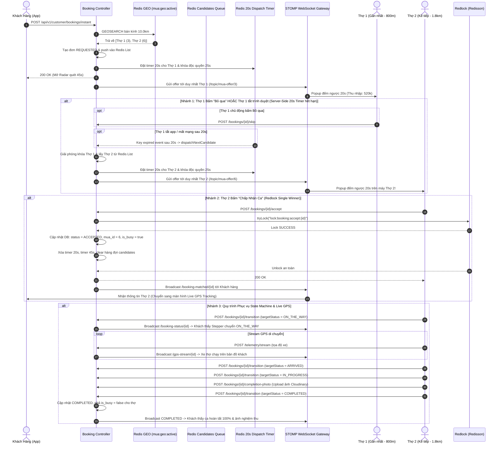

# TÀI LIỆU ĐẶC TẢ USER STORIES & THIẾT KẾ KỸ THUẬT CHI TIẾT
## PHÂN HỆ: LUỒNG ĐẶT CA KHẨN CẤP REALTIME 30-60 PHÚT, WATERFALL DISPATCHING, LIVE GPS TELEMETRY & STATE MACHINE QUY TRÌNH DỊCH VỤ
### (Spring Boot 3.3.x Layered Monolith `core-api` - Schema: `booking_schema`, `telemetry_schema`, Port `8080`)

---

## 📌 1. TỔNG QUAN TÍNH NĂNG (FEATURE OVERVIEW)

* **Tên Phân hệ Nghiệp vụ:** `Realtime Instant Booking, Sequential Waterfall Dispatch & GPS Telemetry Engine`
* **Mã Jira Issues phụ trách (Sprint 3):**
  * `ISSUE-17.1`: **User Story** - Khách hàng đặt ca khẩn cấp 30–60 phút qua API, quét bán kính 10km qua Redis GEO.
  * `ISSUE-17.2`: **Task** - Thuật toán điều phối Thác Nước (Sequential Waterfall Dispatch): ưu tiên thợ gần nhất, khóa thợ độc quyền 25s, gửi offer riêng qua kênh cá nhân `/topic/mua-offer/{muaId}`.
  * `ISSUE-17.3`: **Task** - Cơ chế Server-Side 20s Cascade Timer: Tự động chuyển thợ kế tiếp khi thợ hiện tại từ chối, tắt trình duyệt hoặc mất mạng sau 20s (Redis TTL + Scheduled Safety Net).
  * `ISSUE-17.4`: **Task** - Thợ chấp nhận ca (`/accept`) được bảo vệ bằng Khóa Phân tán Redlock (Redisson) chống race-condition tuyệt đối.
  * `ISSUE-17.5`: **Task** - Live GPS Telemetry Tracking: Stream tọa độ di chuyển của thợ qua WebSocket STOMP `/topic/gps-stream/{bookingId}`, tính cự ly km, ETA phút, cảnh báo khi thợ cách 200m và 0m.
  * `ISSUE-17.6`: **Task** - State Machine quản lý tiến trình phục vụ: Thợ chủ động ấn nút ở từng bước (`ACCEPTED` $\rightarrow$ `ON_THE_WAY` $\rightarrow$ `ARRIVED` $\rightarrow$ `IN_PROGRESS` $\rightarrow$ Chụp ảnh hoàn thành $\rightarrow$ `COMPLETED`), Khách hàng nhận cập nhật Stepper Realtime.
  * `ISSUE-17.7`: **Task** - Cơ chế Đặt Lại (Retry Flow) an toàn, tự động dọn sạch các đơn treo `REQUESTED` cũ để không bị lỗi 409 Conflict.
* **Mô hình Kiến trúc:**
  * **Spring Boot 3.3.x Layered Architecture Monolith** (`code/backend/core-api`, Port `8080`).
  * **Hạ tầng Đồng bộ & Định vị Thời gian thực:**
    * **Redis GEO Cluster (`mua:geo:active`):** Quét tức thời các thợ đang trực tuyến trong bán kính 10km (`GEOSEARCH mua:geo:active`).
    * **Redis Sequential Candidate Queue (`List: booking:dispatch:candidates:{id}`):** Hàng đợi danh sách các thợ ứng viên sắp xếp theo khoảng cách tăng dần (gần nhất lên đầu).
    * **Redis Dispatch Lock (`mua:dispatch:locked:{muaId}`):** Khóa độc quyền thợ đang nhận offer trong 25s, chống bị trùng ca.
    * **Redis Server-Side Timer (`booking:dispatch:timer:{bookingId}:{muaId}`):** Key TTL 20s kích hoạt auto-cascade sang thợ kế tiếp nếu thợ hiện tại không phản hồi.
    * **Redis Expiration Listener (`__keyevent@*__:expired`):** Bắt sự kiện hết hạn heartbeat 25s (auto OFFLINE) và hết hạn offer 20s (auto cascade) với độ trễ 0ms.
    * **Khóa Phân tán Redlock (Redisson):** Đảm bảo duy nhất 1 thợ đầu tiên giành được đơn hàng khi bấm "Chấp nhận" ca (`lock:booking:accept:{bookingId}`).
    * **Embedded STOMP WebSocket Gateway (`/ws-makeup`):** Đẩy thông báo nhận ca tức thì, stream GPS trực tiếp và đồng bộ trạng thái đơn hàng 2 chiều.
  * **Cơ sở Dữ liệu Phụ trách:** PostgreSQL 16 (`booking_schema.bookings`, `booking_schema.booking_history`, `mua_schema.mua_profiles`, `telemetry_schema.telemetry_logs`).
  * **Đồng bộ Định danh:** `@MapsId` đảm bảo `mua_profiles.id == user_id` tránh nhầm lẫn giữa định danh tài khoản và hồ sơ thợ.
* **Đối tượng Sử dụng (User Personas):**
  1. **Customer (Khách hàng có nhu cầu trang điểm gấp):**
     * Cần thợ make-up đến tận nhà ngay trong vòng 30–60 phút (dự tiệc đột xuất, thợ cũ hủy ca phút chót).
     * Xem màn hình Radar quét thợ đếm ngược 45s; theo dõi thợ trên bản đồ Live GPS; theo dõi Stepper tiến trình dịch vụ theo thời gian thực; có nút "Đặt Lại" tiện lợi.
  2. **Freelance MUA (Thợ trang điểm tự do - `ROLE_FREELANCE_MUA`):**
     * Bật công tắc "Trực tuyến" để nhận ca tự do của sàn; nhận Popup toàn màn hình rung chuông báo động hiển thị địa chỉ, thu nhập thực nhận và đồng hồ đếm lùi 20s.
     * Có thể bấm **"Chấp nhận ca"** hoặc bấm **"Bỏ qua"** để nhường đơn cho đồng nghiệp khác.
     * *(Lưu ý: Thợ Studio `ROLE_AGENCY_STAFF` không tham gia nhận broadcast đơn tự do này mà được Chủ Studio phân công điều phối tập trung qua ISSUE-19).*
     * Chủ động ấn nút ở từng mốc phục vụ (`ON_THE_WAY`, `ARRIVED`, `IN_PROGRESS`, `COMPLETED`), tải ảnh nghiệm thu Cloudinary trước khi kết thúc ca.

---

## 🏗️ 2. KIẾN TRÚC PHÂN TẦNG BACK-END (LAYERED ARCHITECTURE BACKEND)

Mã nguồn Luồng Đặt ca Khẩn cấp được tổ chức theo chuẩn Layered Monolith tại `code/backend/core-api/src/main/java/com/makeup/platform/`:

```text
code/backend/core-api/src/main/java/com/makeup/platform/
├── common/
│   ├── base/
│   │   ├── BaseEntity.java                    # id, created_at, updated_at
│   │   ├── BaseController.java                # ok, created, error
│   │   ├── ApiResponse.java                   # Envelope: {success, errorCode, message, data, timestamp}
│   │   ├── BaseService.java
│   │   └── BaseServiceImpl.java
│   ├── constants/
│   │   ├── TelemetryConstants.java            # REDIS_KEY_GEO_ACTIVE, REDIS_KEY_HEARTBEAT_PREFIX...
│   │   └── ErrorCodes.java                    # ERR_MUA_NOT_AVAILABLE, ERR_BOOKING_ALREADY_EXISTS...
│   ├── exception/
│   │   ├── GlobalExceptionHandler.java        # @RestControllerAdvice xử lý ngoại lệ tập trung
│   │   └── CustomBusinessException.java       # Lỗi nghiệp vụ có mã lỗi ErrorCodes
│   └── utils/
│       └── SecurityContextUtils.java          # Trích xuất userId, role từ SecurityContext
│
├── config/
│   ├── WebSocketConfig.java                   # Embedded STOMP Broker (/ws-makeup)
│   ├── RedissonConfig.java                    # Cấu hình Redlock Distributed Lock
│   └── RedisConfig.java                       # RedisTemplate, RedisGeoCommands, RedisMessageListenerContainer
│
├── controller/
│   ├── customer/
│   │   └── CustomerBookingController.java     # POST /api/v1/customer/bookings/instant & /{id}/cancel
│   ├── booking/
│   │   ├── BookingAcceptanceController.java   # POST /api/v1/freelancer/bookings/{id}/accept & /{id}/skip
│   │   └── BookingStateMachineController.java # POST /api/v1/bookings/{id}/transition, /completion-photo, GET /{id}/status
│   └── telemetry/
│       └── LocationStreamController.java      # POST /api/v1/telemetry/availability & /stream
│
├── dto/
│   ├── request/
│   │   ├── booking/
│   │   │   ├── CreateInstantBookingReq.java   # packageId, destinationAddress, destinationLatitude, destinationLongitude, note
│   │   │   ├── CancelBookingReq.java          # reason
│   │   │   └── TransitionBookingStateReq.java # targetStatus, reason, completionPhotoUrl
│   │   └── telemetry/
│   │       ├── MuaAvailabilityReq.java        # isAvailable, latitude, longitude
│   │       └── StreamLocationReq.java         # bookingId, latitude, longitude, speed, heading, accuracy
│   └── response/
│       ├── booking/
│       │   ├── InstantBookingCreatedRes.java  # bookingId, bookingCode, potentialProvidersFound, expiresInSeconds (45s)
│       │   ├── BookingAcceptanceRes.java      # bookingId, bookingCode, status, muaId, customerInfo
│       │   ├── BookingStateTransitionRes.java # bookingId, previousStatus, currentStatus, transitionedAt
│       │   ├── BookingCompletionPhotoRes.java # bookingId, completionPhotoUrl, uploadedAt
│       │   └── BookingStatusDetailRes.java    # bookingId, currentStatus, muaInfo, completionPhotoUrl, timestamps
│       └── telemetry/
│           └── TelemetryStreamRes.java        # distanceRemainingMeters, etaMinutes, streamMode (MOVING, APPROACHING, STOPPED)
│
├── entity/
│   ├── booking/
│   │   ├── BookingEntity.java                 # table: booking_schema.bookings
│   │   └── BookingHistoryEntity.java          # table: booking_schema.booking_history (Audit Log)
│   └── mua/
│       └── MuaProfileEntity.java              # table: mua_schema.mua_profiles (@MapsId user_id)
│
├── mapper/
│   └── booking/
│       ├── InstantBookingMapper.java          # Manual Mapper @Component (Builder Pattern - KHÔNG dùng MapStruct)
│       └── BookingMapper.java                 # Manual Mapper @Component (Builder Pattern)
│
├── event/
│   └── booking/
│       ├── InstantBookingAcceptedEvent.java   # Bắn ra khi thợ giành đơn thành công qua Redlock
│       └── BookingStateChangedEvent.java      # Bắn ra khi đơn chuyển trạng thái ở bất kỳ bước nào
│
├── listener/
│   ├── booking/
│   │   └── InstantBookingEventListener.java   # Lắng nghe Event để Broadcast STOMP (/topic/booking-status/...)
│   └── telemetry/
│       └── RedisExpirationListener.java       # Lắng nghe Redis TTL (Heartbeat 25s & Dispatch Timer 20s)
│
├── service/
│   ├── customer/
│   │   ├── CustomerInstantBookingService.java # Tạo đơn khẩn cấp, Waterfall dispatch, expire, cancel
│   │   └── impl/CustomerInstantBookingServiceImpl.java
│   ├── booking/
│   │   ├── DistributedLockService.java        # Thợ nhận đơn qua Redlock
│   │   ├── BookingStateMachineService.java    # Chuyển trạng thái, upload ảnh Cloudinary
│   │   ├── impl/DistributedLockServiceImpl.java
│   │   └── impl/BookingStateMachineServiceImpl.java
│   └── telemetry/
│       ├── RedisGeoService.java               # Thêm/bớt vị trí thợ vào Redis GEO, tìm kiếm bán kính
│       └── impl/RedisGeoServiceImpl.java
│
└── repository/
    ├── booking/
    │   ├── BookingRepository.java             # Spring Data JPA
    │   └── BookingHistoryRepository.java      # Spring Data JPA (Audit Log)
    └── mua/
        └── MuaProfileRepository.java          # Spring Data JPA
```

---

## 📋 3. DANH SÁCH USER STORIES CHI TIẾT & TIÊU CHÍ BDD (ACCEPTANCE CRITERIA)

---

### **US-INST-01: Khách Hàng Tạo Đơn Khẩn Cấp & Quét Thợ Bán Kính 10km (`ISSUE-17.1`)**
> **As a** Khách hàng cần trang điểm gấp trong vòng 30–60 phút,  
> **I want to** nhập địa chỉ hiện tại và nhấn "⚡ Đặt Thợ Ngay",  
> **So that** hệ thống tự động quét các thợ trang điểm trực tuyến trong bán kính 10km và phát sóng tìm thợ nhanh nhất.

#### **Tiêu chí Nghiệm thu (Acceptance Criteria - BDD):**

* **Scenario 01: Tạo đơn hàng khẩn cấp thành công khi có thợ online trong bán kính (Happy Path)**
  * **Given** Khách hàng đã đăng nhập (`ROLE_CUSTOMER`).
  * **When** Khách gửi request `POST /api/v1/customer/bookings/instant`:
    ```json
    {
      "destinationAddress": "Chung cư Sunrise City, Nguyễn Hữu Thọ, Q.7, TP.HCM",
      "destinationLatitude": 10.776889,
      "destinationLongitude": 106.700806,
      "packageId": 1,
      "note": "Khách đặt thợ make-up khẩn cấp 30-60 phút"
    }
    ```
  * **Then** Hệ thống quét Redis GEO trong bán kính 10.0km (`GEOSEARCH mua:geo:active`).
  * **And** Lọc các thợ có `is_online = true`, `is_busy = false` và không bị khóa bởi đơn khác (`mua:dispatch:locked:{muaId}`).
  * **And** Tìm thấy danh sách ứng viên (ví dụ: Thợ 1 cách 800m, Thợ 2 cách 1.8km).
  * **And** Khởi tạo bản ghi `bookings` với `booking_type = 'REALTIME_INSTANT'`, `status = 'REQUESTED'`.
  * **And** Khởi tạo hàng đợi ứng viên trong Redis List `booking:dispatch:candidates:{bookingId}`.
  * **And** Trả về HTTP `200 OK` kèm `expiresInSeconds = 45` và `potentialProvidersFound = 2`.
  * **And** Giao diện Khách hàng mở modal Radar quét sóng đếm ngược 45s.

* **Scenario 02: Từ chối tạo đơn khi không có thợ nào online/rảnh trong bán kính 10km (Fail-Fast)**
  * **Given** Vị trí của khách hàng không có thợ nào trực tuyến trong vòng 10km (hoặc tất cả thợ đều đang bận ca).
  * **When** Khách gửi request `POST /api/v1/customer/bookings/instant`.
  * **Then** Backend từ chối ngay lập tức, **không tạo bản ghi rác** trong cơ sở dữ liệu.
  * **And** Ném ngoại lệ `CustomBusinessException(ErrorCodes.ERR_MUA_NOT_AVAILABLE, "booking.no_mua_available_in_radius", HttpStatus.NOT_FOUND)`.
  * **And** Khách hàng nhận thông báo Toast: *"Không tìm thấy thợ trang điểm nào đang trực tuyến trong bán kính 10km quanh vị trí của bạn."*.

* **Scenario 03: Khách hàng chủ động hủy tìm kiếm trong 45s đếm ngược**
  * **Given** Đơn hàng đang ở trạng thái `REQUESTED` và đang đếm ngược 45s.
  * **When** Khách hàng nhấn nút **[Hủy tìm kiếm]** trên modal Radar $\rightarrow$ Gửi request `POST /api/v1/customer/bookings/{bookingId}/cancel`:
    ```json
    {
      "reason": "Khách hàng chủ động hủy tìm kiếm"
    }
    ```
  * **Then** Hệ thống cập nhật trạng thái đơn `status = 'CANCELLED'`.
  * **And** Ghi nhận Audit Log vào `booking_schema.booking_history` (`from_status = 'REQUESTED'`, `to_status = 'CANCELLED'`).
  * **And** Giải phóng khóa thợ trong Redis (`mua:dispatch:locked:{muaId}`) và xóa các key dispatch timer.
  * **And** Bắn STOMP WebSocket tới `/topic/instant-dismiss/{bookingId}` để lập tức đóng popup đếm ngược trên máy thợ đang nhận offer.
  * **And** Trả về HTTP `200 OK`.

---

### **US-INST-02: Thuật Toán Phát Đơn Thác Nước (Sequential Waterfall Dispatch) & Server-Side 20s Cascade Timer (`ISSUE-17.2 & ISSUE-17.3`)**
> **As a** Động cơ Điều phối Thông minh (Smart Dispatch Engine),  
> **I want** phát đơn lần lượt tới từng thợ gần nhất (mỗi thợ 20s), tự động chuyển thợ kế tiếp nếu thợ hiện tại từ chối hoặc tắt trình duyệt sau 20s,  
> **So that** không phát tán bừa bãi làm nhiều thợ tranh chấp nhau, đồng thời đảm bảo đơn luôn được tiếp tục điều phối mà không bị treo.

#### **Tiêu chí Nghiệm thu (Acceptance Criteria - BDD):**

* **Scenario 01: Phát đơn độc quyền cho thợ gần nhất (Candidate 1)**
  * **Given** Danh sách ứng viên gần nhất gồm: Thợ 1 (`mua_id = 3`, cách 800m) và Thợ 2 (`mua_id = 6`, cách 1.8km).
  * **When** Hệ thống lưu danh sách vào `booking:dispatch:candidates:{bookingId}` và lấy thợ đầu tiên: Thợ 1.
  * **Then** Thiết lập khóa thợ: `SET mua:dispatch:locked:3` với TTL 25 giây.
  * **And** Thiết lập Server-Side Timer: `SET booking:dispatch:timer:{bookingId}:3` với TTL 20 giây.
  * **And** Lưu thời điểm gửi: `SET booking:dispatch:sent_at:{bookingId}`.
  * **And** Bắn thông báo STOMP **duy nhất** tới kênh riêng của Thợ 1: `/topic/mua-offer/3`.
  * **And** Thợ 2 **hoàn toàn không nhận được** thông báo này lúc này.
  * **And** Máy Thợ 1 rung chuông, hiện Popup đếm ngược 20s hiển thị địa chỉ khách, cự ly và thu nhập thực nhận (80%).

* **Scenario 02: Thợ 1 chủ động bấm "Bỏ qua" $\rightarrow$ Lập tức chuyển sang Thợ 2**
  * **Given** Thợ 1 đang thấy Popup đếm ngược 20s.
  * **When** Thợ 1 bấm nút **[Bỏ qua (Chuyển thợ khác)]** $\rightarrow$ Gọi API `POST /api/v1/freelancer/bookings/{bookingId}/skip`.
  * **Then** Hệ thống giải phóng khóa Thợ 1: xóa `mua:dispatch:locked:3` và xóa `booking:dispatch:timer:{bookingId}:3`.
  * **And** Lấy ứng viên kế tiếp từ Redis List: Thợ 2 (`mua_id = 6`).
  * **And** Khóa Thợ 2: `SET mua:dispatch:locked:6` (25s) và đặt timer mới `booking:dispatch:timer:{bookingId}:6` (20s).
  * **And** Bắn thông báo STOMP tới kênh riêng của Thợ 2: `/topic/mua-offer/6`.
  * **And** Popup đếm ngược trên máy Thợ 1 đóng lại, Popup trên máy Thợ 2 bật lên ngay lập tức ($< 15\text{ms}$).

* **Scenario 03: Thợ 1 tắt trình duyệt / Mất mạng / Không phản hồi $\rightarrow$ Server tự động Cascade sang Thợ 2 sau 20s**
  * **Given** Thợ 1 nhận được offer nhưng vô tình đóng trình duyệt hoặc mất kết nối mạng (không thể bấm "Bỏ qua").
  * **When** Hết 20 giây, key `booking:dispatch:timer:{bookingId}:3` hết hạn trong Redis.
  * **Then** `RedisExpirationListener` bắt được sự kiện hết hạn.
  * **And** Kiểm tra đơn vẫn đang `REQUESTED` và thợ hiện tại vẫn là Thợ 1.
  * **And** Server tự động gọi `dispatchNextCandidate(bookingId)` mà không cần client gửi request.
  * **And** Đơn hàng được tự động chuyển sang Thợ 2 (`mua_id = 6`) kèm bộ đếm 20s mới.
  * **And** *(Lưới an toàn phụ trợ)*: Scheduled task `scanAndExpireOverdueInstantBookings` chạy mỗi 3 giây kiểm tra `sent_at >= 20000ms` để phòng ngừa độ trễ mạng Redis.

* **Scenario 04: Tất cả thợ đều bỏ qua hoặc hết thời gian 45s**
  * **Given** Danh sách ứng viên trong Redis List đã hết (hoặc tổng thời gian tạo đơn vượt quá 45 giây).
  * **When** `dispatchNextCandidate` không còn thợ nào hoặc Timer 45s `booking:instant:expire:{bookingId}` hết hạn.
  * **Then** Hệ thống tự động gọi `expireInstantBooking(bookingId)`.
  * **And** Cập nhật đơn sang `status = 'CANCELLED'`.
  * **And** Ghi Audit Log lý do hủy đơn do hết thời gian tìm kiếm.
  * **And** Xóa sạch các key Redis liên quan (`candidates`, `current`, `timer`, `sent_at`, `locked`).
  * **And** Bắn gói tin STOMP tới `/topic/booking-status/{bookingId}` và `/topic/booking-matched/{bookingId}` thông báo timeout.
  * **And** Giao diện Khách hàng hiển thị banner: *"Đã hủy đơn (Timeout/Cancel) - Tất cả các thợ gần bạn đều bận hoặc đã từ chối nhận ca."* kèm nút **[Đặt Lại]**.

---

### **US-INST-03: Thợ Nhận Đơn Qua Redlock & Kết Nối Live Tracking (`ISSUE-17.4`)**
> **As a** Thợ MUA đang trực tuyến,  
> **I want to** bấm "⚡ Chấp Nhận Ca" trong 20s để nhận việc,  
> **So that** tôi giành được đơn độc quyền qua Redlock và mở quy trình phục vụ khách hàng.

#### **Tiêu chí Nghiệm thu (Acceptance Criteria - BDD):**

* **Scenario 01: Thợ nhận đơn thành công qua Redlock**
  * **Given** Thợ đang nhận offer của đơn `bookingId = 901`.
  * **When** Thợ bấm nút **[⚡ Chấp Nhận Ca]** $\rightarrow$ Gửi request `POST /api/v1/freelancer/bookings/901/accept`.
  * **Then** Hệ thống lấy khóa phân tán Redisson: `RLock lock = redissonClient.getLock("lock:booking:accept:901")` (wait 2s, lease 5s).
  * **And** Kiểm tra đơn vẫn đang ở trạng thái `REQUESTED`.
  * **And** Cập nhật đơn: `status = 'ACCEPTED'`, gán `mua = currentMua`.
  * **And** Cập nhật hồ sơ thợ: `is_busy = true`, `availability_status = AvailabilityStatus.BUSY`.
  * **And** Ghi Audit Log vào `booking_schema.booking_history` (`from_status = 'REQUESTED'`, `to_status = 'ACCEPTED'`).
  * **And** Xóa sạch các timer và hàng đợi: `booking:instant:expire`, `booking:dispatch:candidates`, `booking:dispatch:current`, `booking:dispatch:sent_at`, `booking:dispatch:timer`.
  * **And** Bắn sự kiện Spring EventBus: `InstantBookingAcceptedEvent`.
  * **And** STOMP Gateway đẩy thông báo tới Khách hàng qua `/topic/booking-matched/901`:
    ```json
    {
      "type": "BOOKING_MATCHED",
      "bookingId": 901,
      "bookingCode": "BK-20260916-XYZ",
      "status": "ACCEPTED",
      "muaId": 3,
      "muaName": "Nguyễn Thị Phương (Pro MUA)",
      "muaPhone": "0912345678",
      "rating": 5.0
    }
    ```
  * **And** Bắn chỉ thị `/topic/instant-dismiss/901` để giải tán popup trên các máy khác (nếu có).
  * **And** Màn hình Khách hàng tự động chuyển sang tab **Theo Dõi Thợ (Live Tracking)**, hiển thị tên, ảnh đại diện, SĐT thợ và nút bấm gọi điện thoại trực tiếp.

---

### **US-INST-04: Live GPS Telemetry Stream Xe Thợ Di Chuyển (`ISSUE-17.5`)**
> **As a** Khách hàng đã đặt được thợ thành công,  
> **I want to** theo dõi vị trí xe của thợ di chuyển trên bản đồ thời gian thực,  
> **So that** tôi biết chính xác cự ly (km), thời gian thợ đến nơi (ETA) và chủ động chuẩn bị đón thợ.

#### **Tiêu chí Nghiệm thu (Acceptance Criteria - BDD):**

* **Scenario 01: Stream tọa độ GPS di chuyển thời gian thực**
  * **Given** Đơn hàng đang ở trạng thái `ON_THE_WAY` (Thợ đang trên đường đến).
  * **When** Thợ di chuyển (hoặc bấm các bước mô phỏng GPS: 1️⃣ Cách 1.2km MOVING, 2️⃣ Cách 200m APPROACHING, 3️⃣ Đến nơi 0m STOPPED) $\rightarrow$ Gửi request `POST /api/v1/telemetry/stream`:
    ```json
    {
      "bookingId": 901,
      "latitude": 10.776100,
      "longitude": 106.700900,
      "speed": 35.0,
      "heading": 90.0,
      "accuracy": 5.0
    }
    ```
  * **Then** Backend tính toán cự ly còn lại tới điểm đến của khách (`distanceRemainingMeters`) và thời gian dự kiến đến (`etaMinutes`).
  * **And** Ghi log tọa độ vào `telemetry_schema.telemetry_logs` (Point 4326).
  * **And** Phát sóng STOMP WebSocket tới `/topic/gps-stream/901`:
    ```json
    {
      "bookingId": 901,
      "currentLat": 10.776100,
      "currentLng": 106.700900,
      "distanceRemainingMeters": 1200,
      "etaMinutes": 4,
      "speed": 35.0,
      "streamMode": "MOVING",
      "timestamp": 1726470000000
    }
    ```
  * **And** Bản đồ Leaflet trên màn hình Khách hàng vẽ lại vị trí xe thợ di chuyển mượt mà.
  * **And** Hộp thông tin Live Tracking hiển thị: `Cự ly: 1.20 km`, `Thời gian đến: 4 phút`, `Vận tốc: 35 km/h`.

* **Scenario 02: Cảnh báo tự động khi thợ sắp đến nơi và đã đến nơi**
  * **When** Thợ di chuyển cách điểm đến dưới 250m (`APPROACHING`): Khách nhận thông báo Toast: *"🔔 Thợ makeup sắp tới nơi (cách ~200m)!"*.
  * **When** Thợ di chuyển đến điểm hẹn 0m (`STOPPED`): Khách nhận thông báo Toast: *"📍 Thợ makeup đã tới điểm hẹn trước cửa nhà bạn!"*.

---

### **US-INST-05: State Machine Quản Lý Quy Trình Phục Vụ & Nghiệm Thu Ảnh Cloudinary (`ISSUE-17.6`)**
> **As a** Thợ MUA và Khách hàng,  
> **I want** thợ chủ động ấn nút xác nhận ở từng mốc phục vụ và bắt buộc tải ảnh hoàn thành lên Cloudinary,  
> **So that** tiến trình dịch vụ được cập nhật minh bạch, chính xác và có bằng chứng nghiệm thu rõ ràng.

#### **Vòng đời Chuyển Đổi Trạng Thái (State Transitions):**
```text
[ACCEPTED] ──(Thợ ấn "Bắt đầu xuất phát")──> [ON_THE_WAY]
    │
    ▼ (Thợ ấn "Đã đến nơi hẹn")
[ARRIVED]
    │
    ▼ (Thợ ấn "Bắt đầu thực hiện make-up")
[IN_PROGRESS] ──(Bắt buộc chụp & upload ảnh hoàn thành lên Cloudinary)
    │
    ▼ (Thợ ấn "🎉 Hoàn Thành Ca")
[COMPLETED] (Giải phóng thợ hết bận, hoàn tất đơn hàng)
```

#### **Tiêu chí Nghiệm thu (Acceptance Criteria - BDD):**

* **Scenario 01: Thợ chủ động ấn chuyển trạng thái thủ công (User Control)**
  * **Given** Thợ đang trong ca làm việc `bookingId = 901`.
  * **When** Thợ bấm nút trên giao diện `mua.html`:
    * Bấm **"1. Bắt đầu xuất phát di chuyển"** $\rightarrow$ Gọi `POST /api/v1/bookings/901/transition` với `targetStatus = 'ON_THE_WAY'`.
    * Bấm **"2. Thợ đã đến nơi điểm hẹn"** $\rightarrow$ Gọi `POST /api/v1/bookings/901/transition` với `targetStatus = 'ARRIVED'`.
    * Bấm **"3. Bắt đầu thực hiện make-up"** $\rightarrow$ Gọi `POST /api/v1/bookings/901/transition` với `targetStatus = 'IN_PROGRESS'`.
  * **Then** Backend cập nhật database, ghi Audit Log trong cùng transaction.
  * **And** Backend phát sự kiện `BookingStateChangedEvent` $\rightarrow$ WebSocket Gateway đẩy tới `/topic/booking-status/901`.
  * **And** Stepper (Thanh tiến trình 5 bước) bên Khách hàng đổi màu tương ứng ngay lập tức kèm thông báo Toast.

* **Scenario 02: Bắt buộc tải ảnh chụp nghiệm thu trước khi Hoàn Thành Ca**
  * **Given** Đơn hàng đang ở trạng thái `IN_PROGRESS` (đang trang điểm).
  * **When** Giao diện thợ tự động hiển thị khu vực **📸 Tải Ảnh Hoàn Thành Ca (Bắt Buộc)**.
  * **And** Thợ chọn file ảnh hoặc bấm **"📷 Ảnh Mẫu Demo"** $\rightarrow$ Gọi API `POST /api/v1/bookings/901/completion-photo`.
  * **Then** Ảnh được upload lên Cloudinary CDN và lưu URL vào `completion_photo_url` của đơn hàng.
  * **And** Nếu thợ cố tình bấm nút **"🎉 Hoàn Thành Ca"** khi chưa có ảnh hoàn thành $\rightarrow$ Hệ thống kiên quyết chặn lại và cảnh báo: *"⚠️ BẮT BUỘC: Bạn phải tải ảnh trước khi Hoàn Thành Ca!"*.

* **Scenario 03: Hoàn thành ca make-up thành công (`COMPLETED`)**
  * **Given** Đơn hàng đã có ảnh hoàn thành Cloudinary.
  * **When** Thợ bấm **"🎉 Hoàn Thành Ca"** $\rightarrow$ Gọi `POST /api/v1/bookings/901/transition` với `targetStatus = 'COMPLETED'`.
  * **Then** Đơn chuyển sang trạng thái `COMPLETED`.
  * **And** Thợ được giải phóng trạng thái bận: `is_busy = false`, `availability_status = AVAILABLE`.
  * **And** Khách hàng nhận thông báo hoàn tất ca qua WebSocket; ảnh tác phẩm make-up hiển thị trực tiếp trên màn hình khách; Stepper đạt 100%.

---

### **US-INST-06: Cơ Chế "Đặt Lại" (Retry Flow) Không Lỗi Xung Đột (`ISSUE-17.7`)**
> **As a** Khách hàng tìm thợ không thành công ở lượt đầu tiên,  
> **I want to** bấm nút "Đặt Lại" để quét lại đợt mới,  
> **So that** tôi tìm được thợ mà không bị lỗi xung đột đơn cũ (409 Conflict).

#### **Tiêu chí Nghiệm thu (Acceptance Criteria - BDD):**

* **Scenario 01: Bấm "Đặt Lại" sau khi timeout hoặc không có thợ nhận**
  * **Given** Khách hàng vừa nhận thông báo hết giờ tìm thợ, banner hiện: *"Đã hủy đơn (Timeout/Cancel) #28 - [Đặt Lại]"*.
  * **When** Khách hàng nhấn nút **[Đặt Lại]**.
  * **Then** Client tự động dọn sạch `activeBookingId` trong `localStorage` và gửi lệnh hủy ngầm đơn cũ.
  * **And** Tại Backend trong hàm `createInstantBooking`: Tự động quét và **hủy ngay lập tức (`CANCELLED`)** mọi đơn cũ còn đang ở trạng thái `REQUESTED` của khách hàng này, đồng thời giải phóng các khóa Redis cũ.
  * **And** Bộ lọc chặn đơn (`activeExecutingStatuses`) **chỉ chặn khi thợ đã nhận ca và đang phục vụ** (`ACCEPTED`, `ON_THE_WAY`, `ARRIVED`, `IN_PROGRESS`). Đơn đang tìm kiếm (`REQUESTED`) không bao giờ chặn việc đặt lại.
  * **And** Khách hàng tạo đơn tìm kiếm đợt mới thành công rực rỡ, không gặp bất kỳ lỗi 409 Conflict nào.

---

## 💻 4. ĐẶC TẢ REST API & WEBSOCKET CONTRACTS

---

### 4.1. `POST /api/v1/customer/bookings/instant` (Tạo Đơn Khẩn Cấp Realtime)
* **Quyền:** `ROLE_CUSTOMER`
* **Request:**
```json
{
  "destinationAddress": "Chung cư Sunrise City, Nguyễn Hữu Thọ, Q.7, TP.HCM",
  "destinationLatitude": 10.776889,
  "destinationLongitude": 106.700806,
  "packageId": 1,
  "note": "Khách đặt thợ make-up khẩn cấp 30-60 phút"
}
```
* **Response `200 OK`:**
```json
{
  "success": true,
  "message": "booking.instant_created_successfully",
  "data": {
    "bookingId": 901,
    "bookingCode": "BK-20260916-ABC",
    "status": "REQUESTED",
    "potentialProvidersFound": 2,
    "expiresInSeconds": 45,
    "totalAmount": 650000.00,
    "depositAmount": 195000.00
  },
  "timestamp": "2026-09-16T15:00:00"
}
```

---

### 4.2. `POST /api/v1/customer/bookings/{bookingId}/cancel` (Khách Hủy Tìm Thợ)
* **Quyền:** `ROLE_CUSTOMER`
* **Request:**
```json
{
  "reason": "Khách hàng chủ động hủy tìm kiếm"
}
```
* **Response `200 OK`:**
```json
{
  "success": true,
  "message": "booking.cancelled_successfully",
  "data": {
    "bookingId": 901,
    "status": "CANCELLED"
  },
  "timestamp": "2026-09-16T15:00:15"
}
```

---

### 4.3. `POST /api/v1/freelancer/bookings/{bookingId}/accept` (Thợ Nhận Ca - Redlock)
* **Quyền:** `ROLE_FREELANCE_MUA` (Dành riêng cho Thợ tự do nhận cuốc broadcast của sàn)
* **Response `200 OK`:**
```json
{
  "success": true,
  "message": "booking.accept_success",
  "data": {
    "bookingId": 901,
    "bookingCode": "BK-20260916-ABC",
    "status": "ACCEPTED",
    "assignedMuaId": 3,
    "customerName": "Nguyễn Thị Anh",
    "customerPhone": "0988776666",
    "destinationAddress": "Chung cư Sunrise City, Nguyễn Hữu Thọ, Q.7, TP.HCM"
  },
  "timestamp": "2026-09-16T15:00:10"
}
```

---

### 4.4. `POST /api/v1/freelancer/bookings/{bookingId}/skip` (Thợ Bỏ Qua Ca)
* **Quyền:** `ROLE_FREELANCE_MUA`
* **Response `200 OK`:**
```json
{
  "success": true,
  "message": "booking.skip_success",
  "data": {
    "bookingId": 901,
    "nextCandidateDispatched": true
  },
  "timestamp": "2026-09-16T15:00:08"
}
```

---

### 4.5. `POST /api/v1/bookings/{bookingId}/transition` (Chuyển Đổi Trạng Thái State Machine)
* **Quyền:** `ROLE_FREELANCE_MUA`, `ROLE_AGENCY_STAFF`, `ROLE_CUSTOMER`
* **Request:**
```json
{
  "targetStatus": "ON_THE_WAY",
  "reason": null,
  "completionPhotoUrl": null
}
```
* **Response `200 OK`:**
```json
{
  "success": true,
  "message": "booking.transition_success",
  "data": {
    "bookingId": 901,
    "previousStatus": "ACCEPTED",
    "currentStatus": "ON_THE_WAY",
    "transitionedAt": "2026-09-16T15:01:00"
  },
  "timestamp": "2026-09-16T15:01:00"
}
```

---

### 4.6. `POST /api/v1/bookings/{bookingId}/completion-photo` (Upload Ảnh Nghiệm Thu Cloudinary)
* **Quyền:** `ROLE_FREELANCE_MUA`, `ROLE_AGENCY_STAFF`
* **Body:** `MultipartFile file` (ảnh chụp)
* **Response `200 OK`:**
```json
{
  "success": true,
  "message": "booking.photo_uploaded_successfully",
  "data": {
    "bookingId": 901,
    "completionPhotoUrl": "https://res.cloudinary.com/makeup-platform/image/upload/v123456/completion_901.jpg"
  },
  "timestamp": "2026-09-16T15:30:00"
}
```

---

### 4.7. WebSocket STOMP Topics Matrix

| STOMP Topic Pattern | Chiều | Mục Đích | Payload Nổi Bật |
| :--- | :---: | :--- | :--- |
| `/topic/mua-offer/{muaId}` | Server $\rightarrow$ MUA | Bắn lời mời nhận ca riêng tư cho thợ được chọn (Waterfall). | `{type: "INSTANT_BOOKING_OFFER", bookingId, customerAddress, earningsAmount, countdownSeconds: 20}` |
| `/topic/instant-dismiss` & `/{id}` | Server $\rightarrow$ MUA | Đóng popup đếm ngược khi đơn đã có người nhận hoặc khách hủy. | `{type: "BOOKING_DISMISSED", bookingId, reason}` |
| `/topic/booking-matched/{bookingId}` | Server $\rightarrow$ Customer | Báo cho khách hàng khi thợ nhận ca thành công. | `{type: "BOOKING_MATCHED", bookingId, muaName, muaPhone, rating}` |
| `/topic/booking-status/{bookingId}` | Server $\rightarrow$ Cả 2 | Cập nhật chuyển trạng thái State Machine (`ON_THE_WAY`, `ARRIVED`...). | `{type: "BOOKING_STATUS_CHANGED", currentStatus, previousStatus}` |
| `/topic/gps-stream/{bookingId}` | Server $\rightarrow$ Customer | Stream tọa độ GPS thợ di chuyển trực tiếp lên bản đồ. | `{currentLat, currentLng, distanceRemainingMeters, etaMinutes, streamMode}` |

---

## ⚡ 5. SƠ ĐỒ TUẦN TỰ KHÉP KÍN (END-TO-END SEQUENCE DIAGRAM)



---

## 🗄️ 6. THIẾT KẾ CƠ SỞ DỮ LIỆU & HẠ TẦNG REDIS

### 6.1. Bảng Khóa Redis Điều Phối Khẩn Cấp (Redis Keys Matrix)

| Tên Khóa (Key Pattern) | Kiểu Dữ liệu | Mục Đích Nghiệp Vụ | Cơ chế Hết hạn (TTL) |
| :--- | :--- | :--- | :--- |
| `mua:geo:active` | `Redis GEO` | Lưu tọa độ các thợ đang trực tuyến (`is_online == true`). | Cập nhật realtime khi thợ stream vị trí |
| `telemetry:heartbeat:{muaId}` | `String` | Ping định kỳ 25s xác nhận thợ còn kết nối mạng. | `TTL = 30s` (hết hạn $\rightarrow$ auto chuyển `OFFLINE`) |
| `booking:dispatch:candidates:{bookingId}` | `List (Long)` | Hàng đợi danh sách `muaId` ứng viên sắp xếp theo cự ly tăng dần. | `TTL = 10 phút` (hoặc xóa khi đơn có người nhận / hủy) |
| `booking:dispatch:current:{bookingId}` | `String` | Lưu ID thợ đang giữ offer hiện tại. | `TTL = 10 phút` |
| `mua:dispatch:locked:{muaId}` | `String` | Khóa thợ độc quyền chống nhận trùng ca khi đang xem offer. | `TTL = 25 giây` |
| `booking:dispatch:timer:{bookingId}:{muaId}` | `String` | **Server-side 20s Timer**: Hết hạn $\rightarrow$ auto cascade sang thợ kế tiếp. | `TTL = 20 giây` |
| `booking:dispatch:sent_at:{bookingId}` | `String` | Lưu timestamp gửi offer cho thợ hiện tại để Scheduler 3s kiểm tra. | `TTL = 5 phút` |
| `booking:instant:expire:{bookingId}` | `String` | Timer 45s đếm ngược tìm kiếm tổng cho khách hàng. | `TTL = 45 giây` (hết hạn $\rightarrow$ auto hủy đơn `CANCELLED`) |
| `lock:booking:accept:{bookingId}` | `Redlock` | Khóa phân tán bảo vệ thao tác nhận ca đồng thời giữa các thợ. | `Wait: 2s, Lease: 5s` |

---

## 🛡️ 7. YÊU CẦU PHI CHỨC NĂNG & HIỆU NĂNG BACK-END (NFRS)

1. **Hiệu Năng Tìm Kiếm Trong Bộ Nhớ RAM (Redis GEO Latency):**
   - Quét thợ rảnh trong bán kính 10km qua Redis GEO hoàn tất trong vòng **$< 5\text{ms}$**, loại bỏ hoàn toàn các câu lệnh SQL không gian nặng nề vào PostgreSQL trong pha đếm ngược.
2. **Khả Năng Chống Tranh Chấp Tuyệt Đối (Zero Race Condition):**
   - Đảm bảo $100\%$ không bao giờ xảy ra tình trạng 2 thợ cùng nhận một đơn hàng khẩn cấp nhờ lớp bảo vệ **Redlock Distributed Lock**.
3. **Cơ Chế Cascade Độc Lập Phía Server (Zero Browser Dependency):**
   - Ngay cả khi máy thợ bị sập nguồn, mất sóng hoặc tắt app, hệ thống vẫn tự động chuyển thợ kế tiếp chuẩn xác sau 20s nhờ sự kết hợp giữa **Redis Key Expiration** và **Scheduled Safety Net**.
4. **Trải Nghiệm Đồng Bộ Thời Gian Thực (Embedded STOMP Gateway):**
   - Mọi thao tác chuyển trạng thái tiến trình phục vụ (`ON_THE_WAY`, `ARRIVED`, `IN_PROGRESS`, `COMPLETED`) và stream GPS cập nhật tới màn hình khách hàng với độ trễ **$< 50\text{ms}$**.
