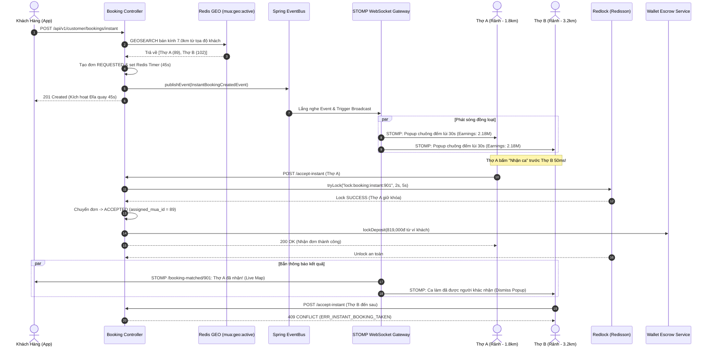

# TÀI LIỆU ĐẶC TẢ USER STORIES & THIẾT KẾ KỸ THUẬT CHI TIẾT
## PHÂN HỆ: LUỒNG ĐẶT CA KHẨN CẤP REALTIME 30-60 PHÚT (REALTIME INSTANT BOOKING & 30s COUNTDOWN FLOW)
### (Spring Boot 3.3.x Layered Monolith `core-api` - Schema: `booking_schema`, Port `8080`)

---

## 📌 1. TỔNG QUAN TÍNH NĂNG (FEATURE OVERVIEW)

* **Tên Phân hệ Nghiệp vụ:** `Realtime Instant Booking & 30s Dispatching Engine`
* **Mã Jira Issues phụ trách (Sprint 3):**
  * `ISSUE-17.1`: **User Story** - Luồng 1: Đặt ca Khẩn cấp Realtime (Instant 30–60 phút) - API tạo đơn.
  * `ISSUE-17.2`: **Task** - Bắn Event `INSTANT_BOOKING_CREATED` qua Spring `ApplicationEventPublisher`.
  * `ISSUE-17.3`: **Task** - Màn hình Popup Đếm ngược 30–45s nhận ca khẩn cấp trên Mobile App Thợ & Đĩa quay radar Khách hàng.
  * `ISSUE-17.4`: **Task** - Logic Thợ bấm 'Chấp nhận' ca $\rightarrow$ Khóa đơn duy nhất qua Redlock và phát sinh giao dịch Escrow giữ cọc.
* **Mô hình Kiến trúc:**
  * **Spring Boot 3.3.x Layered Architecture Monolith** (`code/backend/core-api`, Port `8080`).
  * **Hạ tầng Đồng bộ & Định vị Thời gian thực:**
    * **Redis GEO Cluster:** Quét tức thời các thợ đang trực tuyến trong bán kính $R$ km (`GEOSEARCH mua:geo:active`).
    * **Spring In-Memory EventBus (`ApplicationEventPublisher`):** Bắn sự kiện bất đồng bộ nội bộ giữa các domain modules (Booking $\rightarrow$ WebSocket & Wallet) với độ trễ $< 1\text{ms}$.
    * **Embedded STOMP WebSocket Gateway (`/ws-makeup`):** Đẩy thông báo nhận ca tức thì tới các thợ rảnh trong bán kính và cập nhật kết quả cho khách.
    * **Khóa Phân tán Redlock (Redisson):** Đảm bảo duy nhất 1 thợ đầu tiên giành được đơn hàng khi nhiều thợ cùng bấm "Chấp nhận" đồng thời.
  * **Cơ sở Dữ liệu Phụ trách:** PostgreSQL 16 (`booking_schema.bookings`, `booking_schema.booking_items`, `wallet_schema.wallets`, `wallet_schema.wallet_transactions`).
* **Đối tượng Sử dụng (User Personas):**
  1. **Customer (Khách hàng có nhu cầu trang điểm gấp):**
     * Cần thợ make-up đến tận nhà ngay trong vòng 30–60 phút (dự tiệc đột xuất, thợ cũ hủy ca phút chót).
     * Xem màn hình Radar quét thợ đếm ngược 45s; được tự động hoàn cọc 100% ngay lập tức nếu hết giờ mà không có thợ nhận.
  2. **Freelance MUA & Studio Staff MUA (Thợ trang điểm đang rảnh):**
     * Đang bật công tắc "Sẵn sàng nhận việc" trên Mobile App.
     * Nhận được Popup toàn màn hình rung chuông báo động, hiển thị cự ly di chuyển, địa chỉ, số tiền thu nhập thực nhận và đồng hồ đếm lùi 30s để bấm nhận ca.
  3. **Escrow Wallet Engine (Động cơ Ví Khóa Cọc):**
     * Tự động phong tỏa 30% giá trị đơn hàng từ Ví Khách hàng sang số dư đóng băng (`frozen_balance`) ngay khi thợ nhận ca thành công để đảm bảo khả năng thanh toán.

---

## 🏗️ 2. KIẾN TRÚC PHÂN TẦNG BACK-END (LAYERED ARCHITECTURE BACKEND)

Mã nguồn Luồng Đặt ca Khẩn cấp được tổ chức theo chuẩn Layered Monolith tại `code/backend/core-api/src/main/java/com/makeup/platform/`:

```text
code/backend/core-api/src/main/java/com/makeup/platform/
├── common/
│   ├── base/
│   │   ├── BaseEntity.java                    # id, created_at, updated_at
│   │   ├── BaseController.java                # ok, created, error
│   │   ├── ApiResponse.java                   # Envelope: {success, code, message, data, timestamp}
│   │   ├── PageResponse.java                  # Envelope phân trang chuẩn
│   │   ├── BaseService.java
│   │   └── BaseServiceImpl.java
│   ├── constants/
│   │   ├── InstantBookingConstants.java       # SEARCH_TIMEOUT_SECONDS (45s), MUA_COUNTDOWN_SECONDS (30s)
│   │   └── ErrorCodes.java                    # ERR_NO_MUA_IN_RADIUS, ERR_ESCROW_INSUFFICIENT_FUNDS
│   ├── exception/
│   │   ├── GlobalExceptionHandler.java        # @RestControllerAdvice xử lý ngoại lệ tập trung
│   │   ├── CustomBusinessException.java       # Lỗi nghiệp vụ có mã lỗi ErrorCodes
│   │   ├── ResourceNotFoundException.java     # Lỗi không tìm thấy bản ghi (404)
│   │   └── AccessDeniedException.java         # Lỗi vi phạm phân quyền/IDOR (403)
│   ├── i18n/
│   │   ├── CustomLocaleResolver.java          # Đa ngôn ngữ Accept-Language
│   │   └── JsonMessageSource.java             # Nạp file i18n JSON
│   └── utils/
│       └── SecurityContextUtils.java          # Trích xuất userId, role từ SecurityContext
│
├── config/
│   ├── WebSocketConfig.java                   # Embedded STOMP Broker (/ws-makeup)
│   └── RedissonConfig.java                    # Cấu hình Redlock Distributed Lock
│
├── controller/
│   └── booking/
│       ├── InstantBookingCustomerController.java # POST /api/v1/customer/bookings/instant & /cancel-instant
│       └── InstantBookingMUAController.java      # POST /api/v1/freelancer/bookings/{id}/accept-instant
│
├── dto/
│   ├── request/booking/
│   │   ├── CreateInstantBookingReq.java       # packageId, addOnItemIds, destinationAddress, lat, lng, voucher
│   │   └── CancelInstantBookingReq.java       # cancellationReason
│   └── response/booking/
│       ├── InstantBookingCreatedRes.java      # bookingId, bookingCode, countdownSeconds, totalAmount, depositAmount
│       ├── InstantBookingOfferBroadcastRes.java # Payload STOMP gửi thợ: bookingId, earnings, distanceKm, address
│       ├── InstantBookingMatchedRes.java      # Payload STOMP gửi khách: thợ nhận, avatar, phone, etaMinutes
│       └── InstantBookingTimeoutRes.java      # Hết thời gian tìm kiếm, trạng thái hoàn cọc
│
├── entity/
│   └── booking/
│       ├── BookingEntity.java                 # table: booking_schema.bookings
│       └── BookingItemEntity.java             # table: booking_schema.booking_items
│
├── mapper/
│   └── booking/
│       ├── InstantBookingMapper.java          # MapStruct: BookingEntity <-> DTOs
│       └── BookingItemMapper.java             # MapStruct: BookingItemEntity <-> DTOs
│
├── event/
│   ├── InstantBookingCreatedEvent.java        # Bắn ra khi khách bấm tạo đơn khẩn cấp
│   ├── InstantBookingAcceptedEvent.java       # Bắn ra khi thợ giành đơn thành công qua Redlock
│   └── InstantBookingTimeoutEvent.java        # Bắn ra khi hết 45s không có thợ nhận
│
├── listener/
│   └── InstantBookingEventListener.java       # Lắng nghe Event để Broadcast STOMP & Kích hoạt Escrow
│
├── service/
│   └── booking/
│       ├── InstantBookingService.java         # Tạo đơn khẩn cấp, validate cọc, tính giá realtime
│       ├── InstantDispatchService.java        # Quét thợ Redis GEO, điều phối STOMP Broadcast
│       ├── InstantBookingAcceptanceService.java # Thợ nhận đơn qua Redlock, khóa đơn, trừ cọc Escrow
│       └── InstantBookingTimeoutScheduler.java  # Quét timeout 45s tự động hủy và hoàn tiền
│
└── repository/
    └── booking/
        └── BookingRepository.java             # Spring Data JPA
```

---

## 📋 3. DANH SÁCH USER STORIES CHI TIẾT & TIÊU CHÍ BDD (ACCEPTANCE CRITERIA)

---

### **US-INST-01: Khách Hàng Tạo Đơn Khẩn Cấp Realtime 30–60 Phút (`ISSUE-17.1`)**
> **As a** Khách hàng cần trang điểm gấp,  
> **I want to** chọn gói dịch vụ, nhập địa chỉ hiện tại và nhấn "Đặt Thợ Khẩn Cấp Ngay",  
> **So that** hệ thống tự động tìm kiếm và điều phối các thợ trang điểm rảnh ở gần tôi nhất trong bán kính $5\text{–}10\text{ km}$.

#### **Tiêu chí Nghiệm thu (Acceptance Criteria - BDD):**

* **Scenario 01: Tạo đơn hàng khẩn cấp thành công và bắt đầu tìm kiếm (Happy Path)**
  * **Given** Khách hàng đã đăng nhập (`customer_id = 15`) và số dư ví khả dụng $\ge$ tiền cọc $30\%$ (hoặc đã chọn phương thức thanh toán nhanh).
  * **When** Khách gửi request `POST /api/v1/customer/bookings/instant`:
    ```json
    {
      "package_id": 45,
      "add_on_item_ids": [112],
      "destination_address": "Chung cư Sunrise City, Q.7, TP.HCM",
      "destination_latitude": 10.755800,
      "destination_longitude": 106.702200,
      "voucher_code": null
    }
    ```
  * **Then** Hệ thống gọi `DynamicPricingService` tính tổng tiền hóa đơn:
    - `service_subtotal`: $2,580,000\text{ đ}$.
    - Phụ thu khẩn cấp (Instant Rush Fee): $+150,000\text{ đ}$.
    - Tổng tiền: $2,730,000\text{ đ}$, Tiền cọc Escrow cần giữ ($30\%$): $819,000\text{ đ}$.
  * **And** Hệ thống kiểm tra Redis GEO: Tìm thấy 4 thợ rảnh trong bán kính 7.0km (`GEOSEARCH mua:geo:active`).
  * **And** Khởi tạo bản ghi `bookings` với `booking_type = 'REALTIME_INSTANT'`, `status = 'REQUESTED'`.
  * **And** Trả về HTTP `201 Created` kèm `countdown_seconds = 45` để kích hoạt đĩa quay Radar trên App Khách.

* **Scenario 02: Từ chối tạo đơn khi không có thợ nào rảnh trong bán kính phục vụ**
  * **Given** Vị trí của khách hàng tại huyện ngoại thành xa trung tâm.
  * **When** Hệ thống quét Redis GEO trong bán kính tối đa 10.0km nhưng trả về `total_found = 0`.
  * **Then** Backend từ chối tạo đơn, không trừ tiền cọc.
  * **And** Trả về HTTP `404 NOT_FOUND` với mã lỗi `ERR_NO_MUA_IN_RADIUS`.
  * **And** Hiển thị thông báo gợi ý: `"Hiện không có thợ trang điểm nào rảnh quanh khu vực này. Bạn có muốn đặt lịch hẹn trước cho các khung giờ sau?"`.

* **Scenario 03: Chặn tạo đơn khi khách hàng đang có đơn khẩn cấp khác đang tìm kiếm**
  * **Given** Khách hàng đã có đơn `booking_id = 890` đang ở trạng thái `REQUESTED`.
  * **When** Khách hàng cố tình gửi thêm 1 request tạo đơn khẩn cấp thứ hai.
  * **Then** Hệ thống phát hiện vi phạm và ném lỗi `ERR_CUSTOMER_ALREADY_HAS_ACTIVE_BOOKING`.
  * **And** Trả về HTTP `409 CONFLICT`, điều hướng người dùng quay lại màn hình đếm ngược của đơn cũ.

---

### **US-INST-02: Bắn Event In-Memory & Broadcast WebSocket STOMP tới Thợ Rảnh (`ISSUE-17.2`)**
> **As a** Động cơ Điều phối Đơn hàng (Dispatch Engine),  
> **I want** bắn sự kiện `InstantBookingCreatedEvent` qua Spring EventBus để WebSocket Gateway đẩy thông báo đồng loạt tới các thợ phù hợp,  
> **So that** quá trình phát sóng diễn ra tức thì trong vòng **$< 50\text{ms}$** mà không làm nghẽn luồng xử lý HTTP API.

#### **Tiêu chí Nghiệm thu (Acceptance Criteria - BDD):**

* **Scenario 01: Broadcast thông tin đơn khẩn cấp đến danh sách thợ rảnh gần nhất**
  * **Given** Đơn khẩn cấp `booking_id = 901` vừa được tạo tại tọa độ Q.7.
  * **When** `InstantBookingService` gọi `eventPublisher.publishEvent(new InstantBookingCreatedEvent(...))`.
  * **Then** `@EventListener` tiếp nhận sự kiện và lấy danh sách `mua_id` đủ điều kiện từ Redis GEO (ví dụ: `[89, 102, 115]`).
  * **And** `WebSocketBroadcastService` đẩy tin nhắn STOMP tới Topic chung `/topic/booking-broadcast` (kèm mảng `target_mua_ids`) hoặc gửi trực tiếp tới Queue `/user/{muaId}/queue/instant-offers`.
  * **And** Payload gửi tới thợ bao gồm:
    ```json
    {
      "type": "INSTANT_BOOKING_OFFER",
      "booking_id": 901,
      "service_name": "Trang điểm Dự Tiệc Khẩn Cấp",
      "customer_address": "Chung cư Sunrise City, Q.7",
      "distance_km": 1.85,
      "estimated_travel_minutes": 8,
      "mua_earnings_amount": 2184000.00,
      "countdown_seconds": 30,
      "timestamp": 1726308000000
    }
    ```
  * **And** Toàn bộ thời gian từ lúc khách bấm nút tạo đơn đến khi chuông thợ reo hoàn tất trong vòng **$< 45\text{ms}$**.

---

### **US-INST-03: Màn Hình Popup Đếm Ngược 30–45s trên App Thợ & Đĩa Quay Khách (`ISSUE-17.3`)**
> **As a** Người dùng (Khách hàng & Thợ trang điểm),  
> **I want** giao diện hiển thị đồng hồ đếm ngược trực quan kèm hiệu ứng rung chuông,  
> **So that** thợ đưa ra quyết định nhận ca nhanh chóng và khách hàng nắm bắt được trạng thái tìm kiếm thời gian thực.

#### **Tiêu chí Nghiệm thu UI/UX:**

* **AC-01 (Màn hình Thợ - Fullscreen Alert Popup):**
  * Ngay khi nhận được gói tin STOMP `INSTANT_BOOKING_OFFER`, Mobile App Thợ lập tức phát âm thanh báo động khẩn cấp và rung chuông 3 nhịp liên tục.
  * Màn hình mở Popup toàn phần với tông màu Vàng Gold & Hồng Burgundy sang trọng:
    * Vòng tròn đếm lùi **30 giây** chuyển màu từ Xanh lá $\rightarrow$ Vàng $\rightarrow$ Đỏ.
    * Thẻ thông tin nổi bật: **Thu nhập thực nhận của Thợ: 2,184,000 đ** (sau khi đã trừ hoa hồng sàn $20\%$).
    * Khoảng cách đến nhà khách: **1.85 km (khoảng 8 phút đi xe máy)**.
    * Nút trượt/bấm: **[Trượt để Chấp Nhận Ca]** hoặc nút góc phải **[Bỏ qua]**.
* **AC-02 (Màn hình Khách hàng - Radar Pulse Countdown):**
  * Bản đồ hiển thị sóng Radar lan tỏa từ vị trí của khách với đĩa tròn đếm ngược **45 giây**.
  * Hiển thị dòng trạng thái động: `"Đang phát sóng tới 4 thợ trang điểm rảnh xung quanh bạn..."`.
  * Nút bấm: **[Hủy tìm kiếm]** (cho phép hủy tự do nếu chưa có thợ nào bấm nhận).

---

### **US-INST-04: Thợ Chấp Nhận Ca, Khóa Đơn Redlock & Tự Động Kích Hoạt Escrow (`ISSUE-17.4`)**
> **As a** Hệ thống Điều phối & Tài chính Sàn,  
> **I want** khi thợ đầu tiên bấm nhận đơn, hệ thống dùng Redlock khóa đơn duy nhất và phát sinh giao dịch tạm giữ cọc (Escrow Lock),  
> **So that** không bao giờ bị nhận trùng đơn và cam kết tài chính chắc chắn cho cả hai bên.

#### **Tiêu chí Nghiệm thu (Acceptance Criteria - BDD):**

* **Scenario 01: Thợ đầu tiên bấm nhận đơn thành công qua Redlock (Single Winner)**
  * **Given** Đơn `booking_id = 901` đang phát sóng đếm ngược.
  * **When** Thợ A (`mua_id = 89`) bấm nút "Trượt để Chấp nhận".
  * **And** Gửi request `POST /api/v1/freelancer/bookings/901/accept-instant`.
  * **Then** Service xin khóa phân tán `RLock lock = redissonClient.getLock("lock:booking:instant:901")`.
  * **And** Thợ A lấy khóa thành công trong $2\text{ms}$.
  * **And** Kiểm tra trạng thái trong DB: `status == 'REQUESTED'`.
  * **And** Cập nhật `status = 'ACCEPTED'`, `assigned_mua_id = 89`.
  * **And** Kích hoạt `WalletEscrowService.lockDeposit(bookingId, customerId, depositAmount)`: Phong tỏa $819,000\text{ đ}$ trong ví khách.
  * **And** Gửi gói tin STOMP tới Khách hàng qua `/topic/booking-matched/901`:
    ```json
    {
      "type": "BOOKING_MATCHED",
      "booking_id": 901,
      "mua_info": {
        "mua_id": 89,
        "full_name": "Lê Bảo Ngọc (Pro MUA)",
        "avatar_url": "https://cdn.makeup.vn/avatars/baongoc.webp",
        "phone_number": "0987***321",
        "rating": 4.95,
        "estimated_arrival_minutes": 10
      }
    }
    ```
  * **And** Gửi lệnh STOMP huỷ popup đếm ngược tới tất cả các thợ khác: `{"type": "BOOKING_DISMISSED", "booking_id": 901}`.
  * **And** Đĩa quay trên App Khách chuyển ngay sang màn hình **Live Tracking** vị trí thợ đang đến.

* **Scenario 02: Thợ đến sau bị chặn lại lịch sự (Race Condition Prevention)**
  * **Given** Thợ B (`mua_id = 102`) bấm nhận đơn chậm hơn Thợ A 50 mili-giây.
  * **When** Request của Thợ B được xử lý sau khi Thợ A đã đổi đơn sang `ACCEPTED`.
  * **Then** Backend từ chối và trả về HTTP `409 CONFLICT` với mã lỗi `ERR_INSTANT_BOOKING_TAKEN`.
  * **And** App Thợ B đóng popup đếm ngược và hiển thị thông báo nhẹ: `"Ca làm này đã được đồng nghiệp khác tiếp nhận!"`.

* **Scenario 03: Hết thời gian 45s mà không có thợ nào nhận (Search Timeout Flow)**
  * **Given** Không có thợ nào bấm nhận sau 45 giây.
  * **When** Redis Key `booking:instant:timer:{bookingId}` hết hạn hoặc Scheduled Worker quét thấy `timeout`.
  * **Then** Hệ thống tự động chuyển trạng thái đơn sang `CANCELLED` với lý do `"NO_MUA_ACCEPTED"`.
  * **And** Tự động giải phóng $100\%$ tiền cọc nếu đã tạm giữ, đảm bảo số dư khách không bị trừ.
  * **And** Bắn WebSocket tới Khách: `{"type": "BOOKING_TIMEOUT", "message": "Rất tiếc! Hiện các thợ xung quanh đều đang bận"}`.
  * **And** Hiển thị màn hình gợi ý Khách đặt lịch hẹn cho khung giờ sau hoặc mở rộng bán kính tìm kiếm.

---

## ⚠️ 4. CHI TIẾT NGOẠI LỆ, VALIDATION & BẢNG MÃ LỖI BACK-END

Tất cả các lỗi nghiệp vụ được xử lý tập trung qua `GlobalExceptionHandler.java`:

```json
{
  "success": false,
  "code": "MÃ_LỖI_NGHIỆP_VỤ",
  "message": "Mô tả lỗi thân thiện",
  "errors": [],
  "timestamp": "2026-09-14T09:30:00Z"
}
```

### 4.1. Bảng Ma trận Mã Lỗi Phân hệ Instant Booking

| HTTP Status | Mã Lỗi (`code`) | Nguyên Nhân Kích Hoạt | Giải Pháp Xử Lý Phía Server |
| :--- | :--- | :--- | :--- |
| **`400 BAD_REQUEST`** | `ERR_INVALID_GEO_COORDINATES` | Tọa độ điểm đến của khách hàng không hợp lệ (ngoài phạm vi Việt Nam). | Bean Validation chặn lại ngay tại tầng Controller DTO. |
| **`400 BAD_REQUEST`** | `ERR_ESCROW_INSUFFICIENT_FUNDS` | Số dư khả dụng trong ví của khách hàng không đủ để thanh toán tiền cọc $30\%$. | Báo lỗi yêu cầu nạp thêm tiền ví hoặc liên kết thẻ thanh toán. |
| **`404 NOT_FOUND`** | `ERR_NO_MUA_IN_RADIUS` | Không có bất kỳ thợ nào đang bật online rảnh việc trong bán kính quét $10\text{ km}$. | Chặn tạo đơn, gợi ý khách đặt lịch hẹn trước cho khung giờ khác. |
| **`409 CONFLICT`** | `ERR_CUSTOMER_ALREADY_HAS_ACTIVE_BOOKING` | Khách hàng đang có 1 ca khẩn cấp khác đang chờ tìm thợ. | Chặn tạo đơn trùng, trả về ID đơn cũ để theo dõi tiếp. |
| **`409 CONFLICT`** | `ERR_INSTANT_BOOKING_TAKEN` | Thợ bấm nhận đơn nhưng đơn đã bị thợ khác giành trước qua Redlock. | Đóng popup đếm ngược, thông báo đơn đã có người nhận. |
| **`410 GONE`** | `ERR_BOOKING_SEARCH_TIMEOUT` | Thợ bấm nhận đơn nhưng đơn đã hết hạn 45s và hệ thống đã tự động hủy. | Trả về thông báo đơn đã hết hạn tìm kiếm. |

---

### 4.2. Mã nguồn Validation DTO Mẫu (Bean Validation)

#### DTO Tạo Đơn Khẩn Cấp: `CreateInstantBookingReq.java`
```java
package com.makeup.platform.dto.request.booking;

import jakarta.validation.constraints.*;
import lombok.AllArgsConstructor;
import lombok.Builder;
import lombok.Data;
import lombok.NoArgsConstructor;

import java.math.BigDecimal;
import java.util.List;

@Data
@Builder
@NoArgsConstructor
@AllArgsConstructor
public class CreateInstantBookingReq {

    @NotNull(message = "{booking.package_id.required}")
    private Long packageId;

    private List<Long> addOnItemIds; // Danh sách ID các option mua thêm

    @NotBlank(message = "{booking.destination_address.required}")
    @Size(max = 255, message = "{booking.destination_address.too_long}")
    private String destinationAddress;

    @NotNull(message = "{booking.latitude.required}")
    @DecimalMin(value = "8.0", message = "{booking.latitude.out_of_vietnam}")
    @DecimalMax(value = "24.0", message = "{booking.latitude.out_of_vietnam}")
    private BigDecimal destinationLatitude;

    @NotNull(message = "{booking.longitude.required}")
    @DecimalMin(value = "102.0", message = "{booking.longitude.out_of_vietnam}")
    @DecimalMax(value = "110.0", message = "{booking.longitude.out_of_vietnam}")
    private BigDecimal destinationLongitude;

    private String voucherCode; // Mã giảm giá (nếu có)
}
```

---

## 💻 5. ĐẶC TẢ REST API & WEBSOCKET CONTRACTS

---

### 5.1. `POST /api/v1/customer/bookings/instant` (Tạo Đơn Hàng Khẩn Cấp Realtime)
* **Quyền truy cập:** `ROLE_CUSTOMER`.
* **Headers:** `Authorization: Bearer <JWT>`, `Content-Type: application/json`
* **Request Body:**
```json
{
  "package_id": 45,
  "add_on_item_ids": [112],
  "destination_address": "Chung cư Sunrise City, Q.7, TP.HCM",
  "destination_latitude": 10.755800,
  "destination_longitude": 106.702200,
  "voucher_code": null
}
```
* **Response `201 Created`:**
```json
{
  "success": true,
  "code": "INSTANT_BOOKING_SEARCH_STARTED",
  "message": "Đã khởi tạo tìm kiếm thợ trang điểm khẩn cấp xung quanh bạn",
  "data": {
    "booking_id": 901,
    "booking_code": "BK-260914-FAST901",
    "status": "REQUESTED",
    "total_amount": 2730000.00,
    "deposit_locked_amount": 819000.00,
    "search_radius_km": 7.0,
    "potential_providers_found": 4,
    "search_timeout_seconds": 45,
    "created_at": "2026-09-14T09:30:00Z"
  },
  "timestamp": "2026-09-14T09:30:00Z"
}
```

---

### 5.2. `POST /api/v1/freelancer/bookings/{bookingId}/accept-instant` (Thợ Chấp Nhận Ca - Redlock)
* **Quyền truy cập:** `ROLE_FREELANCE_MUA` hoặc `ROLE_AGENCY_STAFF`.
* **Headers:** `Authorization: Bearer <JWT>`
* **Response `200 OK` (Thành công - Giành được đơn):**
```json
{
  "success": true,
  "code": "INSTANT_BOOKING_ACCEPTED",
  "message": "Chúc mừng! Bạn đã nhận thành công ca trang điểm khẩn cấp!",
  "data": {
    "booking_id": 901,
    "booking_code": "BK-260914-FAST901",
    "status": "ACCEPTED",
    "assigned_mua_id": 89,
    "customer_info": {
      "full_name": "Nguyễn Hoàng Mai",
      "phone_number": "0912345678",
      "address": "Chung cư Sunrise City, Q.7, TP.HCM"
    },
    "destination": {
      "latitude": 10.755800,
      "longitude": 106.702200
    },
    "service_name": "Gói Trang điểm Cô Dâu Luxury 2026",
    "mua_net_earnings": 2184000.00,
    "accepted_at": "2026-09-14T09:30:12Z"
  },
  "timestamp": "2026-09-14T09:30:12Z"
}
```

---

### 5.3. Giao thức STOMP WebSocket Messages

#### 1. Server Broadcast tới Thợ (Đẩy Popup Đếm Ngược 30s):
* **STOMP Topic:** `/topic/booking-broadcast`
* **Payload:**
```json
{
  "type": "INSTANT_BOOKING_OFFER",
  "booking_id": 901,
  "target_mua_ids": [89, 102, 115],
  "service_name": "Trang điểm Dự Tiệc Khẩn Cấp",
  "customer_address": "Chung cư Sunrise City, Q.7",
  "distance_km": 1.85,
  "estimated_travel_minutes": 8,
  "mua_earnings_amount": 2184000.00,
  "countdown_seconds": 30,
  "timestamp": 1726308000000
}
```

#### 2. Server Bắn tới Khách hàng (Khi Thợ đã nhận đơn):
* **STOMP Topic:** `/topic/booking-matched/901`
* **Payload:**
```json
{
  "type": "BOOKING_MATCHED",
  "booking_id": 901,
  "status": "ACCEPTED",
  "mua_info": {
    "mua_id": 89,
    "full_name": "Lê Bảo Ngọc (Pro MUA)",
    "avatar_url": "https://cdn.makeup.vn/avatars/baongoc.webp",
    "phone_number": "0987123456",
    "rating": 4.95,
    "estimated_arrival_minutes": 10
  },
  "timestamp": 1726308012000
}
```

---

## ⚡ 6. SƠ ĐỒ TUẦN TỰ KHÉP KÍN (END-TO-END SEQUENCE DIAGRAM)



---

## 🗄️ 7. THIẾT KẾ CƠ SỞ DỮ LIỆU & BỘ ĐẾM REDIS TIMEOUT

### 7.1. Cấu trúc Khóa Redis Điều Phối Khẩn Cấp

| Tên Khóa (Key Pattern) | Kiểu Dữ liệu | Mục đích | Cơ chế Hết hạn (TTL) |
| :--- | :--- | :--- | :--- |
| `booking:instant:timer:{bookingId}` | `String` | Đồng hồ đếm ngược tìm kiếm đơn khẩn cấp. Nếu hết hạn mà đơn vẫn `REQUESTED` $\rightarrow$ Kích hoạt huỷ tự động. | `TTL = 45s` |
| `lock:booking:instant:{bookingId}` | `Redlock (String)` | Khóa phân tán bảo vệ thao tác bấm nhận đơn giữa các thợ. | `Wait: 2s, Lease: 5s` |
| `customer:active_instant:{customerId}` | `String` | Đánh dấu khách đang có 1 đơn tìm kiếm khẩn cấp để chống spam đặt nhiều đơn. | `TTL = 50s` (hoặc xóa khi có thợ nhận) |

---

## 🛡️ 8. YÊU CẦU PHI CHỨC NĂNG & HIỆU NĂNG BACK-END (NFRS)

1. **Độ Trễ Phát Sóng Thời Gian Thực (Broadcast Latency):**
   - Từ khi khách bấm nút tạo đơn khẩn cấp đến khi chuông trên máy của các thợ rảnh rung lên không được vượt quá **$50\text{ms}$** trong mạng $4G/Wi-Fi$ tiêu chuẩn.
2. **Khả Năng Chống Xung Đột Tranh Chấp Tuyệt Đối (Zero Race Condition):**
   - Đảm bảo $100\%$ không bao giờ xảy ra tình trạng 2 thợ cùng nhận một đơn hàng khẩn cấp nhờ lớp bảo vệ **Redlock Distributed Lock**.
3. **Độ Tin Cậy Hoàn Cọc Tự Động (Auto-Refund Reliability):**
   - Trường hợp sau 45 giây không có thợ nào nhận đơn, tiến trình hoàn cọc tự động qua Escrow phải hoàn tất trong vòng **$< 100\text{ms}$**, trả lại tiền nguyên vẹn cho khách hàng mà không cần hỗ trợ thủ công từ CSKH.
