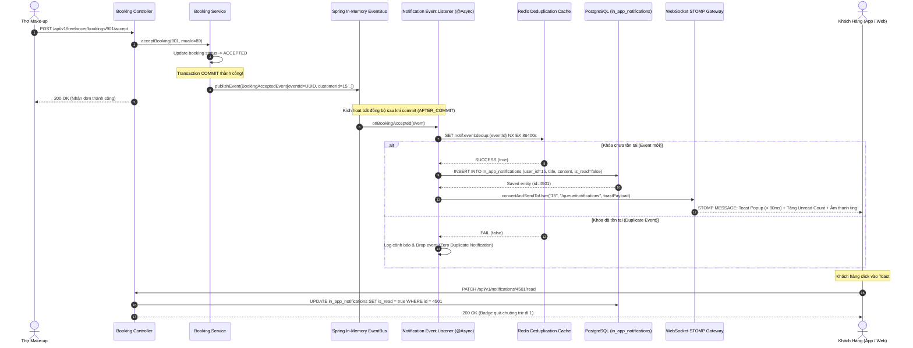

# TÀI LIỆU ĐẶC TẢ USER STORIES & THIẾT KẾ KỸ THUẬT CHI TIẾT
## PHÂN HỆ: IN-APP NOTIFICATION MODULE & EVENT-DRIVEN DISPATCHING
### (Spring Boot 3.3.x Layered Monolith with Domain Sub-packages `core-api` - Schema: `interaction_schema`, Port `8080`)

---

## 📌 1. TỔNG QUAN TÍNH NĂNG (FEATURE OVERVIEW)

* **Tên Phân hệ Nghiệp vụ:** `In-App Notification Module & Event-Driven Dispatching Engine`
* **Mã Jira Issues phụ trách (Sprint 4):**
  * `ISSUE-21.1`: **User Story** - In-App Notification Module - Xử lý thông báo In-App qua In-Memory EventBus.
  * `ISSUE-21.2`: **Task** - `@EventListener` bất đồng bộ (`@Async`) lắng nghe Domain Events phát sinh từ các module lõi (`booking`, `wallet`, `catalog`, `agency`).
  * `ISSUE-21.3`: **Task** - Xử lý chống trùng lặp thông báo Event qua `Event ID` (Idempotency Guard với Redis Cache).
  * `ISSUE-21.4`: **Task** - In-App Toast Popup Notification Client-side (< 100ms response time qua WebSocket STOMP P2P Queue `/user/queue/notifications`).
  * `ISSUE-21.5`: **Task** - Lưu danh sách thông báo In-App vào Bảng `interaction_schema.in_app_notifications` & Đánh dấu Đã đọc (`is_read`).

* **Mô hình Kiến trúc Toàn Hệ Thống:**
  * **Event-Driven Monolith (Spring In-Memory EventBus):** 
    * Khi các domain modules nghiệp vụ (Booking, Escrow, Review) hoàn tất trạng thái, chúng không gọi trực tiếp `NotificationService` (tránh chặt chẽ coupling) mà phát sinh sự kiện qua **`ApplicationEventPublisher.publishEvent(...)`**.
    * Tầng Notification tiếp nhận qua `@EventListener` / `@TransactionalEventListener(phase = AFTER_COMMIT)` để đảm bảo giao dịch cơ sở dữ liệu đã commit thành công trước khi bắn thông báo cho người dùng.
  * **Hạ tầng Đẩy Realtime Kết hợp Lưu trữ Bền vững:**
    * **Đẩy tức thời qua WebSocket STOMP:** Bắn gói tin trực tiếp vào kênh cá nhân `/user/{userId}/queue/notifications` để hiển thị Toast Popup trên màn hình Client trong vòng $< 100\text{ms}$.
    * **Lưu trữ CSDL Bền vững (Persistence):** Ghi vào bảng `interaction_schema.in_app_notifications` trên PostgreSQL 16 để người dùng có thể xem lại lịch sử chuông thông báo bất cứ lúc nào.
  * **Cơ chế Chống Trùng lặp (Event Deduplication / Idempotency):**
    * Ứng dụng Redis Key `notif:event:dedup:{eventId}` với TTL $24\text{ giờ}$ để đảm bảo dù hệ thống bị retry sự kiện do lỗi mạng thì mỗi người dùng chỉ nhận duy nhất 1 thông báo cho 1 sự kiện nghiệp vụ.

* **Đối tượng Sử dụng (User Personas):**
  1. **Customer (`ROLE_CUSTOMER`):**
     * Nhận thông báo Toast tức thì khi thợ nhận đơn, thợ bắt đầu di chuyển, đơn hoàn tất hoặc ví được hoàn tiền cọc.
     * Biểu tượng quả chuông trên thanh Header hiển thị số lượng thông báo chưa đọc (Unread Badge Counter) kèm âm thanh nhẹ nhàng.
  2. **Freelance MUA & Studio Staff MUA (`ROLE_FREELANCE_MUA`, `ROLE_AGENCY_STAFF`):**
     * Nhận thông báo được gán ca làm việc từ Agency, thông báo khách hủy ca, thông báo tiền tip hoặc khiếu nại phát sinh.
  3. **Agency Admin (`ROLE_AGENCY_ADMIN`):**
     * Nhận cảnh báo thợ hủy ca khẩn cấp, thông báo doanh thu ngày hoặc có đơn đặt chỉ định Studio mới.

---

## 🏗️ 2. KIẾN TRÚC PHÂN TẦNG BACK-END (LAYERED ARCHITECTURE WITH DOMAIN SUB-PACKAGES)

Tuân thủ 100% cấu trúc chuẩn mực quy định tại `docs/project_structure.md` và `docs/convention.md`:

```text
code/backend/core-api/src/main/java/com/makeup/platform/
├── Application.java                           # Bootstrap Spring Boot 3.3.x Monolith
│
├── common/                                    # TẦNG DÙNG CHUNG TOÀN HỆ THỐNG
│   ├── base/
│   │   ├── BaseEntity.java                    # id, created_at, updated_at
│   │   ├── BaseController.java                # ok, created, noContent, error
│   │   ├── ApiResponse.java                   # Envelope API chuẩn
│   │   └── PageResponse.java                  # Chuẩn hóa dữ liệu phân trang
│   ├── constants/
│   │   ├── ErrorCodes.java                    # ERR_NOTIFICATION_NOT_FOUND, ERR_NOTIFICATION_ACCESS_DENIED...
│   │   └── NotificationConstants.java         # Enum NotificationType, Redis Dedup Prefix, TTL
│   ├── exception/
│   │   └── ResourceNotFoundException.java     # Báo lỗi 404 khi không tìm thấy thông báo
│   └── utils/
│       └── SecurityContextUtils.java          # Trích xuất current userId để chống IDOR
│
├── config/                                    # CẤU HÌNH FRAMEWORK & BẤT ĐỒNG BỘ
│   ├── AsyncConfig.java                       # ThreadPoolTaskExecutor cho xử lý thông báo bất đồng bộ (@Async)
│   ├── RedisConfig.java                       # RedisTemplate cho bộ đệm chống trùng lặp Event ID
│   └── WebSocketConfig.java                   # STOMP Broker (/user destination prefix)
│
├── controller/                                # TẦNG REST CONTROLLERS (Domain: notification)
│   └── notification/
│       └── NotificationController.java        # GET /api/v1/notifications, PATCH /{id}/read, PATCH /read-all
│
├── dto/                                       # DATA TRANSFER OBJECTS (Domain: notification)
│   ├── request/
│   │   └── notification/
│   │       └── NotificationFilterReq.java     # page, size, isRead, type
│   └── response/
│       └── notification/
│           ├── InAppNotificationRes.java      # id, title, content, type, referenceId, isRead, createdAt
│           ├── UnreadNotificationCountRes.java# unreadCount
│           └── NotificationToastPayloadRes.java# Payload đẩy qua STOMP /user/queue/notifications
│
├── entity/                                    # JPA ENTITIES (interaction_schema)
│   └── notification/
│       └── InAppNotificationEntity.java       # table: interaction_schema.in_app_notifications
│
├── mapper/                                    # MANUAL MAPPERS (@Component tường minh)
│   └── notification/
│       └── NotificationMapper.java            # InAppNotificationEntity <-> InAppNotificationRes
│
├── event/                                     # DOMAIN EVENTS PHÁT SINH TỪ CÁC MODULES KHÁC
│   ├── booking/
│   │   ├── BookingCreatedEvent.java           # eventId, bookingId, customerId, muaId, totalAmount
│   │   ├── BookingAcceptedEvent.java          # eventId, bookingId, customerId, muaId
│   │   ├── BookingStatusChangedEvent.java     # eventId, bookingId, oldStatus, newStatus
│   │   └── BookingCancelledEvent.java         # eventId, bookingId, cancelledBy, reason
│   └── wallet/
│       ├── EscrowLockedEvent.java             # eventId, walletId, amount, bookingId
│       └── RefundProcessedEvent.java          # eventId, walletId, amount, bookingId
│
├── listener/                                  # TẦNG LẮNG NGHE SỰ KIỆN TOÀN HỆ THỐNG
│   └── notification/
│       └── DomainNotificationEventListener.java # @TransactionalEventListener xử lý Event -> Tạo Notif
│
├── repository/                                # SPRING DATA JPA REPOSITORY
│   └── notification/
│       └── NotificationRepository.java        # findByUserIdOrderByCreatedAtDesc, countByUserIdAndIsReadFalse
│
└── service/                                   # TẦNG NGHIỆP VỤ LÕI
    └── notification/
        ├── NotificationService.java           # Interface quản lý thông báo, phân trang, đánh dấu đã đọc
        ├── NotificationEventProcessor.java    # Interface chống trùng lặp Event ID và sinh nội dung i18n
        ├── WebSocketBroadcastService.java     # Đẩy STOMP packet vào hàng đợi riêng của người dùng
        └── impl/
            ├── NotificationServiceImpl.java   # 100% logic CRUD thông báo, kiểm tra phân quyền sở hữu
            ├── NotificationEventProcessorImpl.java # Xử lý Redis Dedup & đa ngôn ngữ theo locale user
            └── WebSocketBroadcastServiceImpl.java # Implement SimpMessagingTemplate.convertAndSendToUser()
```

---

## 📋 3. DANH SÁCH USER STORIES CHI TIẾT & TIÊU CHÍ BDD (ACCEPTANCE CRITERIA)

---

### **US-NOTIF-01: `@EventListener` Bất Đồng Bộ Tiếp Nhận Domain Events Toàn Hệ Thống (`ISSUE-21.1` & `ISSUE-21.2`)**
> **As a** Động cơ Điều phối Thông báo (Notification Dispatcher),  
> **I want** lắng nghe tự động các sự kiện phát sinh từ các Domain Modules (`booking`, `wallet`, `agency`) qua Spring EventBus sau khi database transaction đã commit thành công,  
> **So that** quá trình tạo và đẩy thông báo diễn ra hoàn toàn bất đồng bộ (`@Async`), không làm chậm thời gian phản hồi của các luồng nghiệp vụ chính.

#### **Tiêu chí Nghiệm thu (Acceptance Criteria - BDD):**

* **Scenario 01: Lắng nghe sự kiện `BookingAcceptedEvent` và tạo thông báo cho Khách hàng**
  * **Given** Thợ trang điểm A (`mua_id = 89`) nhận đơn hàng `booking_id = 901` của khách hàng (`customer_id = 15`).
  * **When** `BookingStateMachineService` commit thành công trạng thái `ACCEPTED` và kích hoạt:
    ```java
    eventPublisher.publishEvent(new BookingAcceptedEvent(
        UUID.randomUUID().toString(), // eventId
        901L,                         // bookingId
        15L,                          // customerId
        89L,                          // muaId
        "Lê Bảo Ngọc (Pro MUA)"       // muaName
    ));
    ```
  * **Then** `DomainNotificationEventListener` tiếp nhận sự kiện qua `@TransactionalEventListener(phase = TransactionPhase.AFTER_COMMIT)`.
  * **And** Phương thức được thực thi bất đồng bộ trên luồng riêng (`@Async("notificationTaskExecutor")`).
  * **And** Hệ thống tra cứu ngôn ngữ người dùng (`vi` hoặc `en`), biên dịch nội dung:
    * Tiêu đề: `"Thợ trang điểm đã nhận ca!"`
    * Nội dung: `"Chuyên viên Lê Bảo Ngọc (Pro MUA) đã xác nhận lịch hẹn #BK-260914-FAST901 của bạn."`
  * **And** Bản ghi được lưu bền vững vào bảng `in_app_notifications` và gửi đồng thời qua WebSocket STOMP tới khách.

* **Scenario 02: Giao dịch gốc thất bại (Rollback) thì không được phát sinh thông báo**
  * **Given** Đang trong tiến trình đặt ca khẩn cấp nhưng bước trừ cọc ví Escrow bị lỗi (thiếu số dư).
  * **When** Database transaction của nghiệp vụ Booking bị Rollback.
  * **Then** `DomainNotificationEventListener` **KHÔNG** kích hoạt (nhờ cơ chế `AFTER_COMMIT`), đảm bảo khách hàng không bao giờ nhận thông báo "ảo" về một đơn hàng không tồn tại.

---

### **US-NOTIF-02: Cơ Chế Xử Lý Chống Trùng Lặp Thông Báo Qua Event ID (`ISSUE-21.3`)**
> **As a** Kỹ sư Backend,  
> **I want** áp dụng cơ chế Idempotency Guard kiểm tra `Event ID` trên Redis trước khi xử lý,  
> **So that** dù hệ thống gặp sự cố mạng hoặc có cơ chế Retry bắn lại Event thì người dùng không bao giờ bị nhận 2 thông báo giống hệt nhau cho cùng 1 hành vi nghiệp vụ.

#### **Tiêu chí Nghiệm thu (Acceptance Criteria - BDD):**

* **Scenario 01: Sự kiện đến lần đầu tiên được xử lý bình thường (First Arrival)**
  * **Given** Sự kiện `BookingStatusChangedEvent` mang `eventId = "evt-bk-901-accepted-uuid"`.
  * **When** `NotificationEventProcessor` gọi Redis lệnh:
    ```text
    SET notif:event:dedup:evt-bk-901-accepted-uuid "PROCESSED" NX EX 86400
    ```
  * **Then** Redis trả về `true` (Khóa chưa từng tồn tại).
  * **And** Hệ thống tiến hành ghi CSDL và bắn WebSocket bình thường.

* **Scenario 02: Sự kiện trùng lặp (Duplicate Event) bị chặn đứng lập tức**
  * **Given** Do lỗi gián đoạn mạng hoặc retry logic, sự kiện có cùng `eventId = "evt-bk-901-accepted-uuid"` được bắn lại sau 500 mili-giây.
  * **When** `NotificationEventProcessor` kiểm tra Redis khóa `notif:event:dedup:evt-bk-901-accepted-uuid`.
  * **Then** Redis trả về `false` (Khóa đã tồn tại).
  * **And** Hệ thống lập tức bỏ qua (Drop event), ghi log:
    ```text
    WARN - Duplicate event detected for eventId: evt-bk-901-accepted-uuid. Skipping notification dispatch.
    ```
  * **And** Không ghi thêm bản ghi vào CSDL, không đẩy thêm thông báo WebSocket tới Client.

---

### **US-NOTIF-03: In-App Toast Popup Notification Client-Side Với Phản Hồi Tức Thì < 100ms (`ISSUE-21.4`)**
> **As a** Người dùng ứng dụng (Khách hàng / Thợ / Studio),  
> **I want** ngay khi có sự kiện liên quan đến mình, màn hình ứng dụng lập tức hiện Popup Toast trượt xuống góc trên kèm âm thanh thông báo và số lượng chuông đỏ nhảy số trong vòng $< 100\text{ms}$,  
> **So that** tôi không bị bỏ lỡ thông tin quan trọng mà không cần phải tải lại trang (F5).

#### **Tiêu chí Nghiệm thu UI/UX & STOMP:**

* **Scenario 01: Nhận tin nhắn STOMP P2P và hiển thị Toast trên Client**
  * **Given** Khách hàng đang mở Web/Mobile App và đã kết nối WSS tới `/ws-makeup`, đã subscribe kênh cá nhân:
    ```text
    SUBSCRIBE
    id:sub-notif-15
    destination:/user/queue/notifications
    ```
  * **When** Server hoàn tất xử lý thông báo và gọi `messagingTemplate.convertAndSendToUser("15", "/queue/notifications", toastPayload)`.
  * **Then** Trong vòng **$< 80\text{ms}$**, Client nhận được gói tin JSON:
    ```json
    {
      "notification_id": 4501,
      "type": "BOOKING_ACCEPTED",
      "title": "Thợ trang điểm đã nhận ca!",
      "content": "Chuyên viên Lê Bảo Ngọc (Pro MUA) đã xác nhận lịch hẹn #BK-260914-FAST901 của bạn.",
      "reference_id": 901,
      "created_at": "2026-09-14T10:15:00Z"
    }
    ```
  * **And** Thư viện Toast (Sonner / Toastify) bật Popup trượt từ mép trên màn hình:
    * Icon: Biểu tượng vương miện / thỏi son màu Rose Gold sang trọng (`bg-rose-50 border-rose-200`).
    * Phát âm thanh chuông nhẹ `ting.mp3`.
    * Nút bấm nhanh: **[Xem Chi Tiết Đơn]** $\rightarrow$ Click vào điều hướng thẳng tới `/bookings/901`.
  * **And** Biểu tượng quả chuông trên thanh Header tự động tăng `unread_count` lên $+1$ (hiển thị chấm đỏ nổi bật).

---

### **US-NOTIF-04: Lưu Trữ CSDL `in_app_notifications` & API Đánh Dấu Đã Đọc (`ISSUE-21.5`)**
> **As a** Người dùng hệ thống,  
> **I want** mở danh sách xem lại toàn bộ các thông báo trong quá khứ, lọc theo trạng thái chưa đọc và bấm "Đánh dấu đã đọc tất cả",  
> **So that** tôi kiểm soát được toàn bộ lịch sử biến động dịch vụ và dọn sạch các chấm đỏ chưa đọc.

#### **Tiêu chí Nghiệm thu (Acceptance Criteria - BDD):**

* **Scenario 01: Lấy danh sách thông báo có phân trang (Pagination)**
  * **Given** Người dùng đã đăng nhập (`userId = 15`).
  * **When** Client gửi request `GET /api/v1/notifications?page=0&size=10&is_read=false`.
  * **Then** Service truy vấn bảng `interaction_schema.in_app_notifications` theo chỉ mục `idx_notifications_unread`:
    ```sql
    SELECT * FROM in_app_notifications 
    WHERE user_id = 15 AND is_read = false 
    ORDER BY created_at DESC LIMIT 10 OFFSET 0;
    ```
  * **And** Trả về HTTP `200 OK` bọc trong `PageResponse<InAppNotificationRes>` kèm tổng số bản ghi chưa đọc.

* **Scenario 02: Đánh dấu 1 thông báo cụ thể là đã đọc (Mark Single as Read)**
  * **Given** Thông báo `id = 4501` thuộc quyền sở hữu của `userId = 15` và đang có `is_read = false`.
  * **When** Khách hàng click vào thông báo, Client gửi `PATCH /api/v1/notifications/4501/read`.
  * **Then** Service kiểm tra quyền sở hữu (`notification.getUserId().equals(currentUserId)`):
    * Cập nhật `is_read = true`.
  * **And** Trả về HTTP `200 OK` với thông điệp `"notification.marked_read_success"`.
  * **And** Số lượng unread badge trên Header giảm đi 1.

* **Scenario 03: Chặn hành vi đánh dấu thông báo của người khác (IDOR Prevention)**
  * **Given** Kẻ xấu (`userId = 999`) cố tình gửi request `PATCH /api/v1/notifications/4501/read` (trong đó thông báo 4501 thuộc về `userId = 15`).
  * **When** Service so sánh `userId` trong bản ghi với `currentUserId` từ JWT.
  * **Then** Phát hiện vi phạm phân quyền, ném `CustomBusinessException(ErrorCodes.ERR_NOTIFICATION_ACCESS_DENIED)`.
  * **And** Trả về HTTP `403 FORBIDDEN`, không thay đổi dữ liệu trong CSDL.

* **Scenario 04: Đánh dấu tất cả thông báo là đã đọc (Mark All as Read)**
  * **Given** Người dùng có 15 thông báo chưa đọc.
  * **When** Người dùng nhấn nút "Đánh dấu đã đọc tất cả" trên Web/App (`PATCH /api/v1/notifications/read-all`).
  * **Then** Service thực hiện câu lệnh bulk update:
    ```sql
    UPDATE in_app_notifications SET is_read = true WHERE user_id = 15 AND is_read = false;
    ```
  * **And** Trả về HTTP `200 OK` kèm `updated_count = 15`.
  * **And** Quả chuông trên Header xóa sạch badge đỏ (`unreadCount = 0`).

---

## ⚠️ 4. CHI TIẾT NGOẠI LỆ, VALIDATION & BẢNG MÃ LỖI BACK-END

Tất cả các lỗi nghiệp vụ được xử lý tập trung qua `GlobalExceptionHandler.java` và định dạng theo chuẩn `ApiResponse<T>`:

### 4.1. Bảng Ma Trận Mã Lỗi Phân Hệ In-App Notification

| HTTP Status | Mã Lỗi (`code`) | Nguyên Nhân Kích Hoạt | Giải Pháp Xử Lý Phía Server | Hành Động Phía Client |
| :--- | :--- | :--- | :--- | :--- |
| **`400 BAD_REQUEST`** | `ERR_INVALID_NOTIFICATION_FILTER` | Tham số phân trang âm hoặc kiểu thông báo không nằm trong danh mục enum hợp lệ. | Bean Validation chặn lại tại tầng Controller. | Điều chỉnh lại query params. |
| **`403 FORBIDDEN`** | `ERR_NOTIFICATION_ACCESS_DENIED` | Người dùng cố tình đọc/sửa thông báo thuộc sở hữu của tài khoản khác (IDOR). | Chặn lại tại tầng Service, ghi log cảnh báo an ninh. | Hiển thị thông báo không có quyền truy cập. |
| **`404 NOT_FOUND`** | `ERR_NOTIFICATION_NOT_FOUND` | ID thông báo không tồn tại trong CSDL. | Ném `ResourceNotFoundException`. | Cập nhật lại danh sách thông báo trên giao diện. |
| **`429 TOO_MANY_REQUESTS`**| `ERR_NOTIFICATION_RATE_LIMITED` | Client spam request `PATCH /read-all` liên tục nhiều lần trong 1 giây. | Rate limiter trên Redis từ chối request. | Chờ 1 giây trước khi bấm lại. |

---

## 💻 5. ĐẶC TẢ REST API & WEBSOCKET CONTRACTS

---

### 5.1. `GET /api/v1/notifications` (Lấy Danh Sách Thông Báo Phân Trang)
* **Quyền truy cập:** Đã đăng nhập (`ROLE_CUSTOMER`, `ROLE_FREELANCE_MUA`, `ROLE_AGENCY_ADMIN`, `ROLE_AGENCY_STAFF`, `ROLE_SUPER_ADMIN`).
* **Headers:** `Authorization: Bearer <JWT>`, `Accept-Language: vi`
* **Query Parameters:**
  * `page` (int, default: 0)
  * `size` (int, default: 10, max: 50)
  * `is_read` (boolean, optional: `true`, `false`, hoặc để trống để lấy tất cả)
  * `type` (string, optional: `BOOKING_ACCEPTED`, `PAYMENT_SUCCESS`...)
* **Response `200 OK`:**
```json
{
  "success": true,
  "code": "NOTIFICATIONS_FETCHED_SUCCESS",
  "message": "Lấy danh sách thông báo thành công",
  "data": {
    "content": [
      {
        "id": 4501,
        "title": "Thợ trang điểm đã nhận ca!",
        "content": "Chuyên viên Lê Bảo Ngọc (Pro MUA) đã xác nhận lịch hẹn #BK-260914-FAST901 của bạn.",
        "notification_type": "BOOKING_ACCEPTED",
        "reference_id": 901,
        "is_read": false,
        "created_at": "2026-09-14T10:15:00Z"
      },
      {
        "id": 4489,
        "title": "Tạm giữ tiền cọc thành công",
        "content": "Đã phong tỏa số tiền 819,000 đ từ Ví vào quỹ Escrow cho đơn #BK-260914-FAST901.",
        "notification_type": "PAYMENT_ESCROW_LOCKED",
        "reference_id": 901,
        "is_read": true,
        "created_at": "2026-09-14T10:14:55Z"
      }
    ],
    "page": 0,
    "size": 10,
    "total_elements": 25,
    "total_pages": 3,
    "last": false,
    "unread_count": 8
  },
  "timestamp": "2026-09-14T10:20:00Z"
}
```

---

### 5.2. `PATCH /api/v1/notifications/{id}/read` (Đánh Dấu 1 Thông Báo Đã Đọc)
* **Quyền truy cập:** Chủ sở hữu thông báo (`userId == currentUserId`).
* **Headers:** `Authorization: Bearer <JWT>`
* **Response `200 OK`:**
```json
{
  "success": true,
  "code": "NOTIFICATION_MARKED_READ_SUCCESS",
  "message": "Đã đánh dấu thông báo là đã đọc",
  "data": {
    "notification_id": 4501,
    "is_read": true,
    "read_at": "2026-09-14T10:20:05Z"
  },
  "timestamp": "2026-09-14T10:20:05Z"
}
```

---

### 5.3. `PATCH /api/v1/notifications/read-all` (Đánh Dấu Tất Cả Đã Đọc)
* **Quyền truy cập:** Authenticated User.
* **Headers:** `Authorization: Bearer <JWT>`
* **Response `200 OK`:**
```json
{
  "success": true,
  "code": "ALL_NOTIFICATIONS_MARKED_READ_SUCCESS",
  "message": "Đã đánh dấu tất cả thông báo là đã đọc",
  "data": {
    "updated_count": 8,
    "unread_count": 0
  },
  "timestamp": "2026-09-14T10:20:10Z"
}
```

---

### 5.4. Giao Thức STOMP WebSocket P2P Toast Message
* **Destination Queue:** `/user/{userId}/queue/notifications`
* **Payload Format:**
```json
{
  "notification_id": 4501,
  "notification_type": "BOOKING_ACCEPTED",
  "title": "Thợ trang điểm đã nhận ca!",
  "content": "Chuyên viên Lê Bảo Ngọc (Pro MUA) đã xác nhận lịch hẹn #BK-260914-FAST901 của bạn.",
  "reference_id": 901,
  "action_url": "/customer/bookings/901",
  "created_at": "2026-09-14T10:15:00Z",
  "unread_count": 9
}
```

---

## ⚡ 6. SƠ ĐỒ TUẦN TỰ KHÉP KÍN (MERMAID SEQUENCE DIAGRAM)



---

## 🗄️ 7. THIẾT KẾ CƠ SỞ DỮ LIỆU & CẤU TRÚC REDIS KEY

### 7.1. Bảng Dữ Liệu: `interaction_schema.in_app_notifications`

```sql
CREATE SCHEMA IF NOT EXISTS interaction_schema;

CREATE TABLE interaction_schema.in_app_notifications (
    id BIGINT GENERATED ALWAYS AS IDENTITY PRIMARY KEY,
    user_id BIGINT NOT NULL REFERENCES auth_schema.users(id) ON DELETE CASCADE,
    title VARCHAR(200) NOT NULL,
    content TEXT NOT NULL,
    notification_type VARCHAR(50) NOT NULL, -- BOOKING_ACCEPTED, BOOKING_COMPLETED, ESCROW_LOCKED...
    reference_id BIGINT,                   -- booking_id, transaction_id
    is_read BOOLEAN DEFAULT FALSE,
    created_at TIMESTAMP WITH TIME ZONE DEFAULT CURRENT_TIMESTAMP
);

-- Tối ưu hóa truy vấn danh sách thông báo chưa đọc của từng người dùng
CREATE INDEX idx_notifications_unread 
ON interaction_schema.in_app_notifications (user_id, is_read, created_at DESC);
```

### 7.2. Cấu Trúc Khóa Redis

| Tên Khóa (Redis Key Pattern) | Kiểu Dữ Liệu | Mục Đích | TTL / Cơ Chế Hết Hạn |
| :--- | :--- | :--- | :--- |
| `notif:event:dedup:{eventId}` | `String` | Khóa chống trùng lặp sự kiện. Nếu eventId đã xử lý thì chặn không phát thông báo lại. | `TTL = 24 giờ` (86400s) |
| `notif:unread:count:{userId}` | `String (Atomic Counter)` | Cache số lượng thông báo chưa đọc của user để trả về nhanh trên Header mà không cần đếm lại trong DB. | `TTL = 7 ngày` (Hoặc invalidate khi có thay đổi) |

---

## 🛡️ 8. YÊU CẦU PHI CHỨC NĂNG (NFRS)

1. **Thời Gian Phản Hồi Realtime (Client Toast Response Time):**
   * Thời gian từ lúc nghiệp vụ commit xong đến khi Popup Toast hiển thị trên màn hình người dùng qua WebSocket không được vượt quá **$100\text{ms}$** trong điều kiện mạng $4G/\text{Wi-Fi}$.
2. **Khả Năng Cách Ly Giao Dịch (Non-Blocking Transaction Isolation):**
   * Toàn bộ việc tạo thông báo, gửi WebSocket hay ghi log đều chạy trên luồng `@Async` độc lập (`notificationTaskExecutor`). Nếu hạ tầng thông báo gặp sự cố, **tuyệt đối không được gây lỗi hoặc rollback nghiệp vụ chính** (Booking, Escrow).
3. **Đảm Bảo Tính Nhất Quán (Zero Duplicate Notifications):**
   * Đảm bảo $100\%$ không phát sinh 2 thông báo trùng lặp cho cùng 1 sự kiện nghiệp vụ nhờ tầng bảo vệ Redis Idempotency Lock.

---

## ⚠️ 9. ĐÁNH GIÁ CÁC ĐIỂM CHƯA TỐI ƯU & RỦI RO KIẾN TRÚC CỦA TÍNH NĂNG (CRITICAL GAP ANALYSIS & BOTTLENECK AUDIT)

> [!WARNING]
> Dưới đây là **6 điểm nghẽn kỹ thuật và hạn chế kiến trúc** của module In-App Notification hiện tại, cùng giải pháp khắc phục chi tiết:

---

### 9.1. Điểm Chưa Tối Ưu 1: In-Memory EventBus Mất Sự Kiện Khi Server Restart / Crash (Lack of Event Durability)
* **Thực trạng chưa tối ưu:**
  * Spring `ApplicationEventPublisher` là bộ điều phối sự kiện hoàn toàn nằm trong bộ nhớ RAM (**In-Memory**).
  * Nếu một giao dịch Booking vừa commit thành công, Event `BookingAcceptedEvent` vừa được phát ra nhưng server bất ngờ bị crash, mất điện hoặc bị container restart đúng lúc đó $\rightarrow$ **Sự kiện thông báo sẽ biến mất vĩnh viễn trong RAM**, khách hàng sẽ không bao giờ nhận được thông báo về việc thợ đã nhận đơn.
* **Phương án Khắc phục / Lộ trình Tối ưu:**
  * Áp dụng **Transactional Outbox Pattern**:
    * Trong cùng transaction của Booking, ghi thêm một dòng vào bảng `outbox_events` (CSDL quan hệ PostgreSQL).
    * Một background worker (hoặc Debezium CDC / Spring Scheduled) quét bảng Outbox để dispatch thông báo. Khi nào đẩy thành công mới đánh dấu `processed = true`. Cách này đảm bảo tính bền vững 100% (**At-Least-Once Delivery**).

---

### 9.2. Điểm Chưa Tối Ưu 2: Cạn Kiệt Thread Pool Trong Giờ Cao Điểm (Async ThreadPool Exhaustion)
* **Thực trạng chưa tối ưu:**
  * `ISSUE-21.2` dùng `@Async` với `ThreadPoolTaskExecutor`.
  * Vào khung giờ cao điểm (ví dụ: ngày cưới, sự kiện tiệc tối), hàng nghìn đơn hàng thay đổi trạng thái cùng một lúc, sinh ra hàng loạt sự kiện thông báo. Nếu `queueCapacity` và `maxPoolSize` bị đầy, luồng mới sẽ bị đẩy vào chính sách từ chối (`AbortPolicy` gây văng ngoại lệ `RejectedExecutionException` hoặc `CallerRunsPolicy` làm chậm ngược lại luồng HTTP chính của khách).
* **Phương án Khắc phục / Lộ trình Tối ưu:**
  * Cấu hình ThreadPool riêng biệt cho Notification với hàng đợi đệm đủ lớn:
    ```java
    executor.setCorePoolSize(10);
    executor.setMaxPoolSize(50);
    executor.setQueueCapacity(10000);
    executor.setRejectedExecutionHandler(new ThreadPoolExecutor.CallerRunsPolicy());
    ```
  * Về lâu dài, chuyển tầng nhận Event sang hàng đợi Message Queue phân tán có độ bền cao như **RabbitMQ** hoặc **Redis Streams**.

---

### 9.3. Điểm Chưa Tối Ưu 3: Phình Bảng CSDL Do Thiếu Chính Sách Dọn Dẹp / Lưu Trữ (Table Bloat & Archiving Strategy)
* **Thực trạng chưa tối ưu:**
  * Bảng `in_app_notifications` lưu toàn bộ thông báo của hàng trăm ngàn khách hàng và thợ theo thời gian.
  * Nếu không có chính sách xoá tự động (Data Retention Policy), sau 6 tháng đến 1 năm bảng sẽ đạt hàng chục triệu dòng. Chỉ mục `idx_notifications_unread` bị phình to, làm chậm đáng kể API `GET /api/v1/notifications` và gây tốn dung lượng lưu trữ CSDL.
* **Phương án Khắc phục / Lộ trình Tối ưu:**
  * Thiết lập chính sách lưu trữ (**Data Retention Policy**):
    * Tự động xóa hoặc chuyển lưu trữ lạnh (Cold Storage) các thông báo cũ quá $90\text{ ngày}$.
    * Viết một Spring `@Scheduled` chạy vào 2:00 sáng hàng ngày:
      ```sql
      DELETE FROM interaction_schema.in_app_notifications 
      WHERE created_at < NOW() - INTERVAL '90 days';
      ```
    * Hoặc cấu hình **PostgreSQL Table Partitioning** theo tháng (`PARTITION BY RANGE (created_at)`).

---

### 9.4. Điểm Chưa Tối Ưu 4: Lệ Thuộc Vào Kết Nối WebSocket Đang Mở (No Offline Push Notification Fallback)
* **Thực trạng chưa tối ưu:**
  * `ISSUE-21.4` chỉ đẩy Toast qua kết nối STOMP WebSocket đang mở.
  * Nếu khách hàng hoặc thợ đang tắt màn hình điện thoại, khóa máy hoặc đóng tab trình duyệt, kết nối WebSocket bị đứt. Khi đó, người dùng sẽ **hoàn toàn không nhận được bất kỳ chuông báo hay thông báo nào trên màn hình khóa** cho đến khi họ tự tay mở lại ứng dụng.
* **Phương án Khắc phục / Lộ trình Tối ưu:**
  * Kết hợp song song với dịch vụ **Push Notification di động (Firebase Cloud Messaging - FCM / Apple APNs)**:
    * Nếu kiểm tra trong Redis thấy người dùng không có WebSocket session nào đang hoạt động (`ws:session:user:{id}` rỗng), hệ thống tự động kích hoạt đẩy Push Notification qua FCM tới điện thoại để đánh thức màn hình và phát chuông báo.

---

### 9.5. Điểm Chưa Tối Ưu 5: Nguy Cơ Lệch Số Lượng Chưa Đọc (Unread Count Inconsistency)
* **Thực trạng chưa tối ưu:**
  * Nếu đếm số lượng thông báo chưa đọc bằng câu lệnh `COUNT(*)` trong PostgreSQL mỗi khi khách mở app, câu lệnh này sẽ quét index liên tục làm tăng tải CPU của CSDL.
  * Ngược lại, nếu lưu số lượng `unread_count` trong Redis cache để tăng tốc, các thao tác xóa thông báo, đánh dấu đã đọc trên nhiều thiết bị (Multi-device: điện thoại + laptop) có thể khiến giá trị cache bị lệch so với số dòng thực tế trong DB.
* **Phương án Khắc phục / Lộ trình Tối ưu:**
  * Sử dụng cơ chế **Event-Driven Cache Invalidation**: Mỗi khi có hành động `read` hoặc `read-all`, phát sự kiện để tính toán lại hoặc xóa cache Redis, ép truy vấn lần tiếp theo nạp lại số liệu chính xác từ database.

---

### 9.6. Điểm Chưa Tối Ưu 6: Thiếu Lọc Nhóm Thông Báo (Notification Aggregation / Batching)
* **Thực trạng chưa tối ưu:**
  * Trong trường hợp có nhiều cập nhật liên tiếp trong thời gian ngắn (ví dụ: thợ gửi vị trí, đơn hàng có 3 món phụ phí được chấp nhận liên tục), hệ thống sẽ bắn liên tục 3–4 cái Toast dồn dập trong 5 giây, gây khó chịu và rối loạn tầm nhìn của người dùng (Notification Fatigue / Spam).
* **Phương án Khắc phục / Lộ trình Tối ưu:**
  * Áp dụng **Notification Debounce / Aggregation**: Nếu có nhiều thông báo cùng loại phát sinh cho cùng một đơn hàng trong vòng 10 giây, gộp chúng lại thành 1 thông báo tổng hợp: *"Đơn hàng #901 vừa có 3 cập nhật mới"*.
