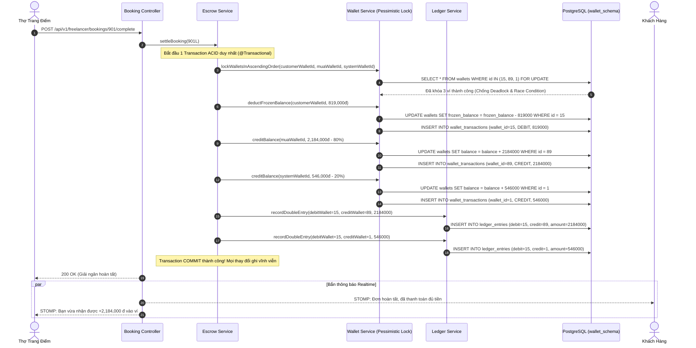

# TÀI LIỆU ĐẶC TẢ USER STORIES & THIẾT KẾ KỸ THUẬT CHI TIẾT
## PHÂN HỆ: VÍ 7 BẢNG SỔ CÁI KẾ TOÁN ĐÚP & CƠ CHẾ ESCROW TỰ ĐỘNG
### (Spring Boot 3.3.x Layered Monolith with Domain Sub-packages `core-api` - Schema: `wallet_schema`, Port `8080`)

---

## 📌 1. TỔNG QUAN TÍNH NĂNG (FEATURE OVERVIEW)

* **Tên Phân hệ Nghiệp vụ:** `Double-Entry Accounting Ledger & Automated Escrow Engine`
* **Mã Jira Issues phụ trách (Sprint 5 - Nhóm 1):**
  * `ISSUE-22.1`: **User Story** - Phân vùng Ví 7 Bảng - Khởi tạo Schema Sổ cái Kế toán Đúp (`wallet_schema` trong `core-api`).
  * `ISSUE-22.2`: **Task** - Module Quản lý Số dư khả dụng (`balance`) & Số dư phong tỏa (`frozen_balance`) trong Bảng `wallets`.
  * `ISSUE-22.3`: **Task** - Bảng Sổ cái Kế toán Đúp (`ledger_entries`) hạch toán Nợ (`debit`) / Có (`credit`) đối ứng bảo toàn tiền tệ.
  * `ISSUE-22.4`: **Task** - Bảng Sao kê Biến động số dư từng Ví (`wallet_transactions`) với các trạng thái `CREDIT`, `DEBIT`, `FREEZE`, `UNFREEZE`.
  * `ISSUE-22.5`: **Task** - Cơ chế Escrow Tự động: Giữ cọc 30% $\rightarrow$ Giải ngân Ví Thợ/Studio $\rightarrow$ Cắt % Hoa hồng Sàn (`SYSTEM_PLATFORM_WALLET`) trong 1 Database Transaction ACID duy nhất.

* **Mô hình Kiến trúc & Nguyên Lý Kế Toán Đúp:**
  * **Toàn vẹn Dữ liệu Kế toán (Financial Integrity):** Áp dụng chuẩn kế toán tài chính quốc tế **Double-Entry Bookkeeping**: Tiền không tự sinh ra và không tự mất đi; mọi biến động tiền tệ đều phải là sự dịch chuyển giữa 2 tài khoản ví đối ứng:
    $$\sum \text{Debit (Ghi Nợ)} = \sum \text{Credit (Ghi Có)}$$
  * **Bảo vệ Tranh Chấp Đơn Hàng (Escrow Protection):** 
    * Khi đơn hàng được xác nhận, tiền cọc $30\%$ của khách hàng được chuyển từ `balance` sang `frozen_balance` (Số dư phong tỏa).
    * Khi đơn hoàn tất nghiệm thu, động cơ Escrow tự động phân bổ:
      - $80\%$ doanh thu vào Ví Thợ tự do (`FREELANCER_WALLET`) hoặc Ví Studio (`AGENCY_WALLET`).
      - $20\%$ phí hoa hồng nền tảng vào Ví Sàn (`SYSTEM_PLATFORM_WALLET`).
  * **Bảo toàn Giao dịch & Chống Race Condition:**
    * Sử dụng **Khóa Bi quan (Pessimistic Locking - `PESSIMISTIC_WRITE`)** trên các dòng bản ghi của bảng `wallets` trong suốt quá trình biến động số dư.
    * Cơ chế sắp xếp ID ví tăng dần trước khi khóa (`ORDER BY wallet_id ASC`) để loại trừ $100\%$ rủi ro Deadlock giữa các giao dịch đồng thời.

---

## 🏗️ 2. KIẾN TRÚC PHÂN TẦNG BACK-END (DOMAIN SUB-PACKAGE: `wallet`)

Mã nguồn được tổ chức chặt chẽ theo cấu trúc chuẩn dự án tại `docs/project_structure.md`:

```text
code/backend/core-api/src/main/java/com/makeup/platform/
├── common/
│   ├── base/
│   │   ├── BaseEntity.java                    # id, created_at, updated_at
│   │   ├── BaseController.java                # ok, created, noContent, error
│   │   └── ApiResponse.java                   # Chuẩn hóa Envelope
│   └── constants/
│       ├── ErrorCodes.java                    # ERR_WALLET_INSUFFICIENT_BALANCE, ERR_LEDGER_UNBALANCED...
│       └── WalletConstants.java               # Tỷ lệ cọc 30%, Hoa hồng sàn 20%, SYSTEM_WALLET_ID
│
├── config/
│   └── DatabaseConfig.java                    # Quản lý @EnableTransactionManagement
│
├── controller/
│   └── wallet/
│       ├── WalletController.java              # GET /api/v1/wallets/me, GET /api/v1/wallets/transactions
│       └── AdminWalletAuditController.java    # GET /api/v1/admin/wallets/ledger-audit (Đối soát)
│
├── dto/
│   ├── request/
│   │   └── wallet/
│   │       ├── EscrowLockReq.java             # bookingId, customerId, amount
│   │       └── EscrowReleaseReq.java          # bookingId, completionProofNote
│   └── response/
│       └── wallet/
│           ├── WalletBalanceRes.java          # walletId, balance, frozenBalance, currency
│           ├── WalletTransactionDetailRes.java# id, amount, balanceBefore, balanceAfter, entryType
│           └── LedgerAuditRes.java            # debitWalletId, creditWalletId, amount, transactionCode
│
├── entity/
│   └── wallet/
│       ├── WalletEntity.java                  # table: wallet_schema.wallets
│       ├── TransactionEntity.java             # table: wallet_schema.transactions
│       ├── WalletTransactionEntity.java       # table: wallet_schema.wallet_transactions
│       └── LedgerEntryEntity.java             # table: wallet_schema.ledger_entries
│
├── mapper/
│   └── wallet/
│       ├── WalletMapper.java                  # Manual Mapper (@Component)
│       └── LedgerMapper.java                  # Manual Mapper (@Component)
│
├── repository/
│   └── wallet/
│       ├── WalletRepository.java              # findByIdWithPessimisticLock, findByUserId, findByAgencyId
│       ├── TransactionRepository.java         # findByTransactionCode, findByBookingId
│       ├── WalletTransactionRepository.java   # findByWalletIdOrderByCreatedAtDesc (Pageable)
│       └── LedgerEntryRepository.java         # findByTransactionId, calculateTotalDebitCreditAudit
│
├── event/
│   └── wallet/
│       ├── EscrowLockedEvent.java             # Bắn ra khi tiền cọc đã phong tỏa an toàn
│       └── EscrowDisbursedEvent.java          # Bắn ra khi đã giải ngân ví thợ và ví sàn
│
└── service/
    └── wallet/
        ├── WalletService.java                 # Interface nạp tiền, trừ tiền, khóa/mở phong tỏa
        ├── LedgerService.java                 # Interface ghi nhận bút toán kép đối ứng
        ├── EscrowService.java                 # Interface vòng đời cọc đơn hàng: Hold -> Release -> Refund
        └── impl/
            ├── WalletServiceImpl.java         # 100% logic khóa bi quan, kiểm tra số dư khả dụng
            ├── LedgerServiceImpl.java         # 100% logic hạch toán Nợ/Có bảo toàn tổng tài sản
            └── EscrowServiceImpl.java         # 100% logic điều phối giải ngân và cắt hoa hồng sàn
```

---

## 📋 3. DANH SÁCH USER STORIES CHI TIẾT & TIÊU CHÍ BDD (ACCEPTANCE CRITERIA)

---

### **US-WAL-01: Quản Lý Số Dư Khả Dụng & Số Dư Phong Tỏa Trong Bảng `wallets` (`ISSUE-22.1` & `ISSUE-22.2`)**
> **As a** Chủ sở hữu Ví (Khách hàng / Thợ / Studio / Ban Quản trị Sàn),  
> **I want** hệ thống quản lý độc lập 2 loại số dư: **Số dư khả dụng (`balance`)** và **Số dư đóng băng/phong tỏa (`frozen_balance`)**,  
> **So that** tôi biết chính xác số tiền có thể rút hoặc chi tiêu ngay lập tức, trong khi các khoản cọc đang thực hiện dịch vụ được bảo vệ an toàn.

#### **Tiêu chí Nghiệm thu (Acceptance Criteria - BDD):**

* **Scenario 01: Phong tỏa số dư để đặt cọc đơn hàng (Freeze Balance)**
  * **Given** Khách hàng A (`userId = 15`) sở hữu ví có `balance = 2,000,000 đ` và `frozen_balance = 0 đ`.
  * **When** Khách hàng đặt đơn hàng yêu cầu cọc $819,000\text{ đ}$.
  * **Then** Service mở transaction, xin khóa bi quan `PESSIMISTIC_WRITE` trên dòng ví của Khách A.
  * **And** Kiểm tra điều kiện: `balance >= 819,000` (Thỏa mãn).
  * **And** Cập nhật ví:
    * `balance = 2,000,000 - 819,000 = 1,181,000 đ`.
    * `frozen_balance = 0 + 819,000 = 819,000 đ`.
  * **And** Ghi 1 bản ghi vào `wallet_transactions` với `entry_type = 'FREEZE'`, lưu vết `balance_before`, `balance_after`, `frozen_balance_before`, `frozen_balance_after`.

* **Scenario 02: Từ chối phong tỏa khi số dư khả dụng không đủ**
  * **Given** Khách hàng B sở hữu ví có `balance = 500,000 đ`, cần cọc $819,000\text{ đ}$.
  * **When** Hệ thống thực hiện lệnh phong tỏa cọc.
  * **Then** Service phát hiện `balance < amount`, lập tức ném ngoại lệ `CustomBusinessException(ErrorCodes.ERR_WALLET_INSUFFICIENT_BALANCE)`.
  * **And** Trả về HTTP `400 BAD_REQUEST`, hủy bỏ giao dịch (Rollback toàn bộ).

---

### **US-WAL-02: Bút Toán Sổ Cái Kế Toán Đúp (`ledger_entries`) Đối Ứng Nợ / Có (`ISSUE-22.3`)**
> **As a** Giám đốc Tài chính & Kế toán Trưởng Hệ thống,  
> **I want** mọi giao dịch tài chính phát sinh đều phải tạo thành một cặp bút toán kép: Ví Ghi Nợ (`debit_wallet_id`) và Ví Ghi Có (`credit_wallet_id`) với số tiền bằng nhau,  
> **So that** hệ thống không thể xảy ra tình trạng "tiền ảo" tự sinh ra hoặc thất thoát ngoài tầm kiểm soát.

#### **Tiêu chí Nghiệm thu (Acceptance Criteria - BDD):**

* **Scenario 01: Hạch toán phân bổ tiền hoa hồng sàn khi hoàn tất ca làm**
  * **Given** Đơn hàng hoàn tất, hệ thống thu phí hoa hồng sàn $20\%$ tương đương $546,000\text{ đ}$.
  * **When** `LedgerService.recordEntry(...)` được gọi:
    * Ví trích tiền (Nợ): Ví Escrow Trung Gian Tạm Giữ hoặc Ví Thợ (`debit_wallet_id = 101`).
    * Ví thụ hưởng (Có): Ví Doanh Thu Sàn (`credit_wallet_id = 1` - `SYSTEM_PLATFORM_WALLET`).
    * Số tiền: $546,000\text{ đ}$.
  * **Then** Hệ thống chèn 1 bản ghi vào bảng `wallet_schema.ledger_entries`:
    ```sql
    INSERT INTO ledger_entries (transaction_id, debit_wallet_id, credit_wallet_id, amount, currency, description)
    VALUES (7801, 101, 1, 546000.00, 'VND', 'Thu phí hoa hồng sàn 20% đơn #BK-260914-FAST901');
    ```
  * **And** Luôn đảm bảo: Số tiền giảm bên Nợ chính xác bằng số tiền tăng bên Có.

* **Scenario 02: Kiểm tra tính cân bằng sổ cái đối soát (Audit Balance Check)**
  * **Given** Ban quản trị chạy API kiểm tra đối soát tổng tài sản hệ thống.
  * **When** Gọi query đối soát:
    ```sql
    SELECT SUM(amount) AS total_debit FROM ledger_entries;
    ```
  * **Then** Tổng biến động nợ và có của toàn hệ thống phải khớp nhau $100\%$, độ lệch sai số $= 0.00\text{ đ}$.

---

### **US-WAL-03: Bảng Sao Kê Biến Động Số Dư (`wallet_transactions`) Snapshot Minh Bạch (`ISSUE-22.4`)**
> **As a** Người dùng sở hữu Ví,  
> **I want** xem lịch sử sao kê chi tiết từng dòng biến động số dư kèm ảnh chụp trạng thái trước và sau khi thay đổi,  
> **So that** tôi tự kiểm tra được tính minh bạch và chính xác của từng đồng tiền trong ví.

#### **Tiêu chí Nghiệm thu (Acceptance Criteria - BDD):**

* **Scenario 01: Xem sao kê biến động ví của Thợ trang điểm**
  * **Given** Thợ trang điểm vừa hoàn tất ca và được giải ngân $2,184,000\text{ đ}$.
  * **When** Thợ gửi request `GET /api/v1/wallets/transactions?page=0&size=10`.
  * **Then** Trả về danh sách sao kê có cấu trúc snapshot hoàn chỉnh:
    ```json
    {
      "id": 9901,
      "transaction_id": 7801,
      "entry_type": "CREDIT",
      "amount": 2184000.00,
      "balance_before": 1500000.00,
      "balance_after": 3684000.00,
      "frozen_balance_before": 0.00,
      "frozen_balance_after": 0.00,
      "created_at": "2026-09-14T11:00:00Z",
      "description": "Nhận tiền thù lao ca làm đơn #BK-260914-FAST901"
    }
    ```
  * **And** Giá trị `balance_after` bắt buộc phải bằng chính xác $\text{balance\_before} + \text{amount}$.

---

### **US-WAL-04: Động Cơ Tự Động Hóa Escrow: Giữ Cọc $\rightarrow$ Giải Ngân $\rightarrow$ Cắt Hoa Hồng Sàn (`ISSUE-22.5`)**
> **As a** Hệ thống Điều phối Kinh tế Nền tảng (Platform Economy Engine),  
> **I want** khi đơn hàng hoàn tất, hệ thống tự động giải phóng cọc Escrow, cộng doanh thu thuần cho Thợ/Studio và trích hoa hồng cho Sàn trong cùng 1 `@Transactional`,  
> **So that** không cần bất kỳ sự can thiệp thủ công nào của con người và loại trừ hoàn toàn nguy cơ mất tiền hoặc hạch toán dở dang.

#### **Tiêu chí Nghiệm thu (Acceptance Criteria - BDD):**

* **Scenario 01: Hoàn tất đơn hàng và giải ngân tự động trọn gói (Full Settlement Flow)**
  * **Given** Đơn hàng `booking_id = 901` có tổng giá trị $2,730,000\text{ đ}$, trong đó:
    * Tiền cọc đã phong tỏa trong ví khách: $819,000\text{ đ}$ (`frozen_balance`).
    * Tiền mặt hoặc thanh toán phần còn lại khi hoàn tất: $1,911,000\text{ đ}$.
    * Tỷ lệ hoa hồng sàn: $20\%$, Doanh thu thực nhận của Thợ ($80\%$): $2,184,000\text{ đ}$.
    * Hoa hồng Sàn thu về ($20\%$): $546,000\text{ đ}$.
  * **When** Thợ bấm "Nghiệm thu hoàn tất" và Khách hàng xác nhận thành công.
  * **Then** `EscrowService.settleBooking(901L)` thực thi trong 1 giao dịch database duy nhất:
    1. Trừ vĩnh viễn $819,000\text{ đ}$ từ `frozen_balance` của Khách hàng.
    2. Cộng $+2,184,000\text{ đ}$ vào `balance` của Ví Thợ (`FREELANCER_WALLET`).
    3. Cộng $+546,000\text{ đ}$ vào `balance` của Ví Sàn (`SYSTEM_PLATFORM_WALLET`).
    4. Ghi các bút toán kép tương ứng vào bảng `ledger_entries`.
    5. Ghi các dòng sao kê biến động vào `wallet_transactions`.
    6. Đổi trạng thái đơn hàng sang `PAID_OUT`.
  * **And** Bắn sự kiện `EscrowDisbursedEvent` để WebSocket Gateway gửi thông báo Toast cho cả Khách và Thợ.

* **Scenario 02: Khách hàng hủy đơn hợp lệ $\rightarrow$ Hoàn cọc 100% tự động (Auto-Refund Flow)**
  * **Given** Đơn khẩn cấp sau 45s không có thợ nhận, hoặc khách hủy trước khi thợ di chuyển theo đúng chính sách hoàn tiền.
  * **When** `EscrowService.refundDeposit(901L, "SEARCH_TIMEOUT")` được kích hoạt.
  * **Then** Hệ thống chuyển ngược số tiền $819,000\text{ đ}$ từ `frozen_balance` quay trở lại `balance` khả dụng của khách:
    * `frozen_balance = frozen_balance - 819,000`.
    * `balance = balance + 819,000`.
  * **And** Ghi bản ghi `wallet_transactions` với `entry_type = 'UNFREEZE'`.
  * **And** Thời gian hoàn tiền hoàn tất trong vòng $< 50\text{ms}$.

---

## ⚠️ 4. CHI TIẾT NGOẠI LỆ & BẢNG MÃ LỖI VÍ ĐIỆN TỬ

| HTTP Status | Mã Lỗi (`code`) | Nguyên Nhân Kích Hoạt | Xử Lý Phía Server |
| :--- | :--- | :--- | :--- |
| **`400 BAD_REQUEST`** | `ERR_WALLET_INSUFFICIENT_BALANCE` | Số dư khả dụng (`balance`) nhỏ hơn số tiền cần giao dịch/phong tỏa. | Rollback giao dịch, yêu cầu nạp thêm tiền. |
| **`400 BAD_REQUEST`** | `ERR_WALLET_FROZEN_INSUFFICIENT` | Số dư phong tỏa không khớp với số tiền cọc cần giải ngân/hoàn trả. | Chặn giải ngân, ghi log cảnh báo dữ liệu không nhất quán. |
| **`403 FORBIDDEN`** | `ERR_WALLET_ACCESS_DENIED` | Người dùng cố tình truy cập thông tin số dư hoặc sao kê của ví người khác. | Ném lỗi vi phạm phân quyền IDOR. |
| **`409 CONFLICT`** | `ERR_WALLET_LOCKED_CONCURRENT` | Ví đang bị một tiến trình khác khóa quá thời gian chờ (Pessimistic Lock Timeout). | Tự động retry tối đa 3 lần với backoff 100ms. |
| **`500 INTERNAL_ERROR`**| `ERR_LEDGER_UNBALANCED_ENTRY` | Tổng số tiền bên Nợ không bằng bên Có trong cùng bút toán kép. | Rollback toàn bộ transaction, kích hoạt cảnh báo khẩn cấp tới DevOps. |

---

## 💻 5. ĐẶC TẢ REST API VÍ ĐIỆN TỬ

### 5.1. `GET /api/v1/wallets/me` (Xem Số Dư Ví Cá Nhân)
* **Quyền truy cập:** Đã đăng nhập (`ROLE_CUSTOMER`, `ROLE_FREELANCE_MUA`, `ROLE_AGENCY_ADMIN`).
* **Headers:** `Authorization: Bearer <JWT>`
* **Response `200 OK`:**
```json
{
  "success": true,
  "code": "WALLET_BALANCE_FETCHED",
  "message": "Lấy thông tin số dư ví thành công",
  "data": {
    "wallet_id": 88,
    "wallet_type": "CUSTOMER_WALLET",
    "balance": 1181000.00,
    "frozen_balance": 819000.00,
    "total_asset": 2000000.00,
    "currency": "VND",
    "is_active": true
  },
  "timestamp": "2026-09-14T11:15:00Z"
}
```

---

### 5.2. `GET /api/v1/wallets/transactions` (Lấy Danh Sách Sao Kê Biến Động Ví)
* **Query Parameters:** `page=0&size=10&entry_type=ALL`
* **Response `200 OK`:**
```json
{
  "success": true,
  "code": "WALLET_TRANSACTIONS_FETCHED",
  "message": "Lấy danh sách sao kê thành công",
  "data": {
    "content": [
      {
        "id": 9902,
        "transaction_code": "TXN-260914-DISBURSE-901",
        "entry_type": "CREDIT",
        "amount": 2184000.00,
        "balance_before": 1500000.00,
        "balance_after": 3684000.00,
        "frozen_balance_before": 0.00,
        "frozen_balance_after": 0.00,
        "created_at": "2026-09-14T11:00:00Z"
      }
    ],
    "page": 0,
    "size": 10,
    "total_elements": 1,
    "total_pages": 1,
    "last": true
  },
  "timestamp": "2026-09-14T11:15:00Z"
}
```

---

## ⚡ 6. SƠ ĐỒ TUẦN TỰ KHÉP KÍN (MERMAID SEQUENCE DIAGRAM)



---

## 🗄️ 7. THIẾT KẾ CƠ SỞ DỮ LIỆU DDL (WALLET SCHEMA 4 BẢNG CỐT LÕI)

```sql
CREATE SCHEMA IF NOT EXISTS wallet_schema;

CREATE TYPE wallet_type_enum AS ENUM ('CUSTOMER_WALLET', 'FREELANCER_WALLET', 'AGENCY_WALLET', 'SYSTEM_PLATFORM_WALLET');
CREATE TYPE transaction_type_enum AS ENUM ('DEPOSIT', 'WITHDRAWAL', 'ESCROW_LOCK', 'ESCROW_RELEASE', 'PLATFORM_COMMISSION', 'REFUND', 'TIP');

-- 1. BẢNG VÍ
CREATE TABLE wallet_schema.wallets (
    id BIGINT GENERATED ALWAYS AS IDENTITY PRIMARY KEY,
    user_id BIGINT REFERENCES auth_schema.users(id) ON DELETE RESTRICT,
    agency_id BIGINT REFERENCES agency_schema.agency_profiles(id) ON DELETE RESTRICT,
    mua_id BIGINT REFERENCES mua_schema.mua_profiles(id) ON DELETE RESTRICT,
    wallet_type wallet_type_enum NOT NULL,
    balance DECIMAL(15, 2) DEFAULT 0.00 CHECK (balance >= 0),
    frozen_balance DECIMAL(15, 2) DEFAULT 0.00 CHECK (frozen_balance >= 0),
    currency VARCHAR(3) DEFAULT 'VND',
    is_active BOOLEAN DEFAULT TRUE,
    created_at TIMESTAMP WITH TIME ZONE DEFAULT CURRENT_TIMESTAMP,
    updated_at TIMESTAMP WITH TIME ZONE DEFAULT CURRENT_TIMESTAMP
);

-- 2. BẢNG GIAO DỊCH NGHIỆP VỤ
CREATE TABLE wallet_schema.transactions (
    id BIGINT GENERATED ALWAYS AS IDENTITY PRIMARY KEY,
    transaction_code VARCHAR(50) UNIQUE NOT NULL,
    booking_id BIGINT REFERENCES booking_schema.bookings(id) ON DELETE SET NULL,
    transaction_type transaction_type_enum NOT NULL,
    amount DECIMAL(15, 2) NOT NULL CHECK (amount > 0),
    status VARCHAR(30) DEFAULT 'COMPLETED',
    description TEXT,
    created_at TIMESTAMP WITH TIME ZONE DEFAULT CURRENT_TIMESTAMP
);

-- 3. BẢNG SAO KÊ BIẾN ĐỘNG SỐ DƯ TỪNG VÍ
CREATE TABLE wallet_schema.wallet_transactions (
    id BIGINT GENERATED ALWAYS AS IDENTITY PRIMARY KEY,
    transaction_id BIGINT NOT NULL REFERENCES wallet_schema.transactions(id) ON DELETE CASCADE,
    wallet_id BIGINT NOT NULL REFERENCES wallet_schema.wallets(id) ON DELETE RESTRICT,
    amount DECIMAL(15, 2) NOT NULL,
    balance_before DECIMAL(15, 2) NOT NULL,
    balance_after DECIMAL(15, 2) NOT NULL,
    frozen_balance_before DECIMAL(15, 2) NOT NULL,
    frozen_balance_after DECIMAL(15, 2) NOT NULL,
    entry_type VARCHAR(20) NOT NULL CHECK (entry_type IN ('CREDIT', 'DEBIT', 'FREEZE', 'UNFREEZE')),
    created_at TIMESTAMP WITH TIME ZONE DEFAULT CURRENT_TIMESTAMP
);

-- 4. BẢNG SỔ CÁI KẾ TOÁN ĐÚP
CREATE TABLE wallet_schema.ledger_entries (
    id BIGINT GENERATED ALWAYS AS IDENTITY PRIMARY KEY,
    transaction_id BIGINT NOT NULL REFERENCES wallet_schema.transactions(id) ON DELETE CASCADE,
    debit_wallet_id BIGINT NOT NULL REFERENCES wallet_schema.wallets(id) ON DELETE RESTRICT,
    credit_wallet_id BIGINT NOT NULL REFERENCES wallet_schema.wallets(id) ON DELETE RESTRICT,
    amount DECIMAL(15, 2) NOT NULL CHECK (amount > 0),
    currency VARCHAR(3) DEFAULT 'VND',
    description TEXT,
    created_at TIMESTAMP WITH TIME ZONE DEFAULT CURRENT_TIMESTAMP
);

CREATE INDEX idx_ledger_debit_credit ON wallet_schema.ledger_entries(debit_wallet_id, credit_wallet_id, created_at DESC);
CREATE INDEX idx_wallet_txns_wallet_time ON wallet_schema.wallet_transactions(wallet_id, created_at DESC);
```

---

## 🛡️ 8. YÊU CẦU PHI CHỨC NĂNG (NFRS)

1. **Bảo Đảm Tính Toàn Vẹn ACID Tuyệt Đối (Zero Monetary Drift):**
   * Mọi biến động ví, bút toán ledger, trừ cọc escrow bắt buộc nằm trọn vẹn trong 1 `@Transactional`. Nếu xảy ra bất kỳ lỗi runtime nào, toàn bộ giao dịch phải rollback $100\%$, không bao giờ xảy ra tình trạng "ví đã trừ tiền mà sổ cái chưa ghi".
2. **Loại Trừ Hoàn Toàn Nguy Cơ Deadlock (Zero Deadlock Guarantee):**
   * Mọi thao tác cần lock nhiều ví cùng lúc BẮT BUỘC phải sắp xếp danh sách ID ví theo thứ tự tăng dần trước khi thực thi lệnh `SELECT ... FOR UPDATE`.
3. **Độ Chính Xác Tính Toán Tiền Tệ (Mathematical Precision):**
   * Tuyệt đối không dùng kiểu `float` hoặc `double` trong mã nguồn Java. $100\%$ các phép tính tiền tệ, hoa hồng, hoàn cọc phải sử dụng `BigDecimal` với `RoundingMode.HALF_UP` và scale 2 chữ số thập phân.

---

## ⚠️ 9. ĐÁNH GIÁ CÁC ĐIỂM CHƯA TỐI ƯU & RỦI RO KIẾN TRÚC CỦA TÍNH NĂNG (CRITICAL GAP ANALYSIS & BOTTLENECK AUDIT)

> [!WARNING]
> Dưới đây là **5 điểm nghẽn kiến trúc tài chính và hạn chế kỹ thuật** của hệ thống Ví & Sổ cái hiện tại, cùng giải pháp khắc phục chi tiết:

---

### 9.1. Điểm Chưa Tối Ưu 1: Nghẽn Cổ Chai Khóa Bi Quan Trên Ví Nền Tảng (Pessimistic Lock Contention on System Wallet)
* **Thực trạng chưa tối ưu:**
  * Toàn bộ hoa hồng $20\%$ của mọi đơn booking hoàn tất trên cả nước đều được ghi Có (`Credit`) vào duy nhất 1 ví: `SYSTEM_PLATFORM_WALLET` (`wallet_id = 1`).
  * Trong giờ cao điểm (ví dụ: tối Chủ Nhật), hàng trăm ca làm cùng hoàn tất trong 1 giây. Việc mỗi transaction đều thực hiện `SELECT * FROM wallets WHERE id = 1 FOR UPDATE` sẽ biến dòng ví sàn thành **điểm thắt cổ chai cực đại (Hotspot Bottleneck)**. Các transaction phải xếp hàng chờ lock ví sàn, dẫn đến hiện tượng timeout (`PessimisticLockingFailureException`) và giảm thông lượng hệ thống nghiêm trọng.
* **Phương án Khắc phục / Lộ trình Tối ưu:**
  * **Sharded System Wallets (Phân mảnh Ví Sàn):** Tạo $N$ ví sàn phụ (`SYSTEM_PLATFORM_WALLET_1` đến `_10`). Khi hạch toán, chọn ngẫu nhiên 1 ví sàn phụ bằng hash `bookingId % N` để chia tải lock.
  * Hoặc áp dụng **Eventual Consistency cho Ví Sàn**: Tiền hoa hồng sàn chỉ ghi vào `ledger_entries` ngay lập tức, còn số dư lũy kế trên bảng `wallets` của ví sàn sẽ được cập nhật định kỳ theo lô (Batch Async Update mỗi 1 phút).

---

### 9.2. Điểm Chưa Tối Ưu 2: Rủi Ro Lệch Tiền Do Thiếu Tiến Trình Đối Soát Tự Động Định Kỳ (Lack of Automated Reconciliation Cron)
* **Thực trạng chưa tối ưu:**
  * Mặc dù đã thiết kế bảng `ledger_entries` theo kế toán đúp, nhưng hệ thống hiện tại chưa có một Worker tự động chạy định kỳ để đối soát chéo (Reconciliation Job).
  * Nếu chẳng may có một lập trình viên vô tình viết câu lệnh `UPDATE wallets SET balance = balance + 100` trực tiếp mà quên ghi ledger, số dư ví sẽ bị lệch so với tổng sổ cái mà không ai hay biết cho đến kỳ kiểm toán cuối năm.
* **Phương án Khắc phục / Lộ trình Tối ưu:**
  * Xây dựng một Spring `@Scheduled` chạy vào lúc 01:00 sáng mỗi ngày:
    * Quét toàn bộ các ví: So sánh `wallets.balance` hiện tại với tổng công thức:
      $$\text{Balance Dự Kiến} = \sum \text{Credit (Vào)} - \sum \text{Debit (Ra)} \pm \text{Frozen Balance}.$$
    * Nếu phát hiện bất kỳ ví nào lệch dù chỉ $1\text{ đ}$, lập tức kích hoạt còi báo động qua Telegram / Slack tới Ban Giám đốc và tạm khóa chức năng rút tiền của ví đó để kiểm tra an toàn.

---

### 9.3. Điểm Chưa Tối Ưu 3: Tốc Độ Phình Bảng Sổ Cái Gấp 5-6 Lần Đơn Booking (Ledger Data Explosion)
* **Thực trạng chưa tối ưu:**
  * Với mỗi 1 đơn hàng booking từ lúc tạo đến lúc hoàn tất, hệ thống phát sinh:
    * 1 giao dịch giữ cọc (1 dòng `transactions` + 1 dòng `wallet_transactions`).
    * 1 giao dịch giải ngân ví thợ (1 dòng `transactions` + 1 dòng `wallet_transactions` + 1 dòng `ledger_entries`).
    * 1 giao dịch cắt hoa hồng sàn (1 dòng `transactions` + 1 dòng `wallet_transactions` + 1 dòng `ledger_entries`).
    * $\rightarrow$ Trung bình mỗi đơn booking sinh ra **6 đến 8 dòng dữ liệu tài chính**.
  * Với mục tiêu 10,000 đơn/ngày, bảng `ledger_entries` và `wallet_transactions` sẽ tăng thêm $\sim 2.5\text{ triệu dòng/tháng}$, làm chậm truy vấn sao kê của người dùng.
* **Phương án Khắc phục / Lộ trình Tối ưu:**
  * Cấu hình **PostgreSQL Table Partitioning theo quý hoặc theo tháng** cho bảng `wallet_transactions` và `ledger_entries` (`PARTITION BY RANGE (created_at)`).
  * Đánh chỉ mục chuyên biệt `CREATE INDEX CONCURRENTLY` trên cặp `(wallet_id, created_at DESC)`.

---

### 9.4. Điểm Chưa Tối Ưu 4: Thiếu Cơ Chế Đóng Băng Tự Động Khi Phát Hiện Ví Bị Số Dư Âm (Negative Balance Circuit Breaker)
* **Thực trạng chưa tối ưu:**
  * Dù CSDL đã có ràng buộc `CHECK (balance >= 0)`, nhưng trong các tình huống tranh chấp hoàn tiền (Chargeback từ thẻ ngân hàng hoặc Khách hàng khiếu nại thành công sau khi Thợ đã rút hết tiền ví về tài khoản ngân hàng), ví của Thợ có thể rơi vào tình huống bị ép ghi nợ dẫn đến số dư âm hoặc không thể thu hồi công nợ.
* **Phương án Khắc phục / Lộ trình Tối ưu:**
  * Bổ sung cơ chế **Công Nợ Sàn (Debt Ledger)**: Nếu phát sinh khoản phạt hoặc hoàn tiền mà ví thợ không đủ số dư, khoản nợ được ghi nhận vào bảng `mua_debts`. Khi thợ hoàn thành các đơn tiếp theo, hệ thống tự động trừ cấn trừ công nợ trước khi giải ngân vào số dư khả dụng.

---

### 9.5. Điểm Chưa Tối Ưu 5: Chưa Tách Biệt Sổ Cái Đọc & Ghi (Read/Write Contention on Ledger)
* **Thực trạng chưa tối ưu:**
  * Các truy vấn xem lịch sử sao kê ví của người dùng (`GET /api/v1/wallets/transactions`) chạy chung trên Master Database với các lệnh ghi `INSERT INTO ledger_entries` của tiến trình giải ngân đơn khẩn cấp.
  * Khi nhiều khách hàng cùng mở app xem lại lịch sử chi tiêu, các câu lệnh `SELECT ... ORDER BY created_at DESC` với OFFSET lớn sẽ cạnh tranh tài nguyên I/O đĩa cứng với luồng ghi giao dịch cốt lõi.
* **Phương án Khắc phục / Lộ trình Tối ưu:**
  * Cấu hình **Read-Replica Database** (Phân tách Đọc / Ghi qua `@Transactional(readOnly = true)` trỏ tới PostgreSQL Read-Replica Slave). Master Database chỉ chuyên tâm phục vụ luồng ghi giao dịch tài chính.
