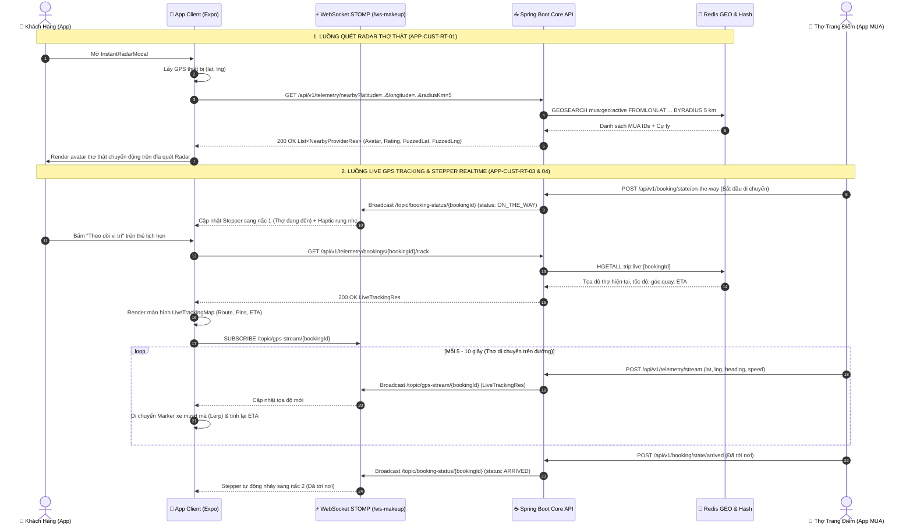

# ĐẶC TẢ TÍNH NĂNG ỨNG DỤNG DI ĐỘNG (MOBILE APP SPECIFICATION)
## Phân hệ: Radar Quét Thợ Thật, Bản Đồ Live GPS Tracking & Stepper Tiến Trình Tự Động
### Vai trò: Khách Hàng (`ROLE_CUSTOMER`)
### Mã Phân Hệ: `APP-CUST-RT` | Sprint: M-3 (Mobile) / Sprint 6 Backlog  
### Công nghệ: React Native 0.86 + Expo SDK 57 + TypeScript + Reanimated + React Native Maps
### Hạ tầng Backend: Spring Boot Core API (`/api/v1/telemetry/*`) & Embedded WebSocket STOMP (`/ws-makeup`)

---

## 📱 1. BỐI CẢNH & PHẠM VI NGHIỆP VỤ

> ⚠️ **NGUYÊN TẮC BẤT DI BẤT DỊCH (STRICT BACKEND ADHERENCE - ZERO MOCKING)**:
> - **100% dữ liệu hiển thị trên ứng dụng di động phải là dữ liệu thực tế** được truy xuất từ Spring Boot Core API, CSDL PostgreSQL 16 và Redis GEO.
> - **Nghiêm cấm tuyệt đối mọi hình thức giả lập (mock data)**:
>   * CẤM tạo danh sách avatar thợ ảo hoặc dùng dữ liệu cứng (hardcoded list) để hiển thị trên Radar khi chưa có hoặc không có thợ online. Nếu không có thợ online trong Redis GEO (`mua:geo:active`), Radar phải hiển thị đúng trạng thái rỗng (*"Không có thợ đang trực tuyến quanh bán kính 5km"*).
>   * CẤM dùng `setTimeout` sinh tọa độ ảo chạy trên đường hoặc vẽ lộ trình giả nếu thợ chưa phát sóng GPS.
>   * CẤM dùng timer ảo tự động nhảy Stepper tiến trình (`ON_THE_WAY` -> `ARRIVED` -> `IN_PROGRESS` -> `COMPLETED`). Stepper chỉ được phép chuyển nấc khi và chỉ khi nhận được sự kiện thật từ Backend qua WebSocket STOMP `/topic/booking-status/{bookingId}`.
>   * Mọi luồng giao dịch, hủy đơn, nhận đơn, kết thúc ca làm đều phải qua API Backend để đảm bảo tính toàn vẹn ACID và hạch toán ví Escrow.

### 3 Tính Năng Cốt Lõi:
1. **`APP-CUST-RT-01` | Radar Quét Thợ Thật Quanh Vị Trí (`GET /telemetry/nearby`)**:
   - Thay thế hiệu ứng sóng radar tĩnh bằng **bản đồ radar quét dữ liệu thợ thật** đang online trong Redis GEO (`mua:geo:active`).
   - Hiển thị avatar thợ thật kèm cự ly (km), số sao uy tín và danh sách phong cách sở trường.
2. **`APP-CUST-RT-03` | Màn Hình Bản Đồ Live GPS Tracking Theo Dõi Xe Thợ Chạy (Realtime Map)**:
   - Thay thế nút bấm chỉ hiện thông báo chữ `Alert.alert` trong `bookings.tsx` thành màn hình bản đồ tương tác chuyên nghiệp `src/app/booking/tracking/[id].tsx`.
   - Tải tọa độ ban đầu qua `GET /api/v1/telemetry/bookings/{id}/track` và hứng luồng stream tọa độ thợ di chuyển liên tục qua WebSocket STOMP `/topic/gps-stream/{bookingId}`.
3. **`APP-CUST-RT-04` | Cập Nhật Stepper Tiến Trình Dịch Vụ Tự Động (`/topic/booking-status/{bookingId}`)**:
   - Lắng nghe trực tiếp sự kiện đổi trạng thái từ backend qua WebSocket `/topic/booking-status/{bookingId}`.
   - Stepper 4 bước tự động nhảy theo thời gian thực: `ON_THE_WAY` $\rightarrow$ `ARRIVED` $\rightarrow$ `IN_PROGRESS` $\rightarrow$ `COMPLETED` mà không cần vuốt màn hình để reload.

---

## 🏗️ 2. KIẾN TRÚC TỔNG THỂ & DATA FLOW (MERMAID SEQUENCE)



---

## 📍 3. CHI TIẾT TÍNH NĂNG 1: RADAR QUÉT THỢ THẬT QUANH VỊ TRÍ (`APP-CUST-RT-01`)

### 3.1. Mục Tiêu & Vấn Đề Khắc Phục
* **Vấn đề cũ:** `src/components/booking/InstantRadarModal.tsx` chỉ vẽ các vòng tròn sóng xung kích CSS/SVG tĩnh vô nghĩa, tạo cảm giác giả lập.
* **Yêu cầu mới:** Kết nối API thực tế, hiển thị đúng các thợ MUA đang trực tuyến phát sóng GPS trong bán kính từ 1km đến 5km.

### 3.2. Đặc Tả Giao Diện & Tương Tác (UI/UX)
1. **Khởi tạo khi mở Modal:**
   - App kiểm tra quyền truy cập vị trí qua `expo-location`.
   - Nếu đã có tọa độ `(latitude, longitude)`, kích hoạt đĩa quay radar và gọi ngay API tìm kiếm thợ.
   - Nếu chưa có quyền, hiển thị prompt yêu cầu cấp quyền định vị một chạm.
2. **Giao Diện Trạng Thái Phát Sóng Tìm Thợ (Compact Scanning View):**
   - Loại bỏ đĩa radar tròn khổ lớn chiếm diện tích nhằm tránh che khuất nội dung và nút bấm trên màn hình điện thoại.
   - Tập trung vào đĩa đếm ngược trung tâm (`InstantCountdownTimer`), huy hiệu phát sóng nhịp nhàng (`Đang Phát Tín Hiệu Thác Nước Tới Thợ...`), cùng thẻ tóm tắt gói dịch vụ và địa chỉ đón.
   - Bố cục gọn gàng, vừa vặn trên mọi khung hình giúp nút **[Hủy Tìm Thợ]** luôn hiển thị rõ ràng, không bị đẩy tràn xuống dưới.
3. **Hiển Thị Marker Thợ (`MuaRadarMarker.tsx`):**
   - Avatar tròn kích thước 40x40px, viền sáng màu xanh lá `#10B981` thể hiện đang sẵn sàng nhận việc.
   - Thẻ cự ly mini đính kèm dưới chân avatar (VD: `1.2 km`, `800 m`).
4. **Tương Tác Bấm Chọn Thợ (Quick Info Popover):**
   - Khi bấm vào 1 avatar thợ trên radar, kim quét tạm dừng nhẹ, hiển thị popover thông tin nhanh:
     * Họ tên thợ MUA & Danh hiệu (VD: *Lan Anh Makeup - Pro MUA*).
     * Điểm đánh giá sao uy tín: `⭐ 4.95 (128 đơn)`.
     * Cự ly thực tế & Thời gian ước tính có mặt (VD: `Cách bạn 1.5 km • ~12 phút`).
     * Các phong cách sở trường (Tags: *Tone Thái, Douyin, Cô dâu*).
     * Giá khởi điểm: `Từ 350.000 đ`.
     * Nút bấm: `[Đặt Thợ Này Ngay]` hoặc `[Xem Hồ Sơ Chi Tiết]`.

### 3.3. Hợp Đồng API & Dữ Liệu Backend

* **Endpoint:** `GET /api/v1/telemetry/nearby`
* **Controller:** `TelemetryQueryController.java`
* **Query Parameters (`NearbyProvidersReq`):**
  ```http
  GET /api/v1/telemetry/nearby?latitude=21.028511&longitude=105.854444&radiusKm=5.0&limit=10 HTTP/1.1
  Host: 192.168.0.229:8080
  Authorization: Bearer <JWT_CUSTOMER_TOKEN>
  ```
* **Cấu trúc phản hồi chuẩn (`ApiResponse<List<NearbyProviderRes>>`):**
  ```json
  {
    "success": true,
    "message": "telemetry.nearby_query_success",
    "errorCode": null,
    "data": [
      {
        "providerId": 12,
        "providerType": "FREELANCER_MUA",
        "code": "MUA-00012",
        "fullName": "Nguyễn Hoàng Lan Anh",
        "avatarUrl": "https://res.cloudinary.com/.../lananh_avatar.jpg",
        "distanceKm": 1.45,
        "ratingAvg": 4.95,
        "startingPrice": 350000,
        "fuzzedLatitude": 21.034510,
        "fuzzedLongitude": 105.859210,
        "styles": ["Tone Thái Sắc Sảo", "Tone Hàn Trong Trẻo", "Douyin"]
      },
      {
        "providerId": 18,
        "providerType": "FREELANCER_MUA",
        "code": "MUA-00018",
        "fullName": "Trần Thu Hà",
        "avatarUrl": "https://res.cloudinary.com/.../thuha_avatar.jpg",
        "distanceKm": 2.80,
        "ratingAvg": 4.88,
        "startingPrice": 400000,
        "fuzzedLatitude": 21.018900,
        "fuzzedLongitude": 105.845120,
        "styles": ["Make-up Cô Dâu", "Dự Tiệc Tối"]
      }
    ],
    "timestamp": "2026-09-25T16:50:00.000Z"
  }
  ```
* **Bảo vệ quyền riêng tư (Privacy Fuzzing):**
  - Tọa độ trả về (`fuzzedLatitude`, `fuzzedLongitude`) đã được Backend tự động làm mờ ngẫu nhiên trong bán kính $\pm 30 - 50m$ để bảo vệ an toàn cho Thợ khi chưa nhận cuốc, tuân thủ nghiêm ngặt chính sách an toàn bảo mật vị trí.

### 3.4. Bố Cục Thẻ Dịch Vụ & Báo Giá Khẩn Cấp Minh Bạch Phía Khách Hàng (`InstantRadarModal.tsx`)

Nhằm khắc phục tình trạng chỉ có 3 nút bấm phân loại chung chung và thiếu dữ liệu chi phí, `InstantRadarModal.tsx` được nâng cấp với **Khung Thông Tin Dịch Vụ Khẩn Cấp Đầy Đủ**:

```text
┌─────────────────────────────────────────────────────────────┐
│ ⚡ ĐẶT THỢ TRANG ĐIỂM KHẨN CẤP (30-45 PHÚT CÓ MẶT)           │
│ [🟢 Có 4 chuyên viên đang online phát sóng quanh bạn 5km]   │
├─────────────────────────────────────────────────────────────┤
│ 💄 1. GÓI DỊCH VỤ CẦN GẤP:                                  │
│    (•) Make-up Dự Tiệc Tối (500k)   ( ) Cô Dâu Cấp Tốc (1tr2)│
│    ( ) Make-up Tự Nhiên Đi Làm (350k)                        │
├─────────────────────────────────────────────────────────────┤
│ 🎨 2. PHONG CÁCH YÊU CẦU: [Tone Thái] [Douyin] [Tone Hàn]   │
│    Tùy chọn: [✔] Kèm làm tóc (+100k)  [✔] Mi 3D (+50k)       │
├─────────────────────────────────────────────────────────────┤
│ 📍 3. ĐỊA CHỈ TRANG ĐIỂM TẬN NƠI:                           │
│    P1208, Tòa R2 Royal City, 72A Nguyễn Trãi, Thanh Xuân     │
│    [Ghi chú: Bấm chuông tầng 12, gọi trước khi lên]         │
├─────────────────────────────────────────────────────────────┤
│ 🧾 4. BẢNG TÍNH GIÁ REALTIME (MINH BẠCH 100%):              │
│    • Giá dịch vụ gốc:                        500.000 đ      │
│    • Phụ phí ca khẩn cấp (Cam kết 30-45p):   + 150.000 đ    │
│    • Phụ phí dịch vụ thêm (Làm tóc + Mi):    + 150.000 đ    │
│    • Hệ số Surge cao điểm:                   x 1.0 (0 đ)    │
│    ─────────────────────────────────────────────────────────│
│    💰 TỔNG CỘNG:                             800.000 đ      │
│    🔒 Tiền cọc giữ chân thợ (30% Escrow):    240.000 đ      │
│    (Số tiền còn lại 560.000 đ thanh toán sau khi nghiệm thu)│
├─────────────────────────────────────────────────────────────┤
│ [            🚀 BẮT ĐẦU QUÉT TÌM THỢ GẦN NHẤT              ] │
└─────────────────────────────────────────────────────────────┘
```

#### Quy Chuẩn Hiển Thị:
1. **Chỉ số thợ thực tế**: Đọc số lượng thợ online từ danh sách `List<NearbyProviderRes>` thực tế trả về từ `GET /api/v1/telemetry/nearby`. Tuyệt đối không sinh số ảo.
2. **Breakdown chi phí rõ ràng**: Tách biệt giá gói gốc và Phụ phí khẩn cấp 150.000đ để khách hàng hiểu rõ lý do phát sinh phí, tránh thắc mắc khiếu nại.
3. **Minh bạch tiền cọc Escrow 30%**: Nêu rõ tiền cọc được giữ an toàn trên quỹ Escrow của hệ thống và chỉ giải ngân cho thợ khi khách hàng nghiệm thu hoàn thành.

---

## 🗺️ 4. CHI TIẾT TÍNH NĂNG 2: MÀN HÌNH BẢN ĐỒ LIVE GPS TRACKING XE THỢ CHẠY (`APP-CUST-RT-03`)

### 4.1. Mục Tiêu & Vấn Đề Khắc Phục
* **Vấn đề cũ:** Tại màn hình Lịch Hẹn Của Tôi (`src/app/bookings.tsx`), hàm `handleTrack` đang dùng `Alert.alert('Vị Trí Thợ (Live Tracking)', ...)`. Khách hoàn toàn không xem được xe thợ đang ở đâu, lộ trình di chuyển thế nào.
* **Yêu cầu mới:** Xây dựng màn hình độc lập `src/app/booking/tracking/[id].tsx` và component bản đồ `src/components/booking/LiveTrackingMap.tsx`.

### 4.2. Đặc Tả Giao Diện & Tính Năng Chi Tiết (UI/UX)
1. **Điều Hướng:**
   - Trong `bookings.tsx`, khi khách bấm nút `[Theo Dõi Vị Trí]` trên các đơn có trạng thái `ON_THE_WAY` hoặc `ARRIVED`:
     ```typescript
     const handleTrack = (booking: CustomerBookingItem) => {
       router.push(`/booking/tracking/${booking.id}`);
     };
     ```
2. **Khung Bản Đồ Tương Tác (Interactive Map View):**
   - Sử dụng `react-native-maps` tích hợp Goong Map Tiles hoặc OpenStreetMap vector tiles.
   - **Ghim Vị Trí Khách Hàng (Customer Pin):** Icon ngôi nhà hoặc ghim màu đỏ Rose Ruby kèm vòng tròn hào quang xung quanh.
   - **Marker Thợ Trang Điểm Di Chuyển (Vehicle Moving Marker):**
     * Biểu tượng xe máy / ô tô mini màu vàng hoàng kim.
     * **Góc quay (Heading rotation):** Marker tự động xoay mượt mà theo góc `heading` (0 - 360 độ) nhận từ cảm biến la bàn của thợ.
     * **Thuật toán nội suy chuyển động (Interpolation / Lerp):** Khi nhận tọa độ mới qua WebSocket mỗi 5-10 giây, marker không nhảy giật cục mà di chuyển tịnh tiến 60 FPS qua `Animated.timing` hoặc `react-native-reanimated`.
   - **Tuyến Đường Di Chuyển (Route Polyline):**
     * Vẽ nét đứt phát sáng (Glowing dash line) nối từ vị trí hiện tại của thợ đến địa chỉ khách hàng.
3. **Thanh Trạng Thái Nổi Đầu Trang (Top Floating ETA Banner):**
   - Hiển thị thời gian dự kiến đến nơi (ETA): `⚡ Thợ sẽ đến sau khoảng 12 phút (2.3 km)`.
   - Tốc độ di chuyển hiện tại: `Tốc độ: 32 km/h`.
   - Nút `[Thu Phóng Vừa Khung]`: Tự động căn chỉnh bản đồ (`fitToCoordinates`) bao trọn cả khách và thợ.
4. **Bottom Sheet Thông Tin Thợ & Thao Tác Khẩn Cấp:**
   - Vuốt từ dưới lên (Bottom Sheet Modal):
     * Ảnh đại diện thợ, họ tên, số điện thoại đã được định dạng.
     * Biển số xe / Phương tiện di chuyển (nếu có đăng ký).
     * Nút `[📞 Gọi Điện Cho Thợ]`: Mở trình gọi điện thoại native thiết bị (`Linking.openURL('tel:' + phone)`).
     * Nút `[💬 Nhắn Tin Nhanh]`: Mở hộp thoại chat nội bộ hoặc SMS.
     * Nút `[🚨 Báo Cáo Sự Cố / Hủy Cuốc]`: Bật modal hủy ca kèm chính sách giải phóng cuốc.

### 4.3. Hợp Đồng API & WebSocket STOMP Stream

#### Bước 1: Lấy Tọa Độ & Trạng Thái Ban Đầu
* **Endpoint:** `GET /api/v1/telemetry/bookings/{id}/track`
* **Controller:** `TelemetryQueryController.java`
* **Cấu trúc dữ liệu phản hồi (`LiveTrackingRes`):**
  ```json
  {
    "success": true,
    "message": "telemetry.live_track_success",
    "errorCode": null,
    "data": {
      "bookingId": 105,
      "muaId": 12,
      "currentLat": 21.031200,
      "currentLng": 105.851230,
      "speed": 28.5,
      "heading": 135.0,
      "accuracy": 4.2,
      "etaMinutes": 11,
      "distanceRemainingMeters": 2150.0,
      "streamMode": "ACTIVE_DRIVING",
      "updatedAt": "2026-09-25T16:52:10.150Z"
    }
  }
  ```

#### Bước 2: Đăng Ký Luồng Stream Tọa Độ Realtime
* **Giao thức:** WebSocket STOMP qua WSS (`/ws-makeup`)
* **Topic Khách Hàng Subscribe:** `/topic/gps-stream/{bookingId}`
* **Tần suất nhận bản tin:** Mỗi 5 đến 10 giây (do thợ di chuyển gửi lên backend).
* **Payload nhận được trên STOMP Client:**
  ```json
  {
    "bookingId": 105,
    "muaId": 12,
    "currentLat": 21.030800,
    "currentLng": 105.852100,
    "speed": 31.0,
    "heading": 140.5,
    "accuracy": 3.8,
    "etaMinutes": 10,
    "distanceRemainingMeters": 1920.0,
    "streamMode": "ACTIVE_DRIVING",
    "updatedAt": "2026-09-25T16:52:18.420Z"
  }
  ```

---

## ⏱️ 5. CHI TIẾT TÍNH NĂNG 3: STEPPER TIẾN TRÌNH DỊCH VỤ TỰ ĐỘNG (`APP-CUST-RT-04`)

### 5.1. Mục Tiêu & Vấn Đề Khắc Phục
* **Vấn đề cũ:** Khi thợ bấm đổi trạng thái ca làm (*Bắt đầu đi* $\rightarrow$ *Đã tới nơi* $\rightarrow$ *Bắt đầu trang điểm* $\rightarrow$ *Hoàn thành*), màn hình app của khách hàng hoàn toàn không tự cập nhật nếu khách không tự vuốt kéo reload trang.
* **Yêu cầu mới:** Khách hàng subscribe trực tiếp WebSocket `/topic/booking-status/{bookingId}`. Tiến trình 4 bước tự động nhảy theo thời gian thực kèm phản hồi âm thanh và rung haptic.

### 5.2. Đặc Tả Bộ 4 Nấc Tiến Trình (The 4-Step Service Stepper)
Component `BookingProgressStepper.tsx` được hiển thị đồng thời ở 2 vị trí:
1. Màn hình Chi tiết / Live Tracking: `src/app/booking/tracking/[id].tsx`
2. Chi tiết thẻ lịch hẹn: `src/app/bookings.tsx` (Thẻ đơn hàng mở rộng)

| Nấc | Trạng Thái Backend (`BookingStatus`) | Tên Hiển Thị Khách Hàng | Màu Sắc & Biểu Tượng | Hành Vi Giao Diện |
| :---: | :--- | :--- | :--- | :--- |
| **1** | `ON_THE_WAY` | **Thợ Đang Di Chuyển** | Xanh dương (`#3B82F6`)<br>Icon: 🛵 Xe máy | Hiển thị ETA đếm ngược, kích hoạt nút xem Live Tracking Map. |
| **2** | `ARRIVED` | **Thợ Đã Tới Nơi** | Vàng Hổ Phách (`#F59E0B`)<br>Icon: 📍 Check-in | Bật thông báo *"Thợ đã tới điểm hẹn. Vui lòng đón thợ!"*. Bản đồ chuyển sang chế độ dừng. |
| **3** | `IN_PROGRESS` | **Đang Trang Điểm** | Hồng Rose Ruby (`#E11D48`)<br>Icon: 💄 Son môi | Đồng hồ đếm thời lượng làm đẹp bắt đầu chạy. Bản đồ thu gọn lại. |
| **4** | `COMPLETED` | **Hoàn Thành Ca Làm** | Xanh Lục Bảo (`#10B981`)<br>Icon: ✅ Hoàn tất | Bật Popup chúc mừng & nghiệm thu, hiển thị ảnh chụp hoàn thiện và nút Đánh giá sao ⭐. |

### 5.3. Hợp Đồng WebSocket STOMP Status Topic

* **Topic Lắng Nghe:** `/topic/booking-status/{bookingId}`
* **Định Dạng Bản Tin Broadcast Từ Spring Boot (`InstantBookingEventListener`):**
  ```json
  {
    "type": "BOOKING_STATUS_CHANGED",
    "bookingId": 105,
    "bookingCode": "BK-20260925-00105",
    "previousStatus": "ON_THE_WAY",
    "currentStatus": "ARRIVED",
    "status": "ARRIVED",
    "updatedByUserId": 12,
    "timestamp": 1790343200150
  }
  ```
* **Xử Lý Sự Kiện Phía Client App (`useWebSocket.ts`):**
  1. Khi nhận tin nhắn có `currentStatus`:
     - So khớp `bookingId` với đơn hàng đang theo dõi.
     - Cập nhật state nội bộ `activeStep` của Stepper.
     - Kích hoạt rung haptic thông báo thành công: `Haptics.notificationAsync(Haptics.NotificationFeedbackType.Success)`.
     - Hiển thị Toast thông báo nổi từ cạnh trên màn hình với thông điệp bản địa hóa tương ứng (VD: *"Chuyên viên Lan Anh đã có mặt tại sảnh!"*).
  2. Nếu `currentStatus === 'COMPLETED'`:
     - Tự động hủy đăng ký kênh tọa độ `/topic/gps-stream/{bookingId}` để tiết kiệm pin và băng thông.
     - Mở Modal nghiệm thu dịch vụ, mời khách kiểm tra lớp trang điểm và gửi đánh giá / tiền tip cho thợ.

---

## 📁 6. MA TRẬN FILE MÃ NGUỒN & NHIỆM VỤ TRIỂN KHAI

| File Mã Nguồn | Loại | Trách Nhiệm Kỹ Thuật Chi Tiết | Trạng Thái |
| :--- | :---: | :--- | :---: |
| `src/services/telemetry.service.ts` | Service | Thêm hàm `getNearbyProviders(req)` và `getLiveTripTracking(bookingId)`. | Cần Viết |
| `src/components/booking/InstantRadarModal.tsx` | Component | Tích hợp gọi `getNearbyProviders()`, render marker thợ thật, bỏ sóng radar tĩnh. | Cần Nâng Cấp |
| `src/components/booking/RadarScannerCanvas.tsx` | Component | Vẽ đĩa xoay Canvas 360 độ và chuyển đổi tọa độ GPS sang điểm cực $(r, \theta)$. | Cần Tạo Mới |
| `src/components/booking/MuaRadarMarker.tsx` | Component | Component avatar thợ hiển thị trên đĩa radar, hiệu ứng pulse xanh lá khi online. | Cần Tạo Mới |
| `src/app/booking/tracking/[id].tsx` | Screen | Màn hình Live GPS Tracking bản đồ bám đuổi xe thợ thời gian thực. | Cần Tạo Mới |
| `src/components/booking/LiveTrackingMap.tsx` | Component | Bản đồ `react-native-maps`, vẽ polyline, xe di chuyển mượt mà kèm góc xoay la bàn. | Cần Tạo Mới |
| `src/components/booking/BookingProgressStepper.tsx` | Component | Stepper 4 bước gắn liền STOMP `/topic/booking-status/{bookingId}`. | Cần Tạo Mới |
| `src/app/bookings.tsx` | Screen | Đổi `handleTrack` sang điều hướng `tracking/[id]`, nhúng listener STOMP cập nhật danh sách. | Cần Nâng Cấp |

---

## 🛡️ 7. QUY CHUẨN KỸ THUẬT & KIỂM THỬ CHẤT LƯỢNG

1. **Tuân Thủ Tuyệt Đối Backend - Nghiêm Cấm Giả Lập Dữ Liệu (Strict Rule 5):**
   - 100% tọa độ thợ, trạng thái cuốc xe, danh sách thợ quanh vùng BẮT BUỘC lấy từ API thật của Spring Boot Core API và Redis GEO.
   - Nghiêm cấm dùng `setTimeout` sinh tọa độ ảo hoặc tạo avatar thợ giả phía Frontend.
2. **Quản Lý Bộ Nhớ & Vòng Đời WebSocket:**
   - Khi khách thoát khỏi màn hình Live Tracking hoặc đóng Modal Radar, BẮT BUỘC phải gọi `websocketService.unsubscribe()` để đóng kênh, giải phóng RAM và chặn rò rỉ bộ nhớ (Memory Leak).
3. **Chống Mất Kết Nối Mạng (Network Disconnection Resilience):**
   - Nếu kết nối WebSocket bị đứt quãng khi xe thợ đi vào tầng hầm, app hiển thị thanh cảnh báo mỏng màu cam: `Đang kết nối lại tín hiệu vệ tinh...`.
   - Client STOMP tự động thử kết nối lại theo cơ chế Exponential Backoff (1s, 2s, 4s, 8s...).
   - Đồng thời kích hoạt cơ chế Fallback Polling gọi `GET /api/v1/telemetry/bookings/{id}/track` mỗi 15 giây nếu STOMP chưa khôi phục.
4. **Đa Ngôn Ngữ Song Ngữ (System-Wide i18n):**
   - Mọi nhãn hiển thị, thông báo toast, tiêu đề stepper đều phải khai báo song ngữ trong `TRANSLATIONS.vi` và `TRANSLATIONS.en`.
   - Ví dụ: `radar_searching_mua`, `tracking_eta_minutes`, `status_on_the_way`, `status_arrived`, `status_in_progress`, `status_completed`.
