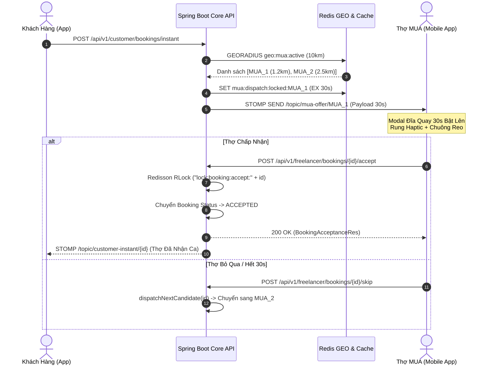

# ĐẶC TẢ TÍNH NĂNG ỨNG DỤNG DI ĐỘNG (MOBILE APP SPECIFICATION)
## Phân hệ: Bàn Làm Việc Thợ, Nhận Đơn Cấp Tốc 30s & Tiến Trình Ca Làm Nghiệm Thu Ảnh
### Vai trò: Thợ Trang Điểm Tự Do (`ROLE_FREELANCE_MUA`) & Nhân Viên Studio (`ROLE_AGENCY_STAFF`)
### Sprint: M-3 / Sprint 6 Backlog | Công nghệ: React Native 0.86 + Expo SDK 57 + Expo Router + TypeScript | Backend: Spring Boot 3.3 Core API (Port 8080)

---

## 📱 1. PHẠM VI & ĐỐI TƯỢNG TRÊN ỨNG DỤNG DI ĐỘNG

* **Phân hệ sử dụng:** Ứng dụng di động **Mobile App (`code/app`)** dành cho 2 nhóm đối tượng tác nghiệp trực tiếp tại hiện trường:
  1. **Thợ Trang Điểm Tự Do (`ROLE_FREELANCE_MUA`):** Sở hữu toàn bộ 3 tính năng (`APP-MUA-01`, `APP-MUA-02`, `APP-MUA-03`). Thợ tự quản lý trạng thái phát sóng GPS, nhận đơn khẩn cấp 30s qua mạng lưới phân phối Waterfall và tự giải ngân quỹ cọc Escrow sau khi hoàn tất ca làm.
  2. **Nhân Viên Studio (`ROLE_AGENCY_STAFF`):** Sử dụng tính năng `APP-MUA-03` để thực hiện ca làm việc do Agency Admin điều phối phân công (`src/app/job-execution/[id].tsx`), chụp ảnh nghiệm thu khuôn mặt khách và ghi nhận chỉ số KPI hoàn thành ca cho Studio.
* *(Ghi chú: Tài khoản `ROLE_SUPER_ADMIN` và `ROLE_AGENCY_ADMIN` không sử dụng app mobile này theo quy chuẩn kiến trúc).*

### 3 Tính Năng Trọng Tâm Của Tài Liệu:
1. **`APP-MUA-01` (Màn hình Bàn Làm Việc Thợ - Workstation Dashboard):**
   - Công tắc Trực tuyến: Gạt bật/tắt trạng thái *Sẵn sàng nhận ca (GPS ON)* / *Tạm nghỉ*.
   - Widget thống kê nhanh trong ngày: Số ca đã hoàn thành, Điểm đánh giá sao uy tín (⭐), Doanh thu/Thu nhập ròng trong ngày.
   - Danh sách các ca hẹn sắp tới trong ngày có thẻ thời gian, thông tin khách, địa chỉ và nút dẫn đường bản đồ (Deep link Goong Maps / Google Maps).
2. **`APP-MUA-02` (Modal Đĩa Quay Đếm Ngược 30s Nhận Ca Cấp Tốc):**
   - Modal bật lên tức thì toàn màn hình khi nhận tin nhắn phân phối đơn khẩn cấp qua WebSocket STOMP (`/topic/mua-offer/{muaId}` hoặc `/topic/booking-broadcast`).
   - Đĩa quay đồng hồ đếm ngược 30 giây (SVG Ring + Reanimated) kèm chuông báo âm thanh và rung xúc giác liên tục (`expo-haptics`).
   - Hiển thị chi tiết đơn khẩn cấp: Gói dịch vụ, tên & địa chỉ khách hàng, khoảng cách (km), số tiền thợ thực nhận (Net Earnings sau trừ phí nền tảng), thời gian cần có mặt.
   - Nút `[Chấp Nhận Nhận Ca]` (gọi API với **Redisson Distributed Lock** chống race-condition) và nút `[Bỏ Qua]` (chuyển thợ kế tiếp qua Sequential Waterfall Dispatch).
3. **`APP-MUA-03` (Tiến Trình Thực Hiện Ca Làm 4 Bước & Nghiệm Thu Ảnh):**
   - Bộ 4 nút chuyển trạng thái làm việc tuần tự:
     * `ON_THE_WAY`: *Bắt đầu di chuyển* (kích hoạt phát sóng GPS Telemetry thời gian thực).
     * `ARRIVED`: *Đã tới nơi* (check-in tại địa chỉ khách hàng, bán kính cho phép).
     * `IN_PROGRESS`: *Bắt đầu trang điểm* (tính giờ làm đẹp chính thức).
     * `COMPLETED`: *Hoàn thành ca* (bắt buộc chụp ảnh nghiệm thu sản phẩm make-up).
   - Modal Camera nghiệm thu (`ProofCameraModal.tsx`): Chụp ảnh cận cảnh khuôn mặt khách hàng sau khi hoàn tất, upload trực tiếp lên Core API qua Multipart Form.
   - Khi hoàn thành thành công: Kích hoạt Spring EventBus `DoubleEntryLedgerService` tự động giải ngân quỹ cọc Escrow vào ví thợ (với Freelancer MUA) hoặc ghi nhận KPI hoàn thành ca (với Agency Staff).

---

## 🛠️ 2. TECH STACK & THƯ VIỆN MOBILE BẮT BUỘC

* **Nền tảng:** React Native 0.86, Expo SDK 57, TypeScript.
* **Điều hướng:** `expo-router` (File-based navigation).
* **Kết nối Realtime STOMP:** `@stomp/stompjs` + `sockjs-client` kết nối Embedded WebSocket Spring Boot (`ws://192.168.0.229:8080/ws-makeup`).
* **Định vị & Bản đồ:**
  - `expo-location`: Lấy tọa độ GPS thiết bị với độ chính xác cao `Accuracy.High` ($\pm 5m$).
  - `react-native-maps` / Goong Static Maps: Hiển thị lộ trình và bản đồ thu nhỏ.
  - Deep Link dẫn đường: `Linking.openURL('https://www.google.com/maps/dir/?api=1&destination=lat,lng')` hoặc Goong Maps.
* **Camera & Xử lý Ảnh:**
  - `expo-camera`: Chụp ảnh nghiệm thu sắc nét, hỗ trợ flash, căn khung oval khuôn mặt.
  - `expo-image-manipulator`: Tự động nén ảnh chuẩn JPEG chất lượng 0.85, resize max chiều rộng 1600px trước khi tải lên.
* **Hiệu ứng & Âm thanh:**
  - `react-native-reanimated` & `react-native-svg`: Vẽ đĩa quay đếm ngược thời gian SVG Circle Stroke mượt mà 60 FPS.
  - `expo-haptics`: Rung giật nhịp tim (Heavy impact) khi chuông đơn khẩn cấp reo và rung phản hồi (Success notification) khi nhận đơn thành công.
  - `expo-av`: Phát âm thanh chuông báo khẩn cấp (`alarm_beep.mp3`) vòng lặp trong 30 giây.
* **State Management:** Zustand (`useAuthStore`, `useWorkstationStore`, `useBookingStore`).
* **Form & Validation:** React Hook Form + Zod Schema (kiểm tra lý do chuyển trạng thái, hợp lệ ảnh nghiệm thu).

---

## 📊 3. CHI TIẾT TÍNH NĂNG 1: BÀN LÀM VIỆC THỢ (`APP-MUA-01`)

### 3.1. Luồng Thao Tác Người Dùng (Mobile User Flow)
1. **Truy cập:** Thợ MUA đăng nhập vào ứng dụng, thanh Bottom Tab Bar hiển thị tab trọng tâm: **Bàn Làm Việc** (`/mua/workstation`).
2. **Khu vực Header & Trạng Thái Hoạt Động (`WorkstationHeader.tsx`):**
   - Avatar thợ MUA, Tên hiển thị, Huy hiệu xác minh tay nghề (Badge Vàng đã xác thực chứng chỉ).
   - **Thanh gạt Switch Trực Tuyến (Online/Offline Toggle):**
     * Trạng thái **TẮT (Nghỉ ngơi - Xám)**: Không gửi tọa độ GPS, không xuất hiện trên Radar tìm kiếm khách hàng, không nhận đơn khẩn cấp.
     * Trạng thái **BẬT (Trực tuyến - Xanh Neon #10B981)**:
       - App kích hoạt `expo-location` lấy tọa độ GPS hiện tại.
       - Gọi API `POST /api/v1/telemetry/availability` gửi `{ isAvailable: true, latitude, longitude }`.
       - Hệ thống tự động ghi nhận vị trí vào Redis GEO key `geo:mua:active` với TTL 5 phút.
       - Mở kênh lắng nghe STOMP `/topic/mua-offer/{muaId}` sẵn sàng hứng đơn cấp tốc.
3. **Widget Chỉ Số Hoạt Động Trong Ngày (Daily Quick Stats):**
   - 3 Thẻ Metric sang trọng phong cách Glassmorphism:
     * 🏁 **Ca Hoàn Thành:** Số đơn đã kết thúc trong ngày (VD: `3 ca`).
     * ⭐ **Đánh Giá:** Điểm trung bình sao uy tín (VD: `4.98 ★` từ 42 lượt review).
     * 💰 **Thu Nhập Tạm Tính:** Tổng tiền ròng nhận được trong ngày (VD: `1.850.000 đ`).
4. **Danh Sách Lịch Hẹn Trong Ngày (Today's Agenda):**
   - Bộ lọc tab nhỏ: *Tất cả* | *Sắp làm* | *Đang làm* | *Đã xong*.
   - Mỗi thẻ lịch hẹn (`TodayBookingCard.tsx`) hiển thị:
     * Khung giờ hẹn (VD: `08:30 - 10:00`).
     * Tên khách hàng + Số điện thoại (Nút gọi điện nhanh 📞).
     * Tên gói dịch vụ (VD: *Make-up Cô Dâu Đãi Tiệc Tối*).
     * Địa chỉ trang điểm tận nơi kèm khoảng cách km từ vị trí thợ hiện tại.
     * Nút bấm hành động nhanh:
       - `[🗺️ Dẫn Đường]`: Mở ứng dụng bản đồ chỉ đường đến nhà khách.
       - `[⚡ Vào Ca Làm]`: Điều hướng trực tiếp sang màn hình Tiến trình 4 bước (`/job-execution/[id]`).

---

## ⚡ 4. CHI TIẾT TÍNH NĂNG 2: MODAL ĐĨA QUAY ĐẾM NGƯỢC 30S NHẬN CA CẤP TỐC (`APP-MUA-02`)

### 4.1. Cơ Chế Phân Phối Thác Nước Tuần Tự (Sequential Waterfall Dispatch)
Khác với mô hình Broadcast tràn lan gây tranh chấp hoặc nghẽn mạng, nền tảng sử dụng thuật toán **Waterfall Dispatch**:
1. Khách hàng bấm đặt đơn khẩn cấp 30-60 phút $\rightarrow$ Backend quét Redis GEO tìm top thợ online trong bán kính 10km.
2. Thợ gần nhất (Candidate 1) được ưu tiên nhận cơ hội trước trong **30 giây**:
   - Backend đẩy tin nhắn STOMP vào kênh riêng `/topic/mua-offer/{targetMuaId}`.
   - Thợ nhận được khóa tạm thời trên Redis (`mua:dispatch:locked:{muaId}`) trong 30 giây để tránh bị đơn khác chen ngang.
3. Nếu Thợ 1 bấm `[Bỏ Qua]` hoặc hết 30 giây không bấm $\rightarrow$ Backend tự động kích hoạt `dispatchNextCandidate()` chuyển cơ hội sang Thợ 2 (gần nhì).



### 4.2. Giao Diện & Trải Nghiệm Modal Toàn Màn Hình (`CountdownAcceptModal.tsx`)
* **Hiệu ứng đánh thức giác quan:**
  - Nền mờ Backdrop màu đen thẫm (`rgba(15, 23, 42, 0.92)`).
  - Vòng tròn đồng hồ SVG viền Rose Ruby chuyển sắc `#E11D48` $\rightarrow$ `#F43F5E` co ngắn dần theo thời gian thực (30s $\rightarrow$ 0s).
  - Con số đếm ngược to bản ở tâm đĩa tròn với hiệu ứng đập nhịp (Pulse animation).
  - Âm thanh chuông báo giục giã lặp lại mỗi 2 giây kết hợp rung xúc giác haptic `Haptics.impactAsync(ImpactFeedbackStyle.Heavy)`.
* **Thông tin hiển thị trên thẻ đơn:**
  - Tiêu đề nổi bật: **⚡ ĐƠN KHẨN CẤP ĐẾN GẦN BẠN**
  - Số tiền thợ thực nhận (Net Earnings): `+ 480.000 đ` (đã trừ 20% hoa hồng nền tảng, màu Emerald Green nổi bật).
  - Khoảng cách di chuyển: `Cách bạn 1.8 km (~6 phút đi xe)`.
  - Tên gói dịch vụ: `Trang Điểm Dự Tiệc Nhanh (Party Glam)`.
  - Địa chỉ đón: `Số 88 Phố Huế, P. Hàng Bài, Q. Hoàn Kiếm, Hà Nội`.
  - Tên khách hàng & Ghi chú (VD: *Khách cần có mặt trước 10h15 để dự hội nghị*).
* **Cụm 2 nút hành động:**
  - Nút **[CHẤP NHẬN NHẬN CA]** (Rộng full ngang, nền gradient Rose Ruby rực rỡ, hiệu ứng rung xác nhận).
  - Nút **[Bỏ Qua Ca Này]** (Màu xám mờ bên dưới, cho phép từ chối lịch sự).

---

## 💄 5. CHI TIẾT TÍNH NĂNG 3: TIẾN TRÌNH CA LÀM 4 BƯỚC & NGHIỆM THU ẢNH (`APP-MUA-03`)

### 5.1. Luồng Máy Trạng Thái Ca Làm Việc (Job Execution State Machine)
Màn hình thực hiện ca làm việc (`src/app/job-execution/[id].tsx`) dùng chung cho cả **Thợ MUA Tự Do** và **Nhân Viên Agency Staff**:

```text
[ACCEPTED / AGENCY_ASSIGNED]
         │
         ▼ (Bước 1: Bấm "Bắt đầu di chuyển")
    [ON_THE_WAY] ──> Tự động kích hoạt Background GPS Telemetry gửi tọa độ mỗi 5s
         │
         ▼ (Bước 2: Bấm "Đã tới nơi")
     [ARRIVED]   ──> Kiểm tra khoảng cách GPS thợ < 200m so với địa chỉ khách
         │
         ▼ (Bước 3: Bấm "Bắt đầu trang điểm")
   [IN_PROGRESS] ──> Đồng hồ đếm giờ làm đẹp bắt đầu chạy
         │
         ▼ (Bước 4: Bấm "Hoàn thành ca")
  [Mở Camera Nghiệm Thu] ──> Chụp ảnh khuôn mặt khách hàng ──> Tải ảnh lên Server
         │
         ▼ (Chuyển trạng thái COMPLETED)
    [COMPLETED]  ──> Kích hoạt Spring Event giải ngân cọc Escrow / Ghi nhận KPI
```

### 5.2. Chi Tiết Từng Bước Hành Động Trên Mobile

#### Bước 1: Bắt đầu di chuyển (`targetStatus: "ON_THE_WAY"`)
- Thợ rời khỏi vị trí ban đầu $\rightarrow$ Bấm nút `[🚀 Bắt Đầu Di Chuyển]`.
- Ứng dụng gọi API `POST /api/v1/bookings/{id}/transition` với `targetStatus = "ON_THE_WAY"`.
- App tự động khởi chạy tác vụ chạy ngầm phát sóng tọa độ GPS (`useGpsTracker`):
  * Cứ mỗi 5-10 giây gửi bản tin `POST /api/v1/telemetry/stream` chứa `{ bookingId, latitude, longitude, heading, speed }`.
  * Khách hàng theo dõi vị trí thợ di chuyển trực tiếp trên bản đồ bám đuổi qua WebSocket `/topic/gps-stream/{bookingId}`.

#### Bước 2: Đã tới nơi (`targetStatus: "ARRIVED"`)
- Khi thợ có mặt tại địa chỉ nhà khách $\rightarrow$ Bấm nút `[📍 Đã Tới Nơi]`.
- Hệ thống so sánh tọa độ hiện tại của thợ với `destinationLatitude, destinationLongitude` của đơn hàng:
  * Nếu hợp lệ: Cập nhật trạng thái `ARRIVED`.
  * Ứng dụng gửi thông báo đẩy (Push Notification) đến điện thoại khách hàng: *"Chuyên viên trang điểm đã có mặt tại cửa nhà bạn!"*.

#### Bước 3: Bắt đầu trang điểm (`targetStatus: "IN_PROGRESS"`)
- Thợ chuẩn bị cốp đồ nghề, bàn giao đổi phong cách và bắt đầu tác nghiệp $\rightarrow$ Bấm nút `[💄 Bắt Đầu Trang Điểm]`.
- Trạng thái chuyển thành `IN_PROGRESS`.
- Màn hình mobile kích hoạt **Đồng hồ đếm giờ thực tế (Live Stopwatch)**:
  * Hiển thị thời gian đã thực hiện (VD: `00:42:15 / Dự kiến 01:30:00`).
  * Thanh tiến trình phần trăm thời gian hoàn thành gói dịch vụ.

#### Bước 4: Nghiệm thu & Chụp ảnh hoàn thành (`ProofCameraModal.tsx`)
- Khi trang điểm xong, thợ bấm nút `[🏁 Hoàn Thành Ca Trang Điểm]`.
- Hệ thống **BẮT BUỘC** mở giao diện **Camera Nghiệm Thu** toàn màn hình:
  * Khung hướng dẫn oval căn chỉnh khuôn mặt khách hàng trong điều kiện ánh sáng tốt.
  * Thợ chụp ảnh khuôn mặt hoàn thiện của khách (góc chính diện hoặc góc nghiêng tôn nét make-up).
  * Cho phép xem lại ảnh (Preview) với 2 nút: `[Chụp Lại]` hoặc `[Xác Nhận Ảnh Này]`.
- **Luồng upload & hoàn tất:**
  1. App gọi API `POST /api/v1/bookings/{id}/completion-photo` dạng Multipart/form-data để upload ảnh lên storage, nhận về `photoUrl`.
  2. App gọi tiếp API `POST /api/v1/bookings/{id}/transition` với payload:
     ```json
     {
       "targetStatus": "COMPLETED",
       "completionPhotoUrl": "https://storage.makeup-platform.com/proofs/proof-bk-1082-1727078400.jpg"
     }
     ```
  3. Backend xác thực ảnh hợp lệ $\rightarrow$ Chuyển trạng thái sang `COMPLETED` $\rightarrow$ Trả về kết quả thành công $\rightarrow$ App hiển thị Modal chúc mừng rực rỡ kèm thông báo số tiền cọc đã được cộng vào Ví.

---

## 📂 6. CẤU TRÚC FILE MÃ NGUỒN MOBILE DỰ KIẾN (`code/app/src/`)

```text
code/app/src/
├── app/
│   ├── mua/
│   │   └── workstation.tsx                   # [APP-MUA-01] Màn hình Bàn Làm Việc Thợ MUA
│   └── job-execution/
│       └── [id].tsx                          # [APP-MUA-03] Màn hình Tiến trình ca làm 4 bước
├── components/
│   └── mua/
│       ├── WorkstationHeader.tsx             # Header: Avatar, Tên, Badge & Switch Trực tuyến
│       ├── WorkstationStatCards.tsx          # 3 Thẻ Metric thống kê ca, đánh giá sao, thu nhập
│       ├── TodayBookingCard.tsx              # Thẻ hiển thị lịch hẹn hôm nay có nút dẫn đường & vào ca
│       ├── CountdownAcceptModal.tsx          # [APP-MUA-02] Modal đĩa quay đếm ngược 30s nhận ca cấp tốc
│       ├── ProofCameraModal.tsx              # [APP-MUA-03] Modal Camera chụp ảnh nghiệm thu khuôn mặt
│       └── JobTimelineStep.tsx               # Thành phần trực quan hóa 4 nấc trạng thái ca làm
├── schemas/
│   └── job-execution.schema.ts               # Zod Schema validate chuyển trạng thái & ảnh nghiệm thu
└── services/
    ├── telemetry.service.ts                  # Axios client gọi API availability, stream GPS, heartbeat
    └── booking-execution.service.ts          # Axios client gọi API accept/skip, transition state, upload photo
```

---

## 🔌 7. BACKEND API CONTRACT & WEBSOCKET TOPICS

### 7.1. Bảng API Endpoints RESTful

| Mã Issue | Thao Tác Nghiệp Vụ | Method | Endpoint REST API | Phân Quyền | Request Body / Param | Response Data & Mã Lỗi |
| :--- | :--- | :---: | :--- | :---: | :--- | :--- |
| **APP-MUA-01** | Bật / Tắt trạng thái GPS nhận ca | `POST` | `/api/v1/telemetry/availability` | `ROLE_FREELANCE_MUA` | `{ "isAvailable": true, "latitude": 21.0285, "longitude": 105.8542, "heading": 0.0, "speed": 0.0 }` | `200 OK`: `{"success": true, "message": "telemetry.status_online"}`<br>Lỗi: `ERR_VALIDATION` |
| **APP-MUA-01** | Lấy thông tin thống kê MUA Profile | `GET` | `/api/v1/muas/my-profile` | `ROLE_FREELANCE_MUA` | Không có (Đọc từ JWT Token) | `200 OK`: `{ "id": 5, "ratingAverage": 4.95, "totalReviews": 38, "completedBookingsCount": 124, "isOnline": true }` |
| **APP-MUA-01** | Lấy danh sách lịch hẹn hôm nay | `GET` | `/api/v1/bookings/my` | `ROLE_FREELANCE_MUA`<br>`ROLE_AGENCY_STAFF` | `?date=2026-09-23` | `200 OK`: `[ { "id": 108, "bookingCode": "BK-20260923-01", "customerName": "Mai Lan", "customerPhone": "0912345678", "status": "ACCEPTED", "startTime": "09:00", "destinationAddress": "..." } ]` |
| **APP-MUA-02** | Chấp nhận nhận ca khẩn cấp (Redlock) | `POST` | `/api/v1/freelancer/bookings/{bookingId}/accept` | `ROLE_FREELANCE_MUA` | Không có | `200 OK`: `BookingAcceptanceRes` `{ "bookingId": 108, "status": "ACCEPTED", "message": "booking.accept_success" }`<br>Lỗi: `ERR_BOOKING_ALREADY_ACCEPTED` (409) nếu thợ khác đã nhận |
| **APP-MUA-02** | Bỏ qua ca khẩn cấp (Next thợ) | `POST` | `/api/v1/freelancer/bookings/{bookingId}/skip` | `ROLE_FREELANCE_MUA` | Không có | `200 OK`: `{ "bookingId": 108, "nextCandidateDispatched": true }` |
| **APP-MUA-03** | Chuyển nấc trạng thái ca làm | `POST` | `/api/v1/bookings/{bookingId}/transition` | `ROLE_FREELANCE_MUA`<br>`ROLE_AGENCY_STAFF` | `{ "targetStatus": "ON_THE_WAY" / "ARRIVED" / "IN_PROGRESS" / "COMPLETED", "reason": "...", "completionPhotoUrl": "..." }` | `200 OK`: `BookingStateTransitionRes`<br>Lỗi: `ERR_INVALID_STATE_TRANSITION`, `ERR_COMPLETION_PHOTO_REQUIRED` (400) |
| **APP-MUA-03** | Tải lên ảnh nghiệm thu sản phẩm | `POST` | `/api/v1/bookings/{bookingId}/completion-photo` | `ROLE_FREELANCE_MUA`<br>`ROLE_AGENCY_STAFF` | `MultipartFile file` (image/jpeg, max 10MB) | `200 OK`: `BookingCompletionPhotoRes` `{ "bookingId": 108, "photoUrl": "https://storage.makeup-platform.com/proofs/..." }` |
| **APP-MUA-03** | Stream tọa độ GPS thợ khi di chuyển | `POST` | `/api/v1/telemetry/stream` | `ROLE_FREELANCE_MUA`<br>`ROLE_AGENCY_STAFF` | `{ "bookingId": 108, "latitude": 21.0285, "longitude": 105.8542, "heading": 90.0, "speed": 25.5 }` | `200 OK`: `LiveTrackingRes` `{ "etaMinutes": 8, "remainingDistanceKm": 2.1 }` |

---

### 7.2. WebSocket STOMP Channels & Payloads

1. **Kênh nhận thông báo đơn khẩn cấp riêng cho Thợ MUA:**
   - **Topic:** `/topic/mua-offer/{muaId}` (hoặc topic broadcast chung `/topic/booking-broadcast`).
   - **Payload tin nhắn nhận được (JSON):**
     ```json
     {
       "type": "INSTANT_BOOKING_OFFER",
       "bookingId": 108,
       "bookingCode": "BK-FAST-839210",
       "targetMuaId": 5,
       "targetUserId": 14,
       "candidateIndex": 1,
       "totalCandidates": 3,
       "customerName": "Trần Thu Hà",
       "customerPhone": "0987654321",
       "customerAddress": "Số 21 Phố Huế, P. Hàng Bài, Q. Hoàn Kiếm, Hà Nội",
       "latitude": 21.0189,
       "longitude": 105.8512,
       "serviceName": "Trang Điểm Khẩn Cấp Dự Tiệc Tối",
       "earningsAmount": 480000.00,
       "totalAmount": 600000.00,
       "countdownSeconds": 30,
       "timestamp": 1727076000000
     }
     ```
2. **Kênh phát sóng GPS bám đuổi của đơn hàng:**
   - **Topic:** `/topic/gps-stream/{bookingId}`
   - **Payload phát sóng định kỳ mỗi 5s:**
     ```json
     {
       "bookingId": 108,
       "muaId": 5,
       "latitude": 21.0234,
       "longitude": 105.8528,
       "heading": 135.0,
       "speed": 32.0,
       "etaMinutes": 7,
       "recordedAt": "2026-09-23T14:15:30Z"
     }
     ```

---

## 🛡️ 8. QUY TẮC RÀNG BUỘC NGHIỆP VỤ & ACCEPTANCE CRITERIA (GHERKIN)

### 8.1. Acceptance Criteria: Bật/Tắt Trạng Thái Nhận Ca (`APP-MUA-01`)
* **Kịch bản 1: Thợ gạt công tắc chuyển sang Trực Tuyến thành công**
  - **Given:** Thợ MUA đã đăng nhập, tài khoản đã được Super Admin phê duyệt chứng chỉ tay nghề (`isVerified = true`).
  - **When:** Thợ gạt Switch "Trực Tuyến" sang trạng thái BẬT.
  - **Then:** Ứng dụng xin quyền GPS (nếu chưa cấp), lấy tọa độ tức thời và gọi API `/api/v1/telemetry/availability` với `isAvailable = true`.
  - **And:** Switch hiển thị màu xanh lá `#10B981`, có âm báo haptic rung nhẹ, hiển thị thông báo: *"Bạn đang trực tuyến và sẵn sàng nhận ca!"*.

* **Kịch bản 2: Chặn bật trực tuyến khi thợ chưa được xác minh tay nghề**
  - **Given:** Thợ MUA mới tạo tài khoản, chưa tải chứng chỉ bằng cấp hoặc chứng chỉ đang ở trạng thái `PENDING`.
  - **When:** Thợ gạt Switch "Trực Tuyến".
  - **Then:** Công tắc tự động nảy về trạng thái TẮT.
  - **And:** Bật thông báo Toast cảnh báo lỗi từ Backend: *"Bạn cần hoàn thiện hồ sơ và được xác thực chứng chỉ tay nghề trước khi nhận ca khẩn cấp"*.

---

### 8.2. Acceptance Criteria: Modal Đĩa Quay 30s Nhận Ca Cấp Tốc (`APP-MUA-02`)
* **Kịch bản 1: Thợ chấp nhận ca kịp thời trước khi hết 30 giây**
  - **Given:** Thợ đang ở trạng thái Trực Tuyến và nhận được tin nhắn STOMP đơn khẩn cấp.
  - **When:** Modal đếm ngược bật lên và thợ bấm nút `[CHẤP NHẬN NHẬN CA]` tại giây thứ 18.
  - **Then:** App dừng phát âm thanh chuông báo, vô hiệu hóa nút bấm và gọi `POST /api/v1/freelancer/bookings/{id}/accept`.
  - **And:** Khi Backend trả về `200 OK`, Modal đếm ngược đóng lại, rung chuông Haptic thành công và tự động điều hướng sang màn hình Chi Tiết Ca Làm (`/job-execution/{id}`).

* **Kịch bản 2: Bị thợ khác nhận trước do tranh chấp (Race Condition)**
  - **Given:** Đơn hàng được broadcast hoặc khóa tạm thời vừa hết hạn 30s.
  - **When:** Thợ bấm `[CHẤP NHẬN NHẬN CA]` nhưng thợ khác đã chiếm Redlock thành công trước vài mili-giây.
  - **Then:** Backend trả về mã lỗi `ERR_BOOKING_ALREADY_ACCEPTED` (HTTP 409).
  - **And:** App đóng modal và hiển thị Toast màu hổ phách: *"Rất tiếc! Ca làm này đã được một thợ khác tiếp nhận nhanh hơn"*.

* **Kịch bản 3: Thợ bấm Bỏ qua hoặc đồng hồ đếm về 0**
  - **Given:** Modal đếm ngược đang hiển thị.
  - **When:** Thợ bấm `[Bỏ Qua Ca Này]` hoặc đồng hồ đếm lùi về `0s`.
  - **Then:** Modal tự động đóng lại, app gọi `POST /api/v1/freelancer/bookings/{id}/skip` để Backend nhả khóa và chuyển đơn cho thợ tiếp theo.

---

### 8.3. Acceptance Criteria: Tiến Trình Ca Làm & Nghiệm Thu Ảnh (`APP-MUA-03`)
* **Kịch bản 1: Hoàn thành tuần tự 4 bước và chụp ảnh nghiệm thu hợp lệ**
  - **Given:** Thợ đang ở màn hình `/job-execution/{id}` của đơn hàng đang thực hiện.
  - **When:** Thợ lần lượt bấm:
    1. `[Bắt Đầu Di Chuyển]` $\rightarrow$ Trạng thái chuyển `ON_THE_WAY`.
    2. `[Đã Tới Nơi]` $\rightarrow$ Trạng thái chuyển `ARRIVED`.
    3. `[Bắt Đầu Trang Điểm]` $\rightarrow$ Trạng thái chuyển `IN_PROGRESS`.
    4. `[Hoàn Thành Ca]` $\rightarrow$ Mở Camera chụp ảnh khuôn mặt khách $\rightarrow$ Bấm `[Xác Nhận Ảnh]`.
  - **Then:** Hệ thống upload ảnh lên `/api/v1/bookings/{id}/completion-photo` và chuyển trạng thái đơn sang `COMPLETED`.
  - **And:** Màn hình chúc mừng xuất hiện: *"Chúc mừng bạn đã hoàn thành xuất sắc ca trang điểm!"*, số dư ví hiển thị tiền cọc đã được giải ngân.

* **Kịch bản 2: Chặn hoàn thành ca nếu chưa có ảnh nghiệm thu**
  - **Given:** Đơn hàng đang ở trạng thái `IN_PROGRESS`.
  - **When:** Thợ cố tình gửi yêu cầu `transition` sang `COMPLETED` mà không đính kèm `completionPhotoUrl`.
  - **Then:** Backend chặn lại với lỗi `ERR_COMPLETION_PHOTO_REQUIRED` (HTTP 400).
  - **And:** Frontend hiển thị cảnh báo đỏ bắt buộc: *"Ảnh chụp nghiệm thu khuôn mặt khách hàng là bắt buộc để hoàn tất ca làm và giải ngân thanh toán"*.
