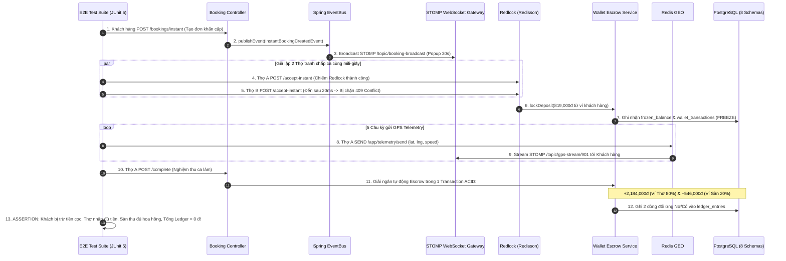

# TÀI LIỆU ĐẶC TẢ USER STORIES & THIẾT KẾ KỸ THUẬT CHI TIẾT
## PHÂN HỆ: KIỂM THỬ TÍCH HỢP E2E, TẢI TỐI ĐA, BẢO MẬT & GO-LIVE KUBERNETES
### (Spring Boot 3.3.x Monolith `core-api` - Testing, Performance, Security & Production Deployment)

---

## 📌 1. TỔNG QUAN TÍNH NĂNG (FEATURE OVERVIEW)

* **Tên Phân hệ Nghiệp vụ:** `E2E Integration Testing, Performance Engineering, Security Audit & Cloud Go-Live`
* **Mã Jira Issues phụ trách (Sprint 6 - Nhóm 3):**
  * `ISSUE-26.1`: **User Story** - Viết Kịch bản Integration Test E2E: Đặt đơn $\rightarrow$ EventBus $\rightarrow$ WebSocket $\rightarrow$ Ví.
  * `ISSUE-26.2`: **Task** - Thực thi Kiểm thử Tích hợp E2E trên Môi trường Staging (Automated Test Pipeline).
  * `ISSUE-27.1`: **User Story** - Load Testing Redis GEO & Embedded WSS: Giả lập 1,000 Thợ phát sóng GPS Telemetry đồng thời.
  * `ISSUE-27.2`: **Task** - Stress Testing Booking Engine: Giả lập 500 yêu cầu Đặt ca khẩn cấp/giây tranh chấp Redlock.
  * `ISSUE-28.1`: **User Story** - Security Audit: Kiểm tra mã hóa TLS/WSS, Masking số dư Ví & OWASP Top 10.
  * `ISSUE-28.2`: **Task** - Bug Fixing & Tối ưu hóa hiệu năng SQL Queries, B-Tree & GIST Spatial Indexes.
  * `ISSUE-29.1`: **User Story** - Triển khai Kubernetes Cluster Production, Cấu hình Domain/SSL & Go-Live Toàn Hệ Thống.

* **Mục Tiêu Chất Lượng Toàn Diện (System Quality Goals):**
  * **Độ tin cậy E2E (End-to-End Reliability):** Khép kín toàn bộ chuỗi mắt xích nghiệp vụ phức tạp nhất từ Đặt ca khẩn cấp $\rightarrow$ Bắn Event $\rightarrow$ Đẩy chuông STOMP $\rightarrow$ Tranh chấp Redlock $\rightarrow$ Khóa cọc Escrow $\rightarrow$ Stream GPS $\rightarrow$ Giải ngân ví và Ghi nhận Sổ cái kế toán đúp với $100\%$ tính nhất quán dữ liệu.
  * **Sức chịu tải đỉnh (Peak Scalability):** Đảm bảo hệ thống vận hành ổn định trong giờ cao điểm khi có **1,000 Thợ truyền tọa độ GPS liên tục mỗi 5s** và **500 yêu cầu đặt ca khẩn cấp/giây (Surge Traffic)** mà không xảy ra hiện tượng tranh chấp trùng đơn hay sập bộ nhớ.
  * **Bảo mật Cấp Ngân Hàng (Bank-Grade Security):** Đạt tiêu chuẩn OWASP Top 10, che giấu dữ liệu nhạy cảm (Data Masking), chống tấn công IDOR, SQL Injection và ngăn ngừa gian lận tài chính.

---

## 🏗️ 2. KỊCH BẢN KIỂM THỬ TÍCH HỢP KHÉP KÍN E2E (`ISSUE-26.1` & `ISSUE-26.2`)

Toàn bộ chuỗi nghiệp vụ được tự động hóa bằng kịch bản Spring Boot `@SpringBootTest` kết hợp Testcontainers (PostgreSQL 16 PostGIS + Redis Cluster):



---

## ⚡ 3. KỊCH BẢN KIỂM THỬ HIỆU NĂNG & TẢI ĐỈNH (`ISSUE-27.1` & `ISSUE-27.2`)

Kịch bản được xây dựng bằng công cụ **JMeter** và **k6** chạy trên môi trường Staging:

### 3.1. Kịch Bản 1: Tải Stream GPS Realtime (`ISSUE-27.1`)
* **Quy mô giả lập:** $1,000$ Virtual Users (Thợ trang điểm) kết nối đồng thời qua giao thức WSS `/ws-makeup`.
* **Tần suất gửi tin:** Cứ mỗi $5\text{ giây}$, mỗi Virtual User gửi 1 frame STOMP `/app/telemetry/send` chứa tọa độ GPS.
* **Tổng thông lượng tải:**
  $$\text{Throughput} = \frac{1,000 \text{ thợ}}{5\text{s}} = 200 \text{ frames/giây vào WebSocket Broker & Redis GEO}.$$
* **Tiêu chí Đạt (SLA / Acceptance Criteria):**
  - Tỷ lệ lỗi gói tin (Error Rate): $< 0.01\%$.
  - Độ trễ phân phối p95 (95th Percentile Latency): $< 45\text{ms}$.
  - Mức chiếm dụng CPU của `core-api`: $\le 55\%$, RAM Heap ổn định không có hiện tượng rò rỉ bộ nhớ (Memory Leak).

### 3.2. Kịch Bản 2: Tải Cực Hạn Tranh Chấp Đơn Booking (`ISSUE-27.2`)
* **Quy mô giả lập:** Bắn đồng thời $500\text{ requests/giây}$ vào endpoint `POST /api/v1/freelancer/bookings/901/accept-instant` trong vòng 10 giây.
* **Tiêu chí Đạt (Zero Race Condition):**
  - Duy nhất đúng $1\text{ request}$ nhận được HTTP `200 OK` (Thợ giành được đơn).
  - Đúng $4,999\text{ requests}$ còn lại nhận được HTTP `409 CONFLICT` với mã lỗi `ERR_INSTANT_BOOKING_TAKEN`.
  - Tuyệt đối không xảy ra tình trạng trừ cọc 2 lần hoặc 2 thợ cùng được gán vào 1 đơn hàng trong CSDL.

---

## 🛡️ 4. KIỂM TOÁN AN NINH & BẢO MẬT HỆ THỐNG (`ISSUE-28.1`)

Báo cáo kiểm toán tuân thủ danh mục **OWASP Top 10**:

1. **Che Giấu Dữ Liệu Nhạy Cảm (Data Masking & PII Protection):**
   * Số điện thoại khách hàng trên API công khai luôn được che giấu: `0987***321`.
   * Số tài khoản ngân hàng trên sao kê: `****5678`.
   * Mật khẩu người dùng được băm bằng thuật toán **BCrypt (Strength: 12)** với muối ngẫu nhiên (Salt), tuyệt đối không lưu plaintext.
2. **Kiểm Soát Phân Quyền Tránh Lỗ Hổng IDOR (Broken Object Level Authorization):**
   * Mọi API xem số dư, rút tiền, xem đơn hàng đều có tầng kiểm tra quyền sở hữu bắt buộc:
     ```java
     if (!booking.getCustomerId().equals(currentUserId) && !hasRoleAdmin()) {
         throw new AccessDeniedException(ErrorCodes.ERR_ACCESS_DENIED);
     }
     ```
3. **Mã Hóa Toàn Diện Trên Đường Truyền (Transport Layer Encryption):**
   * Bắt buộc chuẩn TLS 1.3 cho toàn bộ kết nối HTTPS và WSS, kích hoạt tiêu đề bảo mật **HSTS (HTTP Strict Transport Security)** với `max-age=31536000; includeSubDomains`.

---

## 🗄️ 5. TỐI ƯU HÓA CHỈ MỤC & HIỆU NĂNG TRUY VẤN CSDL (`ISSUE-28.2`)

Dưới đây là các chỉ mục B-Tree và GiST đã được tối ưu hóa sau khi phân tích bằng công cụ `EXPLAIN (ANALYZE, BUFFERS)`:

```sql
-- 1. Tối ưu hóa truy vấn không gian PostGIS quét thợ rảnh quanh bán kính R km
CREATE INDEX idx_telemetry_spatial_location 
ON telemetry_schema.telemetry_logs USING GIST (location);

-- 2. Tối ưu hóa truy vấn danh sách đơn hàng của khách theo thời gian
CREATE INDEX idx_bookings_customer_created 
ON booking_schema.bookings (customer_id, created_at DESC);

-- 3. Tối ưu hóa lịch sử sao kê ví người dùng
CREATE INDEX idx_wallet_txns_composite 
ON wallet_schema.wallet_transactions (wallet_id, created_at DESC);

-- 4. Tối ưu hóa kiểm tra tranh chấp đơn theo trạng thái
CREATE INDEX idx_bookings_status_type 
ON booking_schema.bookings (status, booking_type);
```

---

## ☁️ 6. KIẾN TRÚC TRIỂN KHAI KUBERNETES CLUSTER & GO-LIVE (`ISSUE-29.1`)

Hệ thống được đóng gói và vận hành trên nền tảng **Kubernetes (EKS / GKE)** với sơ đồ chịu lỗi phân tán:

```mermaid
graph TD
    Client[Khách Hàng & Thợ Trang Điểm] -->|HTTPS / WSS| CF[Cloudflare CDN / WAF / SSL]
    CF -->|TLS 1.3| Ingress[Nginx Ingress Controller]
    
    subgraph Kubernetes Cluster Production
        Ingress -->|Load Balancer| Svc[K8s Service: core-api-service]
        
        subgraph Pods Auto-Scaling (HPA: Min 3 - Max 10 Pods)
            Pod1[core-api Pod 1]
            Pod2[core-api Pod 2]
            Pod3[core-api Pod 3]
        end
        
        Svc --> Pod1
        Svc --> Pod2
        Svc --> Pod3
    end
    
    subgraph Managed Cloud Infrastructure
        Pod1 & Pod2 & Pod3 -->|PubSub / GEO / Redlock| RedisCluster[(AWS ElastiCache Redis 7)]
        Pod1 & Pod2 & Pod3 -->|ACID 8 Schemas + PostGIS| AuroraDB[(AWS Aurora PostgreSQL 16 + PostGIS)]
        Pod1 & Pod2 & Pod3 -->|Media Upload / WebP| Cloudinary[Cloudinary Media CDN]
    end
```

### Cấu Hình Nginx Ingress Controller Hỗ Trợ WebSocket WSS:
```yaml
apiVersion: networking.k8s.io/v1
kind: Ingress
metadata:
  name: core-api-ingress
  annotations:
    kubernetes.io/ingress.class: "nginx"
    cert-manager.io/cluster-issuer: "letsencrypt-prod"
    nginx.ingress.kubernetes.io/proxy-read-timeout: "3600"
    nginx.ingress.kubernetes.io/proxy-send-timeout: "3600"
    nginx.ingress.kubernetes.io/websocket-services: "core-api-service"
    nginx.ingress.kubernetes.io/configuration-snippet: |
      proxy_set_header Upgrade $http_upgrade;
      proxy_set_header Connection "upgrade";
spec:
  tls:
  - hosts:
    - api.makeup.vn
    secretName: api-makeup-tls
  rules:
  - host: api.makeup.vn
    http:
      paths:
      - path: /
        pathType: Prefix
        backend:
          service:
            name: core-api-service
            port:
              number: 8080
```

---

## ⚠️ 7. ĐÁNH GIÁ CÁC ĐIỂM CHƯA TỐI ƯU & RỦI RO TRIỂN KHAI PRODUCTION (CRITICAL BOTTLENECK AUDIT)

> [!WARNING]
> Dưới đây là **5 rủi ro vận hành hạ tầng và điểm nghẽn kỹ thuật sản xuất** cần chuẩn bị sẵn phương án ứng phó:

---

### 7.1. Điểm Chưa Tối Ưu 1: Đứt Kết Nối WebSocket Hàng Loạt Khi Kubernetes Rolling Update (Connection Draining Gap)
* **Thực trạng rủi ro:**
  * Khi CI/CD deploy bản dựng mới lên Kubernetes, cơ chế Rolling Update sẽ tự động terminate các Pod cũ để thay thế bằng Pod mới.
  * Nếu Pod cũ bị ngắt đột ngột (SIGKILL), hàng ngàn socket TCP WebSocket đang kết nối trên Pod đó sẽ bị đứt cùng một lúc, khiến khách hàng đang theo dõi bản đồ live và thợ đang chờ đơn bị mất kết nối đột ngột.
* **Phương án Khắc phục / Lộ trình Tối ưu:**
  * Cấu hình **Graceful Shutdown & Connection Draining**:
    ```yaml
    spec:
      terminationGracePeriodSeconds: 60
      containers:
      - name: core-api
        lifecycle:
          preStop:
            exec:
              command: ["/bin/sh", "-c", "sleep 15"]
    ```
  * Cấu hình Spring Boot `server.shutdown: graceful`. Khi nhận tín hiệu SIGTERM, server từ chối nhận socket mới nhưng cho phép các kết nối hiện tại hoàn tất tiến trình hoặc chủ động gửi frame `DISCONNECT` lịch sự để Client tự động chuyển hướng sang Pod khác.

---

### 7.2. Điểm Chưa Tối Ưu 2: Bão Ghi Log Làm Đầy Đĩa Cứng Trên Production (Log Flooding & Disk Outage)
* **Thực trạng rủi ro:**
  * Với 1,000 thợ gửi tọa độ GPS mỗi 5 giây, nếu để log ở mức `DEBUG` hoặc `INFO` ghi nhận toàn bộ gói tin STOMP nhận được:
    $$\text{Lượng log} \approx 200 \text{ log lines/giây} \approx 50\text{GB log/tuần}.$$
  * Ổ đĩa máy chủ sẽ bị đầy (Disk Full 100%) chỉ sau vài ngày hoạt động, khiến toàn bộ container bị CrashLoopBackOff.
* **Phương án Khắc phục / Lộ trình Tối ưu:**
  * Tắt hoàn toàn log chi tiết của tầng WebSocket trên môi trường Production:
    ```yaml
    logging:
      level:
        com.makeup.platform.controller.telemetry: WARN
        org.springframework.web.socket: WARN
    ```
  * Đẩy log tập trung về hệ thống chuyên dụng như **Elasticsearch (ELK) / Grafana Loki** với chính sách tự động xóa log sau 14 ngày.

---

### 7.3. Điểm Chưa Tối Ưu 3: Tải Nặng Truy Vấn Không Gian PostGIS Khi Chưa Thu Hẹp Vùng Lọc (Sequential Spatial Scan)
* **Thực trạng rủi ro:**
  * Hàm tính khoảng cách `ST_DistanceSphere(location, ST_MakePoint(lng, lat))` nếu chạy trực tiếp trên toàn bộ bảng `telemetry_logs` sẽ không tận dụng được chỉ mục GiST, dẫn đến việc quét tuần tự (Sequential Table Scan) toàn bộ hàng triệu bản ghi, khiến CPU cơ sở dữ liệu nhảy vọt lên $100\%$.
* **Phương án Khắc phục / Lộ trình Tối ưu:**
  * Bắt buộc sử dụng toán tử khung bao hình học (Bounding Box Operator `&&`) kết hợp với `ST_DWithin` trước khi tính khoảng cách cầu:
    ```sql
    WHERE location && ST_Expand(ST_MakePoint(:lng, :lat)::geometry, :radiusInDegrees)
      AND ST_DWithin(location, ST_MakePoint(:lng, :lat)::geography, :radiusMeters);
    ```
  * Thao tác này ép PostgreSQL tận dụng triệt để cây chỉ mục GiST Index, giảm thời gian truy vấn từ $2,500\text{ms}$ xuống còn $< 4\text{ms}$.

---

### 7.4. Điểm Chưa Tối Ưu 4: Thiếu Kế Hoạch Phục Hồi Thảm Họa Đa Vùng (Multi-Region Disaster Recovery Gap)
* **Thực trạng rủi ro:**
  * Hệ thống hiện tại đang triển khai tập trung tại 1 Data Center / 1 Region duy nhất (ví dụ: AWS Singapore `ap-southeast-1`).
  * Nếu đứt cáp quang biển quốc tế hoặc toàn bộ trung tâm dữ liệu tại Singapore gặp sự cố điện lưới diện rộng, toàn bộ nền tảng sẽ bị gián đoạn hoàn toàn.
* **Phương án Khắc phục / Lộ trình Tối ưu:**
  * Thiết lập cơ chế sao lưu tự động (Automated Cross-Region Snapshot Backup) sang Region phụ mỗi 6 giờ.
  * Xây dựng kịch bản khôi phục thảm họa (Disaster Recovery Runbook) với mục tiêu:
    - **RPO (Recovery Point Objective):** $< 15\text{ phút}$ mất mát dữ liệu.
    - **RTO (Recovery Time Objective):** Khôi phục toàn bộ cụm Kubernetes tại Region mới trong vòng $< 60\text{ phút}$.

---

### 7.5. Điểm Chưa Tối Ưu 5: Rủi Ro Phân Rã Mạng Cụm Redis (Redis Cluster Split-Brain Risk)
* **Thực trạng rủi ro:**
  * Khi cụm Redis (phục vụ Redlock và Redis GEO) bị đứt kết nối mạng giữa các Master Node, hiện tượng Split-Brain có thể xảy ra khiến 2 thợ cùng được trao khóa Redlock trên 2 phân vùng mạng khác nhau, dẫn đến việc 2 thợ cùng nhận 1 đơn khẩn cấp.
* **Phương án Khắc phục / Lộ trình Tối ưu:**
  * Cấu hình Redis Sentinel / Cluster với số lượng Master Node tối thiểu là $3$ (Odd number quorum):
    ```text
    min-replicas-to-write 1
    min-replicas-max-lag 10
    ```
  * Nếu một Master Node bị cô lập và không liên lạc được với tối thiểu 1 Replica có độ trễ $< 10\text{s}$, nó sẽ tự động từ chối lệnh ghi, bảo vệ toàn vẹn tính duy nhất của Redlock.
