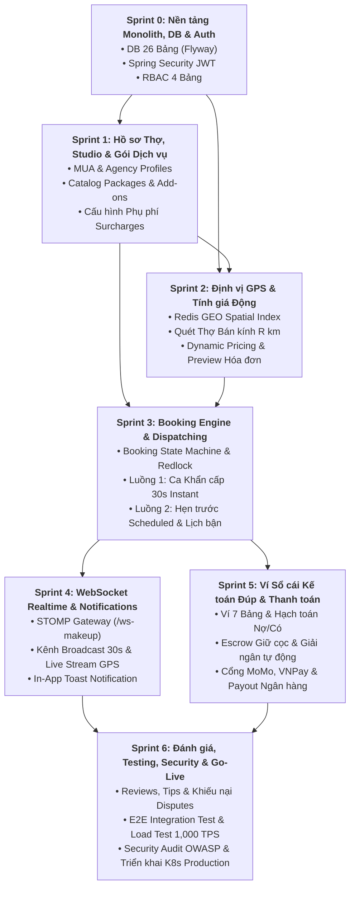

# BẢNG PHÂN RÃ CÔNG VIỆC CHI TIẾT & MA TRẬN PHỤ THUỘC TÍNH NĂNG
## (GRANULAR JIRA WBS & FEATURE DEPENDENCY MATRIX - 84 ISSUES / 7 SPRINTS)

> 💡 **Quy tắc Ưu tiên & Quản lý Phụ thuộc (Dependency & Critical Path Rule):**
> 1. **Wave 1 (Nền tảng / Blockers):** Phải được phát triển và kiểm thử trước tiên vì là tiền điều kiện tiên quyết cho các task tiếp theo.
> 2. **Wave 2 (Nghiệp vụ Trung gian / Business Processing):** Phụ thuộc vào dữ liệu/API của Wave 1.
> 3. **Wave 3 (Tích hợp & Khách hàng / End-to-End Delivery):** Chỉ triển khai sau khi Wave 1 và Wave 2 đã hoạt động ổn định.

---

## 🗺️ MA TRẬN PHỤ THUỘC TỔNG THỂ GIỮA CÁC SPRINT (CROSS-SPRINT FLOW)

---

## 📌 SPRINT 0: KHỞI TẠO DỰ ÁN LAYERED MONOLITH (CORE-API), DB & AUTH MODULE (13 ISSUES)

### Bảng Phân rã Issues & Tiền điều kiện:

| Mã Issue | Loại Issue | Tên Tính năng / Task Kỹ thuật | Tiền điều kiện (Depends On) | Trạng thái | Hạn chót | Ưu tiên | Phụ trách |
| :--- | :--- | :--- | :--- | :--- | :--- | :--- | :--- |
| **ISSUE-6** | Task | Khởi tạo Git Repository và cấu trúc thư mục Layered Monolith | *Không (Gốc dự án)* | Done | 8/9/2026 | Medium | DE, SA |
| **ISSUE-4** | User Story | Tạo cấu trúc thư mục dự án tổng quan | `ISSUE-6` | Done | 8/9/2026 | High | DE, SA |
| **ISSUE-1** | User Story | Phân tích và tạo tài liệu đặc tả SRS cho phân hệ ADMIN | `ISSUE-4` | Done | 8/9/2026 | High | SA, BE1 |
| **ISSUE-8.1** | Task | Cấu hình Docker Compose cho PostgreSQL 16 & PostGIS Extension | `ISSUE-6` | In Progress | 9/9/2026 | Medium | DE |
| **ISSUE-8.2** | Task | Cấu hình Docker Compose cho Redis GEO Cluster & Cache | `ISSUE-6` | In Progress | 9/9/2026 | Medium | DE |
| **ISSUE-8.4** | Task | Viết Script DDL Migration 26 Bảng (RBAC 4 Bảng, Ví 7 Bảng) | `ISSUE-8.1` | In Progress | 9/9/2026 | High | BE1, DE |
| **ISSUE-3** | User Story | Tạo file User Story cho hệ thống mua-makeup | `ISSUE-1` | To Do | 9/9/2026 | High | SA, QA |
| **ISSUE-5** | User Story | Bổ sung file đặc tả cấu trúc hoàn chỉnh, Skills, Rules & Workflows | `ISSUE-4`, `ISSUE-3` | In Review | 9/9/2026 | High | SA |
| **ISSUE-9.1** | User Story | Monolith Core Application - Khởi tạo Spring Boot App (:8080) | `ISSUE-6`, `ISSUE-8.1`, `ISSUE-8.4` | To Do | - | Medium | BE1, SA |
| **ISSUE-8.3** | Task | Cấu hình Spring In-Memory EventBus (`ApplicationEventPublisher`) | `ISSUE-9.1` | In Progress | 9/9/2026 | Medium | DE |
| **ISSUE-9.2** | Task | Spring Security & JWT Filter Middleware trong Single App | `ISSUE-9.1` | To Do | - | Medium | BE1 |
| **ISSUE-10.1** | User Story | Auth & Profile Module - API Đăng ký / Login OTP & OAuth2 3 Phân hệ | `ISSUE-9.2`, `ISSUE-8.4` | To Do | - | Medium | BE1, FE1 |
| **ISSUE-10.2** | Task | Auth & Profile Module - Tích hợp Phân quyền RBAC 4 Bảng | `ISSUE-10.1` | To Do | - | Medium | BE1 |

### 🎯 Trình tự Thực hiện Ưu tiên trong Sprint 0:
* **Wave 1 (Hạ tầng DB & Docker):** `ISSUE-6` $\rightarrow$ `ISSUE-8.1`, `ISSUE-8.2` $\rightarrow$ `ISSUE-8.4` *(Phải có DB Schema trước khi viết code).*
* **Wave 2 (Spring Boot Monolith Core):** `ISSUE-9.1` $\rightarrow$ `ISSUE-8.3`, `ISSUE-9.2` *(Tạo khung app và middleware bảo mật JWT).*
* **Wave 3 (Nghiệp vụ Đăng nhập & Phân quyền):** `ISSUE-10.1` $\rightarrow$ `ISSUE-10.2` *(Có Auth Login mới cấp token JWT làm việc cho Sprint 1).*

---

## 📌 SPRINT 1: HỒ SƠ THỢ, STUDIO/ĐẠI LÝ & DANH MỤC GÓI DỊCH VỤ (13 ISSUES)

<<<<<<< Updated upstream
### Bảng Phân rã Issues & Tiền điều kiện:

| Mã Issue | Loại Issue | Tên Tính năng / Task Kỹ thuật | Tiền điều kiện (Depends On) | Trạng thái | Hạn chót | Ưu tiên | Phụ trách |
| :--- | :--- | :--- | :--- | :--- | :--- | :--- | :--- |
| **ISSUE-11.1** | User Story | Hồ sơ Thợ Make-up (`mua_profiles`), Bio & Chứng chỉ | `ISSUE-10.1` (Tài khoản MUA) | To Do | - | Medium | BE2, FE2 |
| **ISSUE-11.2** | Task | Upload CDN (Cloudinary/S3) nén ảnh Portfolio chất lượng cao | `ISSUE-11.1` | To Do | - | Medium | BE2, FE2 |
| **ISSUE-11.3** | Task | Quản lý Album Ảnh sản phẩm hoàn thiện (`staff_portfolio_showcases`) | `ISSUE-11.2` | To Do | - | High | BE2, FE2 |
| **ISSUE-12.1** | User Story | Quản lý Studio / Đại lý (`agency_profiles`), Hotline & Mã QR mời thợ | `ISSUE-10.1` (Tài khoản Agency) | To Do | - | Medium | BE1, FE3 |
| **ISSUE-12.2** | Task | Quản lý Nhân viên Studio (`agency_staff`) & Duyệt thợ gia nhập | `ISSUE-12.1`, `ISSUE-11.1` | To Do | - | Medium | BE1, FE3 |
| **ISSUE-12.3** | Task | Cấu hình % Hoa hồng nội bộ giữa Studio và Thợ làm việc | `ISSUE-12.2` | To Do | - | Medium | BE1, FE3 |
| **ISSUE-13.1** | User Story | CRUD Master Categories & Tone Make-up chuẩn sàn (`makeup_styles`) | `ISSUE-9.1`, `ISSUE-8.4` | To Do | - | Medium | BE2, FE1 |
| **ISSUE-12.4** | Task | Quản lý Năng lực thợ Studio theo Tone Make-up (`agency_staff_styles`) | `ISSUE-12.2`, `ISSUE-13.1` | To Do | - | High | BE2 |
| **ISSUE-13.2** | Task | CRUD Gói dịch vụ Studio/Freelancer (`service_packages`) | `ISSUE-13.1`, `ISSUE-11.1` hoặc `12.1` | To Do | - | Medium | BE2, FE1 |
| **ISSUE-13.3** | Task | Chi tiết các bước thực hiện mặc định & Option mua thêm (`package_items`) | `ISSUE-13.2` | To Do | - | Medium | BE2, FE1 |
| **ISSUE-13.4** | Task | Gán Kỹ năng Gói Dịch vụ cho thợ Studio (`agency_staff_services`) | `ISSUE-13.2`, `ISSUE-12.2` | To Do | - | Medium | BE2, FE3 |
| **ISSUE-13.5** | Task | Cấu hình Phụ phí (`surcharges`): Làm sớm 3h-5h sáng, đi tỉnh & Lễ/Tết | `ISSUE-11.1` hoặc `ISSUE-12.1` | To Do | - | Medium | BE2, FE1 |

### 🎯 Trình tự Thực hiện Ưu tiên trong Sprint 1:
* **Wave 1 (Khởi tạo Danh mục sàn & Hồ sơ gốc):** `ISSUE-13.1` (Master Taxonomy) song song với `ISSUE-11.1` (MUA Profile) và `ISSUE-12.1` (Agency Profile).
* **Wave 2 (Gói Dịch vụ & Tuyển thợ Studio):**
  * `ISSUE-13.2` (Gói Dịch vụ) $\rightarrow$ `ISSUE-13.3` (Add-ons) & `ISSUE-13.5` (Cấu hình Phụ phí).
  * `ISSUE-12.1` $\rightarrow$ `ISSUE-12.2` (Duyệt Thợ) $\rightarrow$ `ISSUE-12.3` (% Hoa hồng) & `ISSUE-12.4` (Gán Style thợ).
* **Wave 3 (Gán gói cho thợ & Portfolio ảnh):**
  * `ISSUE-13.4` (Gán Gói Studio cho Thợ phụ trách - cần cả Gói và Thợ đã tạo xong).
  * `ISSUE-11.2` $\rightarrow$ `ISSUE-11.3` (Upload ảnh Showcase hoàn thiện).
=======
| Mã Issue | Loại Issue | Tên Tính năng / Task Kỹ thuật | Trạng thái | Hạn chót | Ưu tiên | Phụ trách |
| :--- | :--- | :--- | :--- | :--- | :--- | :--- |
| **ISSUE-11.1** | User Story | Hồ sơ Thợ Make-up (`mua_profiles`), Bio & Chứng chỉ | To Do | - | Medium | BE2, FE2 |
| **ISSUE-11.2** | Task | Upload CDN (Cloudinary/S3) nén ảnh Portfolio chất lượng cao | To Do | - | Medium | BE2, FE2 |
| **ISSUE-11.3** | Task | Quản lý Album Ảnh sản phẩm hoàn thiện của khách trước đó (`staff_portfolio_showcases`) | To Do | - | High | BE2, FE2 |
| **ISSUE-12.1** | User Story | Quản lý Studio / Đại lý (`agency_profiles`), Hotline & Mã giới thiệu thợ | To Do | - | Medium | BE1, FE3 |
| **ISSUE-12.2** | Task | Quản lý Nhân viên Studio (`agency_staff`) & Duyệt thợ gia nhập | To Do | - | Medium | BE1, FE3 |
| **ISSUE-12.3** | Task | Cấu hình % Hoa hồng nội bộ giữa Studio và Thợ làm việc | To Do | - | Medium | BE1, FE3 |
| **ISSUE-12.4** | Task | Quản lý Năng lực thợ Studio theo Tone Make-up (`agency_staff_styles`) | To Do | - | High | BE2 |
| **ISSUE-12.5** | Task | Bảng ma trận Xếp ca làm việc cố định theo tuần của Thợ Studio (`agency_staff_shifts`) & Theo dõi trạng thái ca làm | To Do | - | High | BE1, FE3 |
| **ISSUE-13.1** | User Story | CRUD Master Categories & Tone Make-up (`master_service_categories`, `makeup_styles`) | To Do | - | Medium | BE2, FE1 |
| **ISSUE-13.2** | Task | CRUD Gói dịch vụ Studio/Freelancer (`service_packages`) | To Do | - | Medium | BE2, FE1 |
| **ISSUE-13.3** | Task | Chi tiết các bước thực hiện mặc định & Option mua thêm (`package_items`) | To Do | - | Medium | BE2, FE1 |
| **ISSUE-13.4** | Task | Gán Kỹ năng Gói Dịch vụ cho thợ Studio (`agency_staff_services`) | To Do | - | Medium | BE2, FE3 |
| **ISSUE-13.5** | Task | Cấu hình Phụ phí (`surcharges`): Làm sớm 3h-5h sáng, đi tỉnh & ngày Lễ/Tết | To Do | - | Medium | BE2, FE1 |
>>>>>>> Stashed changes

---

## 📌 SPRINT 2: LOCATION TELEMETRY GPS & DYNAMIC PRICING ENGINE (11 ISSUES)

### Bảng Phân rã Issues & Tiền điều kiện:

| Mã Issue | Loại Issue | Tên Tính năng / Task Kỹ thuật | Tiền điều kiện (Depends On) | Trạng thái | Hạn chót | Ưu tiên | Phụ trách |
| :--- | :--- | :--- | :--- | :--- | :--- | :--- | :--- |
| **ISSUE-14.1** | User Story | Location Telemetry Module - Xây dựng Module Định vị GPS & Redis GEO | `ISSUE-8.2`, `ISSUE-8.1`, `ISSUE-11.1` | To Do | - | Medium | BE3, DE |
| **ISSUE-14.2** | Task | Redis GEO Spatial Index lưu tọa độ Thợ rảnh Realtime (`mua:geo:active`) | `ISSUE-14.1` | To Do | - | High | BE3 |
| **ISSUE-14.3** | Task | GPS Telemetry Background Task trên Mobile App Thợ (Stream 5-10s) | `ISSUE-14.2` | To Do | - | High | FE2, BE3 |
| **ISSUE-14.4** | Task | API Quét danh sách Thợ/Studio rảnh trong bán kính R km từ vị trí khách | `ISSUE-14.2`, `ISSUE-13.1` (Lọc category) | To Do | - | High | BE3 |
| **ISSUE-14.5** | Task | Bảng lưu vết Lịch sử tọa độ GPS di chuyển thợ (`telemetry_logs`) | `ISSUE-14.3` | To Do | - | Medium | BE3 |
| **ISSUE-15.1** | User Story | Dynamic Pricing Module - Xây dựng Module Tính giá động & Phụ phí | `ISSUE-13.2` (Giá gói), `ISSUE-13.5` (Phụ phí) | To Do | - | Medium | BE3, FE1 |
| **ISSUE-15.2** | Task | Tích hợp Maps API (Google Maps / Goong Maps API) tính khoảng cách km | `ISSUE-15.1` | To Do | - | High | BE3 |
| **ISSUE-15.3** | Task | Thuật toán tính Phí di chuyển theo km (Distance Fee Calculator) | `ISSUE-15.2` | To Do | - | Medium | BE3 |
| **ISSUE-15.4** | Task | Thuật toán Surge Pricing tự động tăng giá theo khung giờ cao điểm | `ISSUE-15.1` | To Do | - | Medium | BE3 |
| **ISSUE-15.5** | Task | Tự động tính toán và tổng hợp Phụ phí làm sớm/đêm vào tổng tiền | `ISSUE-13.5`, `ISSUE-15.1` | To Do | - | Medium | BE3 |
| **ISSUE-15.6** | Task | API Preview Hóa đơn Chi tiết Realtime trước khi Khách bấm Đặt đơn | `ISSUE-15.3`, `ISSUE-15.4`, `ISSUE-15.5` | To Do | - | High | BE3, FE1 |

### 🎯 Trình tự Thực hiện Ưu tiên trong Sprint 2:
* **Wave 1 (Cốt lõi Không gian & Bản đồ):**
  * `ISSUE-14.1` $\rightarrow$ `ISSUE-14.2` *(Xây dựng bộ chỉ mục Redis GEO `mua:geo:active` và cơ chế Heartbeat).*
  * `ISSUE-15.1` $\rightarrow$ `ISSUE-15.2` *(Tích hợp Maps API tính khoảng cách km giữa 2 tọa độ).*
* **Wave 2 (Động cơ Tính giá & Stream Tọa độ):**
  * `ISSUE-14.2` $\rightarrow$ `ISSUE-14.3` (Stream 5-10s) & `ISSUE-14.4` (API Quét thợ bán kính $R$ km).
  * `ISSUE-15.2` $\rightarrow$ `ISSUE-15.3` (Phí km di chuyển) + `ISSUE-15.4` (Surge Pricing) + `ISSUE-15.5` (Phụ phí làm sớm/Lễ Tết).
* **Wave 3 (Preview Hóa đơn & Lưu vết Lịch sử):**
  * `ISSUE-15.6` *(Tổng hợp mọi cấu phần phí thành API Preview Hóa đơn chi tiết cho khách hàng).*
  * `ISSUE-14.5` *(Lưu vết lộ trình di chuyển vào bảng `telemetry_logs` qua cơ chế Dead-Reckoning).*

---

## 📌 SPRINT 3: BOOKING ENGINE, LUỒNG 1 INSTANT, LUỒNG 2 SCHEDULED & DISPATCHING (13 ISSUES)

### Bảng Phân rã Issues & Tiền điều kiện:

| Mã Issue | Loại Issue | Tên Tính năng / Task Kỹ thuật | Tiền điều kiện (Depends On) | Trạng thái | Hạn chót | Ưu tiên | Phụ trách |
| :--- | :--- | :--- | :--- | :--- | :--- | :--- | :--- |
| **ISSUE-16.1** | User Story | Booking Engine - Máy trạng thái Đơn hàng (Booking State Machine) | `ISSUE-13.2` (Gói), `ISSUE-15.6` (Giá) | To Do | - | Medium | BE1, SA |
| **ISSUE-16.2** | Task | Nhật ký Audit Log lịch sử biến động trạng thái đơn (`booking_history`) | `ISSUE-16.1` | To Do | - | Medium | BE1 |
| **ISSUE-16.3** | Task | Tích hợp Redlock (Redis Distributed Lock) chống tranh chấp ca khẩn cấp | `ISSUE-8.2` (Redis), `ISSUE-16.1` | To Do | - | High | BE1 |
| **ISSUE-17.1** | User Story | Luồng 1: Đặt ca Khẩn cấp Realtime (Instant 30-60 phút) - API tạo đơn | `ISSUE-16.1`, `ISSUE-14.4` (Quét thợ rảnh) | To Do | - | Medium | BE1, FE1 |
| **ISSUE-17.2** | Task | Bắn Event `INSTANT_BOOKING_CREATED` qua Spring `ApplicationEventPublisher` | `ISSUE-17.1`, `ISSUE-8.3` (EventBus) | To Do | - | High | BE1, DE |
| **ISSUE-17.3** | Task | Màn hình Popup Đếm ngược 30-45s nhận ca khẩn cấp trên App Thợ | `ISSUE-17.2` | To Do | - | High | FE2 |
| **ISSUE-17.4** | Task | Logic Thợ bấm 'Chấp nhận' ca -> Khóa đơn duy nhất và phát sinh Escrow | `ISSUE-16.3` (Redlock), `ISSUE-17.3` | To Do | - | High | BE1, FE2 |
| **ISSUE-18.1** | User Story | Luồng 2: Đặt Lịch Hẹn Trước cho tương lai (Scheduled Booking Flow) | `ISSUE-16.1`, `ISSUE-15.6` | To Do | - | Medium | BE1, FE1 |
| **ISSUE-18.2** | Task | Lịch bận cá nhân Thợ (`mua_calendars`) - Khóa ca làm trùng giờ | `ISSUE-18.1` | To Do | - | High | BE1, FE2 |
| **ISSUE-18.3** | Task | Scheduler Cron Job tự động phát thông báo nhắc lịch ca hẹn trước 24h & 2h | `ISSUE-18.1` | To Do | - | Medium | BE1 |
| **ISSUE-19.1** | User Story | Agency Dispatching Engine - Tiếp nhận đơn đặt chỉ định Studio | `ISSUE-18.1`, `ISSUE-12.1` (Studio) | To Do | - | Medium | BE1, FE3 |
| **ISSUE-19.2** | Task | UI Ma trận Lịch rảnh & Gán Thợ chính / Thợ phụ cho ca trên Web Studio | `ISSUE-19.1`, `ISSUE-13.4`, `ISSUE-12.4` | To Do | - | High | FE3, BE1 |
| **ISSUE-19.3** | Task | Tính năng Đổi Thợ dự phòng khi Thợ chính báo bận đột xuất trên Web Studio | `ISSUE-19.2` | To Do | - | Medium | BE1, FE3 |

### 🎯 Trình tự Thực hiện Ưu tiên trong Sprint 3:
* **Wave 1 (Booking State Machine & Khóa Redlock):**
  * `ISSUE-16.1` $\rightarrow$ `ISSUE-16.2` (Audit Log) và `ISSUE-16.3` (Redlock chống tranh chấp đơn).
* **Wave 2 (Hai Luồng Đặt Lịch Cốt lõi):**
  * **Luồng 1 (Khẩn cấp):** `ISSUE-17.1` (Tạo đơn) $\rightarrow$ `ISSUE-17.2` (Phát Event) $\rightarrow$ `ISSUE-17.3` (UI Đếm ngược 30s) $\rightarrow$ `ISSUE-17.4` (Thợ tranh chấp nhận ca bằng Redlock).
  * **Luồng 2 (Hẹn trước):** `ISSUE-18.1` (Tạo đơn hẹn trước) $\rightarrow$ `ISSUE-18.2` (Khóa lịch bận `mua_calendars`).
* **Wave 3 (Điều phối Studio & Tự động nhắc lịch):**
  * `ISSUE-18.3` (Cron job nhắc lịch hẹn 24h & 2h).
  * `ISSUE-19.1` $\rightarrow$ `ISSUE-19.2` (Ma trận gán thợ Studio) $\rightarrow$ `ISSUE-19.3` (Đổi thợ dự phòng).

---

## 📌 SPRINT 4: EMBEDDED WEBSOCKET REALTIME GATEWAY & IN-APP NOTIFICATION MODULE (11 ISSUES)

### Bảng Phân rã Issues & Tiền điều kiện:

| Mã Issue | Loại Issue | Tên Tính năng / Task Kỹ thuật | Tiền điều kiện (Depends On) | Trạng thái | Hạn chót | Ưu tiên | Phụ trách |
| :--- | :--- | :--- | :--- | :--- | :--- | :--- | :--- |
| **ISSUE-20.1** | User Story | WebSocket Realtime Gateway - Tích hợp Embedded STOMP trong core-api | `ISSUE-9.1` (Spring Boot App) | To Do | - | Medium | BE2, SA |
| **ISSUE-20.2** | Task | Kết nối màng lưới thời gian thực mã hóa WSS (WebSocket Secure) | `ISSUE-20.1` | To Do | - | High | BE2, DE |
| **ISSUE-20.3** | Task | Authentication Middleware xác thực kết nối WebSocket bằng JWT | `ISSUE-20.1`, `ISSUE-9.2` (Security JWT) | To Do | - | High | BE2 |
| **ISSUE-20.4** | Task | Tích hợp Redis PubSub Adapter đồng bộ kết nối WebSocket phân tán | `ISSUE-20.1`, `ISSUE-8.2` (Redis) | To Do | - | High | BE2, DE |
| **ISSUE-20.5** | Task | Kênh Broadcast Popup Đếm ngược 30s đồng loạt đến App các Thợ rảnh | `ISSUE-20.3`, `ISSUE-17.2` (Event Đơn) | To Do | - | High | BE2, FE2 |
| **ISSUE-20.6** | Task | Kênh Stream vị trí GPS Thợ di chuyển Realtime cho Khách xem bản đồ | `ISSUE-20.3`, `ISSUE-14.3` (Stream GPS) | To Do | - | High | BE2, FE1 |
| **ISSUE-21.1** | User Story | In-App Notification Module - Xử lý thông báo qua In-Memory EventBus | `ISSUE-8.3` (Spring EventBus) | To Do | - | Medium | BE2, DE |
| **ISSUE-21.2** | Task | @EventListener lắng nghe Event phát sinh từ các Domain Modules | `ISSUE-21.1` | To Do | - | High | BE2 |
| **ISSUE-21.3** | Task | Xử lý chống trùng lặp thông báo Event qua Event ID | `ISSUE-21.2` | To Do | - | Medium | BE2 |
| **ISSUE-21.4** | Task | In-App Toast Popup Notification Client-side (<100ms response time) | `ISSUE-21.2`, `ISSUE-20.3` (Kênh STOMP) | To Do | - | High | FE1, FE2, FE3 |
| **ISSUE-21.5** | Task | Lưu danh sách thông báo vào Bảng `in_app_notifications` & Đánh dấu đọc | `ISSUE-21.2` | To Do | - | Medium | BE2 |

### 🎯 Trình tự Thực hiện Ưu tiên trong Sprint 4:
* **Wave 1 (Hạ tầng STOMP WebSocket & Bảo mật JWT):**
  * `ISSUE-20.1` $\rightarrow$ `ISSUE-20.2` (WSS Secure) $\rightarrow$ `ISSUE-20.3` (Handshake Auth JWT) $\rightarrow$ `ISSUE-20.4` (Redis PubSub).
* **Wave 2 (Động cơ Thông báo Sự kiện In-App):**
  * `ISSUE-21.1` $\rightarrow$ `ISSUE-21.2` (@EventListener nhận Event từ Booking/Wallet) $\rightarrow$ `ISSUE-21.3` (Idempotency chống trùng lặp).
* **Wave 3 (Kênh Realtime Đẩy xuống Client):**
  * `ISSUE-20.5` *(Kênh Broadcast 30s Popup Đếm ngược đến App Thợ).*
  * `ISSUE-20.6` *(Kênh Live GPS Stream thợ chạy xe tới nhà khách).*
  * `ISSUE-21.4` (Toast Popup Client) & `ISSUE-21.5` (Lưu lịch sử thông báo vào DB).

---

## 📌 SPRINT 5: VÍ 7 BẢNG SỔ CÁI KẾ TOÁN ĐÚP & TÍCH HỢP THANH TOÁN PAYOUT (11 ISSUES)

### Bảng Phân rã Issues & Tiền điều kiện:

| Mã Issue | Loại Issue | Tên Tính năng / Task Kỹ thuật | Tiền điều kiện (Depends On) | Trạng thái | Hạn chót | Ưu tiên | Phụ trách |
| :--- | :--- | :--- | :--- | :--- | :--- | :--- | :--- |
| **ISSUE-22.1** | User Story | Phân vùng Ví 7 Bảng - Khởi tạo Schema Sổ cái Kế toán Đúp (`wallet_schema`) | `ISSUE-8.4` (DDL Schema) | To Do | - | Medium | BE3, SA |
| **ISSUE-22.2** | Task | Module Quản lý Số dư khả dụng & Số dư phong tỏa trong Bảng `wallets` | `ISSUE-22.1` | To Do | - | High | BE3 |
| **ISSUE-22.3** | Task | Bảng Sổ cái Kế toán Đúp (`ledger_entries`) hạch toán Nợ/Có đối ứng | `ISSUE-22.2` | To Do | - | High | BE3 |
| **ISSUE-22.4** | Task | Bảng Sao kê Biến động số dư từng Ví (`wallet_transactions`) | `ISSUE-22.3` | To Do | - | High | BE3 |
| **ISSUE-22.5** | Task | Cơ chế Escrow Tự động: Giữ cọc -> Giải ngân Ví Thợ/Studio -> Cắt % Sàn | `ISSUE-22.3`, `ISSUE-16.1` (Booking State) | To Do | - | High | BE3 |
| **ISSUE-23.1** | User Story | Bảng Quản lý Tài khoản Ngân hàng chính chủ đã liên kết | `ISSUE-22.2` (Ví User) | To Do | - | Medium | BE3, FE2 |
| **ISSUE-23.2** | Task | Tích hợp Cổng thanh toán MoMo API (Khởi tạo QR & Webhook IPN) | `ISSUE-22.4` (Ghi biến động ví) | To Do | - | High | BE3, FE1 |
| **ISSUE-23.3** | Task | Tích hợp Cổng thanh toán VNPay API (VNPay Checkout & IPN Callback) | `ISSUE-22.4` (Ghi biến động ví) | To Do | - | High | BE3, FE1 |
| **ISSUE-23.4** | Task | Tích hợp Cổng thanh toán ZaloPay & Phương thức VietQR Nạp tiền Ví | `ISSUE-22.4` (Ghi biến động ví) | To Do | - | Medium | BE3, FE1 |
| **ISSUE-23.5** | Task | Bảng Yêu cầu Rút tiền (`withdrawal_requests`) & Payout API Ngân hàng | `ISSUE-23.1`, `ISSUE-22.2` | To Do | - | High | BE3, FE2, FE3 |
| **ISSUE-23.6** | Task | Dashboard Quản lý Duyệt Yêu cầu Rút tiền cho Admin / Studio Web | `ISSUE-23.5` | To Do | - | Medium | FE3, BE3 |

### 🎯 Trình tự Thực hiện Ưu tiên trong Sprint 5:
* **Wave 1 (Lõi Kế toán Đúp & Ví Tiền):**
  * `ISSUE-22.1` $\rightarrow$ `ISSUE-22.2` (Bảng `wallets`) $\rightarrow$ `ISSUE-22.3` (Sổ cái `ledger_entries` DEBIT/CREDIT) $\rightarrow$ `ISSUE-22.4` (Sao kê `wallet_transactions`).
* **Wave 2 (Cơ chế Escrow Đơn hàng & Cổng Nạp Pay-in):**
  * `ISSUE-22.5` *(Kích hoạt Escrow: Giữ cọc khi thợ nhận đơn, giải ngân khi khách bấm hoàn thành).*
  * `ISSUE-23.2` (MoMo), `ISSUE-23.3` (VNPay), `ISSUE-23.4` (VietQR/ZaloPay) $\rightarrow$ Nạp tiền vào ví.
* **Wave 3 (Rút tiền Pay-out & Dashboard Đối soát):**
  * `ISSUE-23.1` (Liên kết TK Ngân hàng) $\rightarrow$ `ISSUE-23.5` (Yêu cầu rút tiền Payout) $\rightarrow$ `ISSUE-23.6` (UI Duyệt Payout cho Admin).

---

## 📌 SPRINT 6: ĐÁNH GIÁ, POLISH UI, TESTING, SECURITY AUDIT & GO-LIVE PRODUCTION (13 ISSUES)

### Bảng Phân rã Issues & Tiền điều kiện:

| Mã Issue | Loại Issue | Tên Tính năng / Task Kỹ thuật | Tiền điều kiện (Depends On) | Trạng thái | Hạn chót | Ưu tiên | Phụ trách |
| :--- | :--- | :--- | :--- | :--- | :--- | :--- | :--- |
| **ISSUE-24.1** | User Story | Module Đánh giá Rating 1-5★ & Nhận xét chất lượng (`reviews`) | `ISSUE-16.1` (Đơn COMPLETED) | To Do | - | Medium | BE1, FE1 |
| **ISSUE-24.2** | Task | Tính năng Tip tiền trực tiếp cho Thợ từ Ví Khách hàng sau khi xong ca | `ISSUE-24.1`, `ISSUE-22.2` (Ví) | To Do | - | Medium | BE3, FE1 |
| **ISSUE-24.3** | Task | Module Đơn Khiếu nại Dịch vụ (`disputes`) & Tạm đóng băng tiền | `ISSUE-22.5` (Escrow), `ISSUE-14.5` (GPS) | To Do | - | Medium | BE1, FE1 |
| **ISSUE-25.1** | User Story | Hoàn thiện UI/UX App Khách hàng (Map tracking thợ, Lightbox Portfolio) | `ISSUE-20.6`, `ISSUE-11.3` | To Do | - | Medium | FE1 |
| **ISSUE-25.2** | Task | Hoàn thiện UI/UX App Thợ (Công tắc On/Off phát sóng GPS, Đĩa đếm ngược) | `ISSUE-14.2`, `ISSUE-20.5` | To Do | - | Medium | FE2 |
| **ISSUE-25.3** | Task | Hoàn thiện UI/UX Web Studio Portal (Dashboard Analytics, Ma trận xếp ca) | `ISSUE-19.2`, `ISSUE-23.6` | To Do | - | Medium | FE3 |
| **ISSUE-26.1** | User Story | Viết Kịch bản Integration Test E2E: Đặt đơn -> Event -> WS -> Ví | Toàn bộ Sprint 1 $\rightarrow$ Sprint 5 | To Do | - | Medium | QA, BE1-3 |
| **ISSUE-26.2** | Task | Thực thi Kiểm thử Tích hợp E2E trên Môi trường Staging | `ISSUE-26.1` | To Do | - | High | QA |
| **ISSUE-27.1** | User Story | Load Testing Redis GEO & Embedded WSS: Giả lập 1,000 Thợ GPS | `ISSUE-14.3`, `ISSUE-20.6` | To Do | - | Medium | QA, DE, SA |
| **ISSUE-27.2** | Task | Stress Testing Booking Engine: Giả lập 500 yêu cầu Đặt ca khẩn cấp/giây | `ISSUE-17.1`, `ISSUE-16.3` | To Do | - | High | QA, DE |
| **ISSUE-28.1** | User Story | Security Audit: Kiểm tra TLS/WSS, Masking số dư Ví & OWASP Top 10 | `ISSUE-20.2`, `ISSUE-22.2` | To Do | - | Medium | SA, DE |
| **ISSUE-28.2** | Task | Bug Fixing & Tối ưu hóa SQL Queries, B-Tree & GIST Spatial Indexes | `ISSUE-26.2`, `ISSUE-27.1`, `27.2` | To Do | - | High | BE1-3 |
| **ISSUE-29.1** | User Story | Triển khai Kubernetes Cluster Production, Domain/SSL & Go-Live | `ISSUE-28.1`, `ISSUE-28.2` | To Do | - | Medium | Full Team |

### 🎯 Trình tự Thực hiện Ưu tiên trong Sprint 6:
* **Wave 1 (Hậu Mãi, Tip & Khiếu nại):**
  * `ISSUE-24.1` (Review) $\rightarrow$ `ISSUE-24.2` (Tip thưởng) & `ISSUE-24.3` (Tranh chấp & Đóng băng cọc).
  * `ISSUE-25.1`, `ISSUE-25.2`, `ISSUE-25.3` (Đồng bộ Polish UI/UX 3 Client: Khách, Thợ, Studio).
* **Wave 2 (Kiểm thử Tích hợp & Kiểm thử Chịu tải Cao):**
  * `ISSUE-26.1` $\rightarrow$ `ISSUE-26.2` *(Chạy Integration Test luồng xuyên suốt).*
  * `ISSUE-27.1` (Load Test 1,000 Thợ GPS) + `ISSUE-27.2` (Stress Test 500 ca/s với Redlock).
* **Wave 3 (Bảo mật, Tối ưu & Bấm nút Go-Live):**
  * `ISSUE-28.1` (Audit bảo mật OWASP, Masking ví).
  * `ISSUE-28.2` (Tối ưu chỉ mục PostGIS & Fix bugs từ đợt test).
  * `ISSUE-29.1` *(Triển khai Production K8s & Chính thức ra mắt hệ thống).*

---

### 📊 TỔNG KẾT HỆ THỐNG JIRA BACKLOG:
<<<<<<< Updated upstream
- **Sprint 0**: 13 Issues (Khởi tạo Nền tảng Monolith, DB 26 Bảng & Auth JWT/RBAC).
- **Sprint 1**: 12 Issues (Profile MUA, Studio Management, Taxonomy & Gói Dịch vụ).
- **Sprint 2**: 11 Issues (Location Telemetry GPS, Redis GEO & Dynamic Pricing Engine).
- **Sprint 3**: 13 Issues (Booking State Machine, Instant 30s, Scheduled & Dispatching).
- **Sprint 4**: 11 Issues (Embedded WebSocket WSS Gateway, Broadcast & In-App Notifications).
- **Sprint 5**: 11 Issues (Ví 7 Bảng Sổ cái Kế toán Đúp, Escrow, MoMo/VNPay & Payout).
- **Sprint 6**: 13 Issues (Review & Tip, Polish UI, Testing E2E/Load, Security & Go-Live).
- **TỔNG CỘNG HỆ THỐNG**: **84 Issues chi tiết** có liên kết phụ thuộc chặt chẽ, đảm bảo không có task nào bị tắc nghẽn (blocked) trong quá trình thực thi Sprint!
=======
- **Sprint 0**: 13 Issues (Sprint Khởi tạo & DDL DB).
- **Sprint 1**: 13 Issues (Profile, Studio, Xếp ca tuần & Gói dịch vụ).
- **Sprint 2**: 11 Issues (Telemetry GPS & Pricing Engine).
- **Sprint 3**: 13 Issues (Booking Engine 2 luồng & Dispatching).
- **Sprint 4**: 11 Issues (Embedded WebSocket WSS Gateway & In-App Notifications).
- **Sprint 5**: 11 Issues (Ví 7 Bảng Sổ cái & Cổng thanh toán Payout).
- **Sprint 6**: 13 Issues (Review, Polish UI, Testing, Security & Go-Live).
- **TỔNG CỘNG HỆ THỐNG**: **85 Issues chi tiết** phân bổ đều trong 7 Sprints (chuẩn 10-15 Issues / Sprint).
>>>>>>> Stashed changes
