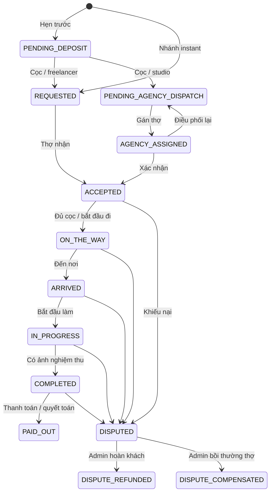

# TÀI LIỆU ĐẶC TẢ YÊU CẦU PHẦN MỀM — MUA-MAKEUP

## 1. Kiến trúc, công nghệ và tác nhân

### 1.1. Thành phần

| Thành phần | Công nghệ/cấu hình trong nguồn | Trách nhiệm |
| --- | --- | --- |
| Backend | Java **17**, Spring Boot **3.3.4**, Gradle | REST, xác thực, nghiệp vụ, DB, scheduler, WebSocket |
| Web portal | React 18.2, JSX, Vite 5, Router 6, Tailwind 3, Zustand 4, Axios/Zod | Quản trị sàn/studio, landing, đăng nhập/đăng ký/gia nhập |
| App/mobile | Expo **57**, React **19.2.3**, React Native **0.86.3**, TypeScript, Expo Router, Zustand 5 | Khách, freelancer, nhân viên studio; iOS/Android/Expo Web |
| Database | PostgreSQL 16 + PostGIS 3.4, Flyway | Dữ liệu nghiệp vụ/địa lý/lịch sử/tài chính |
| Redis | `redis:7-alpine`, Redisson 3.34.1 | Token/OTP, GEO, heartbeat, khóa, lời mời, offer, chống trùng |
| Realtime | Spring WebSocket/STOMP, Application Events | Thông báo, vị trí và biến động nghiệp vụ |
| Media | Cloudinary | Avatar, logo, chứng chỉ, portfolio, ảnh nghiệm thu/minh chứng |
| Payment | VNPay và MoMo strategy | Checkout, IPN, return, query/sync |
| Maps | Maps proxy/service, Goong và routing/fallback trong service | Geocode, autocomplete, place detail, khoảng cách/ETA |
| Push | Expo Notifications/Expo Push | Token thiết bị, thông báo và mở đối tượng liên quan |
| Email | Spring Mail | OTP đăng nhập quản trị; không còn “loại bỏ 100% email” |
| AI | Gemini client + kho tri thức PostgreSQL | Chat hỗ trợ, retrieval và ngữ cảnh tài khoản |

Phiên bản lấy từ manifest/build, không khẳng định mọi môi trường đang cài giống nhau. App dùng React Native components/StyleSheet; không mô tả NativeWind, React Native Maps hay Shadcn là dependency đã có khi manifest chưa khai báo.

Backend là monolith phân tầng `controller → service → repository → entity`, kèm DTO/mapper/config/security/common. REST tiền tố `/api/v1`, port mặc định 8080. WebSocket `/ws-makeup`, application prefix `/app`, simple broker `/topic`, `/queue`, có endpoint thường và SockJS. Event bus/simple broker nội bộ không phải broker bền vững dùng chung nhiều instance.

Compose hiện chạy PostgreSQL/Redis, cổng 5432/6379; backend/web/app chạy riêng. Backend có `application.yml`, `application-dev.yml`, `application-prod.yml`; secrets phụ thuộc môi trường triển khai.

### 1.2. Vai trò

| Vai trò | Phạm vi hiện tại |
| --- | --- |
| Guest | Landing, danh mục/gói/hồ sơ công khai, maps/nearby và AI công khai theo SecurityConfig |
| `ROLE_CUSTOMER` | APP tìm dịch vụ, địa chỉ, booking/cọc/tracking/thanh toán/hủy/tranh chấp/ví/thông báo/hồ sơ |
| `ROLE_FREELANCE_MUA` | APP hồ sơ/chứng chỉ/gói/showcase/online/nhận ca/thực hiện ca/ví; BE có lịch bận và gia nhập studio |
| `ROLE_AGENCY_STAFF` | APP nhánh thợ/workstation/hồ sơ staff/ca được giao; BE có xác nhận assignment, lịch ca, báo bận, quá giờ theo quyền |
| `ROLE_AGENCY_ADMIN` | WEB `/agency/*`: studio, nhân sự, ca, catalog, dispatch, booking, cấu hình |
| `ROLE_SUPER_ADMIN` | WEB `/admin/*`: dashboard, booking, user, agency, chứng chỉ, taxonomy, pricing/H3, dispute |

Router web hiện chỉ cho AGENCY_ADMIN vào `/agency`, không cho AGENCY_STAFF vào toàn portal. UI guard không thay thế kiểm tra role và ownership ở backend. User ID, MUA ID, staff ID và agency ID không thể hoán đổi.

## 2. Chức năng dùng chung

### 2.1. Tài khoản và hồ sơ

| ID | Chức năng | Hiện trạng |
| --- | --- | --- |
| AUTH-01 | Đăng ký, kiểm tra trùng email/điện thoại, tạo hồ sơ/mã nghiệp vụ theo loại tài khoản | BE, WEB; APP CUSTOMER/FREELANCER_MUA |
| AUTH-02 | Login bằng email/điện thoại và mật khẩu; trả userInfo/roles/permissions/token | BE, WEB, APP |
| AUTH-03 | OTP email 6 số cho super admin/agency admin, phiên 5 phút, gửi lại có giới hạn | BE, WEB modal 2FA; APP không có luồng quản trị tương đương |
| AUTH-04 | Khôi phục phiên, refresh, logout/thu hồi token, xử lý lỗi phiên và điều hướng theo role | BE, WEB, APP |
| AUTH-05 | Đổi mật khẩu, ngôn ngữ vi/en, lấy user hiện tại | BE, WEB; APP có API ngôn ngữ, chưa dịch toàn UI |
| AUTH-06 | Sửa hồ sơ và avatar; khách có API profile riêng | BE, WEB theo modal quản trị, APP |
| AUTH-07 | Đăng ký/cập nhật push token | BE, APP |
| AUTH-08 | Onboarding, lưu đã xem, dọn phiên/listener khi logout | APP |

Backend thiết lập cookie khi login/verify/refresh, đồng thời trả token trong response và hỗ trợ Bearer. Refresh/logout ưu tiên cookie rồi body fallback. Native lưu SecureStore; Expo Web dùng localStorage. Không áp quy định “mọi client chỉ dùng HttpOnly cookie” cho toàn dự án. JWT access mặc định 24 giờ; refresh **7 ngày** theo giá trị cấu hình, không phải comment “30 days”. BCrypt strength 12.

### 2.2. Catalog, portfolio và giá

| ID | Chức năng | Hiện trạng |
| --- | --- | --- |
| CAT-01 | Công khai danh mục/phong cách; admin xem cả ẩn, tạo/sửa/bật/tắt | BE, WEB; APP đọc/chọn/lọc |
| CAT-02 | Gói thuộc freelancer/agency: tạo/sửa/xóa/bật tắt, gói của mình, public list/detail | BE, WEB, APP |
| CAT-03 | Item/bước trong gói: CRUD, giá/thời lượng; add-on cộng giá và thời lượng khi đặt | BE, WEB, APP |
| CAT-04 | Phong cách hồ sơ/gói; gán kỹ năng và khả năng thực hiện gói cho staff | BE, WEB; APP hồ sơ/gói thợ |
| CAT-05 | Portfolio ảnh hồ sơ, upload chứng chỉ; showcase gắn gói với ảnh nhiều góc, mô tả, style, nổi bật, ẩn/hiện, sửa/xóa | BE, APP; WEB quản lý chứng chỉ/nhân sự |
| CAT-06 | CRUD/list/calculate phụ phí; giờ sớm/ngày lễ/ngoài bán kính theo cấu hình | BE, WEB; APP chưa có route CRUD riêng |
| PRICE-01 | Preview hóa đơn gói/add-on/khoảng cách/phụ phí/surge/giảm giá/tổng/cọc; kiểm tra item thuộc gói, gói đang cung cấp | BE, WEB, APP |
| PRICE-02 | Khoảng cách, ETA, bán kính, vị trí cơ sở/vị trí gần nhất/fallback | BE, APP; WEB map picker |
| PRICE-03 | CRUD/bật tắt surge theo khung giờ/ngày/phạm vi, multiplier giảm giá Happy Hour | BE, WEB |
| PRICE-04 | H3 surge cung/cầu; admin xem/bật tắt toàn cục, provider có cờ áp dụng | BE, WEB; APP xem báo giá |

Preview scheduled tính từ gói/add-on, di chuyển, phụ phí, surge; instant có phí khẩn cấp và cập nhật giá khi chốt gói. Snapshot giá booking và kết quả server là cơ sở đối chiếu thanh toán, không dùng công thức dự kiến cũ cho mọi nhánh.

### 2.3. Khám phá, địa chỉ

- **DISC-01:** Trang chủ/Explore tìm thợ/studio/gói, gợi ý/bộ lọc, hồ sơ công khai, giá khởi điểm, style, chứng chỉ, gallery, chi tiết gói và bước thực hiện.
- **DISC-02:** Nearby theo tọa độ/bán kính/category/rating/provider type tùy request; tọa độ công khai có trường làm mờ vị trí.
- **ADDR-01:** Xin quyền GPS, lấy vị trí hiện tại/gần nhất, reverse-geocode; xử lý GPS tắt/từ chối quyền/lỗi.
- **ADDR-02:** Autocomplete, geocode, place detail, chọn map, sửa địa chỉ đích và địa chỉ gần đây.
- **ADDR-03:** CRUD địa chỉ lưu và chọn mặc định; tọa độ dùng tính giá/tracking.

### 2.4. Thông báo và realtime

- **NOTI-01:** List, unread count, đọc, đảo đọc/chưa đọc, đọc hết, xóa một/xóa hết.
- **NOTI-02:** Toast/dropdown/modal, mở booking/hồ sơ liên quan; sound/haptic cho offer trên app.
- **NOTI-03:** STOMP cho offer, booking, dispatch, payment/cash, ví, dispute; reconnect/listener khi khôi phục phiên/foreground.
- **NOTI-04:** Expo push token/gửi push; chạm thông báo mở ca đúng vai trò. Cần quyền thiết bị và cấu hình để nghiệm thu.
- **NOTI-05:** Nhắc lịch 24h/2h, scheduler quét mỗi 15 phút, Redis chống trùng; có scheduler hết hạn tìm thợ/cọc/xác nhận.

Topic gồm user/admin notifications, admin disputes, customer/mua/agency bookings, booking-status, gps-stream, offer, cash và wallet; ID phải theo service tương ứng. REST/DB dùng đối soát khi lỡ sự kiện. Không coi biết topic là đủ quyền truy cập; không cam kết độ trễ <5ms/<100ms chưa đo.
## 3. Đặt lịch và thực hiện dịch vụ

### 3.1. Hẹn trước — BOOK-SCH

1. Khách chọn freelancer trực tiếp (`FREELANCER_DIRECT`) hoặc studio, gói/add-on, địa chỉ, ngày giờ.
2. Backend kiểm tra gói, provider, thời gian, khả dụng/capacity, lịch bận và thời lượng gồm gói cộng add-on. Scheduled giới hạn tối đa 90 ngày đặt trước; validation thời gian tối thiểu theo DTO/validator.
3. Preview giá rồi tạo booking với snapshot giá/add-on/địa chỉ; khóa lịch/provider và transaction bảo vệ tranh chấp cập nhật.
4. Đơn `PENDING_DEPOSIT`, cọc mặc định **30%**, hạn cọc **15 phút**. Chờ cọc không đồng nghĩa đã độc quyền giữ slot: nguồn hiện tại kiểm tra lại slot lúc xác nhận tiền và có migration giải phóng lịch chưa thanh toán.
5. Cọc được xác nhận: freelancer sang `REQUESTED`, studio sang `PENDING_AGENCY_DISPATCH`. Deadline xác nhận do server tính theo utility/nghiệp vụ; client dùng deadline trả về.
6. Thợ nhận/từ chối; studio gán và xác nhận phân công. Từ chối/hết hạn cập nhật trạng thái, giải phóng lịch và xử lý cọc tương ứng.
7. Khách xem danh sách/chi tiết/lịch sử/thanh toán, nhận nhắc lịch. App có polling/làm mới bổ sung realtime.

BE còn có API ngày có lịch, slot khả dụng, block/unblock lịch bận freelancer/staff. Chưa có route APP quản lý lịch bận độc lập trong kiểm kê hiện tại.

### 3.2. Cấp tốc — BOOK-INS

1. Khách chọn vị trí, radar/danh sách online, gửi instant; có nhánh chọn thợ trực tiếp theo request/app.
2. Backend tạo booking, tìm ứng viên, quản lý offer/lease/TTL trong Redis. Hằng số hiện có: tìm kiếm mặc định **45 giây**, offer cho thợ **20 giây**; nhánh cụ thể có thể điều chỉnh timeout. Nội dung UI “15–30 phút có thợ” không phải SLA đã đo.
3. Thợ nhận popup đếm ngược, âm thanh/rung; nhận hoặc bỏ qua. Backend khóa nhận ca, rút offer không còn hợp lệ.
4. Khách xem thợ ghép, có thể từ chối provider; chọn gói/add-on và xác nhận báo giá trước cọc.
5. Instant cọc 30%, phí khẩn cấp mặc định **150.000 VND**, fallback giá cơ sở **500.000 VND** ở nhánh chưa xác định gói; gói đã chọn dùng giá tương ứng, không bị thay bằng fallback. Chốt gói cập nhật tiền/thời lượng.
6. Đủ điều kiện cọc mới khởi hành; hết hạn/không có thợ/hủy dọn offer/lease, cập nhật các bên.

Nguồn: `CustomerInstantBookingServiceImpl`, `FreelancerBookingServiceImpl`, `InstantDispatchLeaseService`, `InstantBookingExpirationScheduler`, modal radar/offer và `booking/instant-matched/[id]`.

### 3.3. Trạng thái — BOOK-STATE

Biểu đồ là luồng chính, không thay thế điều kiện service. Enum đầy đủ: `PENDING_DEPOSIT`, `REQUESTED`, `PENDING_AGENCY_DISPATCH`, `AGENCY_ASSIGNED`, `ACCEPTED`, `ON_THE_WAY`, `ARRIVED`, `IN_PROGRESS`, `COMPLETED`, `PAID_OUT`, `CANCELLED`, `CANCELLED_EXPIRED`, `DISPUTED`, `DISPUTE_REFUNDED`, `DISPUTE_COMPENSATED`.

State machine cho phép hủy tại một số trạng thái trước/đang di chuyển nhưng kiểm tra thêm actor/loại đơn. Scheduler/service chuyên biệt ghi trạng thái hết hạn hoặc kết quả dispute ngoài bảng chuyển chung. `DISPUTED → DISPUTED` bổ sung lời khai/minh chứng. State machine chung còn `DISPUTED → PAID_OUT/CANCELLED`; admin dispute dùng trạng thái kết quả riêng. `COMPLETED` chưa đồng nghĩa trả đủ; `PAID_OUT` là quyết toán booking, không phải rút ngân hàng.

Bảng chuyển đầy đủ của `BookingStateMachineServiceImpl.isValidTransition` (chưa áp các điều kiện actor/cọc/ảnh):

| Từ | Đích được phép |
| --- | --- |
| PENDING_DEPOSIT | CANCELLED, REQUESTED, PENDING_AGENCY_DISPATCH |
| REQUESTED | ACCEPTED, PENDING_AGENCY_DISPATCH, CANCELLED |
| PENDING_AGENCY_DISPATCH | AGENCY_ASSIGNED, CANCELLED |
| AGENCY_ASSIGNED | ACCEPTED, PENDING_AGENCY_DISPATCH, CANCELLED |
| ACCEPTED | ON_THE_WAY, CANCELLED, DISPUTED |
| ON_THE_WAY | ARRIVED, CANCELLED, DISPUTED |
| ARRIVED | IN_PROGRESS, DISPUTED |
| IN_PROGRESS | COMPLETED, DISPUTED |
| COMPLETED | PAID_OUT, DISPUTED |
| DISPUTED | PAID_OUT, CANCELLED; bổ sung đối chất cùng trạng thái qua nhánh riêng |
| Các trạng thái khác | Không chuyển qua switch chung; tác vụ chuyên biệt có quy tắc riêng |

### 3.4. Thực hiện ca và tracking — JOB

- **JOB-01:** Workstation ở trang chủ theo role: thống kê, bán kính, online/offline, ca hôm nay, offer instant/scheduled. `/mua/workstation` hiện chuyển về `/`.
- **JOB-02:** `job-execution/[id]`: thông tin ca/khách/địa chỉ/giá/thu nhập, timeline bắt đầu đi → đến nơi → làm → ảnh → hoàn thành.
- **JOB-03:** Chặn khởi hành khi chưa cọc; bắt buộc ảnh khi COMPLETED; lịch sử lưu actor, trạng thái, thời gian/lý do.
- **JOB-04:** REST `/telemetry/stream` hoặc STOMP `/app/telemetry/location`, Redis vị trí hiện hành, PostGIS log, ETA/mode chuyển động; API lịch sử và nén hành trình.
- **JOB-05:** App lấy/gửi GPS bằng vòng chạy trong màn hình ca, điều chỉnh chu kỳ; heartbeat workstation 45 giây. Chưa chứng minh GPS task nền bền vững khi OS treo/đóng app.
- **JOB-06:** Khách xem map/vị trí/ETA/tiến độ; Activity xem đơn hoạt động/lịch sử. Chi tiết/lịch sử hỗ trợ thanh toán/minh chứng/đối chất theo trạng thái.

### 3.5. Hủy, bồi thường và tranh chấp — DISPUTE

| Tình huống | Hành vi hiện tại |
| --- | --- |
| Scheduled chưa cọc | Hủy hợp lệ, không hoàn tiền chưa nộp |
| Đã cọc, thợ chưa xác nhận | Hoàn 100% cọc về ví khách theo nhánh hủy hợp lệ |
| Scheduled ACCEPTED, còn >2 giờ | Hoàn 100% cọc về ví khách |
| Scheduled ACCEPTED, còn ≤2 giờ và chưa tới giờ bắt đầu | Bồi thường cọc cho thợ |
| ACCEPTED đã tới/quá giờ bắt đầu | Chặn khách tự hủy; xử lý qua khiếu nại |
| Instant đã cọc | Chặn khách tự hủy thông thường |
| Thợ đang đi | Khách gửi yêu cầu hủy chuyến; thợ xác nhận/từ chối bồi thường qua API riêng |
| Thợ hủy hợp lệ, đã cọc | Hoàn cọc khách theo service |
| Khiếu nại | Có lý do; thợ/agency báo khách vắng mặt phải có minh chứng theo điều kiện service |
| DISPUTED | Bên còn lại bổ sung lời khai/ảnh, phân biệt người gửi và xem hồ sơ đối chất |
| Admin giải quyết | `APPROVE_REFUND_CUSTOMER` hoặc `REJECT_AND_PAYOUT_MUA`, bắt buộc ghi chú; tác động ví/cọc/lịch/trạng thái/audit/realtime |

Khách không được tự chuyển CANCELLED khi thợ đang đi/đã đến/đang làm. Hoàn cọc là ghi có ví nội bộ, không mặc định refund ra VNPay/MoMo/ngân hàng. API hủy khác nhau có điều kiện riêng. Portal có lọc/thống kê/chi tiết/giải quyết; APP có dossier và counter-dispute.

## 4. Thanh toán, ví và quyết toán

### 4.1. PAY

- **PAY-01:** List gateway cấu hình, create intent/checkout, tra payment code; strategy thực tế **VNPay/MoMo**, chưa có VietQR/ZaloPay.
- **PAY-02:** Intent cọc theo booking, xem cọc/sync-query gateway; kiểm tra lại slot và xử lý `SLOT_TAKEN` nếu ca bị chiếm.
- **PAY-03:** IPN GET/POST với hai dạng alias, return HTML; processor kiểm tra kết quả/số tiền theo gateway. Return client không tự chứng minh đã trả tiền.
- **PAY-04:** Intent tiền còn lại, final-payment sync, reconciliation/posting/online settlement. App mở checkout và làm mới khi quay về.
- **PAY-05:** Tiền mặt cần khách xác nhận đã trả và thợ xác nhận đã nhận; có API receipt status. Đủ hai phía mới thỏa điều kiện biên nhận quyết toán; thao tác lặp dùng record/idempotency.
- **PAY-06:** Không ghi có/quyết toán trùng khi IPN/sync/confirm lặp; khóa, transaction, idempotency và kiểm tra record hiện có cần test concurrency.

### 4.2. WALLET

Khách xem số dư/hoàn cọc/lịch sử; thợ xem số dư/cọc giữ/giao dịch/quyết toán. APP có tab, lọc khoảng ngày, refresh, chi tiết giao dịch liên kết booking. Nhãn “khả dụng rút” hay “nạp/rút” chưa chứng minh đã có API nghiệp vụ nạp/rút.

7 bảng tài chính thực tế: `payment_transactions`, `booking_deposits`, `wallets`, `wallet_holds`, `ledger_entries`, `booking_settlements`, `booking_cash_receipts`. Không suy ra đã có kế toán kép cân bằng mọi bút toán, ví sàn/agency hoặc payout ngân hàng chỉ từ việc có ledger.

Nhánh tiền mặt `BookingSettlementServiceImpl`:

- `T`: tổng, `D`: cọc, `C`: phần tiền mặt còn lại; `F = round(T × commissionRate)` là phí sàn.
- `E = T − F` là thu nhập; `N = D − F` ghi có ví thợ vì thợ đã nhận `C` ngoài hệ thống.
- `N < 0`: `PENDING_FEE_COLLECTION`, không ghi có âm bằng nhánh này.
- Tạo settlement/ledger có idempotency, tiêu thụ hold, cập nhật booking.

**Chưa đồng nhất:** nhiều offer/UI dùng 20%, cash settlement có mặc định `${app.settlement.commission-rate:0.1500}`. Không mô tả một tỷ lệ là đã thống nhất. Online có nhánh riêng; không áp công thức tiền mặt `N=D−F` cho toàn bộ thanh toán online.

## 5. Vận hành studio và quản trị sàn

### 5.1. AGENCY

| ID | Nghiệp vụ | Giao diện/giới hạn |
| --- | --- | --- |
| AG-01 | Dashboard, thống kê, list/filter/detail booking | BE, WEB dashboard/bookings |
| AG-02 | Hồ sơ/liên hệ/vị trí/logo/commission/surge | BE, WEB settings/modal; profile redirect về settings |
| AG-03 | Tạo/list/thu hồi lời mời, mã/link/QR, public invitation, freelancer nhận lời và agency duyệt | BE, WEB `/join`/modal; APP chưa có route QR/gia nhập riêng |
| AG-04 | List/detail nhân viên, xét duyệt, trạng thái, loại khỏi studio, commission riêng | BE, WEB staff/detail |
| AG-05 | Gán style/kỹ năng và gói cho nhân viên | BE, WEB |
| AG-06 | CRUD ca trực, ma trận tuần/ngày, lịch staff, kiểm tra xung đột | BE, WEB shifts; quyền sửa/xóa giới hạn theo controller |
| AG-07 | CRUD gói/item/add-on/phụ phí studio | BE, WEB packages/surcharges |
| AG-08 | Đơn chờ dispatch, ma trận đủ điều kiện, gán chính/phụ, đổi thợ, từ chối đơn | BE, WEB booking/assignment matrix |
| AG-09 | Nhiều staff/booking, xác nhận assignment, `proceed-solo` | BE, WEB theo modal; APP không mặc định có UI mọi endpoint |
| AG-10 | Báo bận khẩn cấp/lý do/minh chứng, agency duyệt/từ chối/đổi thợ | BE, WEB emergency approval/reassign; APP cần kiểm tra từng ca |
| AG-11 | Rule quá giờ CRUD/bật tắt/list; submit/list/detail/review report | BE; WEB có cấu hình rule, chưa có route riêng bao phủ toàn report |

Report quá giờ có kết quả `PENALIZED`, `APPROVED_WAIVED`, `CHARGED_CUSTOMER`; trạng thái report không tự chứng minh gateway đã thu/phạt. Dispatch kiểm tra ownership studio, năng lực, lịch và assignment của người xác nhận.

### 5.2. ADMIN

| ID | Nghiệp vụ | WEB |
| --- | --- | --- |
| ADM-01 | Dashboard thống kê, list/filter/page/detail booking toàn sàn | `/admin/dashboard`, `/admin/bookings` |
| ADM-02 | Tạo/list user, đổi trạng thái | `/admin/users` |
| ADM-03 | Tạo/list/thẩm định agency | `/admin/agencies` |
| ADM-04 | List chứng chỉ, ảnh/hồ sơ, duyệt/từ chối | `/admin/muas/credentials` |
| ADM-05 | Catalog/style CRUD và bật/tắt | `/admin/taxonomy` |
| ADM-06 | Surge/giảm giá/H3 | `/admin/pricing` |
| ADM-07 | Thống kê/lọc/hồ sơ/giải quyết dispute và tác động tài chính | `/admin/disputes` |
| ADM-08 | Hồ sơ, đổi mật khẩu, ngôn ngữ/theme, realtime notification | Layout/modal |

Chưa có route admin duyệt payout hay ví đối soát sàn; không ghi là WEB đã hoàn thành.
## 6. Trợ lý AI — AI

- **AI-01:** Bong bóng trợ lý dùng chung, `/support-chat`, gửi câu hỏi/nhận trả lời, tiếp tục sessionCode và xem lịch sử.
- **AI-02:** `POST /support/chat`, `GET /support/history/{sessionCode}`; lưu session/message USER/ASSISTANT.
- **AI-03:** Retrieval top 5 tài liệu, kết hợp cosine embedding và keyword, fallback keyword; giữ lịch sử hội thoại gần đây.
- **AI-04:** Có userId thì bổ sung booking/ví/hồ sơ liên quan vào ngữ cảnh; guest được hướng dẫn login khi hỏi dữ liệu cá nhân.
- **AI-05:** Prompt giới hạn hỗ trợ nền tảng/dịch vụ; không bảo đảm tuyệt đối câu trả lời luôn đúng.
- **AI-06:** Generation/embedding model cấu hình môi trường; phụ thuộc API key/mạng/model thực tế.

Chưa có agent tự đặt/hủy đơn, thanh toán hoặc giải quyết dispute. Tri thức seed/prompt có thể chứa kế hoạch cũ: prompt đang nhắc mốc hủy 24 giờ, khác rule 2 giờ của booking service. Cập nhật SRS không tự sửa prompt/dữ liệu đó.

`/support/**` permitAll; endpoint history nhận sessionCode và controller không nhận principal. Cần xác minh quyền sở hữu phiên trước khi coi lịch sử cá nhân được bảo vệ đầy đủ.

## 7. Giao diện và trải nghiệm

### 7.1. App/mobile

| Nhóm | Route/chức năng |
| --- | --- |
| Khởi động/auth | Splash, khôi phục phiên, onboarding, login/register, điều hướng theo role |
| `/` | Khách: vị trí, khám phá, đặt gấp/hẹn trước. Thợ/staff: workstation, online/bán kính/offer/ca |
| `/explore`, `/mua-detail/[id]` | Tìm/lọc, hồ sơ, chứng chỉ, gallery, style, package, đặt dịch vụ |
| `/booking/create` | Provider/gói/add-on/slot/địa chỉ, preview, tạo lịch |
| `/booking/instant-matched/[id]` | Thợ ghép, chốt gói/add-on, từ chối provider/chuyển cọc |
| `/booking/deposit/[id]` | Cọc/countdown/checkout/sync/hủy/thoát theo điều kiện |
| `/booking/tracking/[id]` | Map/ETA/tiến độ, yêu cầu hủy/thanh toán/khiếu nại theo trạng thái |
| `/bookings`, `/activity` | Danh sách/lọc, đơn hoạt động, lịch sử biến động |
| `/booking/detail/[id]`, `/booking/history-detail/[id]` | Giá/trạng thái/ảnh, cash/online, timeline, đối chất |
| `/job-execution/[id]` | Thực hiện ca, GPS, ảnh bằng chứng, hoàn thành, xác nhận tiền/đối chất |
| `/profile/edit` | Hồ sơ/avatar, địa chỉ lưu/mặc định |
| `/profile/mua-profile` | Bio/kinh nghiệm/cơ sở/bán kính/style/portfolio/chứng chỉ |
| `/profile/staff-profile` | Hồ sơ nhân viên và agency |
| `/mua/packages/*` | CRUD/bật tắt gói, items, showcase, thêm tác phẩm |
| `/profile/customer-wallet`, `/profile/freelancer-wallet` | Số dư/cọc giữ/giao dịch/lọc thời gian/chi tiết |
| `/notifications` | List/đọc/xóa/mở đối tượng |
| `/support-chat` | AI, session/history/loading/error |

Modal dùng chung: tài khoản, popup/confirm, undo, địa chỉ/map, gallery/zoom, ngày giờ, hóa đơn, offer countdown/scheduled, cọc thành công, camera, hủy, dossier/counter-dispute, chi tiết giao dịch. Undo chỉ tại nơi đã tích hợp, không đồng nghĩa mọi backend mutation có rollback.

### 7.2. Web portal

Public: `/`, `/login`, `/register`, `/join`, fallback 404. Landing có hero, đối tượng sử dụng, phong cách, workflow, giới thiệu tính năng/điều phối, FAQ/CTA. Minh họa/số liệu landing không phải thống kê thật.

Route admin/agency ở mục 6; có role guard, bảng, tìm kiếm/phân trang, modal/form, toast/confirm, notifications, vi/en/theme. Tệp `AgencyProfilePage.jsx` và `DashboardPage.jsx` vẫn tồn tại nhưng router không gắn thành trang độc lập tương ứng; phân biệt tồn tại page với route hoạt động.

Các route studio thực tế: `/agency/dashboard`, `/agency/bookings`, `/agency/settings`, `/agency/packages`, `/agency/surcharges`, `/agency/staff`, `/agency/staff/:staffId`, `/agency/shifts`. `/agency` chuyển tới dashboard, `/agency/profile` chuyển tới settings; `/admin` chuyển tới `/admin/dashboard`.

## 8. Dữ liệu, API và yêu cầu chất lượng

### 8.1. Mô hình dữ liệu

Tám schema tiếp tục tồn tại, không còn giới hạn “28 bảng”. Danh mục thực tế trích migration tại phụ lục; partition telemetry tách khỏi bảng nghiệp vụ.

| Schema | Dữ liệu |
| --- | --- |
| `auth_schema` | User, role, user-role, role permission, saved address |
| `agency_schema` | Profile/branch, staff, styles/services, shifts, overtime rule/report |
| `mua_schema` | Profile, styles, calendars |
| `catalog_schema` | Category/style/package/item/package-style/surcharge/showcase/surge/distance tier |
| `booking_schema` | Booking/history/staff assignment |
| `telemetry_schema` | Partitioned GPS logs, booking trips |
| `wallet_schema` | Payment/deposit/wallet/hold/ledger/settlement/cash receipt |
| `interaction_schema` | Notifications, AI knowledge/session/message |

Quan hệ chính: user → profile/customer booking; provider → package → item/showcase; booking → history/assignment/calendar/payment/deposit/receipt/settlement; user → wallet → hold/ledger; session → message. Booking lưu snapshot giá/add-on, không phụ thuộc hoàn toàn vào package sửa sau đó.

Migration mới có soft-delete, trạng thái dispute, push token, slot-taken, giải phóng lịch chưa cọc và AI. Flyway/entity là nguồn chi tiết cột/index/constraint; không dùng DDL dự kiến cũ như schema đã triển khai.

### 8.2. Hợp đồng

REST JSON dùng `ApiResponse` (success/message/data/timestamp); phân trang theo DTO từng endpoint, không mặc định mọi list có chung Page. Upload multipart; lỗi qua GlobalExceptionHandler/mã lỗi/message đa ngôn ngữ. Phụ lục giữ alias và mapping không suffix. WebSocket/push là tín hiệu cập nhật; REST/DB đối soát khi refresh/reconnect.

### 8.3. Yêu cầu chất lượng và giới hạn

| ID | Tiêu chí | Hiện trạng cần kiểm chứng |
| --- | --- | --- |
| NFR-01 | Role/ownership đúng, không đọc/ghi người khác | SecurityConfig/method/service checks; cần test IDOR/API/topic |
| NFR-02 | Không nhận trùng/ghi có trùng/settle trùng | Redis/Redisson, transaction, khóa/version, idempotency; cần test đồng thời |
| NFR-03 | Callback chậm/lặp, reconnect/mất mạng | Sync/reconciliation/poll/dedup; cần test tích hợp |
| NFR-04 | Lịch/countdown/hủy thống nhất UTC+7 | Nhiều service dùng +7, một số LocalDateTime.now; cần timezone nhất quán |
| NFR-05 | Quyền ảnh/camera/GPS/push, fallback rõ | Cần thiết bị iOS/Android và Expo Web |
| NFR-06 | Preview/booking/gateway/ledger/UI thống nhất | Commission còn khác mặc định, chưa tuyên bố đạt |
| NFR-07 | Loading/empty/error/confirm/refresh, điều hướng đúng | Có component/handler; chưa chứng nhận accessibility toàn bộ |
| NFR-08 | Secrets và HTTPS/WSS phù hợp triển khai | Cần cấu hình/review môi trường, SRS không chứa secret |
| NFR-09 | Hiệu năng có benchmark | Chưa chứng minh <5ms/<100ms hoặc hàng chục nghìn kết nối |
| NFR-10 | Nhiều backend không mất sự kiện | Event bus/simple broker nội bộ cần thiết kế mở rộng |

SecurityConfig hiện origin rộng, CSRF tắt và permitAll một số nhóm/actuator; STOMP CONNECT đọc JWT nhưng chưa chứng minh kiểm soát mọi SUBSCRIBE. Đây là giới hạn hiện trạng phải đánh giá khi nghiệm thu, không phải yêu cầu production phải để mở.

## 9. Chức năng chưa hoàn thiện và sai khác cần theo dõi

| ID | Nội dung | Phạm vi còn thiếu |
| --- | --- | --- |
| GAP-01 | Rating/review | Có UI/nút/cảm ơn; chưa có ReviewController/service lưu tương ứng |
| GAP-02 | Tip | Chưa có API/UI thanh toán tip hoàn chỉnh |
| GAP-03 | Nạp/rút ngân hàng/duyệt payout/ví sàn-agency | Có nền tảng ví/settlement, chưa có đủ API/route nghiệp vụ |
| GAP-04 | ZaloPay/VietQR | Chưa có gateway strategy |
| GAP-05 | GPS background khi OS treo/đóng app | Foreground stream đã có; task nền chưa hoàn chỉnh |
| GAP-06 | APP lịch bận/ca studio/QR gia nhập/toàn bộ overtime-dispatch | BE có nghiệp vụ; APP thiếu route riêng bao phủ đủ |
| GAP-07 | i18n APP/quyền portal staff | APP nhiều chuỗi tiếng Việt; agency web chỉ AGENCY_ADMIN |
| GAP-08 | Commission | Offer/UI 20% khác mặc định settlement 15%; cần thống nhất |
| GAP-09 | Prompt/tri thức AI | Mốc 24h khác service 2h, có tính năng kế hoạch trong tri thức |
| GAP-10 | AI history/topic security | Cần ownership sessionCode, SUBSCRIBE, CORS/actuator theo môi trường |
| GAP-11 | Minh họa/fallback | Landing mock; một số số điện thoại/profile fallback và rating alert không phải dữ liệu/luồng thật |
| GAP-12 | Kế toán kép và chia tiền sàn–studio–thợ | Ledger chưa chứng minh cân bằng toàn bộ bút toán/phân chia/payout |
| GAP-13 | Thiết bị/tích hợp/hiệu năng | Chưa nghiệm thu runtime trong lần sửa SRS này |

POS phần cứng vẫn ngoài phạm vi. Không suy diễn chat trực tiếp khách–thợ hay nghiệp vụ khác là đã có từ nội dung định hướng.

## 10. Tiêu chí nghiệm thu và truy vết

| Nhóm | Kịch bản |
| --- | --- |
| Auth | Trùng đăng ký, sai mật khẩu/OTP, hết hạn/gửi lại, refresh/logout, đổi tài khoản, role guard |
| Catalog | Ownership, gói ẩn/xóa, item sai gói, upload lỗi, duyệt chứng chỉ, showcase ẩn/nổi bật |
| Scheduled | Slot bận, thời lượng add-on/buffer, cọc hết hạn, slot-taken sau payment, từ chối/không xác nhận |
| Instant | Không thợ, offer hết hạn, nhận đồng thời, từ chối provider, chốt gói, mất mạng |
| Agency | Lời mời hết hạn/thu hồi, duyệt staff, trùng ca, năng lực, nhiều thợ, đổi thợ/báo bận/quá giờ |
| Job | Chưa cọc, actor sai, GPS tắt, thiếu ảnh, reconnect/history |
| Payment/wallet | Chữ ký/số tiền sai, IPN/sync lặp, online final payment, cash một/hai bên, settlement lặp, hold/refund/compensate |
| Dispute | Trước/sát/quá giờ, instant đã cọc, yêu cầu hủy khi đang đi, thiếu ảnh, đối chất, resolve lặp |
| Notification | Ownership, đọc/xóa, dedup/reconnect, deep link đúng role/ca, nhắc 24h/2h |
| AI | Guest/login, history/ownership, lỗi API, retrieval fallback, chính sách hủy đúng |

Repo có test auth/JWT/i18n, catalog/surcharge, agency, pricing/H3/telemetry, payment posting/reconciliation/settlement/webhook amount. Có tệp test không đồng nghĩa đã pass hay đã đủ E2E. Lần cập nhật này kiểm tra tài liệu/truy vết, không sửa logic hoặc tuyên bố đã chạy toàn hệ thống.

## 11. Phụ lục kiểm kê nguồn

Các mục dưới trích trực tiếp working tree ngày 09/10/2026. Mapping giữ nguyên khai báo để không bỏ alias/method không suffix. Quyền/DTO/điều kiện trong controller/service; có API không đồng nghĩa có UI.

### 11.1. Toàn bộ mapping backend

#### AdminAgencyController

Nguồn: [AdminAgencyController.java](../code/backend/core-api/src/main/java/com/makeup/platform/controller/admin/AdminAgencyController.java). Base mapping: `"/api/v1/admin/agencies"`.

| Mapping method (ghép với base) | Handler | Quyền tại method |
| --- | --- | --- |
| `@PostMapping` | `createAgency` | "hasRole('SUPER_ADMIN')" |
| `@GetMapping` | `getAllAgencies` | "hasRole('SUPER_ADMIN')" |
| `@PutMapping("/{agencyId}/verify")` | `verifyAgency` | "hasRole('SUPER_ADMIN')" |

#### AdminBookingController

Nguồn: [AdminBookingController.java](../code/backend/core-api/src/main/java/com/makeup/platform/controller/admin/AdminBookingController.java). Base mapping: `"/api/v1/admin/bookings"`. Quyền cấp lớp: `"hasRole('SUPER_ADMIN')"`.

| Mapping method (ghép với base) | Handler | Quyền tại method |
| --- | --- | --- |
| `@GetMapping` | `getAllBookings` | Theo security/service và quyền cấp lớp nếu có |
| `@GetMapping("/stats")` | `getBookingStats` | Theo security/service và quyền cấp lớp nếu có |
| `@GetMapping("/{id}")` | `getBookingDetail` | Theo security/service và quyền cấp lớp nếu có |

#### AdminDisputeController

Nguồn: [AdminDisputeController.java](../code/backend/core-api/src/main/java/com/makeup/platform/controller/admin/AdminDisputeController.java). Base mapping: `"/api/v1/admin/disputes"`. Quyền cấp lớp: `"hasRole('SUPER_ADMIN')"`.

| Mapping method (ghép với base) | Handler | Quyền tại method |
| --- | --- | --- |
| `@GetMapping` | `getAllDisputes` | Theo security/service và quyền cấp lớp nếu có |
| `@GetMapping("/stats")` | `getDisputeStats` | Theo security/service và quyền cấp lớp nếu có |
| `@GetMapping("/{bookingId}")` | `getDisputeDetail` | Theo security/service và quyền cấp lớp nếu có |
| `@PostMapping("/{bookingId}/resolve")` | `resolveDispute` | Theo security/service và quyền cấp lớp nếu có |

#### AdminMuaCredentialController

Nguồn: [AdminMuaCredentialController.java](../code/backend/core-api/src/main/java/com/makeup/platform/controller/admin/AdminMuaCredentialController.java). Base mapping: `"/api/v1/admin/muas"`.

| Mapping method (ghép với base) | Handler | Quyền tại method |
| --- | --- | --- |
| `@GetMapping("/certificates")` | `getAllCertificates` | "hasRole('SUPER_ADMIN')" |
| `@PutMapping("/{muaId}/certificates/verify")` | `verifyCertificate` | "hasRole('SUPER_ADMIN')" |

#### AdminUserController

Nguồn: [AdminUserController.java](../code/backend/core-api/src/main/java/com/makeup/platform/controller/admin/AdminUserController.java). Base mapping: `"/api/v1/admin/users"`. Quyền cấp lớp: `"hasRole('SUPER_ADMIN')"`.

| Mapping method (ghép với base) | Handler | Quyền tại method |
| --- | --- | --- |
| `@PostMapping` | `createUser` | Theo security/service và quyền cấp lớp nếu có |
| `@GetMapping` | `getAllUsers` | Theo security/service và quyền cấp lớp nếu có |
| `@PutMapping("/{id}/status")` | `updateUserStatus` | Theo security/service và quyền cấp lớp nếu có |

#### AgencyBookingController

Nguồn: [AgencyBookingController.java](../code/backend/core-api/src/main/java/com/makeup/platform/controller/agency/AgencyBookingController.java). Base mapping: `"/api/v1/agency/bookings"`. Quyền cấp lớp: `"hasRole('AGENCY_ADMIN')"`.

| Mapping method (ghép với base) | Handler | Quyền tại method |
| --- | --- | --- |
| `@GetMapping` | `getAgencyBookings` | Theo security/service và quyền cấp lớp nếu có |
| `@GetMapping("/stats")` | `getAgencyBookingStats` | Theo security/service và quyền cấp lớp nếu có |

#### AgencyDispatchController

Nguồn: [AgencyDispatchController.java](../code/backend/core-api/src/main/java/com/makeup/platform/controller/agency/AgencyDispatchController.java). Base mapping: `"/api/v1/agency/dispatch"`.

| Mapping method (ghép với base) | Handler | Quyền tại method |
| --- | --- | --- |
| `@GetMapping("/pending-bookings")` | `getPendingDispatchBookings` | "hasRole('AGENCY_ADMIN')" |
| `@GetMapping("/bookings/{bookingId}/staff-matrix")` | `getStaffMatrix` | "hasRole('AGENCY_ADMIN')" |
| `@PostMapping("/bookings/{bookingId}/assign")` | `assignStaff` | "hasRole('AGENCY_ADMIN')" |
| `@PostMapping("/bookings/{bookingId}/reassign")` | `reassignStaff` | "hasRole('AGENCY_ADMIN')" |
| `@PostMapping("/bookings/{bookingId}/reject")` | `rejectBooking` | "hasRole('AGENCY_ADMIN')" |
| `@PostMapping("/bookings/{bookingId}/proceed-solo")` | `proceedSolo` | "hasRole('AGENCY_ADMIN')" |
| `@PostMapping("/bookings/{bookingId}/report-emergency-busy")` | `reportEmergencyBusy` | "hasAnyRole('AGENCY_STAFF', 'FREELANCE_MUA')" |
| `@PostMapping("/bookings/{bookingId}/emergency-approval/{staffId}")` | `reviewEmergencyReport` | "hasRole('AGENCY_ADMIN')" |
| `@PostMapping("/assignments/{assignmentId}/confirm")` | `confirmAssignment` | "hasRole('AGENCY_STAFF')" |

#### AgencyOvertimeController

Nguồn: [AgencyOvertimeController.java](../code/backend/core-api/src/main/java/com/makeup/platform/controller/agency/AgencyOvertimeController.java). Base mapping: `"/api/v1/agency"`.

| Mapping method (ghép với base) | Handler | Quyền tại method |
| --- | --- | --- |
| `@PostMapping("/overtime-rules")` | `createOrUpdateRule` | "hasRole('AGENCY_ADMIN')" |
| `@GetMapping("/overtime-rules")` | `getAgencyRules` | "hasRole('AGENCY_ADMIN') or hasRole('AGENCY_STAFF') or hasRole('FREELANCE_MUA')" |
| `@DeleteMapping("/overtime-rules/{ruleId}")` | `deleteRule` | "hasRole('AGENCY_ADMIN')" |
| `@PatchMapping("/overtime-rules/{ruleId}/status")` | `toggleRuleStatus` | "hasRole('AGENCY_ADMIN')" |
| `@PostMapping("/overtime-reports")` | `submitOvertimeReport` | "hasRole('FREELANCE_MUA') or hasRole('AGENCY_STAFF')" |
| `@PostMapping("/overtime-reports/{reportId}/review")` | `reviewOvertimeReport` | "hasRole('AGENCY_ADMIN')" |
| `@GetMapping("/overtime-reports")` | `getOvertimeReports` | "hasRole('AGENCY_ADMIN') or hasRole('AGENCY_STAFF')" |
| `@GetMapping("/overtime-reports/{reportId}")` | `getOvertimeReportDetail` | "hasRole('AGENCY_ADMIN') or hasRole('AGENCY_STAFF') or hasRole('FREELANCE_MUA')" |

#### AgencyProfileController

Nguồn: [AgencyProfileController.java](../code/backend/core-api/src/main/java/com/makeup/platform/controller/agency/AgencyProfileController.java). Base mapping: `"/api/v1/agencies"`.

| Mapping method (ghép với base) | Handler | Quyền tại method |
| --- | --- | --- |
| `@GetMapping` | `getPublicAgencies` | Theo security/service và quyền cấp lớp nếu có |
| `@GetMapping("/profile")` | `getMyAgencyProfile` | "hasRole('AGENCY_ADMIN')" |
| `@GetMapping("/{agencyId}/profile")` | `getAgencyProfileById` | Theo security/service và quyền cấp lớp nếu có |
| `@PutMapping("/profile")` | `updateAgencyProfile` | "hasRole('AGENCY_ADMIN')" |
| `@PutMapping("/commission")` | `updateDefaultCommission` | "hasRole('AGENCY_ADMIN')" |
| `@GetMapping("/{agencyId}/location")` | `getAgencyLocation` | Theo security/service và quyền cấp lớp nếu có |
| `@PostMapping(value = "/logo", consumes = MediaType.MULTIPART_FORM_DATA_VALUE)` | `uploadLogo` | "hasRole('AGENCY_ADMIN')" |

#### AgencyShiftController

Nguồn: [AgencyShiftController.java](../code/backend/core-api/src/main/java/com/makeup/platform/controller/agency/AgencyShiftController.java). Base mapping: `"/api/v1/agencies"`.

| Mapping method (ghép với base) | Handler | Quyền tại method |
| --- | --- | --- |
| `@PostMapping("/shifts")` | `createShift` | "hasRole('AGENCY_ADMIN') or hasRole('AGENCY_STAFF')" |
| `@PutMapping("/shifts/{shiftId}")` | `updateShift` | "hasRole('AGENCY_ADMIN')" |
| `@GetMapping("/shifts/matrix")` | `getWeeklyShiftMatrix` | "hasRole('AGENCY_ADMIN') or hasRole('AGENCY_STAFF') or hasRole('FREELANCE_MUA')" |
| `@GetMapping("/shifts/staff/{staffId}")` | `getStaffShifts` | "hasRole('AGENCY_ADMIN') or hasRole('AGENCY_STAFF') or hasRole('FREELANCE_MUA')" |
| `@DeleteMapping("/shifts/{shiftId}")` | `deleteShift` | "hasRole('AGENCY_ADMIN')" |

#### AgencyStaffController

Nguồn: [AgencyStaffController.java](../code/backend/core-api/src/main/java/com/makeup/platform/controller/agency/AgencyStaffController.java). Base mapping: `"/api/v1/agencies"`.

| Mapping method (ghép với base) | Handler | Quyền tại method |
| --- | --- | --- |
| `@PostMapping("/invitations")` | `createInvitation` | "hasRole('AGENCY_ADMIN')" |
| `@GetMapping("/invitations")` | `getInvitations` | "hasRole('AGENCY_ADMIN')" |
| `@DeleteMapping("/invitations/{inviteCode}")` | `cancelInvitation` | "hasRole('AGENCY_ADMIN')" |
| `@GetMapping("/invitations/{inviteCode}/public")` | `getPublicInvitationInfo` | Theo security/service và quyền cấp lớp nếu có |
| `@PostMapping("/invitations/accept")` | `acceptInvitation` | "hasRole('FREELANCE_MUA')" |
| `@GetMapping("/staff")` | `getStaffList` | "hasRole('AGENCY_ADMIN') or hasRole('AGENCY_STAFF')" |
| `@GetMapping("/staff/me")` | `getMyStaffProfile` | "hasRole('AGENCY_STAFF') or hasRole('FREELANCE_MUA')" |
| `@GetMapping("/staff/{staffId}")` | `getStaffDetail` | "hasRole('AGENCY_ADMIN') or hasRole('AGENCY_STAFF')" |
| `@PutMapping("/staff/{staffId}/review")` | `reviewStaffApplication` | "hasRole('AGENCY_ADMIN')" |
| `@PutMapping("/staff/{staffId}/status")` | `updateStaffStatus` | "hasRole('AGENCY_ADMIN')" |
| `@PutMapping("/staff/{staffId}/commission")` | `updateStaffCommission` | "hasRole('AGENCY_ADMIN')" |
| `@DeleteMapping("/staff/{staffId}")` | `removeStaff` | "hasRole('AGENCY_ADMIN')" |

#### AgencyStaffPackageController

Nguồn: [AgencyStaffPackageController.java](../code/backend/core-api/src/main/java/com/makeup/platform/controller/agency/AgencyStaffPackageController.java). Base mapping: `"/api/v1"`.

| Mapping method (ghép với base) | Handler | Quyền tại method |
| --- | --- | --- |
| `@PutMapping({"/agencies/staff/{staffId}/packages", "/packages/staff-assignments"})` | `assignPackagesToStaff` | "hasRole('AGENCY_ADMIN')" |
| `@GetMapping("/agencies/staff/{staffId}/packages")` | `getStaffPackages` | "hasRole('AGENCY_ADMIN') or hasRole('AGENCY_STAFF') or hasRole('FREELANCE_MUA')" |

#### AgencyStaffStyleController

Nguồn: [AgencyStaffStyleController.java](../code/backend/core-api/src/main/java/com/makeup/platform/controller/agency/AgencyStaffStyleController.java). Base mapping: `"/api/v1/agencies"`.

| Mapping method (ghép với base) | Handler | Quyền tại method |
| --- | --- | --- |
| `@PutMapping("/staff/{staffId}/styles")` | `assignStaffStyles` | "hasRole('AGENCY_ADMIN')" |
| `@GetMapping("/staff/{staffId}/styles")` | `getStaffStyles` | "hasRole('AGENCY_ADMIN') or hasRole('AGENCY_STAFF') or hasRole('FREELANCE_MUA')" |

#### AuthController

Nguồn: [AuthController.java](../code/backend/core-api/src/main/java/com/makeup/platform/controller/auth/AuthController.java). Base mapping: `"/api/v1/auth"`.

| Mapping method (ghép với base) | Handler | Quyền tại method |
| --- | --- | --- |
| `@PostMapping("/register")` | `register` | Theo security/service và quyền cấp lớp nếu có |
| `@PostMapping("/login")` | `login` | Theo security/service và quyền cấp lớp nếu có |
| `@PostMapping("/verify-2fa")` | `verify2Fa` | Theo security/service và quyền cấp lớp nếu có |
| `@PostMapping("/resend-2fa")` | `resend2Fa` | Theo security/service và quyền cấp lớp nếu có |
| `@PostMapping("/refresh-token")` | `refreshToken` | Theo security/service và quyền cấp lớp nếu có |
| `@PostMapping("/logout")` | `logout` | Theo security/service và quyền cấp lớp nếu có |
| `@PostMapping("/change-password")` | `changePassword` | Theo security/service và quyền cấp lớp nếu có |
| `@GetMapping("/me")` | `getCurrentUser` | Theo security/service và quyền cấp lớp nếu có |
| `@PutMapping("/language")` | `updateLanguage` | Theo security/service và quyền cấp lớp nếu có |
| `@PatchMapping("/push-token")` | `updatePushToken` | Theo security/service và quyền cấp lớp nếu có |

#### UserProfileController

Nguồn: [UserProfileController.java](../code/backend/core-api/src/main/java/com/makeup/platform/controller/auth/UserProfileController.java). Base mapping: `"/api/v1/users"`.

| Mapping method (ghép với base) | Handler | Quyền tại method |
| --- | --- | --- |
| `@PostMapping(value = "/avatar", consumes = MediaType.MULTIPART_FORM_DATA_VALUE)` | `uploadAvatar` | Theo security/service và quyền cấp lớp nếu có |
| `@PutMapping("/profile")` | `updateProfile` | Theo security/service và quyền cấp lớp nếu có |
| `@GetMapping("/me")` | `getCurrentUser` | Theo security/service và quyền cấp lớp nếu có |

#### BookingAcceptanceController

Nguồn: [BookingAcceptanceController.java](../code/backend/core-api/src/main/java/com/makeup/platform/controller/booking/BookingAcceptanceController.java). Base mapping: `"/api/v1/freelancer/bookings"`.

| Mapping method (ghép với base) | Handler | Quyền tại method |
| --- | --- | --- |
| `@GetMapping` | `getMyAssignedBookings` | "hasAnyRole('FREELANCE_MUA', 'AGENCY_STAFF')" |
| `@PostMapping("/{bookingId}/accept")` | `acceptBooking` | "hasRole('FREELANCE_MUA')" |
| `@PostMapping({ "/{bookingId}/confirm-scheduled", "/{bookingId}/confirm" })` | `confirmScheduledBooking` | "hasRole('FREELANCE_MUA')" |
| `@PostMapping({ "/{bookingId}/reject-scheduled", "/{bookingId}/reject" })` | `rejectScheduledBooking` | "hasRole('FREELANCE_MUA')" |
| `@PostMapping("/{bookingId}/skip")` | `skipBooking` | "hasRole('FREELANCE_MUA')" |
| `@GetMapping("/instant/pending-offer")` | `getPendingOffer` | "hasAnyRole('FREELANCE_MUA', 'AGENCY_STAFF')" |
| `@GetMapping("/scheduled/pending-offers")` | `getPendingScheduledOffers` | "hasAnyRole('FREELANCE_MUA', 'AGENCY_STAFF')" |

#### BookingHistoryController

Nguồn: [BookingHistoryController.java](../code/backend/core-api/src/main/java/com/makeup/platform/controller/booking/BookingHistoryController.java). Base mapping: `"/api/v1/bookings"`.

| Mapping method (ghép với base) | Handler | Quyền tại method |
| --- | --- | --- |
| `@GetMapping("/{bookingId}/history")` | `getBookingHistory` | Theo security/service và quyền cấp lớp nếu có |

#### BookingStateController

Nguồn: [BookingStateController.java](../code/backend/core-api/src/main/java/com/makeup/platform/controller/booking/BookingStateController.java). Base mapping: `"/api/v1/bookings"`.

| Mapping method (ghép với base) | Handler | Quyền tại method |
| --- | --- | --- |
| `@PostMapping("/{bookingId}/transition")` | `transitionState` | Theo security/service và quyền cấp lớp nếu có |
| `@PostMapping(value = "/{bookingId}/completion-photo", consumes = MediaType.MULTIPART_FORM_DATA_VALUE)` | `uploadCompletionPhoto` | Theo security/service và quyền cấp lớp nếu có |
| `@PostMapping(value = "/{bookingId}/dispute-proof", consumes = MediaType.MULTIPART_FORM_DATA_VALUE)` | `uploadDisputeProof` | Theo security/service và quyền cấp lớp nếu có |
| `@GetMapping("/{bookingId}/status")` | `getBookingStatus` | Theo security/service và quyền cấp lớp nếu có |
| `@PostMapping("/{bookingId}/request-cancel-trip")` | `requestCancelTrip` | Theo security/service và quyền cấp lớp nếu có |
| `@PostMapping("/{bookingId}/confirm-cancel-compensation")` | `confirmCancelCompensation` | Theo security/service và quyền cấp lớp nếu có |
| `@PostMapping("/{bookingId}/reject-cancel-compensation")` | `rejectCancelCompensation` | Theo security/service và quyền cấp lớp nếu có |

#### MasterTaxonomyController

Nguồn: [MasterTaxonomyController.java](../code/backend/core-api/src/main/java/com/makeup/platform/controller/catalog/MasterTaxonomyController.java). Base mapping: `"/api/v1"`.

| Mapping method (ghép với base) | Handler | Quyền tại method |
| --- | --- | --- |
| `@GetMapping("/master-categories")` | `getCategories` | Theo security/service và quyền cấp lớp nếu có |
| `@GetMapping("/admin/master-categories/all")` | `getAllCategories` | "hasRole('SUPER_ADMIN')" |
| `@PostMapping("/admin/master-categories")` | `createCategory` | "hasRole('SUPER_ADMIN')" |
| `@PutMapping("/admin/master-categories/{id}")` | `updateCategory` | "hasRole('SUPER_ADMIN')" |
| `@PatchMapping("/admin/master-categories/{id}/status")` | `toggleCategoryStatus` | "hasRole('SUPER_ADMIN')" |
| `@GetMapping("/makeup-styles")` | `getStyles` | Theo security/service và quyền cấp lớp nếu có |
| `@GetMapping("/admin/makeup-styles/all")` | `getAllStyles` | "hasRole('SUPER_ADMIN')" |
| `@PostMapping("/admin/makeup-styles")` | `createStyle` | "hasRole('SUPER_ADMIN')" |
| `@PutMapping("/admin/makeup-styles/{id}")` | `updateStyle` | "hasRole('SUPER_ADMIN')" |
| `@PatchMapping("/admin/makeup-styles/{id}/status")` | `toggleStyleStatus` | "hasRole('SUPER_ADMIN')" |

#### PackageItemController

Nguồn: [PackageItemController.java](../code/backend/core-api/src/main/java/com/makeup/platform/controller/catalog/PackageItemController.java). Base mapping: `"/api/v1/packages/{packageId}/items"`.

| Mapping method (ghép với base) | Handler | Quyền tại method |
| --- | --- | --- |
| `@PostMapping` | `addItem` | "hasAnyRole('AGENCY_ADMIN', 'FREELANCE_MUA')" |
| `@PutMapping("/{itemId}")` | `updateItem` | "hasAnyRole('AGENCY_ADMIN', 'FREELANCE_MUA')" |
| `@DeleteMapping("/{itemId}")` | `deleteItem` | "hasAnyRole('AGENCY_ADMIN', 'FREELANCE_MUA')" |
| `@GetMapping` | `getItems` | Theo security/service và quyền cấp lớp nếu có |

#### ServicePackageController

Nguồn: [ServicePackageController.java](../code/backend/core-api/src/main/java/com/makeup/platform/controller/catalog/ServicePackageController.java). Base mapping: `"/api/v1/packages"`.

| Mapping method (ghép với base) | Handler | Quyền tại method |
| --- | --- | --- |
| `@PostMapping` | `createPackage` | "hasAnyRole('AGENCY_ADMIN', 'FREELANCE_MUA')" |
| `@PutMapping("/{id}")` | `updatePackage` | "hasAnyRole('AGENCY_ADMIN', 'FREELANCE_MUA')" |
| `@DeleteMapping("/{id}")` | `deletePackage` | "hasAnyRole('AGENCY_ADMIN', 'FREELANCE_MUA')" |
| `@PatchMapping({"/{id}/availability", "/{id}/status"})` | `toggleAvailability` | "hasAnyRole('AGENCY_ADMIN', 'FREELANCE_MUA')" |
| `@GetMapping("/my")` | `listMyPackages` | "hasAnyRole('AGENCY_ADMIN', 'FREELANCE_MUA')" |
| `@GetMapping("/{id}")` | `getPackageById` | Theo security/service và quyền cấp lớp nếu có |
| `@GetMapping` | `listPackages` | Theo security/service và quyền cấp lớp nếu có |

#### SurchargeController

Nguồn: [SurchargeController.java](../code/backend/core-api/src/main/java/com/makeup/platform/controller/catalog/SurchargeController.java). Base mapping: `"/api/v1/surcharges"`.

| Mapping method (ghép với base) | Handler | Quyền tại method |
| --- | --- | --- |
| `@PostMapping` | `configureSurcharge` | "hasAnyRole('AGENCY_ADMIN', 'FREELANCE_MUA')" |
| `@PutMapping("/{id}")` | `updateSurcharge` | "hasAnyRole('AGENCY_ADMIN', 'FREELANCE_MUA')" |
| `@DeleteMapping("/{id}")` | `deleteSurcharge` | "hasAnyRole('AGENCY_ADMIN', 'FREELANCE_MUA')" |
| `@GetMapping("/my-surcharges")` | `listMySurcharges` | "hasAnyRole('AGENCY_ADMIN', 'FREELANCE_MUA')" |
| `@GetMapping` | `listSurcharges` | Theo security/service và quyền cấp lớp nếu có |
| `@PostMapping("/calculate")` | `calculateSurcharges` | Theo security/service và quyền cấp lớp nếu có |

#### CustomerAddressController

Nguồn: [CustomerAddressController.java](../code/backend/core-api/src/main/java/com/makeup/platform/controller/customer/CustomerAddressController.java). Base mapping: `"/api/v1/customer/addresses"`.

| Mapping method (ghép với base) | Handler | Quyền tại method |
| --- | --- | --- |
| `@GetMapping` | `getSavedAddresses` | "hasRole('CUSTOMER')" |
| `@PostMapping` | `createAddress` | "hasRole('CUSTOMER')" |
| `@PutMapping("/{id}")` | `updateAddress` | "hasRole('CUSTOMER')" |
| `@DeleteMapping("/{id}")` | `deleteAddress` | "hasRole('CUSTOMER')" |
| `@PatchMapping("/{id}/default")` | `setDefaultAddress` | "hasRole('CUSTOMER')" |

#### CustomerCashPaymentController

Nguồn: [CustomerCashPaymentController.java](../code/backend/core-api/src/main/java/com/makeup/platform/controller/customer/CustomerCashPaymentController.java). Base mapping: `"/api/v1/customer/bookings"`.

| Mapping method (ghép với base) | Handler | Quyền tại method |
| --- | --- | --- |
| `@PostMapping("/{bookingId}/cash-confirmation")` | `confirmCash` | "hasRole('CUSTOMER')" |
| `@GetMapping("/{bookingId}/cash-receipt-status")` | `getCashReceiptStatus` | "hasRole('CUSTOMER')" |

#### CustomerDepositController

Nguồn: [CustomerDepositController.java](../code/backend/core-api/src/main/java/com/makeup/platform/controller/customer/CustomerDepositController.java). Base mapping: `"/api/v1/customer/bookings"`.

| Mapping method (ghép với base) | Handler | Quyền tại method |
| --- | --- | --- |
| `@PostMapping("/{bookingId}/final-payment/sync")` | `syncFinalPayment` | "hasRole('CUSTOMER')" |
| `@PostMapping("/{bookingId}/deposit-intents")` | `createDepositIntent` | "hasRole('CUSTOMER')" |
| `@GetMapping("/{bookingId}/deposit")` | `getDepositStatus` | "hasRole('CUSTOMER')" |
| `@PostMapping("/{bookingId}/deposit/sync-payment")` | `syncDepositPayment` | "hasRole('CUSTOMER')" |
| `@PostMapping("/{bookingId}/final-payment-intents")` | `createFinalPaymentIntent` | "hasRole('CUSTOMER')" |

#### CustomerInstantBookingController

Nguồn: [CustomerInstantBookingController.java](../code/backend/core-api/src/main/java/com/makeup/platform/controller/customer/CustomerInstantBookingController.java). Base mapping: `"/api/v1/customer/bookings"`.

| Mapping method (ghép với base) | Handler | Quyền tại method |
| --- | --- | --- |
| `@PostMapping("/instant")` | `createInstantBooking` | "hasRole('CUSTOMER')" |
| `@PostMapping("/{bookingId}/cancel")` | `cancelInstantBooking` | "hasRole('CUSTOMER')" |
| `@GetMapping("/recent-addresses")` | `getRecentAddresses` | "hasRole('CUSTOMER')" |
| `@PostMapping("/{bookingId}/reject-provider")` | `rejectMatchedProvider` | "hasRole('CUSTOMER')" |
| `@PostMapping("/{bookingId}/confirm-deposit")` | `confirmDeposit` | "hasRole('CUSTOMER')" |

#### CustomerProfileController

Nguồn: [CustomerProfileController.java](../code/backend/core-api/src/main/java/com/makeup/platform/controller/customer/CustomerProfileController.java). Base mapping: `"/api/v1/customer/profile"`.

| Mapping method (ghép với base) | Handler | Quyền tại method |
| --- | --- | --- |
| `@PutMapping` | `updateProfile` | Theo security/service và quyền cấp lớp nếu có |

#### CustomerScheduledBookingController

Nguồn: [CustomerScheduledBookingController.java](../code/backend/core-api/src/main/java/com/makeup/platform/controller/customer/CustomerScheduledBookingController.java). Base mapping: `"/api/v1/customer/bookings"`.

| Mapping method (ghép với base) | Handler | Quyền tại method |
| --- | --- | --- |
| `@GetMapping` | `getMyBookings` | "hasRole('CUSTOMER')" |
| `@GetMapping("/active-tracking")` | `getActiveTrackingBooking` | "hasAnyRole('CUSTOMER', 'FREELANCE_MUA', 'AGENCY_STAFF')" |
| `@PostMapping({"", "/scheduled"})` | `createScheduledBooking` | "hasRole('CUSTOMER')" |
| `@PostMapping("/{bookingId}/deposit")` | `confirmDepositPayment` | "hasRole('CUSTOMER')" |
| `@PostMapping("/{bookingId}/cancel-requested")` | `cancelRequestedBooking` | "hasRole('CUSTOMER')" |

#### CustomerWalletController

Nguồn: [CustomerWalletController.java](../code/backend/core-api/src/main/java/com/makeup/platform/controller/customer/CustomerWalletController.java). Base mapping: `"/api/v1/customer/wallet"`.

| Mapping method (ghép với base) | Handler | Quyền tại method |
| --- | --- | --- |
| `@GetMapping` | `getWallet` | "hasAnyRole('CUSTOMER', 'SUPER_ADMIN')" |

#### FreelancerCalendarController

Nguồn: [FreelancerCalendarController.java](../code/backend/core-api/src/main/java/com/makeup/platform/controller/freelancer/FreelancerCalendarController.java). Base mapping: `"/api/v1/freelancer/calendar"`.

| Mapping method (ghép với base) | Handler | Quyền tại method |
| --- | --- | --- |
| `@PostMapping("/block")` | `blockPersonalSlot` | "hasAnyRole('FREELANCE_MUA', 'AGENCY_STAFF')" |
| `@DeleteMapping("/block/{calendarId}")` | `unblockPersonalSlot` | "hasAnyRole('FREELANCE_MUA', 'AGENCY_STAFF')" |

#### FreelancerWalletController

Nguồn: [FreelancerWalletController.java](../code/backend/core-api/src/main/java/com/makeup/platform/controller/freelancer/FreelancerWalletController.java). Base mapping: `"/api/v1/freelancer"`.

| Mapping method (ghép với base) | Handler | Quyền tại method |
| --- | --- | --- |
| `@GetMapping("/wallet")` | `getWallet` | "hasRole('FREELANCE_MUA')" |
| `@PostMapping("/bookings/{bookingId}/cash-confirmation")` | `confirmCash` | "hasRole('FREELANCE_MUA')" |
| `@GetMapping("/bookings/{bookingId}/cash-receipt-status")` | `getCashReceiptStatus` | "hasRole('FREELANCE_MUA')" |

#### MapsController

Nguồn: [MapsController.java](../code/backend/core-api/src/main/java/com/makeup/platform/controller/maps/MapsController.java). Base mapping: `"/api/v1/maps"`.

| Mapping method (ghép với base) | Handler | Quyền tại method |
| --- | --- | --- |
| `@GetMapping("/reverse-geocode")` | `reverseGeocode` | Theo security/service và quyền cấp lớp nếu có |
| `@GetMapping("/geocode")` | `geocode` | Theo security/service và quyền cấp lớp nếu có |
| `@GetMapping("/places/autocomplete")` | `getPlaceAutoComplete` | Theo security/service và quyền cấp lớp nếu có |
| `@GetMapping("/places/detail")` | `getPlaceDetail` | Theo security/service và quyền cấp lớp nếu có |

#### MUACalendarQueryController

Nguồn: [MUACalendarQueryController.java](../code/backend/core-api/src/main/java/com/makeup/platform/controller/mua/MUACalendarQueryController.java). Base mapping: `"/api/v1/mua"`.

| Mapping method (ghép với base) | Handler | Quyền tại method |
| --- | --- | --- |
| `@GetMapping("/{muaId}/calendar-days")` | `getCalendarDays` | Theo security/service và quyền cấp lớp nếu có |
| `@GetMapping("/{muaId}/available-slots")` | `getAvailableSlots` | Theo security/service và quyền cấp lớp nếu có |

#### MuaPortfolioController

Nguồn: [MuaPortfolioController.java](../code/backend/core-api/src/main/java/com/makeup/platform/controller/mua/MuaPortfolioController.java). Base mapping: `"/api/v1/muas"`.

| Mapping method (ghép với base) | Handler | Quyền tại method |
| --- | --- | --- |
| `@PostMapping(value = "/my-profile/portfolios", consumes = MediaType.MULTIPART_FORM_DATA_VALUE)` | `createPortfolio` | "hasRole('FREELANCE_MUA') and hasAuthority('portfolio:upload')" |
| `@PutMapping("/my-profile/portfolios/{id}")` | `updatePortfolio` | "hasRole('FREELANCE_MUA')" |
| `@PatchMapping("/my-profile/portfolios/{id}/featured")` | `updateFeaturedStatus` | "hasRole('FREELANCE_MUA')" |
| `@PatchMapping("/my-profile/portfolios/{id}/visibility")` | `updateVisibilityStatus` | "hasRole('FREELANCE_MUA')" |
| `@DeleteMapping("/my-profile/portfolios/{id}")` | `deletePortfolio` | "hasRole('FREELANCE_MUA') and hasAuthority('portfolio:delete')" |
| `@GetMapping("/{muaId}/portfolios")` | `getPublicGallery` | Theo security/service và quyền cấp lớp nếu có |
| `@GetMapping("/my-profile/portfolios")` | `getMyPortfolios` | "hasRole('FREELANCE_MUA')" |
| `@GetMapping("/my-profile/portfolios/{id}")` | `getPortfolioDetail` | "hasRole('FREELANCE_MUA')" |

#### MuaProfileController

Nguồn: [MuaProfileController.java](../code/backend/core-api/src/main/java/com/makeup/platform/controller/mua/MuaProfileController.java). Base mapping: `"/api/v1/muas"`.

| Mapping method (ghép với base) | Handler | Quyền tại method |
| --- | --- | --- |
| `@GetMapping({"", "/public"})` | `getPublicMuas` | Theo security/service và quyền cấp lớp nếu có |
| `@GetMapping("/{muaId}/profile")` | `getPublicProfile` | Theo security/service và quyền cấp lớp nếu có |
| `@GetMapping("/my-profile")` | `getMyProfile` | "hasRole('FREELANCE_MUA')" |
| `@PutMapping("/my-profile")` | `updateMyProfile` | "hasRole('FREELANCE_MUA')" |
| `@PutMapping("/my-profile/radius")` | `updateServiceRadius` | "hasRole('FREELANCE_MUA')" |
| `@PostMapping(value = "/my-profile/certificates", consumes = MediaType.MULTIPART_FORM_DATA_VALUE)` | `uploadCertificate` | "hasRole('FREELANCE_MUA')" |
| `@PostMapping(value = "/my-profile/portfolio-images", consumes = MediaType.MULTIPART_FORM_DATA_VALUE)` | `uploadPortfolioImages` | "hasRole('FREELANCE_MUA')" |
| `@DeleteMapping("/my-profile/portfolio-images")` | `deletePortfolioImage` | "hasRole('FREELANCE_MUA')" |

#### MuaStyleController

Nguồn: [MuaStyleController.java](../code/backend/core-api/src/main/java/com/makeup/platform/controller/mua/MuaStyleController.java). Base mapping: `"/api/v1/muas/my-profile/styles"`.

| Mapping method (ghép với base) | Handler | Quyền tại method |
| --- | --- | --- |
| `@PutMapping` | `assignStyles` | "hasRole('FREELANCE_MUA')" |
| `@GetMapping` | `getMyStyles` | "hasRole('FREELANCE_MUA')" |

#### NotificationController

Nguồn: [NotificationController.java](../code/backend/core-api/src/main/java/com/makeup/platform/controller/notification/NotificationController.java). Base mapping: `"/api/v1/notifications"`.

| Mapping method (ghép với base) | Handler | Quyền tại method |
| --- | --- | --- |
| `@GetMapping` | `getNotifications` | Theo security/service và quyền cấp lớp nếu có |
| `@GetMapping("/unread-count")` | `getUnreadCount` | Theo security/service và quyền cấp lớp nếu có |
| `@PatchMapping("/{id}/read")` | `markAsRead` | Theo security/service và quyền cấp lớp nếu có |
| `@PatchMapping("/{id}/toggle-read")` | `toggleRead` | Theo security/service và quyền cấp lớp nếu có |
| `@PatchMapping("/read-all")` | `markAllAsRead` | Theo security/service và quyền cấp lớp nếu có |
| `@DeleteMapping("/{id}")` | `deleteNotification` | Theo security/service và quyền cấp lớp nếu có |
| `@DeleteMapping("/clear-all")` | `clearAllNotifications` | Theo security/service và quyền cấp lớp nếu có |

#### PaymentCallbackController

Nguồn: [PaymentCallbackController.java](../code/backend/core-api/src/main/java/com/makeup/platform/controller/payment/PaymentCallbackController.java). Base mapping: `"/api/v1/payments"`.

| Mapping method (ghép với base) | Handler | Quyền tại method |
| --- | --- | --- |
| `@GetMapping({"/ipn/{gateway}", "/{gateway}/ipn"})` | `handleGetCallback` | Theo security/service và quyền cấp lớp nếu có |
| `@PostMapping({"/ipn/{gateway}", "/{gateway}/ipn"})` | `handlePostCallback` | Theo security/service và quyền cấp lớp nếu có |
| `@GetMapping(value = {"/return/{gateway}", "/{gateway}/return"}, produces = MediaType.TEXT_HTML_VALUE)` | `handleReturnCallback` | Theo security/service và quyền cấp lớp nếu có |

#### PaymentController

Nguồn: [PaymentController.java](../code/backend/core-api/src/main/java/com/makeup/platform/controller/payment/PaymentController.java). Base mapping: `"/api/v1/payments"`.

| Mapping method (ghép với base) | Handler | Quyền tại method |
| --- | --- | --- |
| `@GetMapping("/gateways")` | `getGateways` | Theo security/service và quyền cấp lớp nếu có |
| `@PostMapping("/create-intent")` | `createIntent` | Theo security/service và quyền cấp lớp nếu có |
| `@GetMapping("/{paymentCode}")` | `getPaymentDetail` | Theo security/service và quyền cấp lớp nếu có |

#### DynamicPricingController

Nguồn: [DynamicPricingController.java](../code/backend/core-api/src/main/java/com/makeup/platform/controller/pricing/DynamicPricingController.java). Base mapping: `"/api/v1/pricing"`.

| Mapping method (ghép với base) | Handler | Quyền tại method |
| --- | --- | --- |
| `@GetMapping("/providers")` | `getAvailableProviders` | Theo security/service và quyền cấp lớp nếu có |
| `@PostMapping("/preview-invoice")` | `previewInvoice` | Theo security/service và quyền cấp lớp nếu có |
| `@PostMapping("/calculate-distance")` | `calculateDistance` | Theo security/service và quyền cấp lớp nếu có |

#### SurgeRuleAdminController

Nguồn: [SurgeRuleAdminController.java](../code/backend/core-api/src/main/java/com/makeup/platform/controller/pricing/SurgeRuleAdminController.java). Base mapping: `"/api/v1/admin/pricing/surge-rules"`.

| Mapping method (ghép với base) | Handler | Quyền tại method |
| --- | --- | --- |
| `@PostMapping` | `createRule` | "hasRole('SUPER_ADMIN')" |
| `@PutMapping("/{id}")` | `updateRule` | "hasRole('SUPER_ADMIN')" |
| `@PatchMapping("/{id}/status")` | `toggleRuleStatus` | "hasRole('SUPER_ADMIN')" |
| `@DeleteMapping("/{id}")` | `deleteRule` | "hasRole('SUPER_ADMIN')" |
| `@GetMapping` | `listRules` | "hasRole('SUPER_ADMIN')" |
| `@GetMapping("/h3-status")` | `getH3SurgeStatus` | "hasRole('SUPER_ADMIN')" |
| `@PostMapping("/toggle-h3")` | `toggleH3Surge` | "hasRole('SUPER_ADMIN')" |

#### CustomerAiSupportController

Nguồn: [CustomerAiSupportController.java](../code/backend/core-api/src/main/java/com/makeup/platform/controller/support/CustomerAiSupportController.java). Base mapping: `"/api/v1/support"`.

| Mapping method (ghép với base) | Handler | Quyền tại method |
| --- | --- | --- |
| `@PostMapping("/chat")` | `chat` | Theo security/service và quyền cấp lớp nếu có |
| `@GetMapping("/history/{sessionCode}")` | `getSessionHistory` | Theo security/service và quyền cấp lớp nếu có |

#### LocationStreamController

Nguồn: [LocationStreamController.java](../code/backend/core-api/src/main/java/com/makeup/platform/controller/telemetry/LocationStreamController.java). Base mapping: `"/api/v1/telemetry"`.

| Mapping method (ghép với base) | Handler | Quyền tại method |
| --- | --- | --- |
| `@PostMapping("/availability")` | `toggleAvailability` | Theo security/service và quyền cấp lớp nếu có |
| `@PostMapping("/stream")` | `streamLocation` | Theo security/service và quyền cấp lớp nếu có |
| `@PostMapping("/heartbeat")` | `heartbeat` | Theo security/service và quyền cấp lớp nếu có |

#### TelemetryQueryController

Nguồn: [TelemetryQueryController.java](../code/backend/core-api/src/main/java/com/makeup/platform/controller/telemetry/TelemetryQueryController.java). Base mapping: `"/api/v1/telemetry"`.

| Mapping method (ghép với base) | Handler | Quyền tại method |
| --- | --- | --- |
| `@GetMapping("/nearby")` | `getNearbyProviders` | Theo security/service và quyền cấp lớp nếu có |
| `@GetMapping("/bookings/{id}/track")` | `trackBookingLive` | Theo security/service và quyền cấp lớp nếu có |
| `@GetMapping("/bookings/{id}/history")` | `getBookingTripHistory` | Theo security/service và quyền cấp lớp nếu có |
| `@PostMapping("/bookings/{id}/compress")` | `compressTripRoute` | Theo security/service và quyền cấp lớp nếu có |

#### WebSocketTelemetryHandler

Nguồn: [WebSocketTelemetryHandler.java](../code/backend/core-api/src/main/java/com/makeup/platform/controller/telemetry/WebSocketTelemetryHandler.java). Base mapping: ``.

| Mapping method (ghép với base) | Handler | Quyền tại method |
| --- | --- | --- |
| `@MessageMapping("/telemetry/location")` | `handleLocationStream` | Theo security/service và quyền cấp lớp nếu có |

Tổng: **45 controller, 203 khai báo mapping method** (alias trong một annotation chưa tách thành endpoint riêng; bao gồm STOMP).

### 11.2. Tất cả tệp route/layout APP

Đường dẫn trong bảng tính từ `code/app/src/app`. `_layout` là bố cục, nhóm `(auth)` không tạo segment URL; `index` là route gốc của thư mục. Route tồn tại không chứng minh mọi nút bên trong đã có backend.

| Tệp | Nguồn |
| --- | --- |
| `_layout.tsx` | [Mã nguồn](../code/app/src/app/_layout.tsx) |
| `(auth)/_layout.tsx` | [Mã nguồn](../code/app/src/app/(auth)/_layout.tsx) |
| `(auth)/login.tsx` | [Mã nguồn](../code/app/src/app/(auth)/login.tsx) |
| `(auth)/onboarding.tsx` | [Mã nguồn](../code/app/src/app/(auth)/onboarding.tsx) |
| `(auth)/register.tsx` | [Mã nguồn](../code/app/src/app/(auth)/register.tsx) |
| `activity.tsx` | [Mã nguồn](../code/app/src/app/activity.tsx) |
| `booking/create.tsx` | [Mã nguồn](../code/app/src/app/booking/create.tsx) |
| `booking/deposit/[id].tsx` | [Mã nguồn](../code/app/src/app/booking/deposit/[id].tsx) |
| `booking/detail/[id].tsx` | [Mã nguồn](../code/app/src/app/booking/detail/[id].tsx) |
| `booking/history-detail/[id].tsx` | [Mã nguồn](../code/app/src/app/booking/history-detail/[id].tsx) |
| `booking/instant-matched/[id].tsx` | [Mã nguồn](../code/app/src/app/booking/instant-matched/[id].tsx) |
| `booking/tracking/[id].tsx` | [Mã nguồn](../code/app/src/app/booking/tracking/[id].tsx) |
| `bookings.tsx` | [Mã nguồn](../code/app/src/app/bookings.tsx) |
| `explore.tsx` | [Mã nguồn](../code/app/src/app/explore.tsx) |
| `index.tsx` | [Mã nguồn](../code/app/src/app/index.tsx) |
| `job-execution/[id].tsx` | [Mã nguồn](../code/app/src/app/job-execution/[id].tsx) |
| `mua-detail/[id].tsx` | [Mã nguồn](../code/app/src/app/mua-detail/[id].tsx) |
| `mua/packages/[id]/add-showcase.tsx` | [Mã nguồn](../code/app/src/app/mua/packages/[id]/add-showcase.tsx) |
| `mua/packages/[id]/edit.tsx` | [Mã nguồn](../code/app/src/app/mua/packages/[id]/edit.tsx) |
| `mua/packages/[id]/items.tsx` | [Mã nguồn](../code/app/src/app/mua/packages/[id]/items.tsx) |
| `mua/packages/[id]/showcase.tsx` | [Mã nguồn](../code/app/src/app/mua/packages/[id]/showcase.tsx) |
| `mua/packages/create.tsx` | [Mã nguồn](../code/app/src/app/mua/packages/create.tsx) |
| `mua/packages/index.tsx` | [Mã nguồn](../code/app/src/app/mua/packages/index.tsx) |
| `mua/workstation.tsx` | [Mã nguồn](../code/app/src/app/mua/workstation.tsx) |
| `notifications.tsx` | [Mã nguồn](../code/app/src/app/notifications.tsx) |
| `profile/customer-wallet.tsx` | [Mã nguồn](../code/app/src/app/profile/customer-wallet.tsx) |
| `profile/edit.tsx` | [Mã nguồn](../code/app/src/app/profile/edit.tsx) |
| `profile/freelancer-wallet.tsx` | [Mã nguồn](../code/app/src/app/profile/freelancer-wallet.tsx) |
| `profile/mua-profile.tsx` | [Mã nguồn](../code/app/src/app/profile/mua-profile.tsx) |
| `profile/staff-profile.tsx` | [Mã nguồn](../code/app/src/app/profile/staff-profile.tsx) |
| `support-chat.tsx` | [Mã nguồn](../code/app/src/app/support-chat.tsx) |

### 11.3. Tất cả tệp page WEB

Router thực tế: [routes/index.jsx](../code/frontend/src/routes/index.jsx). Page không được router tham chiếu không được tính là màn hình đang hoạt động độc lập.

| Tệp | Nguồn |
| --- | --- |
| `Agency/AgencyBookingsPage.jsx` | [Mã nguồn](../code/frontend/src/pages/Agency/AgencyBookingsPage.jsx) |
| `Agency/AgencyDashboardPage.jsx` | [Mã nguồn](../code/frontend/src/pages/Agency/AgencyDashboardPage.jsx) |
| `Agency/AgencyProfilePage.jsx` | [Mã nguồn](../code/frontend/src/pages/Agency/AgencyProfilePage.jsx) |
| `Agency/AgencySettingsPage.jsx` | [Mã nguồn](../code/frontend/src/pages/Agency/AgencySettingsPage.jsx) |
| `Agency/ServicePackageListPage.jsx` | [Mã nguồn](../code/frontend/src/pages/Agency/ServicePackageListPage.jsx) |
| `Agency/ShiftSchedulePage.jsx` | [Mã nguồn](../code/frontend/src/pages/Agency/ShiftSchedulePage.jsx) |
| `Agency/StaffDetailPage.jsx` | [Mã nguồn](../code/frontend/src/pages/Agency/StaffDetailPage.jsx) |
| `Agency/StaffManagementPage.jsx` | [Mã nguồn](../code/frontend/src/pages/Agency/StaffManagementPage.jsx) |
| `Agency/SurchargeConfigPage.jsx` | [Mã nguồn](../code/frontend/src/pages/Agency/SurchargeConfigPage.jsx) |
| `Auth/LoginPage.jsx` | [Mã nguồn](../code/frontend/src/pages/Auth/LoginPage.jsx) |
| `Auth/RegisterPage.jsx` | [Mã nguồn](../code/frontend/src/pages/Auth/RegisterPage.jsx) |
| `Dashboard/DashboardPage.jsx` | [Mã nguồn](../code/frontend/src/pages/Dashboard/DashboardPage.jsx) |
| `Join/JoinAgencyPage.jsx` | [Mã nguồn](../code/frontend/src/pages/Join/JoinAgencyPage.jsx) |
| `Landing/LandingPage.jsx` | [Mã nguồn](../code/frontend/src/pages/Landing/LandingPage.jsx) |
| `NotFound/NotFoundPage.jsx` | [Mã nguồn](../code/frontend/src/pages/NotFound/NotFoundPage.jsx) |
| `SuperAdmin/AdminAgenciesPage.jsx` | [Mã nguồn](../code/frontend/src/pages/SuperAdmin/AdminAgenciesPage.jsx) |
| `SuperAdmin/AdminBookingsPage.jsx` | [Mã nguồn](../code/frontend/src/pages/SuperAdmin/AdminBookingsPage.jsx) |
| `SuperAdmin/AdminDashboardPage.jsx` | [Mã nguồn](../code/frontend/src/pages/SuperAdmin/AdminDashboardPage.jsx) |
| `SuperAdmin/AdminDisputesPage.jsx` | [Mã nguồn](../code/frontend/src/pages/SuperAdmin/AdminDisputesPage.jsx) |
| `SuperAdmin/AdminUsersPage.jsx` | [Mã nguồn](../code/frontend/src/pages/SuperAdmin/AdminUsersPage.jsx) |
| `SuperAdmin/MuaVerificationPage.jsx` | [Mã nguồn](../code/frontend/src/pages/SuperAdmin/MuaVerificationPage.jsx) |
| `SuperAdmin/SurgePricingManagementPage.jsx` | [Mã nguồn](../code/frontend/src/pages/SuperAdmin/SurgePricingManagementPage.jsx) |
| `SuperAdmin/TaxonomyManagementPage.jsx` | [Mã nguồn](../code/frontend/src/pages/SuperAdmin/TaxonomyManagementPage.jsx) |

### 11.4. Bảng dữ liệu theo migration

Đếm khai báo CREATE TABLE, không phải truy vấn DB đang chạy. Partition telemetry được liệt kê riêng, không tính là bảng nghiệp vụ mới. Chi tiết ALTER/constraint/index theo toàn bộ migration sau file khởi tạo.

| Bảng nghiệp vụ | Migration khởi tạo |
| --- | --- |
| `agency_schema.agency_branches` | [V20260914210900__Init_Location_Telemetry_Module.sql](../code/backend/core-api/src/main/resources/db/migration/V20260914210900__Init_Location_Telemetry_Module.sql) |
| `agency_schema.agency_overtime_rules` | [V20260915104000__Agency_Staff_Services_And_Overtime.sql](../code/backend/core-api/src/main/resources/db/migration/V20260915104000__Agency_Staff_Services_And_Overtime.sql) |
| `agency_schema.agency_profiles` | [V2__Init_Auth_And_Profiles.sql](../code/backend/core-api/src/main/resources/db/migration/V2__Init_Auth_And_Profiles.sql) |
| `agency_schema.agency_staff` | [V20260915102000__Agency_Staff_Management.sql](../code/backend/core-api/src/main/resources/db/migration/V20260915102000__Agency_Staff_Management.sql) |
| `agency_schema.agency_staff_overtime_reports` | [V20260915104000__Agency_Staff_Services_And_Overtime.sql](../code/backend/core-api/src/main/resources/db/migration/V20260915104000__Agency_Staff_Services_And_Overtime.sql) |
| `agency_schema.agency_staff_services` | [V20260915104000__Agency_Staff_Services_And_Overtime.sql](../code/backend/core-api/src/main/resources/db/migration/V20260915104000__Agency_Staff_Services_And_Overtime.sql) |
| `agency_schema.agency_staff_shifts` | [V20260915103000__Agency_Staff_Styles_And_Shifts.sql](../code/backend/core-api/src/main/resources/db/migration/V20260915103000__Agency_Staff_Styles_And_Shifts.sql) |
| `agency_schema.agency_staff_styles` | [V20260915103000__Agency_Staff_Styles_And_Shifts.sql](../code/backend/core-api/src/main/resources/db/migration/V20260915103000__Agency_Staff_Styles_And_Shifts.sql) |
| `auth_schema.customer_saved_addresses` | [V20260929140000__Create_Customer_Saved_Addresses.sql](../code/backend/core-api/src/main/resources/db/migration/V20260929140000__Create_Customer_Saved_Addresses.sql) |
| `auth_schema.role_permissions` | [V2__Init_Auth_And_Profiles.sql](../code/backend/core-api/src/main/resources/db/migration/V2__Init_Auth_And_Profiles.sql) |
| `auth_schema.roles` | [V2__Init_Auth_And_Profiles.sql](../code/backend/core-api/src/main/resources/db/migration/V2__Init_Auth_And_Profiles.sql) |
| `auth_schema.user_roles` | [V2__Init_Auth_And_Profiles.sql](../code/backend/core-api/src/main/resources/db/migration/V2__Init_Auth_And_Profiles.sql) |
| `auth_schema.users` | [V2__Init_Auth_And_Profiles.sql](../code/backend/core-api/src/main/resources/db/migration/V2__Init_Auth_And_Profiles.sql) |
| `booking_schema.booking_history` | [V20260916162000__Create_Booking_And_History_Tables.sql](../code/backend/core-api/src/main/resources/db/migration/V20260916162000__Create_Booking_And_History_Tables.sql) |
| `booking_schema.booking_staff_assignments` | [V20260924083000__Create_Agency_Dispatch_And_Multi_Staff_Assignments.sql](../code/backend/core-api/src/main/resources/db/migration/V20260924083000__Create_Agency_Dispatch_And_Multi_Staff_Assignments.sql) |
| `booking_schema.bookings` | [V20260916162000__Create_Booking_And_History_Tables.sql](../code/backend/core-api/src/main/resources/db/migration/V20260916162000__Create_Booking_And_History_Tables.sql) |
| `catalog_schema.distance_fee_tiers` | [V20260915153000__Add_Surge_Pricing_And_Distance_Tiers.sql](../code/backend/core-api/src/main/resources/db/migration/V20260915153000__Add_Surge_Pricing_And_Distance_Tiers.sql) |
| `catalog_schema.makeup_styles` | [V3__Init_Catalog_And_Surcharges.sql](../code/backend/core-api/src/main/resources/db/migration/V3__Init_Catalog_And_Surcharges.sql) |
| `catalog_schema.master_service_categories` | [V3__Init_Catalog_And_Surcharges.sql](../code/backend/core-api/src/main/resources/db/migration/V3__Init_Catalog_And_Surcharges.sql) |
| `catalog_schema.package_items` | [V3__Init_Catalog_And_Surcharges.sql](../code/backend/core-api/src/main/resources/db/migration/V3__Init_Catalog_And_Surcharges.sql) |
| `catalog_schema.package_styles` | [V3__Init_Catalog_And_Surcharges.sql](../code/backend/core-api/src/main/resources/db/migration/V3__Init_Catalog_And_Surcharges.sql) |
| `catalog_schema.portfolio_showcases` | [V4__Init_Mua_Portfolio_Gallery.sql](../code/backend/core-api/src/main/resources/db/migration/V4__Init_Mua_Portfolio_Gallery.sql) |
| `catalog_schema.service_packages` | [V3__Init_Catalog_And_Surcharges.sql](../code/backend/core-api/src/main/resources/db/migration/V3__Init_Catalog_And_Surcharges.sql) |
| `catalog_schema.surcharges` | [V3__Init_Catalog_And_Surcharges.sql](../code/backend/core-api/src/main/resources/db/migration/V3__Init_Catalog_And_Surcharges.sql) |
| `catalog_schema.surge_pricing_rules` | [V20260915153000__Add_Surge_Pricing_And_Distance_Tiers.sql](../code/backend/core-api/src/main/resources/db/migration/V20260915153000__Add_Surge_Pricing_And_Distance_Tiers.sql) |
| `interaction_schema.ai_chat_messages` | [V20261009110000__Init_Ai_Support_Knowledge_And_Chat.sql](../code/backend/core-api/src/main/resources/db/migration/V20261009110000__Init_Ai_Support_Knowledge_And_Chat.sql) |
| `interaction_schema.ai_chat_sessions` | [V20261009110000__Init_Ai_Support_Knowledge_And_Chat.sql](../code/backend/core-api/src/main/resources/db/migration/V20261009110000__Init_Ai_Support_Knowledge_And_Chat.sql) |
| `interaction_schema.ai_knowledge_documents` | [V20261009110000__Init_Ai_Support_Knowledge_And_Chat.sql](../code/backend/core-api/src/main/resources/db/migration/V20261009110000__Init_Ai_Support_Knowledge_And_Chat.sql) |
| `interaction_schema.in_app_notifications` | [V20260922160000__Create_In_App_Notifications_Table.sql](../code/backend/core-api/src/main/resources/db/migration/V20260922160000__Create_In_App_Notifications_Table.sql) |
| `mua_schema.mua_calendars` | [V20260922094000__Create_Mua_Calendars_And_Scheduled_Booking.sql](../code/backend/core-api/src/main/resources/db/migration/V20260922094000__Create_Mua_Calendars_And_Scheduled_Booking.sql) |
| `mua_schema.mua_profiles` | [V2__Init_Auth_And_Profiles.sql](../code/backend/core-api/src/main/resources/db/migration/V2__Init_Auth_And_Profiles.sql) |
| `mua_schema.mua_styles` | [V4__Init_Mua_Portfolio_Gallery.sql](../code/backend/core-api/src/main/resources/db/migration/V4__Init_Mua_Portfolio_Gallery.sql) |
| `telemetry_schema.booking_trips` | [V20260914210900__Init_Location_Telemetry_Module.sql](../code/backend/core-api/src/main/resources/db/migration/V20260914210900__Init_Location_Telemetry_Module.sql) |
| `telemetry_schema.telemetry_logs` | [V20260914210900__Init_Location_Telemetry_Module.sql](../code/backend/core-api/src/main/resources/db/migration/V20260914210900__Init_Location_Telemetry_Module.sql) |
| `wallet_schema.booking_cash_receipts` | [V20260930142000__Init_Deposit_And_Wallet_Foundation.sql](../code/backend/core-api/src/main/resources/db/migration/V20260930142000__Init_Deposit_And_Wallet_Foundation.sql) |
| `wallet_schema.booking_deposits` | [V20260930142000__Init_Deposit_And_Wallet_Foundation.sql](../code/backend/core-api/src/main/resources/db/migration/V20260930142000__Init_Deposit_And_Wallet_Foundation.sql) |
| `wallet_schema.booking_settlements` | [V20260930142000__Init_Deposit_And_Wallet_Foundation.sql](../code/backend/core-api/src/main/resources/db/migration/V20260930142000__Init_Deposit_And_Wallet_Foundation.sql) |
| `wallet_schema.ledger_entries` | [V20260930142000__Init_Deposit_And_Wallet_Foundation.sql](../code/backend/core-api/src/main/resources/db/migration/V20260930142000__Init_Deposit_And_Wallet_Foundation.sql) |
| `wallet_schema.payment_transactions` | [V20260928163000__Init_Payment_Transactions_Module.sql](../code/backend/core-api/src/main/resources/db/migration/V20260928163000__Init_Payment_Transactions_Module.sql) |
| `wallet_schema.wallet_holds` | [V20260930142000__Init_Deposit_And_Wallet_Foundation.sql](../code/backend/core-api/src/main/resources/db/migration/V20260930142000__Init_Deposit_And_Wallet_Foundation.sql) |
| `wallet_schema.wallets` | [V20260930142000__Init_Deposit_And_Wallet_Foundation.sql](../code/backend/core-api/src/main/resources/db/migration/V20260930142000__Init_Deposit_And_Wallet_Foundation.sql) |

Tổng **41 bảng nghiệp vụ**, **17 partition telemetry**, **51 tệp migration** được kiểm kê. Các schema/tables nằm theo khai báo SQL, không suy đoán theo tên package Java.

Partition: `telemetry_schema.telemetry_logs_2026_01`, `telemetry_schema.telemetry_logs_2026_02`, `telemetry_schema.telemetry_logs_2026_03`, `telemetry_schema.telemetry_logs_2026_04`, `telemetry_schema.telemetry_logs_2026_05`, `telemetry_schema.telemetry_logs_2026_06`, `telemetry_schema.telemetry_logs_2026_07`, `telemetry_schema.telemetry_logs_2026_08`, `telemetry_schema.telemetry_logs_2026_09`, `telemetry_schema.telemetry_logs_2026_10`, `telemetry_schema.telemetry_logs_2026_11`, `telemetry_schema.telemetry_logs_2026_12`, `telemetry_schema.telemetry_logs_2027_01`, `telemetry_schema.telemetry_logs_2027_02`, `telemetry_schema.telemetry_logs_2027_03`, `telemetry_schema.telemetry_logs_2027_04`, `telemetry_schema.telemetry_logs_default`.

### 11.5. Điểm vào truy vết nghiệp vụ

- [Backend service](../code/backend/core-api/src/main/java/com/makeup/platform/service): quy tắc nghiệp vụ, deadline, scheduler, tích hợp và quyền sở hữu.
- [Backend DTO](../code/backend/core-api/src/main/java/com/makeup/platform/dto): hợp đồng request/response và validation.
- [Backend tests](../code/backend/core-api/src/test/java/com/makeup/platform): phạm vi test hiện có; không thay thế nghiệm thu E2E.
- [App services](../code/app/src/services) và [stores](../code/app/src/store): API được client gọi, phiên, state, realtime.
- [Web services](../code/frontend/src/services) và [components](../code/frontend/src/components/features): thao tác trong page/modal và API liên quan.
